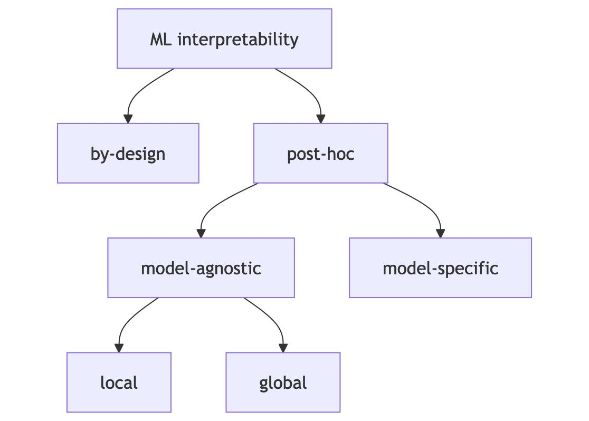
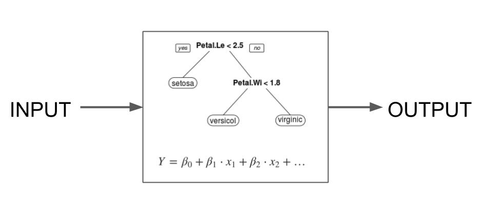
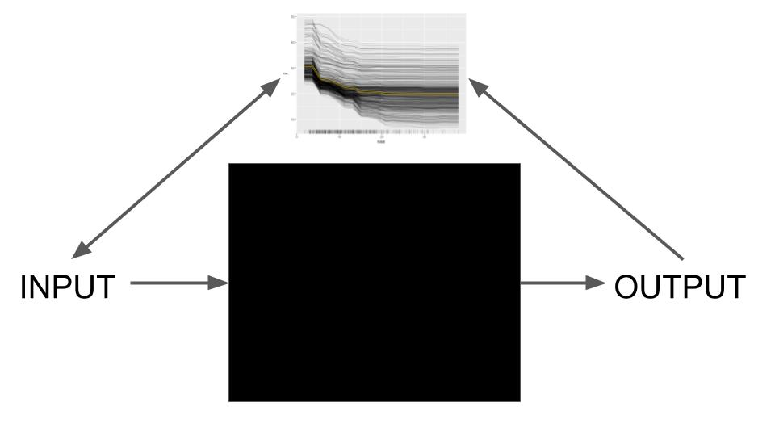
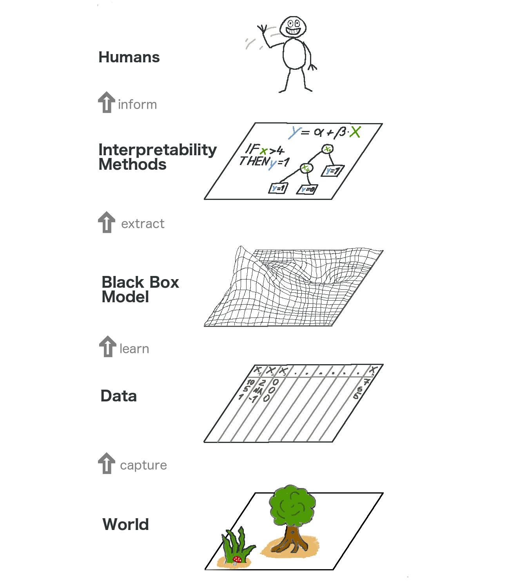
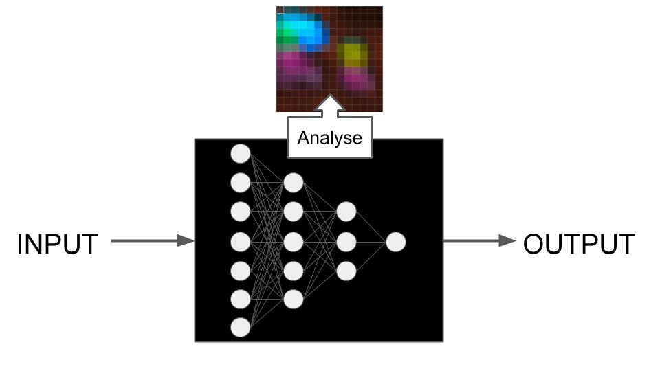

# فصل ۴: مروری بر روش‌ها

> **عنوان اصلی:** Methods Overview  
> **منبع:** [https://christophm.github.io/interpretable-ml-book/overview.html](https://christophm.github.io/interpretable-ml-book/overview.html)  
> **نویسنده:** Christoph Molnar  
> **مترجم:** مریم محمودی

---

این فصل مروری بر رویکردهای تفسیرپذیری ارائه می‌دهد. هدف این است که نقشه‌ای در اختیار شما قرار دهیم تا وقتی وارد جزئیات مدل‌ها و روش‌های مختلف می‌شوید، بتوانید جنگل را از میان درختان ببینید. شکل ۴.۱ طبقه‌بندی رویکردهای مختلف را نشان می‌دهد.

**شکل ۴.۱:** طبقه‌بندی مختصر روش‌های تفسیرپذیری که ساختار کتاب را منعکس می‌کند.

به طور کلی می‌توانیم بین تفسیرپذیری از طریق طراحی و تفسیرپذیری پسینی تمایز قائل شویم. تفسیرپذیری از طریق طراحی به این معناست که مدل‌هایی را آموزش می‌دهیم که ذاتاً قابل تفسیر هستند، مانند استفاده از رگرسیون لجستیک به جای جنگل تصادفی. تفسیرپذیری پسینی به این معناست که از یک روش تفسیرپذیری پس از آموزش مدل استفاده می‌کنیم. روش‌های تفسیر پسینی می‌توانند مدل-ناآگاه باشند، مانند اهمیت ویژگی با جایگشت، یا مدل-خاص، مانند تحلیل ویژگی‌های یادگرفته شده توسط یک شبکه عصبی. روش‌های مدل-ناآگاه را می‌توان به روش‌های موضعی که بر توضیح پیش‌بینی‌های فردی تمرکز دارند، و روش‌های سراسری که بر مجموعه داده‌ها متمرکز هستند، تقسیم کرد. این کتاب بر روش‌های پسینی مدل-ناآگاه تمرکز دارد اما مدل‌های پایه‌ای که از طریق طراحی قابل تفسیر هستند و روش‌های مدل-خاص برای شبکه‌های عصبی را نیز پوشش می‌دهد.

بیایید به هر دسته از تفسیرپذیری نگاه کنیم و همچنین نقاط قوت و ضعف آن‌ها را در ارتباط با اهداف تفسیری شما بررسی کنیم.

## مدل‌های قابل تفسیر از طریق طراحی

تفسیرپذیری از طریق طراحی در سطح الگوریتم یادگیری ماشین تصمیم‌گیری می‌شود. اگر می‌خواهید یک الگوریتم یادگیری ماشین که مدل‌های قابل تفسیر تولید می‌کند، داشته باشید، الگوریتم باید جستجوی مدل‌ها را به آن‌هایی که قابل تفسیر هستند محدود کند. ساده‌ترین مثال رگرسیون خطی است: وقتی از روش حداقل مربعات معمولی برای برازش/آموزش یک مدل رگرسیون خطی استفاده می‌کنید، از الگوریتمی استفاده می‌کنید که مدل‌هایی خطی نسبت به ویژگی‌های ورودی تولید خواهد کرد. مدل‌هایی که از طریق طراحی قابل تفسیر هستند، مدل‌های ذاتاً یا فطرتاً قابل تفسیر نیز نامیده می‌شوند، شکل ۴.۲ را ببینید.

**شکل ۴.۲:** تفسیرپذیری از طریق طراحی به معنای استفاده از الگوریتم‌های یادگیری ماشین است که مدل‌های «ذاتاً قابل تفسیر» تولید می‌کنند.

این کتاب پایه‌ای‌ترین رویکردهای تفسیرپذیری از طریق طراحی را پوشش می‌دهد:

- **رگرسیون خطی:** برازش یک مدل خطی با کمینه‌سازی مجموع خطاهای مربعی.
- **رگرسیون لجستیک:** گسترش رگرسیون خطی برای دسته‌بندی با استفاده از یک تبدیل غیرخطی.
- **گسترش‌های مدل خطی:** افزودن جریمه‌ها، تعاملات و عبارات غیرخطی برای انعطاف‌پذیری بیشتر.
- **درخت‌های تصمیم:** تقسیم بازگشتی داده‌ها برای ایجاد مدل‌های مبتنی بر درخت.
- **قواعد تصمیم:** استخراج قواعد اگر-آنگاه از داده‌ها.
- **RuleFit:** ترکیب قواعد مبتنی بر درخت با رگرسیون Lasso برای یادگیری مدل‌های تنک مبتنی بر قاعده.

رویکردهای بسیار بیشتری برای مدل‌های قابل تفسیر وجود دارد، از گسترش‌های این رویکردهای پایه تا رویکردهای بسیار تخصصی. گنجاندن همه آن‌ها غیرممکن خواهد بود، بنابراین من بر روی رویکردهای پایه تمرکز کرده‌ام. در اینجا چند نمونه از رویکردهای دیگر قابل تفسیر از طریق طراحی آورده شده است:

- شبکه‌های عصبی مبتنی بر نمونه اولیه (Prototype) برای دسته‌بندی تصویر، به نام ProtoViT (Ma et al. 2024). این شبکه‌های عصبی به گونه‌ای آموزش داده می‌شوند که دسته‌بندی تصویر مجموع وزن‌داری از نمونه‌های اولیه (تصاویر خاصی از داده‌های آموزش) و نمونه‌های فرعی اولیه باشد.
- Yang et al. (2024) مجموعه درختان ذاتاً قابل تفسیر را پیشنهاد کردند که درختان تقویت‌شده (مانند XGBoost) با ابرپارامترهای تنظیم‌شده هستند، مانند حداکثر عمق کم درخت، یک نمایش متفاوت که در آن اثرات ویژگی به اثرات اصلی و تعاملات تقسیم می‌شوند، و هرس اثرات. این رویکرد هم تفسیرپذیری از طریق طراحی و هم تفسیرپذیری پسینی را با هم ترکیب می‌کند.
- تقویت مبتنی بر مدل (Model-based boosting) یک چارچوب مدل‌سازی افزایشی است. مدل آموزش‌دیده مجموع وزن‌داری از اثرات خطی، spline‌ها، کنده‌های درختی و سایر یادگیرندگان ضعیف است (Bühlmann and Hothorn 2007).
- مدل‌های افزایشی تعمیم‌یافته با تشخیص خودکار تعاملات (Caruana et al. 2015).

اما مدل‌های ذاتاً قابل تفسیر چقدر قابل تفسیر هستند؟ رویکردهای مدل‌های قابل تفسیر به شدت متفاوت هستند و تفسیر آن‌ها نیز همین‌طور است. بیایید درباره حوزه تفسیرپذیری صحبت کنیم که به ما کمک می‌کند رویکردها را مرتب کنیم:

- **مدل به طور کامل قابل تفسیر است.** مثال: یک درخت تصمیم کوچک را می‌توان به راحتی تجسم و درک کرد. یا یک مدل رگرسیون خطی با تعداد ضرایب نه چندان زیاد. «کاملاً قابل تفسیر» یک الزام سخت است و در عین حال کمی مبهم نیز هست. دیدگاه من این است که اصطلاح کاملاً قابل تفسیر ممکن است تنها برای ساده‌ترین مدل‌ها مانند رگرسیون خطی بسیار تنک یا درخت‌های بسیار کوتاه استفاده شود، اگر اصلاً استفاده شود.
- **بخش‌هایی از مدل قابل تفسیر هستند.** در حالی که یک مدل رگرسیون با صدها ویژگی ممکن است «کاملاً قابل تفسیر» نباشد، هنوز می‌توانیم ضرایب مرتبط با ویژگی‌ها را به صورت جداگانه تفسیر کنیم. یا اگر یک لیست تصمیم بزرگ دارید، هنوز می‌توانید قواعد فردی را بررسی کنید.
- **پیش‌بینی‌های مدل قابل تفسیر هستند.** برخی رویکردها به ما اجازه می‌دهند پیش‌بینی‌های فردی را تفسیر کنیم. فرض کنید یک الگوریتم یادگیری ماشین شبیه k-نزدیک‌ترین همسایه توسعه دهید، اما برای تصاویر. برای دسته‌بندی یک تصویر، k تصویر مشابه را بگیرید و رایج‌ترین کلاس را برگردانید. یک پیش‌بینی به طور کامل با نمایش k تصویر مشابه توضیح داده می‌شود. یا برای درخت‌های تصمیم، یک پیش‌بینی با برگرداندن لیست تصمیماتی که منجر به پیش‌بینی شد، توضیح داده می‌شود.

> **نکته: حوزه تفسیرپذیری روش‌ها را ارزیابی کنید**
> 
> هنگام بررسی یک رویکرد تفسیرپذیری جدید، حوزه تفسیرپذیری را ارزیابی کنید. بپرسید که رویکرد در کدام سطوح (کاملاً قابل تفسیر، تفسیرپذیری جزئی، یا پیش‌بینی‌های قابل تفسیر) عمل می‌کند.

مدل‌هایی که از طریق طراحی قابل تفسیر هستند، معمولاً اشکال‌زدایی و بهبود آن‌ها آسان‌تر است زیرا بینش‌هایی درباره کارکرد درونی آن‌ها به دست می‌آوریم.

تفسیرپذیری از طریق طراحی همچنین در توجیه مدل‌ها و خروجی‌ها درخشش دارد، زیرا اغلب به درستی توضیح می‌دهند که چگونه پیش‌بینی‌ها انجام شده‌اند. آن‌ها همچنین تمایل دارند بررسی سازگاری مدل‌ها با دانش تخصصی حوزه را آسان‌تر کنند. بسیاری از زمینه‌های مبتنی بر داده از قبل رویکردهای مدل‌سازی (قابل تفسیر) مستقری دارند، مانند رگرسیون لجستیک در تحقیقات پزشکی.

وقتی صحبت از کشف بینش‌ها می‌شود، مدل‌های قابل تفسیر ترکیبی هستند. آن‌ها استخراج بینش‌ها درباره خود مدل‌ها را آسان می‌کنند. اما وقتی صحبت از بینش‌های داده می‌شود، کار دشوارتر می‌شود زیرا نیاز به یک پیوند نظری بین ساختار مدل و داده وجود دارد. برای تفسیر مدل به جای داده، باید فرض کنید که ساختار مدل جهان را منعکس می‌کند – چیزی که آماردانان بسیار سخت بر روی آن کار می‌کنند و به فرضیات زیادی نیاز دارند. اما اگر مدلی با عملکرد پیش‌بینی بهتر وجود داشته باشد چه؟ باید استدلال کنید که چرا مدل قابل تفسیر داده‌ها را به درستی نمایش می‌دهد، حتی اگر عملکرد پیش‌بینی آن پایین‌تر باشد. علاوه بر این، اغلب مدل‌های متعددی با عملکرد مشابه اما تفسیرهای متفاوت وجود دارند که کار ما را دشوارتر می‌کند. به این اثر راشومون می‌گویند. مشکل این تکثر مدل این است که کاملاً نامشخص می‌کند که کدام مدل را تفسیر کنیم.

> **نکته: راشومون**
> 
> فیلم ژاپنی راشومون از سال ۱۹۵۰ چهار نسخه متفاوت از یک داستان قتل را روایت می‌کند. در حالی که هر نسخه می‌تواند رویدادها را به خوبی توضیح دهد، با یکدیگر ناسازگار هستند. این پدیده اثر راشومون نامیده شد.

## تفسیرپذیری پسینی

روش‌های پسینی پس از آموزش مدل اعمال می‌شوند. این روش‌ها می‌توانند مدل-ناآگاه یا مدل-خاص باشند:

- **مدل-ناآگاه:** آنچه در داخل مدل است را نادیده می‌گیریم و تنها تحلیل می‌کنیم که چگونه خروجی مدل با توجه به تغییرات در ورودی‌های ویژگی تغییر می‌کند. برای مثال، جایگشت یک ویژگی و اندازه‌گیری میزان افزایش خطای مدل.
- **مدل-خاص:** بخش‌هایی از مدل را تحلیل می‌کنیم تا آن را بهتر درک کنیم. این می‌تواند تحلیل این باشد که یک نرون در یک شبکه عصبی به چه نوع تصاویری بیشترین واکنش را نشان می‌دهد، یا اهمیت جینی در جنگل‌های تصادفی.

### روش‌های پسینی مدل-ناآگاه

روش‌های مدل-ناآگاه بر اساس اصل SIPA کار می‌کنند: نمونه‌برداری از داده‌ها، انجام یک مداخله بر روی داده‌ها، دریافت پیش‌بینی‌ها برای داده‌های دستکاری‌شده، و تجمیع نتایج (Scholbeck et al. 2020). مثالی از این، اهمیت ویژگی با جایگشت است: یک نمونه داده می‌گیریم، با جایگشت آن بر روی داده مداخله می‌کنیم، پیش‌بینی‌های مدل را دریافت می‌کنیم، و خطای مدل را دوباره محاسبه و با خطای اصلی مقایسه می‌کنیم (تجمیع). آنچه این روش‌ها را مدل-ناآگاه می‌کند این است که نیازی به «نگاه کردن به داخل» مدل ندارند، مانند خواندن ضرایب یا وزن‌ها، همان‌طور که در شکل ۴.۳ نمایش داده شده است.

**شکل ۴.۳:** روش‌های تفسیر مدل-ناآگاه با ورودی‌ها و خروجی‌ها کار می‌کنند و داخلی‌های مدل را نادیده می‌گیرند.

تفسیر مدل-ناآگاه، تفسیر مدل را از آموزش مدل جدا می‌کند. با نگاه کردن به این موضوع از سطح بالاتر، فرآیند مدل‌سازی یک لایه دیگر به دست می‌آورد: از جهان شروع می‌شود که آن را در قالب داده ضبط می‌کنیم، از آن یک مدل یاد می‌گیریم. در بالای آن مدل، روش‌های تفسیرپذیری برای انسان‌ها داریم. شکل ۴.۴ را ببینید. برای روش‌های مدل-ناآگاه، این جداسازی را داریم، در حالی که برای تفسیرپذیری از طریق طراحی، لایه‌های مدل و تفسیرپذیری در یک لایه ادغام شده‌اند.

**شکل ۴.۴:** تصویر کلی از یادگیری ماشین قابل تفسیر (مدل-ناآگاه). دنیای واقعی از لایه‌های زیادی می‌گذرد تا به شکل توضیحات به انسان برسد.

جداسازی توضیحات از مدل یادگیری ماشین (= روش‌های تفسیر مدل-ناآگاه) مزایایی دارد (Ribeiro, Singh, and Guestrin 2016). بزرگ‌ترین نقطه قوت، انعطاف‌پذیری در هر دو انتخاب مدل و انتخاب روش تفسیر است. برای مثال، اگر اثرات ویژگی یک مدل XGBoost را با نمودار وابستگی جزئی (PDP) تجسم می‌کنید، حتی می‌توانید مدل پایه را تغییر دهید و همچنان از همان نوع تفسیر استفاده کنید. یا اگر دیگر PDP را دوست ندارید، می‌توانید از اثرات موضعی انباشته (ALE) بدون نیاز به تغییر مدل پایه XGBoost استفاده کنید. اما اگر از یک مدل رگرسیون خطی استفاده می‌کنید و ضرایب را تفسیر می‌کنید، تغییر به یک دسته‌بندی‌کننده مبتنی بر قاعده، وسیله تفسیر را نیز تغییر خواهد داد. برخی روش‌های مدل-ناآگاه حتی به شما انعطاف‌پذیری در نمایش ویژگی مورد استفاده برای ایجاد توضیحات می‌دهند: برای مثال، می‌توانید توضیحاتی را بر اساس بخش‌های تصویر به جای پیکسل‌ها هنگام توضیح خروجی‌های دسته‌بندی‌کننده تصویر ایجاد کنید.

روش‌های تفسیر مدل-ناآگاه را می‌توان به روش‌های موضعی و سراسری تقسیم کرد. روش‌های موضعی هدفشان توضیح پیش‌بینی‌های فردی است، در حالی که روش‌های سراسری توصیف می‌کنند که چگونه ویژگی‌ها به طور متوسط بر پیش‌بینی‌ها تأثیر می‌گذارند.

### روش‌های پسینی مدل-ناآگاه موضعی

روش‌های تفسیر موضعی پیش‌بینی‌های فردی را توضیح می‌دهند. رویکردها در این دسته کاملاً متنوع هستند:

- **نمودارهای سِتِریس پاریبوس** نشان می‌دهند که تغییر یک ویژگی چگونه پیش‌بینی را تغییر می‌دهد.
- **منحنی‌های انتظار شرطی فردی** نشان می‌دهند که تغییر یک ویژگی چگونه پیش‌بینی چندین نقطه داده را تغییر می‌دهد.
- **مدل‌های جایگزین موضعی (LIME: لایم)** یک پیش‌بینی را با جایگزینی مدل پیچیده با یک مدل موضعی قابل تفسیر توضیح می‌دهند.
- **قواعد محدود (anchors)** قواعدی هستند که توصیف می‌کنند کدام مقادیر ویژگی یک پیش‌بینی را «لنگر» می‌کنند، به این معنا که صرف‌نظر از تعداد ویژگی‌های دیگری که تغییر می‌دهید، پیش‌بینی ثابت می‌ماند.
- **توضیحات خلاف واقع** یک پیش‌بینی را با بررسی این‌که کدام ویژگی‌ها باید تغییر کنند تا به یک پیش‌بینی مطلوب برسیم، توضیح می‌دهند.
- **مقادیر شپلی** پیش‌بینی را به صورت عادلانه به ویژگی‌های فردی نسبت می‌دهند.
- **SHAP (شپ)** یک روش محاسباتی برای مقادیر شپلی است اما روش‌های تفسیر سراسری را نیز بر اساس ترکیب مقادیر شپلی در سراسر داده‌ها پیشنهاد می‌کند.

LIME و مقادیر شپلی (و SHAP) روش‌های انتساب هستند که پیش‌بینی یک نقطه داده را به صورت مجموع اثرات ویژگی توضیح می‌دهند. روش‌های دیگر، مانند سِتِریس پاریبوس و ICE (آی‌سی‌ای)، بر ویژگی‌های فردی و اینکه تابع پیش‌بینی چقدر به آن ویژگی‌ها حساس است، تمرکز دارند. روش‌هایی مانند توضیحات خلاف واقع و انکرها جایی در میانه قرار دارند و برای توضیح یک پیش‌بینی به زیرمجموعه‌ای از ویژگی‌ها متکی هستند.

برای اشکال‌زدایی مدل، روش‌های موضعی نمایی «زوم‌شده» ارائه می‌دهند که می‌تواند برای درک موارد استثنا یا مطالعه پیش‌بینی‌های غیرمعمول مفید باشد. برای مثال، می‌توانید به توضیحات پیش‌بینی با بدترین خطای پیش‌بینی نگاه کنید و ببینید که آیا فقط یک نقطه داده دشوار برای پیش‌بینی است، یا شاید مدل شما به اندازه کافی خوب نیست، یا نقطه داده اشتباه برچسب‌گذاری شده است. فراتر از آن، روش‌های سراسری مدل-ناآگاه هستند که برای بهبود مدل مفیدترند.

وقتی صحبت از استفاده از روش‌های تفسیر موضعی برای توجیه پیش‌بینی‌های فردی می‌شود، مفید بودن آن‌ها متفاوت است: روش‌هایی مانند سِتِریس پاریبوس و توضیحات خلاف واقع می‌توانند برای توجیه پیش‌بینی‌های مدل بسیار مفید باشند زیرا به درستی پیش‌بینی‌های خام مدل را منعکس می‌کنند. روش‌های انتساب مانند SHAP یا LIME خودشان نوعی «مدل» (یا حداقل برآوردهای پیچیده‌تر) روی مدلی که در حال توضیح دادن آن هستند، هستند و بنابراین ممکن است برای اهداف توجیهی با اهمیت بالا مناسب نباشند (Rudin 2019).

روش‌های موضعی می‌توانند برای بینش‌های داده مفید باشند. روش‌های انتساب مانند مقادیر شپلی با یک مجموعه داده مرجع کار می‌کنند و بنابراین اجازه مقایسه پیش‌بینی فعلی با زیرمجموعه‌های مختلف را می‌دهند و امکان پرسیدن سؤالات مختلف را فراهم می‌کنند. به طور کلی، مفید بودن تفسیر مدل-ناآگاه برای هر دو روش موضعی و سراسری به عملکرد مدل بستگی دارد. نمودارهای سِتِریس پاریبوس و ICE نیز برای بینش‌های مدل مفید هستند.

### روش‌های پسینی مدل-ناآگاه سراسری

روش‌های سراسری رفتار متوسط یک مدل یادگیری ماشین را در سراسر یک مجموعه داده توصیف می‌کنند. در این کتاب، تکنیک‌های تفسیر سراسری مدل-ناآگاه زیر را یاد خواهید گرفت:

- **نمودار وابستگی جزئی** یک روش اثر ویژگی است.
- **نمودارهای اثر موضعی انباشته** نیز اثرات ویژگی را تجسم می‌کنند، طراحی‌شده برای ویژگی‌های همبسته نیز.
- **تعامل ویژگی (H-statistic)** میزانی که پیش‌بینی نتیجه اثرات مشترک ویژگی‌ها است را کمی می‌کند.
- **تجزیه تابعی** یک ایده محوری تفسیرپذیری و یک تکنیک برای تجزیه توابع پیش‌بینی به بخش‌های کوچک‌تر است.
- **اهمیت ویژگی با جایگشت** اهمیت یک ویژگی را به صورت افزایش در خطا وقتی ویژگی جایگشت می‌شود، اندازه‌گیری می‌کند.
- **حذف یک ویژگی (LOFO)** یک ویژگی را حذف می‌کند و افزایش خطا را پس از آموزش مجدد مدل بدون آن ویژگی اندازه‌گیری می‌کند.
- **مدل‌های جایگزین** مدل اصلی را با یک مدل ساده‌تر برای تفسیر جایگزین می‌کنند.
- **نمونه‌های اولیه و انتقادات** نقاط داده نماینده یک توزیع هستند و می‌توانند برای بهبود تفسیرپذیری استفاده شوند.

دو دسته گسترده در روش‌های سراسری مدل-ناآگاه، اثرات ویژگی و اهمیت ویژگی هستند. اثرات ویژگی (PDP، ALE، H-statistic، تجزیه) درباره نشان دادن رابطه بین ورودی‌ها و خروجی‌ها هستند. اهمیت ویژگی (PFI، LOFO، اهمیت SHAP، ...) درباره رتبه‌بندی ویژگی‌ها بر اساس اهمیت است، که اهمیت توسط هر یک از روش‌ها به صورت متفاوتی تعریف می‌شود.

از آنجا که روش‌های تفسیر سراسری رفتار متوسط را توصیف می‌کنند، زمانی که مدل‌ساز می‌خواهد یک مدل را اشکال‌زدایی کند، به ویژه مفید هستند. به طور خاص، LOFO با روش‌های انتخاب ویژگی مرتبط است و به ویژه برای بهبود مدل مفید است.

برای توجیه مدل‌ها به ذینفعان، روش‌های تفسیر سراسری می‌توانند برخی خطوط کلی مانند اینکه کدام ویژگی‌ها مرتبط بودند را ارائه دهند. همچنین می‌توانید از روش‌های سراسری در ترکیب با مدل‌های ذاتاً قابل تفسیر استفاده کنید. برای مثال، در حالی که لیست‌های قاعده تصمیم توجیه پیش‌بینی‌های فردی را آسان می‌کنند، ممکن است بخواهید خود مدل را نیز با نشان دادن اینکه کدام ویژگی‌ها به طور کلی مهم بودند، توجیه کنید.

روش‌های سراسری اغلب به صورت مقادیر مورد انتظار بر اساس توزیع داده بیان می‌شوند. برای مثال، نمودار وابستگی جزئی، یک نمودار اثر ویژگی، پیش‌بینی مورد انتظار است وقتی همه ویژگی‌های دیگر حاشیه‌سازی شده‌اند. این همان چیزی است که این روش‌ها را برای درک مکانیزم‌های کلی در داده بسیار مفید می‌کند. من و همکارانم مقالاتی درباره PDP و PFI نوشتیم و اینکه چگونه می‌توانند برای استنتاج ویژگی‌های داده استفاده شوند (Molnar et al. 2023; Freiesleben et al. 2024).

> **نکته: سراسری را به گروهی تبدیل کنید**
> 
> با اعمال روش‌های سراسری به زیرمجموعه‌هایی از داده‌های خود، می‌توانید روش‌های سراسری را به روش‌های «گروهی» یا «منطقه‌ای» تبدیل کنید. این را در عمل در مثال‌های این کتاب خواهیم دید.

### روش‌های پسینی مدل-خاص

همان‌طور که از نام پیداست، روش‌های پسینی مدل-خاص پس از آموزش مدل اعمال می‌شوند اما فقط برای مدل‌های یادگیری ماشین خاصی کار می‌کنند، همان‌طور که در شکل ۴.۵ نمایش داده شده است. نمونه‌های زیادی از این دست وجود دارد، از اهمیت جینی برای جنگل‌های تصادفی تا محاسبه نسبت شانس برای رگرسیون لجستیک. این کتاب بر روش‌های تفسیر پسینی برای شبکه‌های عصبی تمرکز دارد.

**شکل ۴.۵:** روش‌های مدل-خاص مدل‌های پیچیده را با تحلیل مدل‌ها قابل تفسیرتر می‌کنند.

برای انجام پیش‌بینی با یک شبکه عصبی، داده‌های ورودی از لایه‌های زیادی از ضرب با وزن‌های یادگرفته‌شده و تبدیلات غیرخطی عبور می‌کنند. یک پیش‌بینی واحد می‌تواند شامل میلیون‌ها ضرب باشد، بسته به معماری شبکه عصبی. هیچ شانسی وجود ندارد که ما انسان‌ها بتوانیم نگاشت دقیق از ورودی داده به پیش‌بینی را دنبال کنیم. باید میلیون‌ها وزن را که به شیوه‌های پیچیده با هم تعامل دارند در نظر بگیریم تا پیش‌بینی یک شبکه عصبی را درک کنیم. برای تفسیر رفتار و پیش‌بینی‌های شبکه‌های عصبی، به روش‌های تفسیر خاصی نیاز داریم. شبکه‌های عصبی هدف جالبی برای تفسیر هستند زیرا شبکه‌های عصبی در لایه‌های پنهان خود ویژگی‌ها و مفاهیم را یاد می‌گیرند. همچنین می‌توانیم از گرادیان‌های آن‌ها برای روش‌های کارآمد محاسباتی استفاده کنیم.

بخش شبکه‌های عصبی تکنیک‌های زیر را پوشش می‌دهد که به سؤالات مختلفی پاسخ می‌دهند:

- **ویژگی‌های یادگرفته‌شده:** شبکه عصبی چه ویژگی‌هایی یاد گرفت؟
- **نقشه‌های برجستگی:** هر پیکسل چگونه به یک پیش‌بینی خاص کمک کرد؟
- **مفاهیم:** شبکه عصبی چه مفاهیمی یاد گرفت؟
- **نمونه‌های متخاصم:** چگونه می‌توانیم شبکه عصبی را فریب دهیم؟
- **نمونه‌های تأثیرگذار:** یک نقطه داده آموزش چقدر برای یک پیش‌بینی مشخص تأثیرگذار بود؟

به طور کلی، بزرگ‌ترین نقطه قوت روش‌های مدل-خاص توانایی یادگیری درباره خود مدل‌ها است. این همچنین می‌تواند به بهبود مدل و توجیه آن برای دیگران کمک کند. وقتی صحبت از بینش‌های داده می‌شود، روش‌های مدل-خاص مشکلات مشابهی با مدل‌های ذاتاً قابل تفسیر دارند: آن‌ها به یک توجیه نظری نیاز دارند که چرا تفسیر مدل داده را منعکس می‌کند.

## خطوط تار هستند

دسته‌بندی‌های مرتبی ارائه کرده‌ام. اما در واقعیت، خطوط بین از طریق طراحی و پسینی تار است. فقط چند نمونه:

- آیا رگرسیون لجستیک یک مدل ذاتاً قابل تفسیر است؟ باید ضرایب را پس‌پردازش کنید تا نسبت شانس را تفسیر کنید. و اگر بخواهید اثرات مدل را در سطح احتمالات تفسیر کنید، باید اثرات حاشیه‌ای را محاسبه کنید که قطعاً می‌تواند به عنوان یک روش تفسیر پسینی دیده شود (که می‌تواند برای مدل‌های دیگر نیز اعمال شود).
- مجموعه درختان تقویت‌شده قابل تفسیر در نظر گرفته نمی‌شوند. اما اگر حداکثر عمق درخت را روی ۱ تنظیم کنید، کنده‌های درختی تقویت‌شده به دست می‌آورید که چیزی شبیه یک مدل افزایشی تعمیم‌یافته به شما می‌دهد.
- برای توضیح یک پیش‌بینی رگرسیون خطی، می‌توانید هر مقدار ویژگی را در ضریب آن ضرب کنید. به این‌ها اثرات گفته می‌شود. علاوه بر این، می‌توانید از هر اثر، میانگین اثر از داده‌ها را کم کنید. اگر این کارها را انجام دهید، مقادیر شپلی را محاسبه کرده‌اید که معمولاً مدل-ناآگاه در نظر گرفته می‌شوند.

نتیجه اخلاقی داستان. تفسیرپذیری یک مفهوم تار است. این تاری را بپذیرید، زیاد به یک رویکرد وابسته نشوید، اما با آزادی رویکردها را ترکیب و تطبیق دهید.
