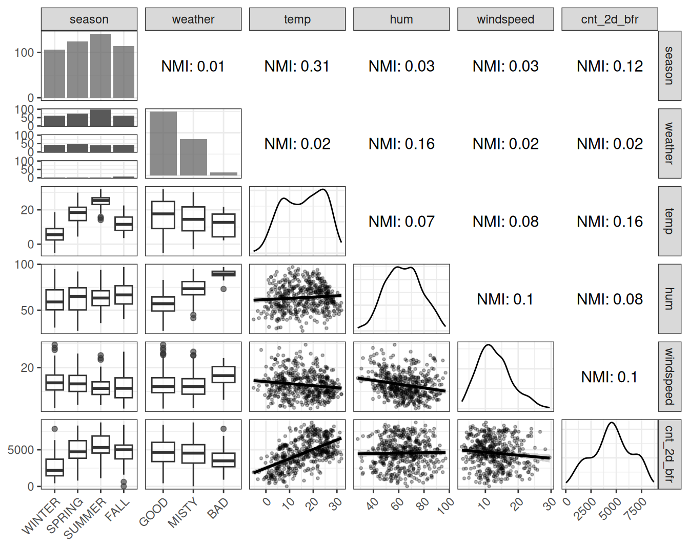
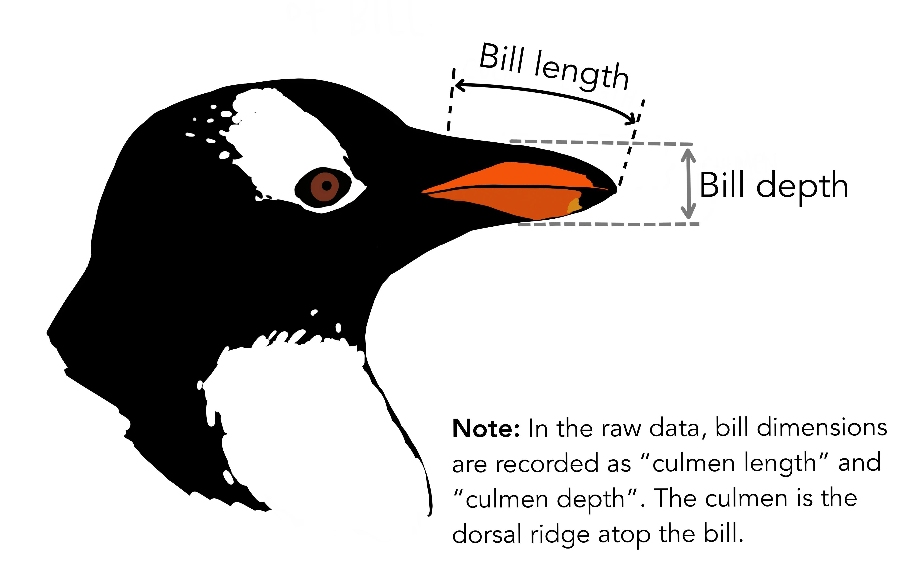
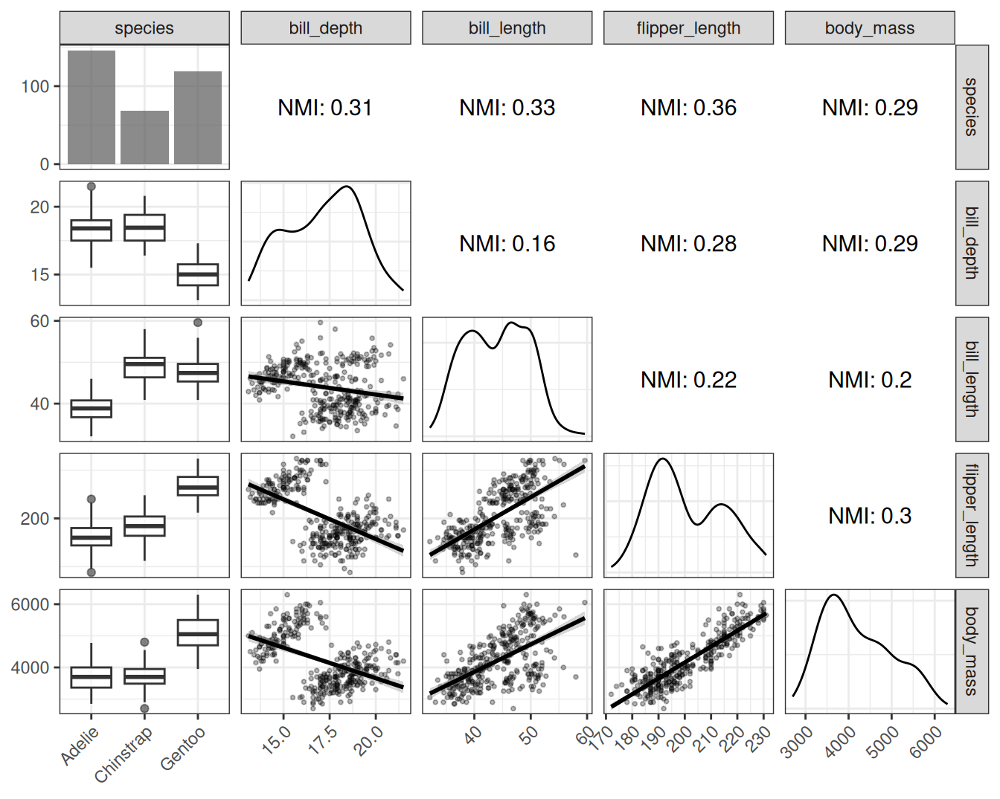
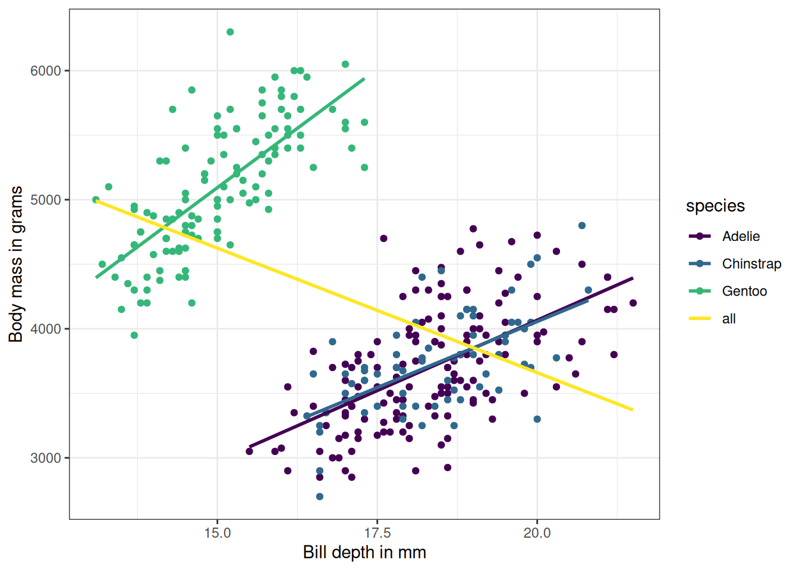

# فصل ۵: داده‌ها و مدل‌ها

> **عنوان اصلی:** Data and Models  
> **منبع:** [https://christophm.github.io/interpretable-ml-book/data.html](https://christophm.github.io/interpretable-ml-book/data.html)  
> **نویسنده:** Christoph Molnar  
> **مترجم:** مریم محمودی

---

در طول این کتاب، با دو مجموعه داده به‌طور مکرر روبرو خواهید شد. یکی درباره دوچرخه‌ها و دیگری درباره پنگوئن‌ها. من هر دو را دوست دارم. این فصل، داده‌ها و مدل‌هایی را که در این کتاب تفسیر خواهیم کرد، معرفی می‌کند.

## اجاره دوچرخه (رگرسیون)

این مجموعه داده شامل تعداد روزانه دوچرخه‌های اجاره‌شده از شرکت اجاره دوچرخه Capital-Bikeshare در واشنگتن دی‌سی به همراه اطلاعات آب‌وهوایی و فصلی است. این داده‌ها با لطف Capital-Bikeshare به‌صورت آزاد در دسترس قرار گرفته‌اند. Fanaee-T و Gama (2014) داده‌های آب‌وهوایی و اطلاعات فصلی را به آن اضافه کردند. این داده‌ها را می‌توان از UCI Machine Learning Repository دانلود کرد. من مقداری پردازش روی داده‌ها انجام دادم و در نهایت به این ستون‌ها رسیدم:

- تعداد دوچرخه‌ها، شامل هم کاربران عادی و هم ثبت‌شده. این تعداد به‌عنوان متغیر هدف در مسئله رگرسیون استفاده می‌شود (cnt).
- فصل سال. یکی از بهار، تابستان، پاییز یا زمستان (season).
- نشان‌دهنده اینکه آیا آن روز تعطیلی رسمی بوده یا نه (holiday).
- نشان‌دهنده اینکه آیا آن روز روز کاری یا آخر هفته بوده است (workday).
- وضعیت آب‌وهوایی در آن روز. یکی از: خوب، مه‌آلود، بد (weather).
- دمای هوا به درجه سانتی‌گراد (temp).
- رطوبت نسبی به درصد (۰ تا ۱۰۰) (hum).
- سرعت باد به کیلومتر بر ساعت (windspeed).
- تعداد دوچرخه‌های اجاره‌شده دو روز قبل (cnt_2d_bfr).

من یک روز را که رطوبت آن ۰ اندازه‌گیری شده بود حذف کردم، و همچنین دو روز اول را به دلیل نبود داده تعداد دوچرخه‌های دو روز قبل (cnt_2d_bfr) حذف کردم. در مجموع، داده‌های پردازش‌شده شامل ۷۲۸ روز هستند.

### پیش‌بینی اجاره دوچرخه

از آنجایی که این مثال صرفاً برای نمایش روش‌های تفسیرپذیری است، من کمی آزادی عمل به خود دادم. فرض می‌کنم که ویژگی‌های آب‌وهوایی پیش‌بینی هستند (در واقعیت نیستند). این بدان معناست که مسئله پیش‌بینی ما شکل زیر را دارد: ما تعداد دوچرخه‌های اجاره‌شده فردا را بر اساس پیش‌بینی آب‌وهوا، اطلاعات فصلی، و تعداد دوچرخه‌هایی که دیروز اجاره شده‌اند، پیش‌بینی می‌کنیم.

من تمام مدل‌های رگرسیون را با استفاده از یک استراتژی ساده holdout آموزش دادم: ۲/۳ داده‌ها برای آموزش و ۱/۳ برای آزمایش. الگوریتم‌های یادگیری ماشین عبارت بودند از: random forest، درخت تصمیم CART، ماشین بردار پشتیبان، و رگرسیون خطی. جدول ۵.۱ نشان می‌دهد که ماشین بردار پشتیبان بهترین عملکرد را داشت، زیرا کمترین ریشه میانگین مربعات خطا (RMSE) و کمترین میانگین قدر مطلق خطا (MAE) را داشت. random forest کمی بدتر بود، و مدل رگرسیون خطی حتی بدتر. درخت تصمیم با فاصله زیادی در رتبه آخر قرار دارد و اصلاً خوب عمل نکرد.

**جدول ۵.۱: مقایسه عملکرد مدل‌های اجاره دوچرخه روی داده‌های آزمایش با ریشه میانگین مربعات خطا (RMSE) و میانگین قدر مطلق خطا (MAE).**

| مدل | RMSE | MAE |
|-----|------|-----|
| SVM | 852 | 628 |
| Random Forest | 881 | 672 |
| Linear Regression | 948 | 737 |
| Decision Tree | 1056 | 794 |

### وابستگی ویژگی‌ها

برای بسیاری از روش‌های تفسیر، درک چگونگی همبستگی ویژگی‌ها اهمیت دارد. بنابراین، بیایید نگاهی به همبستگی پیرسون برای ویژگی‌های عددی بیندازیم. جدول ۵.۲ نشان می‌دهد که تنها همبستگی بزرگتر بین تعداد دو روز قبل و دما است. اما در مورد ویژگی‌های دسته‌ای چطور؟ و در مورد همبستگی غیرخطی چطور؟

برای درک وابستگی‌های غیرخطی، دو کار انجام خواهیم داد:

1. تصویرسازی وابستگی خام دوبه‌دو (مثلاً نمودار پراکندگی)
2. محاسبه اطلاعات متقابل نرمال‌شده (NMI) بین دو ویژگی.

**جدول ۵.۲: همبستگی پیرسون دوبه‌دو بین ویژگی‌های عددی اجاره دوچرخه.**

| متغیر ۱ | متغیر ۲ | همبستگی |
|---------|---------|---------|
| temp | hum | 0.13 |
| temp | windspeed | -0.16 |
| hum | windspeed | -0.25 |
| temp | cnt_2d_bfr | 0.60 |
| hum | cnt_2d_bfr | 0.06 |
| windspeed | cnt_2d_bfr | -0.11 |

اطلاعات متقابل نرمال‌شده عددی بین ۰ و ۱ است. NMI برابر با ۰ به این معناست که ویژگی‌ها هیچ اطلاعاتی را به اشتراک نمی‌گذارند، در حالی که ۱ به این معناست که تمام تغییرات از وابستگی آن‌ها ناشی می‌شود. NMI می‌تواند برای ویژگی‌های با تعداد زیادی دسته/بازه به سمت بالا تورش داشته باشد (Mahmoudi و Jemielniak 2024). این بدان معناست که هرچه تعداد بازه‌ها/دسته‌ها بیشتر باشد، باید کمتر به مقدار بزرگ NMI اعتماد کنید. به همین دلیل است که ما فقط به NMI تکیه نمی‌کنیم، بلکه داده‌های خام را تصویرسازی کرده و همبستگی پیرسون را تحلیل می‌کنیم.

> **نکته: اطلاعات متقابل نرمال‌شده**
> 
> اطلاعات متقابل بین دو متغیر تصادفی دسته‌ای $X$ و $Y$ به‌صورت زیر داده می‌شود:
> 
> $$I(X;Y) = \sum_{i \in \mathcal{X}} \sum_{j \in \mathcal{Y}} p(x_i, y_j) \log \frac{p(x_i, y_j)}{p(x_i)p(y_j)}$$
> 
> که در آن $i \in \mathcal{X}$ و $j \in \mathcal{Y}$. $p(x_i)$ احتمال اینکه ویژگی $X$ دسته $i$ را بگیرد است، و برای $Y$ نیز همین‌طور. $p(x_i, y_j)$ احتمال توأم اینکه ویژگی $X$ دسته $i$ و $Y$ دسته $j$ را بگیرند است.
> 
> اطلاعات متقابل نرمال‌شده، MI را از $[-1, 1]$ به $[0, 1]$ مقیاس‌بندی می‌کند (NMI ممکن است در شرایط خاصی از این محدوده فراتر رود):
> 
> $$NMI(X;Y) = \frac{I(X;Y)}{\sqrt{H(X)H(Y)}}$$
> 
> که در آن
> 
> $$H(X) = -\sum_{i \in \mathcal{X}} p(x_i) \log p(x_i)$$
> 
> که در آن $\mathcal{X}$ مجموعه تمام دسته‌هایی است که $X$ می‌تواند بگیرد. برای استفاده از اطلاعات متقابل با ویژگی‌های عددی، مقادیر مشاهده‌شده $x_1, \ldots, x_n$ ویژگی $X$ را به بازه‌هایی با اندازه برابر گسسته‌سازی می‌کنیم. تعداد بازه‌ها با استفاده از قاعده Freedman-Diaconis تعیین می‌شود (Freedman و Diaconis 1981):
> 
> $$\text{bin width} = 2 \frac{IQR(x)}{n^{1/3}}$$
> 
> $$\text{number of bins} = \frac{\max(x) - \min(x)}{\text{bin width}}$$
> 
> $IQR(x)$ دامنه میان‌چارکی $x$ است، $n$ تعداد نمونه‌های داده، و ما به عدد صحیح بزرگتر بعدی گرد می‌کنیم.

اکنون بیایید نگاهی به داده‌های وابستگی خام و اطلاعات متقابل نرمال‌شده برای ویژگی‌ها در داده‌های اشتراک دوچرخه در شکل ۵.۱ بیندازیم.

**شکل ۵.۱:** اطلاعات متقابل نرمال‌شده و نمودارهای جفتی برای ویژگی‌ها در داده‌های اشتراک دوچرخه. من holiday و workday را برای خوانایی بهتر نمودارها حذف کردم.

تحلیل NMI به‌طور کلی برداشت حاصل از تحلیل همبستگی را تأیید می‌کند. علاوه بر این، ما بینش‌هایی درباره ویژگی‌های دسته‌ای به دست می‌آوریم: فصل سال با دما و تعداد دو روز قبل اطلاعات مشترک دارد، که تعجب‌آور نیست. نمودارهای جفتی نیز تأیید می‌کنند که ضرایب همبستگی معیارهای خوبی از وابستگی برای این مجموعه داده هستند، زیرا ویژگی‌های عددی الگوهای وابستگی عجیبی نشان نمی‌دهند، بلکه عمدتاً خطی هستند. برای مثال داده بعدی، تحلیل وابستگی شگفتی‌های بیشتری دارد.

## پنگوئن‌های پالمر (دسته‌بندی)

برای دسته‌بندی، از داده‌های پنگوئن‌های پالمر استفاده خواهیم کرد. این مجموعه داده جذاب شامل اندازه‌گیری‌هایی از ۳۳۳ پنگوئن از مجمع‌الجزایر پالمر در قطب جنوب است (که در شکل ۵.۲ تصویرسازی شده است). این مجموعه داده توسط Gorman، Williams و Fraser (2014) جمع‌آوری و منتشر شد. مقاله تفاوت‌های ظاهری بین نر و ماده را، در میان چیزهای دیگر، مطالعه می‌کند. به همین دلیل است که ما از دسته‌بندی نر/ماده بر اساس اندازه‌گیری‌های بدن استفاده خواهیم کرد.

**شکل ۵.۲:** اثر هنری پنگوئن‌های پالمر توسط @allison_horst. (الف) سه گونه پنگوئن در داده‌ها. (ب) اندازه‌گیری‌های منقار.

هر سطر نشان‌دهنده یک پنگوئن است و شامل اطلاعات زیر است:

- جنسیت پنگوئن (نر/ماده)، که هدف دسته‌بندی است (sex).
- گونه پنگوئن، که یکی از Chinstrap، Gentoo یا Adelie است (species).
- جرم بدن پنگوئن، بر حسب گرم اندازه‌گیری شده (body_mass_g).
- طول منقار (نوک)، بر حسب میلی‌متر اندازه‌گیری شده (bill_length_mm).
- عمق منقار، بر حسب میلی‌متر اندازه‌گیری شده (bill_depth_mm).
- طول باله (دم)، بر حسب میلی‌متر اندازه‌گیری شده (flipper_length_mm).

۱۱ پنگوئن داده ناقص داشتند. از آنجا که هدف از این داده نمایش روش‌های یادگیری ماشین تفسیرپذیر است و نه مطالعه عمیق پنگوئن‌ها، من به سادگی داده‌های پنگوئن با مقادیر ناقص را حذف کردم. مجموعه داده با استفاده از بسته R پالمرپنگوئن‌ها بارگذاری می‌شود (Horst، Hill و Gorman 2020).

### دسته‌بندی جنسیت پنگوئن (نر / ماده)

برای مثال‌های داده، من مدل‌های زیر را آموزش دادم، با استفاده از یک تقسیم ساده به داده‌های آموزش ۲/۳ و داده‌های آزمایش holdout ۱/۳. برای ارزیابی عملکرد مدل‌ها، من log loss و دقت را روی داده‌های آزمایش اندازه‌گیری کردم. نتایج در جدول ۵.۳ نشان داده شده است.

مدل رگرسیون لجستیک در واقع ۳ مدل است: ابتدا داده‌ها را بر اساس گونه تقسیم کردم، یک مدل رگرسیون لجستیک آموزش دادم، و نتایج عملکرد را ترکیب کردم. این همان کاری است که Gorman، Williams و Fraser (2014) در مقاله خود انجام دادند. این همچنین مدلی است که بهترین عملکرد را داشت. برای random forest و برای درخت تصمیم، من گونه را به‌عنوان یک ویژگی در نظر گرفتم. این برای درخت تصمیم خوب جواب نداد، اما عملکرد random forest نزدیک به مدل‌های رگرسیون لجستیک است، حداقل از نظر دقت.

**جدول ۵.۳: مقایسه عملکرد مدل برای دسته‌بندی جنسیت پنگوئن (نر/ماده).**

| مدل | Log_Loss | Accuracy |
|-----|----------|----------|
| Logistic Regression (by Species) | 0.16 | 0.93 |
| Random Forest | 0.19 | 0.92 |
| Decision Tree | 1.23 | 0.86 |

### وابستگی ویژگی‌ها

بیایید نگاهی بیندازیم به اینکه اندازه‌گیری‌های بدن پنگوئن چگونه با هم همبسته هستند.

**جدول ۵.۴: همبستگی پیرسون دوبه‌دو بین ویژگی‌های عددی پنگوئن.**

| متغیر ۱ | متغیر ۲ | همبستگی |
|---------|---------|---------|
| bill_depth_mm | bill_length_mm | -0.23 |
| bill_depth_mm | flipper_length_mm | -0.58 |
| bill_length_mm | flipper_length_mm | 0.65 |
| bill_depth_mm | body_mass_g | -0.47 |
| bill_length_mm | body_mass_g | 0.59 |
| flipper_length_mm | body_mass_g | 0.87 |

جدول ۵.۴ نشان می‌دهد که به‌ویژه جرم بدن و طول باله به‌شدت همبسته هستند. اما سایر ویژگی‌ها نیز همبسته هستند، مانند طول باله و طول منقار، یا طول باله و عمق منقار. با این حال، همبستگی پیرسون فقط نیمی از داستان را می‌گوید، زیرا فقط وابستگی خطی را اندازه‌گیری می‌کند. بیایید نگاهی به نمودارهای جفتی ویژگی‌ها به همراه اطلاعات متقابل نرمال‌شده بیندازیم.

**شکل ۵.۳:** همبستگی پیرسون دوبه‌دو بین ویژگی‌های عددی پنگوئن.

شکل ۵.۳ تصویر بسیار ظریف‌تری نسبت به آنچه همبستگی پیرسون نشان داد، ارائه می‌دهد. به‌عنوان مثال، اطلاعات متقابل نرمال‌شده بین جرم بدن و عمق منقار مشابه NMI بین جرم بدن و طول باله است. اما همبستگی بین جرم بدن و عمق منقار بسیار کمتر است. دلیل این است که همبستگی خطی پویایی‌ها را درک نمی‌کند، حداقل زمانی که همه پنگوئن‌ها را با هم قرار می‌دهیم. دلیل اینکه همبستگی خطی در اینجا خوب کار نمی‌کند، پارادوکس سیمپسون است. در پارادوکس سیمپسون یک روند در چندین گروه از داده‌ها ظاهر می‌شود، اما زمانی که همه داده‌ها را ترکیب می‌کنیم ناپدید می‌شود یا معکوس می‌شود. ترکیب همه داده‌های پنگوئن، یک همبستگی مثبت بین عمق منقار و جرم بدن را به همبستگی منفی تبدیل می‌کند، همان‌طور که در شکل ۵.۴ نشان داده شده است. دلیل این است که پنگوئن‌های Gentoo سنگین‌تر هستند و منقارهای عمیق‌تری دارند. اطلاعات متقابل این مشکل را حل می‌کند.

**شکل ۵.۴:** وزن پنگوئن در مقابل عمق منقار برای هر ۳ گونه. خطوط، خطوط رگرسیون برای پیش‌بینی عمق منقار از جرم بدن برای زیرمجموعه‌های مختلف پنگوئن‌ها هستند.

نکته‌ای درباره مدل‌سازی همه پنگوئن‌ها با هم: در سراسر کتاب، من پنگوئن‌ها را به‌طور پیش‌فرض به‌عنوان یک مجموعه داده در نظر خواهم گرفت و از گونه به‌عنوان یک ویژگی استفاده خواهم کرد. احتمالاً بهتر است همیشه پنگوئن‌ها را بر اساس گونه مدل‌سازی و تحلیل کنیم. با این حال، این یک تنش بسیار رایج در یادگیری ماشین است: اغلب، نمونه‌های داده متعلق به یک خوشه یا موجودیت هستند – به پیش‌بینی فروش برای فروشگاه‌های مختلف یا دسته‌بندی نمونه‌های آزمایشگاهی از دسته‌های یکسان فکر کنید – و ما باید تصمیم بگیریم که آیا از مدل‌های جداگانه استفاده کنیم یا از شناسه موجودیت به‌عنوان یک ویژگی استفاده کنیم.
