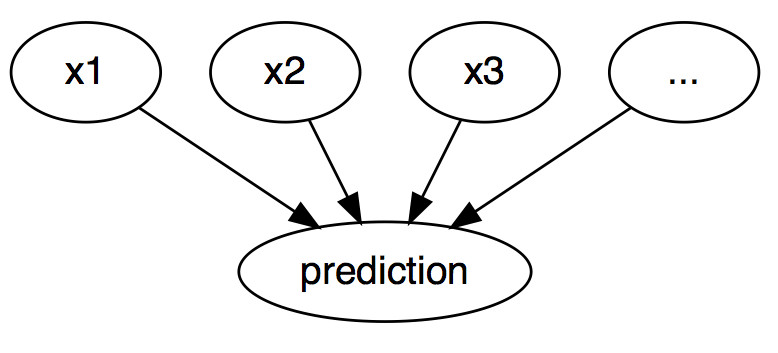
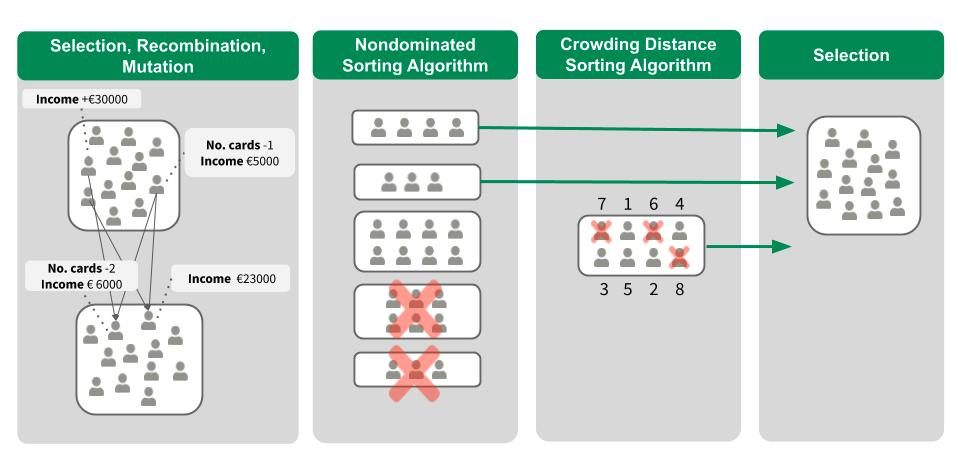

# فصل ۱۵: توضیحات خلاف واقع

> **عنوان اصلی:** Counterfactual Explanations  
> **منبع:** [https://christophm.github.io/interpretable-ml-book/counterfactual.html](https://christophm.github.io/interpretable-ml-book/counterfactual.html)  
> **نویسنده:** Christoph Molnar  
> **مترجم:** مریم محمودی

---

*نویسندگان: Susanne Dandl و Christoph Molnar*

توضیح خلاف واقع، یک موقعیت علّی را به این شکل بیان می‌کند: «اگر X رخ نداده بود، Y هم رخ نمی‌داد.» برای مثال: «اگر یک جرعه از آن قهوه داغ نمی‌نوشیدم، زبانم نمی‌سوخت.» رویداد Y سوختن زبان است و علت X نوشیدن قهوه داغ. تفکر خلاف واقع مستلزم تصور یک واقعیت فرضی است که با آنچه واقعاً رخ داده در تضاد است—جهانی که در آن قهوه‌ای ننوشیده‌ام—و از همین‌رو این نام را به خود گرفته است. توانایی تفکر خلاف واقع از جمله ویژگی‌هایی است که انسان را از سایر جانوران متمایز می‌کند.

در یادگیری ماشین تفسیرپذیر، توضیحات خلاف واقع برای تبیین پیش‌بینی‌های نمونه‌های منفرد به کار می‌روند.[^1] همان‌طور که در شکل ۱۵.۱ نشان داده شده، رابطه میان ورودی‌ها و پیش‌بینی از منظر گرافی ساده است: مقادیر ویژگی‌ها، پیش‌بینی را رقم می‌زنند. حتی اگر در واقعیت رابطه میان ورودی‌ها و پیامد مورد پیش‌بینی لزوماً علّی نباشد، می‌توانیم ورودی‌های مدل را به‌مثابه علت پیش‌بینی در نظر بگیریم.

با توجه به این گراف ساده، به‌راحتی می‌توان دید که چگونه می‌توان حالت‌های خلاف واقع را برای پیش‌بینی‌های مدل‌های یادگیری ماشین شبیه‌سازی کرد: کافی است مقادیر ویژگی‌های یک نمونه را پیش از پیش‌بینی تغییر دهیم و بررسی کنیم که پیش‌بینی چگونه دگرگون می‌شود. ما به سناریوهایی علاقه داریم که در آن‌ها پیش‌بینی به‌شکل معناداری تغییر می‌کند—مانند تغییر برچسب پیش‌بینی‌شده (برای مثال، تأیید یا رد درخواست اعتبار)، یا رسیدن به یک آستانه مشخص (برای مثال، احتمال سرطان به ۱۰٪ برسد). توضیح خلاف واقع یک پیش‌بینی، کوچک‌ترین تغییر در مقادیر ویژگی‌هایی را توصیف می‌کند که پیش‌بینی را به یک خروجی از پیش تعریف‌شده تبدیل می‌کند.

هم روش‌های مستقل از مدل (model-agnostic) و هم روش‌های وابسته به مدل برای توضیحات خلاف واقع وجود دارند، اما در این فصل بر روش‌های مستقل از مدل تمرکز می‌کنیم—روش‌هایی که تنها با ورودی‌ها و خروجی‌های مدل کار می‌کنند و به ساختار درونی مدل‌های خاص نیازی ندارند.

پیش از پرداختن به نحوه ساخت توضیحات خلاف واقع، می‌خواهم چند مورد کاربردی و ویژگی‌های یک توضیح خلاف واقع مطلوب را بررسی کنم.

در مثال اول، پیتر برای دریافت وام درخواست می‌دهد و نرم‌افزار بانکی مبتنی بر یادگیری ماشین درخواست او را رد می‌کند. او می‌خواهد بداند چرا درخواستش رد شده و چگونه می‌تواند شانس خود را افزایش دهد. پرسش «چرا» را می‌توان به‌صورت یک سؤال خلاف واقع بازنویسی کرد: کوچک‌ترین تغییر در ویژگی‌ها (درآمد، تعداد کارت‌های اعتباری، سن، …) که پیش‌بینی را از «رد» به «تأیید» تبدیل کند، چیست؟ یک پاسخ ممکن این است: اگر درآمد سالانه پیتر ۱۰٬۰۰۰ واحد بیشتر بود، وام دریافت می‌کرد. یا اگر کارت‌های اعتباری کمتری داشت و پنج سال پیش وامی را نکول نکرده بود، موفق می‌شد. پیتر هرگز از دلایل رد شدن آگاه نخواهد شد، چرا که بانک انگیزه‌ای برای شفافیت ندارد—اما این داستان دیگری است.

در مثال دوم، می‌خواهیم مدلی را که یک پیامد پیوسته پیش‌بینی می‌کند با توضیحات خلاف واقع تبیین کنیم. آنا می‌خواهد آپارتمانش را اجاره دهد، اما مطمئن نیست چه اجاره‌ای تعیین کند؛ بنابراین تصمیم می‌گیرد یک مدل یادگیری ماشین برای پیش‌بینی اجاره آموزش دهد—چون آنا یک دانشمند داده است و مسائل را این‌گونه حل می‌کند. پس از وارد کردن اطلاعات مربوط به متراژ، موقعیت مکانی، مجاز بودن حیوانات خانگی و غیره، مدل به او می‌گوید که می‌تواند ۹۰۰ یورو اجاره بگیرد. او انتظار ۱۰۰۰ یورو یا بیشتر داشت، اما به مدلش اعتماد دارد و تصمیم می‌گیرد با تغییر مقادیر ویژگی‌های آپارتمان بررسی کند که چطور می‌تواند ارزش آن را افزایش دهد. متوجه می‌شود که اگر آپارتمان ۱۵ متر مربع بزرگ‌تر بود، اجاره آن از ۱۰۰۰ یورو فراتر می‌رفت—اطلاعات جالب، اما غیرقابل اجرا، چون نمی‌تواند آپارتمانش را بزرگ‌تر کند. در نهایت، با تغییر تنها ویژگی‌هایی که در اختیار اوست (آشپزخانه مبله/غیرمبله، مجاز بودن حیوانات خانگی، نوع کف، و غیره)، درمی‌یابد که اگر حیوانات خانگی را بپذیرد و پنجره‌هایی با عایق‌بندی بهتر نصب کند، می‌تواند ۱۰۰۰ یورو اجاره بگیرد. آنا به‌طور شهودی با توضیحات خلاف واقع کار کرده تا به پیامد دلخواهش برسد. توجه داشته باشید که آنا با مدل پیش‌بینی اجاره کار کرده و لزوماً به این علاقه‌ای نداشته که آیا این عوامل در «دنیای واقعی» واقعاً علت اجاره بالاتر هستند یا نه.

> ⚠️ **هشدار**
> توضیحات خلاف واقع (به‌عنوان یک روش IML) به‌تنهایی از ادعاهای علّی درباره دنیای واقعی پشتیبانی نمی‌کنند. برای چنین ادعاهایی به یک مدل علّی نیاز است.

توضیحات خلاف واقع برای انسان‌ها قابل فهم هستند، زیرا نسبت به نمونه جاری تضادگرایانه‌اند و انتخابی عمل می‌کنند—یعنی معمولاً بر تعداد کمی از تغییرات ویژگی تمرکز دارند. با این حال، توضیحات خلاف واقع از «اثر راشومون» رنج می‌برند. راشومون فیلم ژاپنی است که در آن قتل یک سامورایی توسط افراد مختلف روایت می‌شود؛ هر روایت به‌خوبی پیامد را توضیح می‌دهد، اما روایت‌ها با یکدیگر در تناقض‌اند. همین اتفاق می‌تواند برای توضیحات خلاف واقع نیز رخ دهد، چرا که معمولاً چندین توضیح خلاف واقع متفاوت وجود دارد. هر توضیح «داستان» متفاوتی از چگونگی رسیدن به یک پیامد خاص تعریف می‌کند. یک توضیح ممکن است تغییر ویژگی A را پیشنهاد دهد، در حالی که توضیح دیگری A را ثابت نگه می‌دارد اما ویژگی B را تغییر می‌دهد—که این یک تناقض است. این مسئله چندگانگی حقیقت را می‌توان یا با گزارش تمام توضیحات خلاف واقع حل کرد، یا با داشتن معیاری برای ارزیابی و انتخاب بهترین آن‌ها.

از آنجا که به معیارها اشاره کردیم، چگونه یک توضیح خلاف واقع خوب را تعریف کنیم؟ ابتدا، کاربر یک تغییر معنادار در پیش‌بینی نمونه مورد نظر تعریف می‌کند (واقعیت جایگزین). بدیهی‌ترین شرط این است که نمونه خلاف واقع تا حد امکان به پیش‌بینی از پیش تعریف‌شده نزدیک باشد. یافتن چنین نمونه‌ای همیشه ممکن نیست. برای مثال، در یک مسئله دسته‌بندی دوکلاسه با یک کلاس نادر و یک کلاس پرتکرار، مدل ممکن است همواره نمونه را به کلاس پرتکرار اختصاص دهد و تغییر برچسب به کلاس نادر از نظر عملی ناممکن باشد. بنابراین می‌خواهیم این شرط را تخفیف دهیم. در مثال دسته‌بندی، می‌توانیم به‌دنبال توضیحی باشیم که در آن احتمال پیش‌بینی‌شده کلاس نادر از ۲٪ کنونی به ۱۰٪ افزایش یابد. سؤال این است: کوچک‌ترین تغییر در ویژگی‌ها برای رساندن احتمال از ۲٪ به ۱۰٪ (یا نزدیک به آن) چیست؟

> 💡 **نکته: از احتمالات استفاده کنید**
> در مسائل دسته‌بندی، بهتر است توضیح خلاف واقع بر اساس احتمالات پیش‌بینی‌شده تعریف شود، نه برچسب‌های کلاس.

معیار کیفی دیگر این است که توضیح خلاف واقع باید تا حد امکان از نظر مقادیر ویژگی به نمونه اصلی شبیه باشد. فاصله میان دو نمونه را می‌توان با فاصله منهتن یا فاصله گاور (برای ویژگی‌های ترکیبی گسسته و پیوسته) اندازه‌گیری کرد. توضیح خلاف واقع نه تنها باید به نمونه اصلی نزدیک باشد، بلکه باید تعداد کمتری از ویژگی‌ها را تغییر دهد. برای سنجش این ویژگی، می‌توان تعداد ویژگی‌های تغییریافته را شمرد یا به‌زبان ریاضی، نرم $\ell_0$ میان توضیح خلاف واقع و نمونه اصلی را محاسبه کرد.

سومین معیار، تولید چندین توضیح خلاف واقع متنوع است تا فرد ذی‌نفع به شیوه‌های مختلفی برای رسیدن به پیامد دلخواه دسترسی داشته باشد. برای مثال، در مثال وام، یک توضیح ممکن است فقط دو برابر کردن درآمد را پیشنهاد دهد، در حالی که توضیح دیگری نقل مکان به شهری مجاور همراه با افزایش اندک درآمد را مطرح کند. این تنوع به افراد مختلف این امکان را می‌دهد که ویژگی‌هایی را تغییر دهند که برای شرایطشان عملی‌تر است.

آخرین شرط این است که مقادیر ویژگی در توضیح خلاف واقع باید محتمل باشند. توضیحی که متراژ آپارتمان را منفی یا تعداد اتاق‌ها را ۲۰۰ عدد پیشنهاد دهد، بی‌معناست. بهتر است توضیح خلاف واقع با توزیع مشترک داده‌ها سازگار باشد؛ برای مثال، آپارتمانی با ۱۰ اتاق و ۲۰ متر مربع مطلوب نیست. در حالت ایده‌آل، اگر متراژ افزایش می‌یابد، افزایش تعداد اتاق‌ها هم باید پیشنهاد شود.

## تولید توضیحات خلاف واقع

ساده‌ترین رویکرد برای تولید توضیحات خلاف واقع، جستجوی آزمون و خطاست: مقادیر ویژگی نمونه مورد نظر را به‌صورت تصادفی تغییر می‌دهیم تا زمانی که خروجی مطلوب پیش‌بینی شود—درست مثل آنا که به‌دنبال نسخه‌ای از آپارتمانش می‌گشت که اجاره بیشتری داشته باشد. اما روش‌های بهتری هم وجود دارند. ابتدا یک تابع خسارت بر اساس معیارهای ذکرشده تعریف می‌کنیم. این تابع نمونه مورد نظر، یک توضیح خلاف واقع کاندیدا، و پیامد (خلاف واقع) مطلوب را به‌عنوان ورودی می‌گیرد. سپس با بهینه‌سازی این تابع، توضیح خلاف واقعی می‌یابیم که خسارت را کمینه می‌کند. بسیاری از روش‌ها چنین رویکردی دارند، اما در تعریف تابع خسارت و روش بهینه‌سازی با یکدیگر تفاوت دارند.

در ادامه، بر دو روش تمرکز می‌کنیم: روش Wachter، Mittelstadt، و Russell (2018) که توضیحات خلاف واقع را به‌عنوان یک روش تفسیری معرفی کردند، و روش Dandl و همکاران (2020) که هر چهار معیار ذکرشده را در نظر می‌گیرد.

### روش Wachter و همکاران

Wachter و همکاران پیشنهاد می‌کنند تابع خسارت زیر را کمینه کنیم:

$$L(x, x', y', \lambda) = \lambda \cdot (\hat{f}(x') - y')^2 + d(x, x')$$

جمله اول، فاصله درجه دوم میان پیش‌بینی مدل برای توضیح خلاف واقع $x'$ و پیامد مطلوب $y'$ است که کاربر باید از پیش تعریف کند. جمله دوم، فاصله $d$ میان نمونه مورد تفسیر $x$ و توضیح خلاف واقع $x'$ است. این تابع خسارت می‌سنجد که پیش‌بینی توضیح خلاف واقع چقدر از پیامد از پیش تعریف‌شده فاصله دارد و توضیح خلاف واقع چقدر با نمونه اصلی تفاوت دارد. تابع فاصله $d$ به‌صورت فاصله منهتن وزن‌دار با وزن‌های متناسب با معکوس انحراف مطلق میانه (MAD) هر ویژگی تعریف می‌شود:

$$d(x, x') = \sum_{j=1}^{p} \frac{|x_j - x'_j|}{\text{MAD}_j}$$

فاصله کل، مجموع فاصله‌های ویژگی‌به‌ویژگی است—یعنی قدر مطلق اختلاف مقادیر ویژگی میان نمونه $x$ و توضیح خلاف واقع $x'$. این فاصله‌ها با معکوس انحراف مطلق میانه ویژگی $j$ در مجموعه داده مقیاس‌بندی می‌شوند:

$$\text{MAD}_j = \text{median}_{i \in \{1,\ldots,n\}}(|x_{i,j} - \text{median}_{l \in \{1,\ldots,n\}}(x_{l,j})|)$$

میانه یک بردار، مقداری است که نیمی از عناصر بزرگ‌تر و نیمی کوچک‌تر از آن هستند. MAD معادل واریانس یک ویژگی است، با این تفاوت که به جای استفاده از میانگین به‌عنوان مرکز و جمع مربعات فاصله‌ها، از میانه به‌عنوان مرکز و جمع قدر مطلق فاصله‌ها استفاده می‌شود. این تابع فاصله نسبت به فاصله اقلیدسی در برابر داده‌های پرت مقاوم‌تر است. مقیاس‌بندی با MAD برای یکسان‌سازی مقیاس ویژگی‌ها ضروری است—نباید فرقی کند که متراژ آپارتمان به متر مربع اندازه‌گیری شده یا به فوت مربع.

پارامتر $\lambda$ تعادل میان فاصله در پیش‌بینی (جمله اول) و فاصله در مقادیر ویژگی (جمله دوم) را برقرار می‌کند. برای یک مقدار مشخص از $\lambda$، بهینه‌سازی تابع خسارت یک توضیح خلاف واقع $x'$ برمی‌گرداند. مقدار بزرگ‌تر $\lambda$ به معنای ترجیح توضیحاتی است که پیش‌بینی‌شان به $y'$ نزدیک‌تر است، در حالی که مقدار کوچک‌تر به معنای ترجیح توضیحاتی است که از نظر مقادیر ویژگی به $x$ شبیه‌ترند. نویسندگان پیشنهاد می‌کنند به‌جای انتخاب مستقیم $\lambda$، یک بازه تحمل $\epsilon$ تعریف شود که تعیین می‌کند پیش‌بینی توضیح خلاف واقع چقدر می‌تواند از $y'$ فاصله داشته باشد:

$$|\hat{f}(x') - y'| \leq \epsilon$$

برای کمینه کردن این تابع خسارت، می‌توان از هر الگوریتم بهینه‌سازی مناسبی مانند Nelder-Mead استفاده کرد. اگر به گرادیان‌های مدل دسترسی داشته باشیم، می‌توان از روش‌های گرادیانی مانند ADAM بهره گرفت. نمونه مورد تفسیر $x$، خروجی مطلوب $y'$ و پارامتر بازه تحمل $\epsilon$ باید از پیش تعیین شوند. تابع خسارت برای $x'$ کمینه می‌شود و توضیح خلاف واقع (به‌صورت محلی) بهینه $x'$ بازگردانده می‌شود، در حالی که $\lambda$ به‌تدریج افزایش می‌یابد تا راه‌حل کافی درون بازه تحمل یافت شود:

$$\underset{x'}{\arg\min} \max_{\lambda > 0} L(x, x', y', \lambda)$$

به‌طور خلاصه، دستورالعمل تولید توضیحات خلاف واقع به این شکل است:

۱. نمونه مورد تفسیر $x$، پیامد مطلوب $y'$، بازه تحمل $\epsilon$، و یک مقدار اولیه کوچک برای $\lambda$ را انتخاب کنید.
۲. یک نمونه تصادفی به‌عنوان توضیح خلاف واقع اولیه انتخاب کنید.
۳. با این نقطه شروع، تابع خسارت را بهینه کنید.
۴. تا زمانی که $|\hat{f}(x') - y'| > \epsilon$:
   - $\lambda$ را افزایش دهید.
   - با توضیح خلاف واقع فعلی به‌عنوان نقطه شروع، بهینه‌سازی را ادامه دهید.
۵. توضیح خلاف واقعی که تابع خسارت را کمینه می‌کند، بازگردانید.
۶. گام‌های ۲ تا ۴ را تکرار کنید و فهرست توضیحات خلاف واقع یا بهترین آن‌ها را بازگردانید.

این روش دارای چند محدودیت است. تنها معیارهای اول و دوم را در نظر می‌گیرد و معیارهای سوم و چهارم («توضیحات با تغییرات کم و مقادیر ویژگی محتمل») را نادیده می‌گیرد. نرم $\ell_0$ راه‌حل‌های تنک را ترجیح نمی‌دهد، چرا که تغییر ۱۰ ویژگی به اندازه ۱ همان فاصله را ایجاد می‌کند که تغییر یک ویژگی به اندازه ۱۰. همچنین، ترکیب‌های غیرواقعی مقادیر ویژگی جریمه نمی‌شوند.

این روش با ویژگی‌های طبقه‌ای که سطوح زیادی دارند نیز کنار نمی‌آید. نویسندگان پیشنهاد دادند که روش را جداگانه برای هر ترکیب از مقادیر ویژگی‌های طبقه‌ای اجرا کنیم، اما این رویکرد در صورت وجود چندین ویژگی طبقه‌ای با مقادیر زیاد، به انفجار ترکیبی می‌انجامد. برای مثال، شش ویژگی طبقه‌ای با ده سطح منحصربه‌فرد به یک میلیون اجرا نیاز دارد.

اکنون به روشی می‌پردازیم که این مشکلات را برطرف می‌کند.

### روش Dandl و همکاران

Dandl و همکاران پیشنهاد می‌کنند به‌طور همزمان یک تابع خسارت چهار هدفه را کمینه کنیم:

$$\underset{x'}{\arg\min} \; (o_1(x'), o_2(x'), o_3(x'), o_4(x'))$$

هر یک از چهار هدف $o_1$ تا $o_4$ با یکی از چهار معیار ذکرشده متناظر است. هدف اول $o_1$ می‌خواهد پیش‌بینی توضیح خلاف واقع $x'$ تا حد ممکن به پیش‌بینی مطلوب $y'$ نزدیک باشد. بنابراین فاصله میان $\hat{f}(x')$ و $y'$ را با متریک منهتن (نرم $\ell_1$) کمینه می‌کنیم:

$$o_1(x') = \begin{cases} 0 & \text{if } \hat{f}(x') \in y' \\ \inf_{y \in y'} |\hat{f}(x') - y| & \text{otherwise} \end{cases}$$

هدف دوم $o_2$ می‌خواهد توضیح خلاف واقع تا حد ممکن به نمونه $x$ شبیه باشد. این هدف فاصله میان $x'$ و $x$ را با فاصله گاور اندازه می‌گیرد:

$$o_2(x') = \frac{1}{p} \sum_{j=1}^{p} \delta_G(x_j, x'_j)$$

که در آن $p$ تعداد ویژگی‌هاست. مقدار $\delta_G$ بسته به نوع ویژگی $j$ متفاوت است:

$$\delta_G(x_j, x'_j) = \begin{cases} \frac{|x_j - x'_j|}{\text{range}_j} & \text{if } x_j \text{ is numerical} \\ \mathbb{1}_{x_j \neq x'_j} & \text{if } x_j \text{ is categorical} \end{cases}$$

تقسیم فاصله یک ویژگی عددی بر $\text{range}_j$ (بازه مشاهده‌شده آن)، مقدار $\delta_G$ را برای تمام ویژگی‌ها بین صفر و یک مقیاس‌بندی می‌کند.

فاصله گاور می‌تواند هم ویژگی‌های عددی و هم طبقه‌ای را مدیریت کند، اما تعداد ویژگی‌های تغییریافته را نمی‌شمارد. بنابراین با یک هدف سوم $o_3$ تعداد ویژگی‌های تغییریافته را با نرم $\ell_0$ می‌شماریم:

$$o_3(x') = \|x - x'\|_0$$

با کمینه کردن $o_3$ به سومین معیار—تغییرات تنک در ویژگی‌ها—دست می‌یابیم.

هدف چهارم $o_4$ می‌خواهد توضیحات خلاف واقع ترکیب‌های محتملی از مقادیر ویژگی داشته باشند. می‌توانیم از داده‌های آموزشی یا مجموعه داده دیگری برای تخمین این محتمل بودن استفاده کنیم. این مجموعه داده را $X_{\text{obs}}$ می‌نامیم. به‌عنوان تقریبی از محتمل بودن، $o_4$ میانگین فاصله گاور میان $x'$ و نزدیک‌ترین نقطه مشاهده‌شده $x^{[1]}$ را اندازه می‌گیرد:

$$o_4(x') = \frac{1}{p} \sum_{j=1}^{p} \delta_G(x_j^{[1]}, x'_j)$$

در مقایسه با روش Wachter و همکاران، $o_4$ جمله‌های تعادل/وزن‌دهی مانند $\lambda$ ندارد. ما نمی‌خواهیم چهار هدف $o_1$، $o_2$، $o_3$ و $o_4$ را با جمع و وزن‌دهی در یک هدف واحد ترکیب کنیم، بلکه می‌خواهیم هر چهار را به‌طور همزمان بهینه کنیم.

چگونه؟ از الگوریتم ژنتیک مرتب‌سازی غیرمسلط (Deb و همکاران، ۲۰۰۲)، که به اختصار NSGA-II نامیده می‌شود، استفاده می‌کنیم. NSGA-II یک الگوریتم الهام‌گرفته از طبیعت است که قانون «بقای اصلح» داروین را پیاده می‌کند. شایستگی یک توضیح خلاف واقع با بردار مقادیر هدف آن یعنی $(o_1, o_2, o_3, o_4)$ سنجیده می‌شود—هرچه مقادیر هدف کمتر باشد، توضیح «شایسته‌تر» است.

الگوریتم از چهار گامی تشکیل شده که تا رسیدن به یک معیار توقف—مثلاً حداکثر تعداد تکرار/نسل—تکرار می‌شوند. شکل ۱۵.۲ چهار گام یک نسل را نمایش می‌دهد.

در نسل اول، گروهی از توضیحات خلاف واقع کاندیدا با تغییر تصادفی برخی ویژگی‌ها نسبت به نمونه مورد تفسیر $x$ مقداردهی اولیه می‌شوند. با ادامه مثال اعتبار، یک توضیح ممکن است افزایش ۳۰٬۰۰۰ یورویی درآمد را پیشنهاد دهد، در حالی که توضیح دیگری عدم نکول در پنج سال گذشته و کاهش ۱۰ ساله سن را مطرح کند. تمام مقادیر ویژگی دیگر برابر با مقادیر $x$ هستند. سپس هر کاندیدا با چهار تابع هدف ارزیابی می‌شود. از میان آن‌ها، برخی کاندیداها به‌صورت تصادفی انتخاب می‌شوند، با این تفاوت که کاندیداهای شایسته‌تر احتمال انتخاب بیشتری دارند. این کاندیداها به‌صورت دوتایی با هم ترکیب می‌شوند تا فرزندانی مشابه آن‌ها تولید کنند—از طریق میانگین‌گیری مقادیر ویژگی‌های عددی یا تقاطع ویژگی‌های طبقه‌ای. علاوه بر این، مقادیر ویژگی فرزندان کمی جهش می‌یابند تا فضای ویژگی به‌طور کامل کاوش شود.

از دو گروه حاصل—یکی والدین و دیگری فرزندان—تنها نیمه بهتر با دو الگوریتم مرتب‌سازی انتخاب می‌شود. الگوریتم مرتب‌سازی غیرمسلط، کاندیداها را بر اساس مقادیر هدف‌شان رتبه‌بندی می‌کند. اگر کاندیداها به یک اندازه خوب باشند، الگوریتم مرتب‌سازی فاصله تراکمی آن‌ها را بر اساس تنوع‌شان رتبه‌بندی می‌کند.

با توجه به رتبه‌بندی این دو الگوریتم، امیدوارترین و/یا متنوع‌ترین نیمه از کاندیداها انتخاب می‌شود. این مجموعه برای نسل بعدی استفاده می‌شود و فرآیند انتخاب، ترکیب و جهش از نو آغاز می‌شود. با تکرار این گام‌ها، به‌تدریج به یک مجموعه متنوع از کاندیداهای امیدوارکننده با مقادیر هدف پایین نزدیک می‌شویم. از این مجموعه می‌توانیم رضایت‌بخش‌ترین توضیحات را انتخاب کنیم، یا با برجسته کردن اینکه کدام ویژگی‌ها و با چه تکراری تغییر یافته‌اند، خلاصه‌ای از تمام توضیحات ارائه دهیم.

## مثال

مثال زیر بر اساس مثال مجموعه داده اعتبار در Dandl و همکاران (2020) است. مجموعه داده ریسک اعتباری آلمان در پلتفرم چالش‌های یادگیری ماشین kaggle.com در دسترس است. نویسندگان یک ماشین بردار پشتیبان (با هسته پایه شعاعی) برای پیش‌بینی احتمال خوب بودن ریسک اعتباری مشتری آموزش دادند. مجموعه داده متناظر دارای ۵۲۲ مشاهده کامل و نه ویژگی حاوی اطلاعات اعتباری و مشتری است.

هدف، یافتن توضیحات خلاف واقع برای مشتری با مقادیر ویژگی نشان‌داده‌شده در جدول ۱۵.۱ است.

**جدول ۱۵.۱:** مقادیر ویژگی یک مشتری خاص

| سن | جنسیت | شغل | مسکن | پس‌انداز | مبلغ | مدت | هدف |
|---|---|---|---|---|---|---|---|
| ۵۸ | زن | غیرماهر | آزاد | کم | ۶۱۴۳ | ۴۸ | خودرو |

مدل SVM احتمال خوب بودن ریسک اعتباری این شخص را ۲۴.۲٪ پیش‌بینی می‌کند. توضیحات خلاف واقع باید پاسخ دهند که چه تغییراتی در ویژگی‌های ورودی لازم است تا احتمال پیش‌بینی‌شده به بیش از ۵۰٪ برسد. جدول ۱۵.۲ ده توضیح خلاف واقع برتر را نشان می‌دهد. پنج ستون اول تغییرات ویژگی پیشنهادی را نشان می‌دهند (تنها ویژگی‌های تغییریافته نمایش داده شده‌اند)، سه ستون بعدی مقادیر هدف ($o_1$ در تمام موارد برابر صفر است) و ستون آخر احتمال پیش‌بینی‌شده را نشان می‌دهد.

**جدول ۱۵.۲:** ده توضیح خلاف واقع برتر برای مشتری مورد نظر

| سن | جنسیت | شغل | مبلغ | مدت | $o_2$ | $o_3$ | $o_4$ | $\hat{f}(x')$ |
|---|---|---|---|---|---|---|---|---|
| | | ماهر | | ‎−۲۰ | 0.108 | 2 | 0.036 | 0.501 |
| | | ماهر | | ‎−۲۴ | 0.114 | 2 | 0.029 | 0.525 |
| | | ماهر | | ‎−۲۲ | 0.111 | 2 | 0.033 | 0.513 |
| ‎−۶ | | ماهر | | ‎−۲۴ | 0.126 | 3 | 0.018 | 0.505 |
| ‎−۳ | | ماهر | | ‎−۲۴ | 0.120 | 3 | 0.024 | 0.515 |
| ‎−۱ | | ماهر | | ‎−۲۴ | 0.116 | 3 | 0.027 | 0.522 |
| ‎−۳ | مرد | | | ‎−۲۴ | 0.195 | 3 | 0.012 | 0.501 |
| ‎−۶ | مرد | | | ‎−۲۵ | 0.202 | 3 | 0.011 | 0.501 |
| ‎−۳۰ | مرد | ماهر | | ‎−۲۴ | 0.285 | 4 | 0.005 | 0.590 |
| ‎−۴ | مرد | | ‎−۱۲۵۴ | ‎−۲۴ | 0.204 | 4 | 0.002 | 0.506 |

تمام توضیحات خلاف واقع احتمالات پیش‌بینی‌شده بیش از ۵۰٪ دارند و هیچ‌کدام بر دیگری مسلط نیستند. نامسلط بودن به این معناست که هیچ توضیحی در تمام هدف‌ها مقادیر کوچک‌تری از دیگری ندارد—می‌توان آن‌ها را به‌عنوان مجموعه‌ای از راه‌حل‌های مبادله‌ای در نظر گرفت.

همه توضیحات کاهش مدت از ۴۸ ماه به حداقل ۲۳ ماه را پیشنهاد می‌دهند. برخی پیشنهاد می‌کنند که این زن باید به جای غیرماهر، ماهر شود. برخی توضیحات حتی تغییر جنسیت از زن به مرد را پیشنهاد می‌دهند که نشان‌دهنده سوگیری جنسیتی مدل است. این تغییر همواره با کاهش سن بین یک تا ۳۰ سال همراه است. همچنین می‌بینیم که برخی توضیحات که چهار ویژگی را تغییر می‌دهند، نزدیک‌ترین به داده‌های آموزشی هستند.

## نقاط قوت

تفسیر توضیحات خلاف واقع کاملاً روشن است: اگر مقادیر ویژگی یک نمونه طبق توضیح خلاف واقع تغییر کند، پیش‌بینی به پیامد از پیش تعریف‌شده تبدیل می‌شود. هیچ فرض اضافی وجود ندارد و هیچ جادویی در پس‌زمینه رخ نمی‌دهد. این ویژگی همچنین به این معناست که توضیحات خلاف واقع نسبت به روش‌هایی مانند LIME—که مشخص نیست تا چه اندازه می‌توان مدل محلی را برای تفسیر بسط داد—کمتر خطرناک هستند.

روش خلاف واقع یک نمونه جدید می‌سازد، اما می‌توانیم توضیح را با گزارش اینکه کدام مقادیر ویژگی تغییر کرده‌اند خلاصه کنیم. این دو گزینه برای گزارش نتایج به ما می‌دهد: می‌توان نمونه خلاف واقع را کامل گزارش داد، یا تنها ویژگی‌هایی را که میان نمونه مورد نظر و توضیح خلاف واقع تفاوت دارند برجسته کرد.

این روش به داده‌ها یا مدل دسترسی نیاز ندارد—تنها به تابع پیش‌بینی مدل نیاز است که حتی از طریق یک API وب هم قابل استفاده است. این ویژگی برای شرکت‌هایی که توسط طرف‌های ثالث حسابرسی می‌شوند یا می‌خواهند بدون افشای مدل یا داده‌ها توضیحاتی برای کاربران ارائه دهند، جذاب است. توضیحات خلاف واقع تعادلی میان تبیین پیش‌بینی‌های مدل و حفاظت از منافع مالک مدل برقرار می‌کنند.

این روش با سیستم‌هایی که از یادگیری ماشین استفاده نمی‌کنند نیز کار می‌کند. توضیحات خلاف واقع برای هر سیستمی که ورودی می‌گیرد و خروجی تولید می‌کند قابل استفاده است—حتی سیستم پیش‌بینی اجاره که از قوانین دستی استفاده کند.

پیاده‌سازی روش توضیحات خلاف واقع نسبتاً آسان است، چرا که در اصل یک تابع خسارت (با یک یا چند هدف) است که با کتابخانه‌های بهینه‌سازی استاندارد قابل بهینه‌سازی است. البته باید برخی جزئیات را در نظر گرفت، مانند محدود کردن مقادیر ویژگی به بازه‌های معنادار (مثلاً متراژ مثبت).

توضیحات خلاف واقع برای هدف توجیه—به‌ویژه جبران— مفید هستند، چرا که صادقانه و ساده‌اند. بر خلاف سایر روش‌های تفسیر، مانند مقادیر شپلی، صرفاً تخمینی از چیزی نیستند؛ بلکه نمونه‌های داده جدیدی هستند که می‌توانیم گزارش کنیم مدل برای آن‌ها چه پیش‌بینی می‌کند.

## محدودیت‌ها

برای هر نمونه معمولاً چندین توضیح خلاف واقع یافت می‌شود (اثر راشومون). این موضوع ناخوشایند است—اکثر مردم توضیحات ساده را به پیچیدگی دنیای واقعی ترجیح می‌دهند. همچنین یک چالش عملی است: فرض کنید ۲۳ توضیح خلاف واقع برای یک نمونه تولید کرده‌ایم. آیا همه را گزارش می‌دهیم؟ فقط بهترین را؟ اگر همه نسبتاً خوب اما بسیار متفاوت باشند چطور؟ پاسخ این پرسش‌ها باید برای هر پروژه جداگانه تعیین شود. البته داشتن چندین توضیح خلاف واقع هم می‌تواند مفید باشد، چرا که انسان‌ها می‌توانند آن‌هایی را انتخاب کنند که با دانش قبلی‌شان همخوانی دارد.

توضیحات خلاف واقع برای کسب بینش درباره مدل و داده چندان مفید نیستند، چرا که هر توضیح تنها مربوط به یک نمونه و یک پیش‌بینی خلاف واقع است—دیدی بسیار محدود، حتی در مقایسه با سایر روش‌های محلی.

## نرم‌افزار و جایگزین‌ها

روش توضیحات خلاف واقع چند هدفه Dandl و همکاران در یک مخزن GitHub پیاده‌سازی شده است.

در بسته Python به نام Alibi، نویسندگان یک روش خلاف واقع ساده و همچنین یک روش توسعه‌یافته که از نمونه‌های اولیه کلاس برای بهبود تفسیرپذیری و همگرایی خروجی‌های الگوریتم استفاده می‌کند، پیاده‌سازی کرده‌اند (Van Looveren و Klaise، ۲۰۲۱).

Karimi و همکاران (2020) نیز یک پیاده‌سازی Python از الگوریتم MACE خود را در یک مخزن GitHub ارائه داده‌اند. آن‌ها معیارهای لازم برای توضیحات خلاف واقع مناسب را به فرمول‌های منطقی ترجمه کردند و از حل‌کننده‌های ارضاپذیری برای یافتن توضیحاتی که این معیارها را برآورده می‌کنند استفاده نمودند.

Mothilal، Sharma، و Tan (2020) ابزار DiCE (توضیحات خلاف واقع متنوع) را برای تولید مجموعه‌ای متنوع از توضیحات خلاف واقع بر اساس فرآیندهای نقطه‌ای دترمینانتی توسعه دادند. DiCE هم یک روش مستقل از مدل و هم یک روش مبتنی بر گرادیان را پیاده‌سازی می‌کند.

روش دیگری برای جستجوی توضیحات خلاف واقع، الگوریتم Growing Spheres توسط Laugel و همکاران (2017) است. آن‌ها در مقاله‌شان از اصطلاح «خلاف واقع» استفاده نمی‌کنند، اما روش کاملاً مشابه است. آن‌ها نیز یک تابع خسارت تعریف می‌کنند که توضیحاتی را با کمترین تغییر در مقادیر ویژگی ترجیح می‌دهد. به جای بهینه‌سازی مستقیم این تابع، پیشنهاد می‌کنند ابتدا کره‌ای در اطراف نقطه مورد نظر رسم کنیم، نقاطی درون آن نمونه‌برداری کنیم و بررسی کنیم آیا یکی از آن‌ها پیش‌بینی مطلوب را ایجاد می‌کند. سپس کره را بر اساس نتیجه منقبض یا منبسط می‌کنند تا یک توضیح خلاف واقع (تنک) یافت و بازگردانده شود.

لنگرها (Anchors) توسط Ribeiro، Singh، و Guestrin (2018) نقطه مقابل توضیحات خلاف واقع هستند؛ فصل مربوط به قوانین محدوده‌دار (لنگرها) را ببینید.

«خلاف واقع» اصطلاحی است که در زمینه‌های مختلف معانی متفاوتی دارد. در استنتاج علّی، این اصطلاح معنای متفاوتی دارد و به مداخلات علّی فرضی مرتبط است.

[^1]: راهنمای واژگان: در این متن، واژه «خلاف واقع» معادل Counterfactual به کار رفته است.
