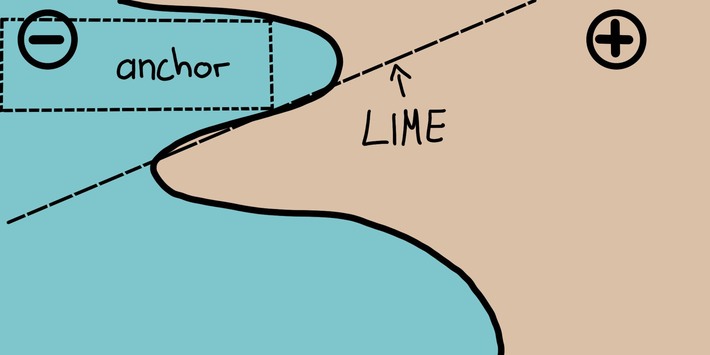
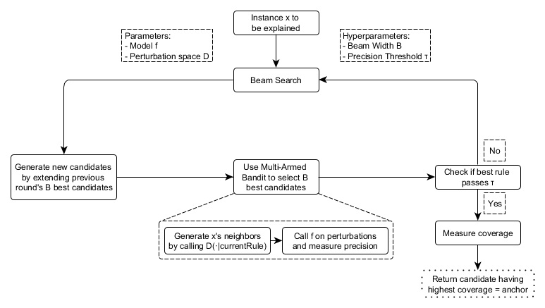

# فصل ۱۶: قوانین محدوده‌دار (Anchors)

> **عنوان اصلی:** Scoped Rules (Anchors)  
> **منبع:** [https://christophm.github.io/interpretable-ml-book/anchors.html](https://christophm.github.io/interpretable-ml-book/anchors.html)  
> **نویسنده:** Christoph Molnar  
> **مترجم:** مریم محمودی

---

*نویسندگان اصلی: Tobias Goerke و Magdalena Lang (با ویرایش‌های بعدی توسط Christoph Molnar)*

روش انکر (Anchors) پیش‌بینی‌های تکی هر مدل طبقه‌بندی جعبه سیاه را با یافتن یک قانون تصمیم که پیش‌بینی را به‌اندازه کافی «محدود» (anchor) می‌کند، توضیح می‌دهد. یک قانون زمانی یک پیش‌بینی را محدود می‌کند که تغییر در سایر مقادیر ویژگی بر پیش‌بینی تأثیری نداشته باشد. انکرز از تکنیک‌های یادگیری تقویتی در ترکیب با یک الگوریتم جستجوی گراف استفاده می‌کند تا تعداد فراخوانی‌های مدل (و در نتیجه زمان اجرای مورد نیاز) را به حداقل برساند، در حالی که همچنان قادر به بازیابی از بهینه‌های محلی است. Ribeiro، Singh و Guestrin (2018) الگوریتم انکرز را ارائه کردند — همان پژوهشگرانی که الگوریتم لایم (LIME) را معرفی کردند.

مانند نسخه پیشین خود، رویکرد انکرز یک استراتژی *مبتنی بر اختلال (perturbation-based)* را برای تولید توضیحات *محلی* برای پیش‌بینی‌های مدل‌های یادگیری ماشین جعبه سیاه به کار می‌گیرد. با این حال، به جای مدل‌های جانشین مورد استفاده در لایم، توضیحات حاصل به‌صورت قوانین *IF-THEN* ساده و قابل فهم، به نام *anchor* (محدوده)، بیان می‌شوند. این قوانین قابل استفاده مجدد هستند زیرا *دامنه‌دار (scoped)* می‌باشند: انکرها شامل مفهوم پوشش (coverage) هستند که به‌دقت مشخص می‌کند این قوانین برای کدام نمونه‌های دیگر (حتی مشاهده‌نشده) اعمال می‌شوند. یافتن انکرها شامل یک مسئله اکتشاف یا بندبند چندبازویی (multi-armed bandit) است که ریشه در رشته یادگیری تقویتی دارد. بدین منظور، همسایگان یا اختلال‌ها برای هر نمونه‌ای که توضیح داده می‌شود ایجاد و ارزیابی می‌شوند. این کار به رویکرد اجازه می‌دهد تا ساختار جعبه سیاه و پارامترهای داخلی آن را نادیده بگیرد، به‌طوری که این موارد هم مشاهده‌نشده و هم تغییرنیافته باقی بمانند. بنابراین، الگوریتم *مستقل از مدل (model-agnostic)* است، به این معنا که می‌توان آن را برای **هر** کلاسی از مدل‌ها به کار برد.

در مقاله خود، نویسندگان هر دو الگوریتم خود را مقایسه می‌کنند و نشان می‌دهند که چگونه هر یک برای استخراج نتایج، به همسایگی یک نمونه مراجعه می‌کند. برای این منظور، شکل ۱۶.۱ هر دو روش لایم و انکرز را در توضیح محلی یک طبقه‌بند دودویی پیچیده (که ‎- یا + را پیش‌بینی می‌کند) با استفاده از دو نمونه نمایشی نشان می‌دهد. نتایج لایم نشان نمی‌دهند که چقدر وفادار هستند، زیرا لایم صرفاً یک مرز تصمیم خطی را یاد می‌گیرد که مدل را با توجه به فضای اختلال $\mathcal{D}$ به بهترین شکل تقریب می‌زند. با همان فضای اختلال، رویکرد انکرز توضیحاتی را می‌سازد که پوشش آن‌ها با رفتار مدل تطبیق داده شده است، و رویکرد مرزهای آن‌ها را به‌وضوح بیان می‌کند. بنابراین، آن‌ها ذاتاً وفادار هستند و دقیقاً بیان می‌کنند که برای کدام نمونه‌ها معتبرند. این ویژگی باعث می‌شود انکرها به‌ویژه شهودی و قابل درک باشند.

همان‌طور که پیش‌تر اشاره شد، نتایج یا توضیحات الگوریتم به‌صورت قوانینی به نام انکر (anchor) ارائه می‌شوند. مثال ساده زیر چنین قانونی را نشان می‌دهد. فرض کنید یک مدل جعبه سیاه دو‌متغیره داریم که پیش‌بینی می‌کند آیا یک مسافر در فاجعه تایتانیک جان سالم به در برده است یا خیر. حال می‌خواهیم بدانیم *چرا* مدل برای یک فرد خاص (جدول ۱۶.۱) پیش‌بینی کرده که جان سالم به در برده است. الگوریتم انکرز توضیحی مانند زیر ارائه می‌دهد.

| ویژگی | مقدار |
|-------|-------|
| سن | ۲۰ |
| جنسیت | زن |
| کلاس | اول |
| قیمت بلیت | ۳۰۰$ |
| سایر ویژگی‌ها | ... |
| زنده ماند | true |

**جدول ۱۶.۱:** نمونه مورد توضیح

و توضیح انکر متناظر این است:

اگر `SEX = female` و `Class = first` آنگاه پیش‌بینی `Survived = true` با دقت ۹۷٪ و پوشش ۱۵٪

این مثال نشان می‌دهد که چگونه انکرها می‌توانند بینش‌های اساسی در مورد پیش‌بینی یک مدل و استدلال زیربنایی آن ارائه دهند. نتیجه نشان می‌دهد که کدام ویژگی‌ها توسط مدل در نظر گرفته شده‌اند که در این مورد، زن و کلاس اول هستند. انسان‌ها که برای صحت بسیار مهم هستند، می‌توانند از این قانون برای اعتبارسنجی رفتار مدل استفاده کنند. anchor additionally به ما می‌گوید که این قانون برای ۱۵٪ از نمونه‌های فضای اختلال اعمال می‌شود. در آن موارد، توضیح ۹۷٪ دقیق است، به این معنا که محمولات نمایش‌داده‌شده تقریباً به‌تنهایی مسئول خروجی پیش‌بینی‌شده هستند.

یک انکر $A$ به‌صورت رسمی به این شکل تعریف می‌شود:

$$ \mathbb{E}_{\mathcal{D}_\mathbf{x}(\mathbf{z}|A)}[1_{\hat{f}(\mathbf{x})=\hat{f}(\mathbf{z})}] \geq \tau; A(\mathbf{x})=1 $$

که در آن:

* $\mathbf{x}$ نشان‌دهنده نمونه‌ای است که توضیح داده می‌شود (مثلاً یک سطر در یک مجموعه داده جدولی).
* $A$ مجموعه‌ای از محمولات (predicates) است، یعنی قانون یا anchor حاصل، به‌طوری که $A(\mathbf{x})=1$ وقتی همه محمولات ویژگی تعریف‌شده توسط $A$ با مقادیر ویژگی $\mathbf{x}$ مطابقت داشته باشند.
* $\hat{f}$ مدل طبقه‌بندی را نشان می‌دهد که باید توضیح داده شود (مثلاً یک مدل شبکه عصبی مصنوعی). می‌توان از آن برای پیش‌بینی برچسب $\mathbf{x}$ و اختلالات آن پرس‌وجو کرد.
* $\mathcal{D}_{\mathbf{x}} (\cdot|A)$ توزیع همسایگان $\mathbf{x}$ را نشان می‌دهد که با $A$ مطابقت دارند.
* $0 \leq \tau \leq 1$ یک آستانه دقت را مشخص می‌کند. فقط قوانینی که وفاداری محلی حداقل $\tau$ را به دست آورند، نتیجه معتبر در نظر گرفته می‌شوند.

توصیف رسمی ممکن است دلهره‌آور باشد و می‌توان آن را به زبان ساده بیان کرد:

> با توجه به نمونه $\mathbf{x}$ که باید توضیح داده شود، باید قانون یا anchor $A$ را یافت به‌طوری که برای $\mathbf{x}$ قابل اعمال باشد، در حالی که همان کلاس پیش‌بینی‌شده برای $\mathbf{x}$ برای کسری حداقل $\tau$ از همسایگان $\mathbf{x}$ که همان $A$ برای آن‌ها قابل اعمال است، پیش‌بینی شود. دقت یک قانون از ارزیابی همسایگان یا اختلالات (با پیروی از $\mathcal{D}_\mathbf{x} (\mathbf{z}|A)$) با استفاده از مدل یادگیری ماشین ارائه‌شده (که با تابع نشانگر $1_{\hat{f}(\mathbf{x}) = \hat{f}(\mathbf{z})}$ نشان داده می‌شود) حاصل می‌شود.

> **نکته — تنظیم دقیق آستانه دقت**
> آستانه دقت $\tau$ را wisely تنظیم کنید: $\tau$ بالاتر قوانین قوی‌تری را تضمین می‌کند، اما ممکن است پوشش را کاهش دهد. با مقادیر مختلف آزمایش کنید تا بین دقت و پوشش تعادل برقرار کنید.

## یافتن انکرها

اگرچه توصیف ریاضی انکرها ممکن است واضح و مستقیم به نظر برسد، ساخت قوانین خاص غیرممکن است. این کار مستلزم ارزیابی $1_{\hat{f}(\mathbf{x}) = \hat{f}(\mathbf{z})}$ برای همه $\mathbf{z} \in \mathcal{D}_\mathbf{x}(\cdot|A)$ است که در فضاهای ورودی پیوسته یا بزرگ امکان‌پذیر نیست. بنابراین، نویسندگان پیشنهاد می‌کنند پارامتر $0 \leq \delta \leq 1$ را برای ایجاد یک تعریف احتمالی معرفی کنند. به این ترتیب، نمونه‌ها تا زمانی که اطمینان آماری در مورد دقت آن‌ها حاصل شود، کشیده می‌شوند. تعریف احتمالی به این صورت است:

$$\mathbb{P}(prec(A) \geq \tau) \geq 1 - \delta \quad \textrm{with} \quad prec(A) = \mathbb{E}_{\mathcal{D}_\mathbf{x}(\mathbf{z}|A)}[1_{\hat{f}(\mathbf{x}) = \hat{f}(\mathbf{z})}]$$

دو تعریف قبلی با مفهوم پوشش (coverage) ترکیب و گسترش می‌یابند. منطق آن شامل یافتن قوانینی است که ترجیحاً برای بخش بزرگی از فضای ورودی مدل قابل اعمال باشند. پوشش به‌صورت رسمی به‌عنوان احتمال اعمال یک anchor برای همسایگانش، یعنی فضای اختلال آن، تعریف می‌شود:

$$cov(A) = \mathbb{E}_{\mathcal{D}_{(\mathbf{x})}}[A(\mathbf{z})]$$

گنجاندن این عنصر به تعریف نهایی anchor منجر می‌شود که بیشینه‌سازی پوشش را در نظر می‌گیرد:

$$\underset{A \:\textrm{s.t.}\;\mathbb{P}(prec(A) \geq \tau) \geq 1 - \delta}{\textrm{max}} cov(A)$$

بنابراین، این رویکرد برای قانونی تلاش می‌کند که بالاترین پوشش را در میان همه قوانین واجد شرایط (همه آن‌هایی که آستانه دقت را با توجه به تعریف احتمالی برآورده می‌کنند) داشته باشد. این قوانین مهم‌تر در نظر گرفته می‌شوند، زیرا بخش بزرگ‌تری از مدل را توصیف می‌کنند. توجه داشته باشید که قوانین با محمولات بیشتر تمایل به دقت بالاتری نسبت به قوانین با محمولات کمتر دارند. به‌طور خاص، قانونی که هر ویژگی $\mathbf{x}$ را تثبیت می‌کند، همسایگی ارزیابی‌شده را به نمونه‌هایی یکسان کاهش می‌دهد. بنابراین، مدل همه همسایگان را به‌طور یکسان طبقه‌بندی می‌کند و دقت قانون $1$ خواهد بود. در عین حال، قانونی که ویژگی‌های زیادی را تثبیت می‌کند، بیش از حد خاص است و فقط برای تعداد کمی از نمونه‌ها قابل اعمال است. از این رو، یک *مبادله بین دقت و پوشش* وجود دارد.

رویکرد انکرز از چهار مؤلفه اصلی برای یافتن توضیحات استفاده می‌کند.

**تولید کاندیدا (Candidate Generation):** کاندیداهای توضیح جدید تولید می‌کند. در دور اول، به ازای هر ویژگی $\mathbf{x}$ یک کاندیدا ایجاد می‌شود که مقدار مربوطه از اختلالات ممکن را تثبیت می‌کند. در هر دور دیگر، بهترین کاندیداهای دور قبلی با یک محمول ویژگی که هنوز در آن موجود نیست، گسترش می‌یابند.

**شناسایی بهترین کاندیدا (Best Candidate Identification):** قوانین کاندیدا از نظر اینکه کدام قانون $\mathbf{x}$ را بهترین توضیح می‌دهد مقایسه می‌شوند. بدین منظور، اختلالاتی که با قانون مشاهده‌شده مطابقت دارند ایجاد و با فراخوانی مدل ارزیابی می‌شوند. با این حال، این فراخوانی‌ها باید برای محدود کردن سربار محاسباتی به حداقل برسند. به همین دلیل، در هسته این مؤلفه، یک بندبند چندبازویی اکتشاف محض (pure-exploration Multi-Armed Bandit - MAB) وجود دارد. به‌طور دقیق‌تر، الگوریتم *KL-LUCB* توسط Kaufmann و Kalyanakrishnan (2013) است. MABها برای کاوش و بهره‌برداری کارآمد از استراتژی‌های مختلف (که در قیاس با ماشین‌های Slot، arm نامیده می‌شوند) با استفاده از انتخاب ترتیبی به کار می‌روند. در این تنظیم، هر قانون کاندیدا به‌عنوان یک arm قابل کشیدن دیده می‌شود. هر بار که کشیده می‌شود، همسایگان مربوطه ارزیابی می‌شوند و بدین‌وسیله اطلاعات بیشتری در مورد بازده (در اینجا دقت) قانون کاندیدا به دست می‌آوریم. دقت thus بیان می‌کند که قانون چقدر نمونه مورد توضیح را به خوبی توصیف می‌کند.

**اعتبارسنجی دقت کاندیدا (Candidate Precision Validation):** در صورت عدم اطمینان آماری مبنی بر اینکه کاندیدا از آستانه $\tau$ فراتر رفته است، نمونه‌های بیشتری می‌گیرد.

**جستجوی پرتو اصلاح‌شده (Modified Beam Search):** همه مؤلفه‌های فوق در یک جستجوی پرتو (beam search) که یک الگوریتم جستجوی گراف و گونه‌ای از الگوریتم جستجوی سطح اول (breadth-first) است، مونتاژ می‌شوند. این جستجو $B$ بهترین کاندیدای هر دور را به دور بعد منتقل می‌کند (که $B$ *عرض پرتو (Beam Width)* نامیده می‌شود). سپس از این $B$ قانون برتر برای ایجاد قوانین جدید استفاده می‌شود. جستجوی پرتو حداکثر $featureCount(\mathbf{x})$ دور انجام می‌دهد، زیرا هر ویژگی فقط یک بار می‌تواند در یک قانون گنجانده شود. بنابراین، در هر دور $i$، کاندیداهایی با دقیقاً $i$ محمول تولید می‌کند و $B$ بهترین آن‌ها را انتخاب می‌کند. بنابراین، با تنظیم $B$ بالا، الگوریتم احتمال بیشتری دارد که از بهینه‌های محلی جلوگیری کند. در عوض، این کار به تعداد بالایی فراخوانی مدل نیاز دارد و در نتیجه بار محاسباتی را افزایش می‌دهد.

این چهار مؤلفه در شکل ۱۶.۲ نشان داده شده‌اند.

این رویکرد دستورالعملی به‌ظاهر کامل برای استخراج کارآمد اطلاعات آماری معتبر درباره اینکه چرا یک سیستم نمونه‌ای را به‌گونه‌ای که کرده طبقه‌بندی کرده است، به نظر می‌رسد. این روش به‌طور سیستماتیک با ورودی مدل آزمایش می‌کند و با مشاهده خروجی‌های مربوطه نتیجه‌گیری می‌کند. این روش بر روش‌های یادگیری ماشین مستقر و پژوهش‌شده (MABها) برای کاهش تعداد فراخوانی‌های مدل تکیه می‌کند. این امر به نوبه خود زمان اجرای الگوریتم را به‌شدت کاهش می‌دهد.

## پیچیدگی و زمان اجرا

دانستن رفتار زمان اجرای مجانبی رویکرد انکرز به ارزیابی این که چقدر خوب روی مسائل خاص عمل می‌کند کمک می‌کند. فرض کنید $B$ عرض پرتو و $p$ تعداد همه ویژگی‌ها باشد. سپس الگوریتم انکرز تابع زیر است:

$$\mathcal{O}(B \cdot p^2 + p^2 \cdot \mathcal{O}_{\textrm{MAB} [B \cdot p, B]})$$

این کران از هایپرپارامترهای مستقل از مسئله، مانند اطمینان آماری $\delta$، انتزاع می‌کند. نادیده گرفتن هایپرپارامترها به کاهش پیچیدگی کران کمک می‌کند (برای اطلاعات بیشتر به مقاله اصلی مراجعه کنید). از آنجایی که MAB در هر دور $B$ بهترین را از بین $B \cdot p$ کاندیدا استخراج می‌کند، اکثر MABها و زمان اجرای آن‌ها عامل $p^2$ را بیش از هر پارامتر دیگری ضرب می‌کنند.

بنابراین آشکار می‌شود: کارایی الگوریتم زمانی که ویژگی‌های زیادی وجود دارند کاهش می‌یابد.

## مثال داده‌های جدولی

داده‌های جدولی داده‌های ساختاریافته‌ای هستند که توسط جداول نمایش داده می‌شوند، که در آن ستون‌ها ویژگی‌ها و سطرها نمونه‌ها را نشان می‌دهند. برای مثال، از داده‌های اجاره دوچرخه برای نشان دادن پتانسیل رویکرد انکرز در توضیح پیش‌بینی‌های یادگیری ماشین برای نمونه‌های انتخاب‌شده استفاده می‌کنیم. برای این کار، رگرسیون را به یک مسئله طبقه‌بندی تبدیل می‌کنیم و یک جنگل تصادفی را به‌عنوان مدل جعبه سیاه خود آموزش می‌دهیم. این مدل باید طبقه‌بندی کند که آیا تعداد دوچرخه‌های اجاره‌شده بالاتر یا پایین‌تر از خط روند است. همچنین از ویژگی‌های اضافی مانند تعداد روزهای از سال ۲۰۱۱ به‌عنوان روند زمانی، ماه و روز هفته استفاده می‌کنیم.

قبل از ایجاد توضیحات انکر، باید یک تابع اختلال تعریف کرد. یک راه آسان برای انجام این کار استفاده از یک فضای اختلال پیش‌فرض شهودی برای موارد توضیح جدولی است که می‌تواند با نمونه‌گیری از، مثلاً، داده‌های آموزشی ساخته شود. هنگام ایجاد اختلال در یک نمونه، این رویکرد پیش‌فرض مقادیر ویژگی‌هایی را که مشمول محمولات انکر هستند حفظ می‌کند، در حالی که ویژگی‌های غیرثابت را با مقادیر گرفته‌شده از نمونه تصادفی دیگر با احتمال مشخصی جایگزین می‌کند. این فرآیند نمونه‌های جدیدی تولید می‌کند که مشابه نمونه توضیح‌داده‌شده هستند اما برخی مقادیر را از نمونه‌های تصادفی دیگر اقتباس کرده‌اند. بنابراین، آن‌ها شبیه همسایگان نمونه توضیح‌داده‌شده هستند.

## نقاط قوت

رویکرد انکرز مزایای متعددی نسبت به لایم دارد. اول، خروجی الگوریتم **راحت‌تر قابل درک است**، زیرا قوانین **به‌راحتی قابل تفسیر** هستند (حتی برای افراد غیرمتخصص).

علاوه بر این، **انکرها قابل زیرمجموعه‌گذاری هستند** و حتی با گنجاندن مفهوم پوشش، معیاری از اهمیت را بیان می‌کنند. دوم، رویکرد انکرز **زمانی کار می‌کند که پیش‌بینی‌های مدل در همسایگی یک نمونه غیرخطی یا پیچیده باشند**. از آنجایی که این رویکرد به جای برازش مدل‌های جانشین از تکنیک‌های یادگیری تقویتی استفاده می‌کند، احتمال کمتری دارد که مدل را کمتر از حد برازش (underfit) کند.

## محدودیت‌ها

الگوریتم از یک **راه‌اندازی بسیار قابل تنظیم و تأثیرگذار** رنج می‌برد، درست مانند اکثر توضیح‌دهنده‌های مبتنی بر اختلال. نه تنها هایپرپارامترهایی مانند عرض پرتو یا آستانه دقت باید برای به‌دست‌آوردن نتایج معنادار تنظیم شوند، بلکه تابع اختلال نیز باید به‌صراحت برای یک دامنه/مورد استفاده خاص طراحی شود. به این فکر کنید که داده‌های جدولی چگونه مختل می‌شوند، و به این فکر کنید که چگونه می‌توان همان مفاهیم را برای داده‌های تصویری اعمال کرد (نکته: نمی‌توان این کار را کرد). خوشبختانه، ممکن است از رویکردهای پیش‌فرض در برخی دامنه‌ها (مثلاً جدولی) استفاده شود که راه‌اندازی اولیه توضیح را تسهیل می‌کند.

همچنین، **بسیاری از سناریوها نیاز به گسسته‌سازی (discretization) دارند**، زیرا در غیر این صورت نتایج بیش از حد خاص، دارای پوشش کم هستند و به درک مدل کمک نمی‌کنند. در حالی که گسسته‌سازی می‌تواند کمک کند، همچنین ممکن است اگر بی‌دقت استفاده شود مرزهای تصمیم را محو کند و thus اثر معکوس داشته باشد. از آنجا که بهترین تکنیک گسسته‌سازی وجود ندارد، کاربران باید قبل از تصمیم‌گیری در مورد نحوه گسسته‌سازی داده‌ها از آن آگاه باشند تا نتایج ضعیفی به دست نیاورند.

## نرم‌افزار و گزینه‌های جایگزین

در حال حاضر، دو پیاده‌سازی موجود است: [anchor، یک بسته پایتون](https://github.com/marcotcr/anchor) (همچنین توسط [Alibi](https://github.com/SeldonIO/alibi) ادغام شده)، و یک [پیاده‌سازی جاوا](https://github.com/viadee/javaAnchorExplainer). اولی مرجع نویسندگان الگوریتم انکرز است و دومی یک پیاده‌سازی با کارایی بالا است که با یک رابط R به نام [anchors](https://github.com/viadee/anchorsOnR) عرضه می‌شود که برای مثال‌های این فصل استفاده شده است. در حال حاضر، پیاده‌سازی انکرز فقط از داده‌های جدولی پشتیبانی می‌کند. با این حال، از نظر تئوری، انکرها را می‌توان برای هر دامنه یا نوع داده‌ای ساخت.
