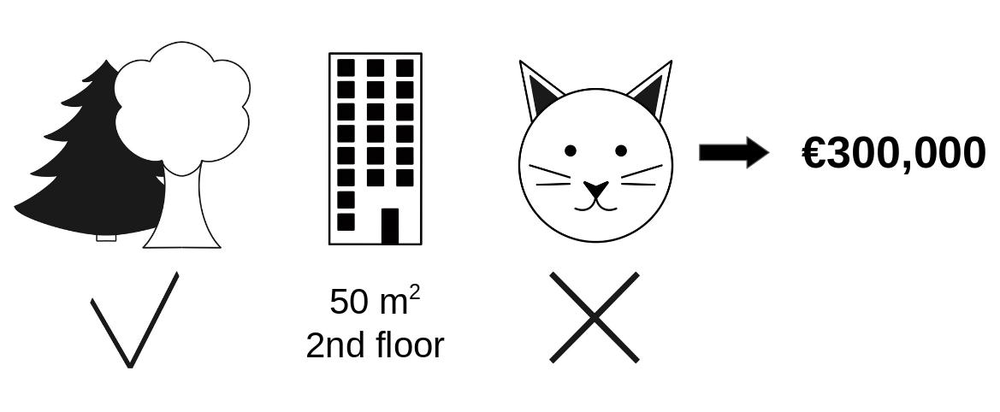
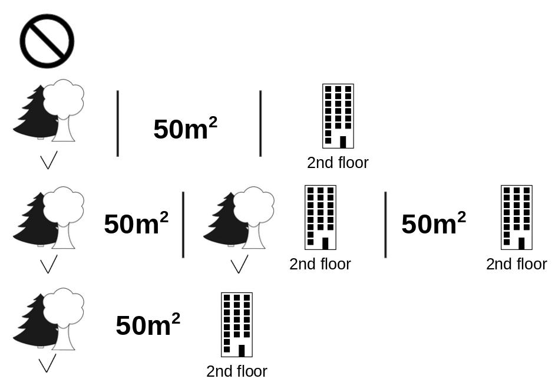
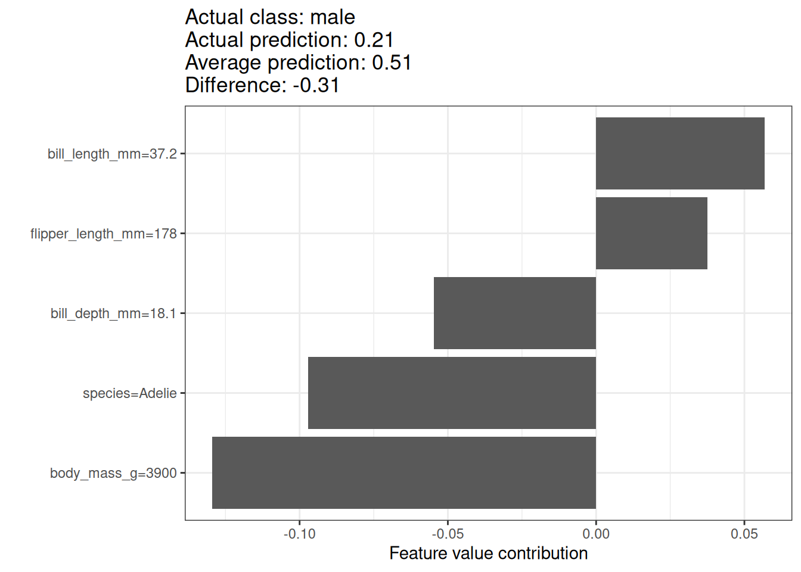
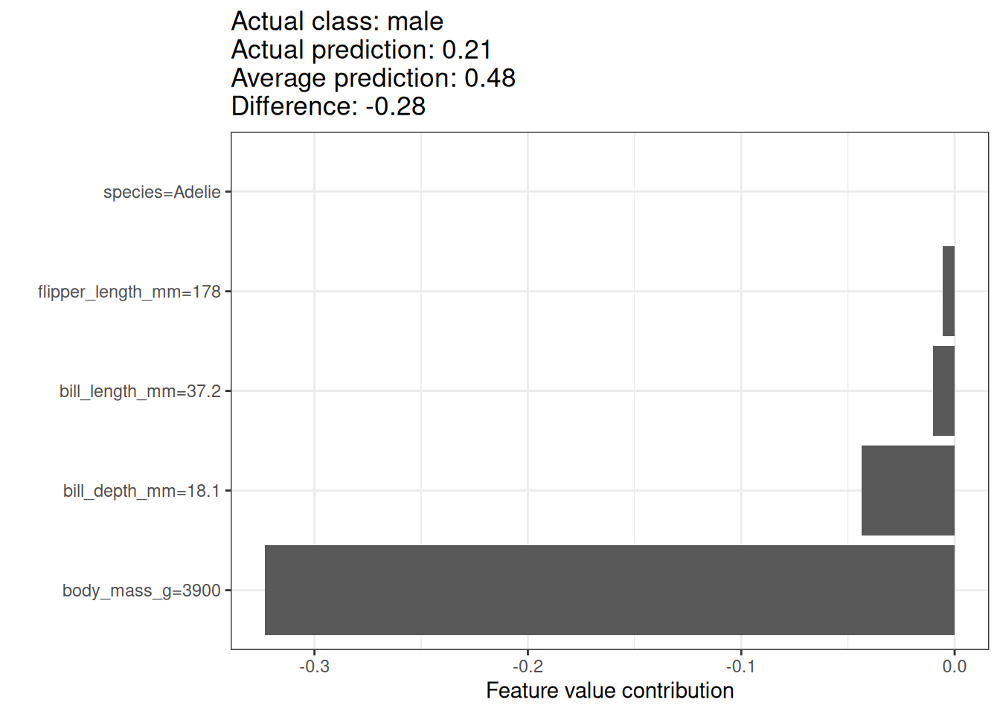
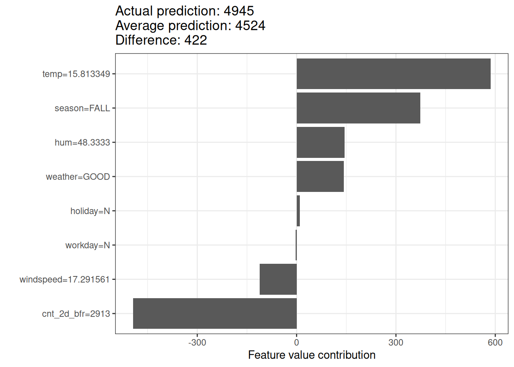

# فصل ۱۷: مقادیر شپلی

> **عنوان اصلی:** Shapley Values  
> **منبع:** [https://christophm.github.io/interpretable-ml-book/shapley.html](https://christophm.github.io/interpretable-ml-book/shapley.html)  
> **نویسنده:** Christoph Molnar  
> **مترجم:** مریم محمودی

---

یک پیش‌بینی را می‌توان با این فرض توضیح داد که هر مقدار ویژگی در یک نمونه، «بازیکنی» در یک بازی است که پیش‌بینی، برنده‌شدن آن بازی است. مقادیر شپلی — روشی برگرفته از نظریه بازی‌های ائتلافی — به ما می‌گویند چگونه این «برنده» را به‌صورت منصفانه میان ویژگی‌ها تقسیم کنیم.

---

> **نکته**
> به دنبال راهنمایی جامع و عملی برای SHAP (شپ) و مقادیر شپلی هستید؟ کتاب *Interpreting Machine Learning Models with SHAP* پاسخگوی نیاز شماست. با مثال‌های عملی پایتون از بسته `shap`، یاد می‌گیرید چگونه مدل‌هایی از ساده تا پیچیده را تفسیر کنید. این کتاب به مکانیزم‌های درونی SHAP می‌پردازد، الگوهای تفسیر ارائه می‌دهد و محدودیت‌های کلیدی را برجسته می‌سازد — تا بتوانید SHAP را با اطمینان و اثربخشی به‌کار ببرید.
>
> 

## ایده کلی

فرض کنید سناریوی زیر را در نظر بگیریم: یک مدل یادگیری ماشین برای پیش‌بینی قیمت آپارتمان‌ها آموزش دیده است. برای یک آپارتمان مشخص، قیمت ۳۰۰٬۰۰۰ یورو پیش‌بینی شده و باید این پیش‌بینی را توضیح دهیم. این آپارتمان ۵۰ متر مربع زیربنا دارد، در طبقه دوم واقع شده، در نزدیکی آن یک پارک وجود دارد، و نگهداری گربه در آن ممنوع است — همان‌طور که در شکل ۱۷.۱ نشان داده شده است. میانگین پیش‌بینی برای همه آپارتمان‌ها ۳۱۰٬۰۰۰ یورو است. هدف ما این است که بفهمیم هر یک از این مقادیر ویژگی چه سهمی در پیش‌بینی داشته‌اند. هر ویژگی در مقایسه با پیش‌بینی میانگین، چه مقدار به این پیش‌بینی کمک کرده است؟

در مدل‌های رگرسیون خطی پاسخ ساده است: اثر هر ویژگی برابر است با وزن آن ویژگی ضربدر مقدارش. این رویکرد تنها به دلیل خطی بودن مدل کار می‌کند. برای مدل‌های پیچیده‌تر، به راه‌حل دیگری نیاز داریم. برای مثال، لایم (LIME) از مدل‌های محلی برای تخمین اثرات استفاده می‌کند. راه‌حل دیگری از نظریه بازی‌های تعاونی می‌آید: مقدار شپلی، که توسط Shapley (1953) معرفی شد، روشی برای تخصیص پرداخت به بازیکنان بر اساس سهم آن‌ها در کل بازده است. بازیکنان در یک ائتلاف همکاری می‌کنند و سودی مشترک به دست می‌آورند.

بازیکنان؟ بازی؟ پرداخت؟ ارتباط اینها با پیش‌بینی‌های یادگیری ماشین و تفسیرپذیری چیست؟ «بازی» همان وظیفه پیش‌بینی برای یک نمونه از مجموعه داده است. «سود» برابر است با پیش‌بینی واقعی برای این نمونه منهای پیش‌بینی میانگین برای همه نمونه‌ها. «بازیکنان» همان مقادیر ویژگی‌های نمونه هستند که با همکاری یکدیگر به این سود دست می‌یابند (یعنی مقدار مشخصی را پیش‌بینی می‌کنند). در مثال آپارتمان، مقادیر ویژگی «پارک‌مجاور»، «گربه‌ممنوع»، «مساحت‌۵۰» و «طبقه‌دوم» با هم همکاری کردند تا پیش‌بینی ۳۰۰٬۰۰۰ یورو حاصل شود. هدف ما توضیح تفاوت میان پیش‌بینی واقعی (۳۰۰٬۰۰۰ یورو) و پیش‌بینی میانگین (۳۱۰٬۰۰۰ یورو) است: تفاوتی برابر با ‎-۱۰٬۰۰۰ یورو.

پاسخ می‌تواند چنین باشد: پارک‌مجاور ۳۰٬۰۰۰ یورو، مساحت‌۵۰ مبلغ ۱۰٬۰۰۰ یورو، طبقه‌دوم مبلغ ۰ یورو، و گربه‌ممنوع مبلغ ‎-۵۰٬۰۰۰ یورو سهم داشته است. مجموع این سهم‌ها برابر با ‎-۱۰٬۰۰۰ یورو می‌شود که همان تفاوت پیش‌بینی نهایی از میانگین پیش‌بینی‌شده قیمت آپارتمان است.

### مقدار شپلی یک ویژگی را چگونه محاسبه می‌کنیم؟

**مقدار شپلی، میانگین سهم حاشیه‌ای یک مقدار ویژگی در تمام ائتلاف‌های ممکن است.**

شکل ۱۷.۲ نشان می‌دهد که چگونه سهم حاشیه‌ای مقدار ویژگی «گربه‌ممنوع» محاسبه می‌شود، وقتی به ائتلاف «پارک‌مجاور» و «مساحت‌۵۰» اضافه می‌شود. ما شبیه‌سازی می‌کنیم که تنها «پارک‌مجاور»، «گربه‌ممنوع» و «مساحت‌۵۰» در ائتلاف هستند — و این کار را با انتخاب تصادفی یک آپارتمان دیگر از داده‌ها انجام می‌دهیم و از مقدار ویژگی طبقه آن استفاده می‌کنیم. مقدار «طبقه‌دوم» با «طبقه‌اول» که به‌صورت تصادفی انتخاب شده، جایگزین می‌شود. سپس قیمت آپارتمان را با این ترکیب پیش‌بینی می‌کنیم (۳۱۰٬۰۰۰ یورو). در گام دوم، «گربه‌ممنوع» را از ائتلاف حذف می‌کنیم و با مقدار تصادفی ویژگی «مجاز/ممنوع بودن گربه» از آپارتمان انتخاب‌شده جایگزین می‌کنیم. در این مثال، مقدار جایگزین «گربه‌مجاز» بود، اما می‌توانست دوباره «گربه‌ممنوع» باشد. قیمت آپارتمان را برای ائتلاف «پارک‌مجاور» و «مساحت‌۵۰» پیش‌بینی می‌کنیم (۳۲۰٬۰۰۰ یورو). سهم «گربه‌ممنوع» برابر با ۳۱۰٬۰۰۰ − ۳۲۰٬۰۰۰ = ‎-۱۰٬۰۰۰ یورو خواهد بود. این تخمین به مقادیر آپارتمان انتخاب‌شده‌ای بستگی دارد که به‌عنوان «دهنده» برای مقادیر ویژگی‌های گربه و طبقه عمل کرده است. با تکرار این نمونه‌گیری و میانگین‌گیری از سهم‌ها، تخمین‌های دقیق‌تری به دست می‌آوریم.

این محاسبه را برای تمام ائتلاف‌های ممکن تکرار می‌کنیم. مقدار شپلی، میانگین تمام سهم‌های حاشیه‌ای در همه ائتلاف‌های ممکن است. زمان محاسبه با افزایش تعداد ویژگی‌ها به‌صورت نمایی رشد می‌کند. یکی از راه‌حل‌ها برای کنترل زمان محاسبه، این است که سهم‌ها را تنها برای تعداد محدودی از ائتلاف‌های نمونه‌گیری‌شده حساب کنیم.

شکل ۱۷.۳ تمام ائتلاف‌های مقادیر ویژگی‌ای را نشان می‌دهد که برای تعیین دقیق مقدار شپلی «گربه‌ممنوع» لازم است. سطر اول، ائتلاف بدون هیچ مقدار ویژگی را نشان می‌دهد. سطرهای دوم، سوم و چهارم، ائتلاف‌های مختلف با اندازه‌های رو به رشد را نشان می‌دهند که با «|» از هم جدا شده‌اند. در مجموع، ائتلاف‌های زیر ممکن هستند:

- `{}` (ائتلاف خالی)
- `{پارک‌مجاور}`
- `{مساحت‌۵۰}`
- `{طبقه‌دوم}`
- `{پارک‌مجاور، مساحت‌۵۰}`
- `{پارک‌مجاور، طبقه‌دوم}`
- `{مساحت‌۵۰، طبقه‌دوم}`
- `{پارک‌مجاور، مساحت‌۵۰، طبقه‌دوم}`

برای هر یک از این ائتلاف‌ها، قیمت پیش‌بینی‌شده آپارتمان را با و بدون مقدار ویژگی «گربه‌ممنوع» محاسبه کرده و تفاوت را به‌عنوان سهم حاشیه‌ای در نظر می‌گیریم. مقدار شپلی، میانگین موزون تمام این سهم‌های حاشیه‌ای است. برای به‌دست‌آوردن پیش‌بینی از مدل یادگیری ماشین، مقادیر ویژگی‌هایی که در ائتلاف نیستند را با مقادیر تصادفی از مجموعه داده آپارتمان‌ها جایگزین می‌کنیم. اگر مقادیر شپلی را برای تمام مقادیر ویژگی‌ها محاسبه کنیم، توزیع کامل پیش‌بینی (منهای میانگین) را در میان ویژگی‌ها به دست می‌آوریم.

---

## مثال‌ها و تفسیر

تفسیر مقدار شپلی برای ویژگی $j$ چنین است: مقدار $j$-امین ویژگی به اندازه $\phi_j$ به پیش‌بینی این نمونه خاص، در مقایسه با پیش‌بینی میانگین مجموعه داده، کمک کرده است. مقدار شپلی هم برای طبقه‌بندی (در صورت کار با احتمال‌ها) و هم برای رگرسیون کاربرد دارد.

از مقدار شپلی برای تحلیل پیش‌بینی‌های یک مدل جنگل تصادفی (Random Forest) برای تعیین جنسیت پنگوئن‌ها استفاده می‌کنیم. شکل ۱۷.۴ مقادیر شپلی را برای یک پنگوئن نر نشان می‌دهد. احتمال پیش‌بینی‌شده ماده بودن این پنگوئن، یعنی P(female)=0.21، مقدار ‎0.31 پایین‌تر از میانگین احتمال P(female)=0.51 برای همه پنگوئن‌هاست. طول منقار بیشترین سهم را در احتمال ماده بودن داشته، اما اکثر عوامل (به‌درستی) به سمت نر بودن اشاره می‌کنند. مجموع سهم‌ها برابر با تفاوت میان پیش‌بینی واقعی و میانگین پیش‌بینی (0.51) می‌شود.

مقادیر شپلی همواره به یک مجموعه داده مرجع نیاز دارند که از آن، اعضای غایب تیم نمونه‌گیری شوند. در اینجا از تمام نقاط داده — یعنی همه پنگوئن‌ها، صرف‌نظر از گونه‌شان — استفاده کردم. پنگوئن مورد نظر از گونه آدلی است و می‌توان مقادیر شپلی را تنها در مقایسه با پنگوئن‌های هم‌گونه نیز محاسبه کرد. این کار مشکل نمونه‌گیری و ترکیب مقادیر غیرواقعی را کاهش می‌دهد. شکل ۱۷.۵ تفسیر متفاوتی را نیز نشان می‌دهد. هنگام مقایسه این پنگوئن با سایر پنگوئن‌های آدلی، دلیل پایین بودن احتمال ماده بودنش، وزن بدن اوست.

> **نکته — انتخاب دقیق داده مرجع**
> تفسیر مقدار شپلی همواره نسبت به مجموعه داده‌ای است که برای جایگزینی مقادیر بازیکنان غایب استفاده شده. اطمینان حاصل کنید که مجموعه داده مرجع معناداری انتخاب می‌کنید.

برای مجموعه داده اجاره دوچرخه نیز یک مدل جنگل تصادفی آموزش می‌دهیم تا تعداد دوچرخه‌های اجاره‌ای در یک روز را — با توجه به اطلاعات آب‌وهوایی و تقویمی — پیش‌بینی کند. توضیحات تولیدشده برای پیش‌بینی مدل جنگل تصادفی برای یک روز مشخص در شکل ۱۷.۶ نشان داده شده است.

با پیش‌بینی ۴۹۴۵ دوچرخه اجاری، این روز ۴۲۲ دوچرخه کمتر از میانگین پیش‌بینی‌شده ۴۵۲۴ دارد. دما و رطوبت بزرگ‌ترین سهم مثبت را داشته‌اند. تعداد کم دوچرخه‌های اجاری دو روز پیش، بزرگ‌ترین سهم منفی را داشته است. مجموع مقادیر شپلی برابر با تفاوت پیش‌بینی واقعی و میانگین پیش‌بینی (۴۲۲) می‌شود.

> **هشدار — مقادیر شپلی، پیش‌بینی‌های خلاف واقع نیستند**
> در تفسیر مقدار شپلی دقت کنید: مقدار شپلی، میانگین سهم یک مقدار ویژگی در پیش‌بینی، در ائتلاف‌های مختلف است. مقدار شپلی **برابر با تفاوت پیش‌بینی پس از حذف ویژگی از آموزش مدل نیست**.

---

## نظریه مقادیر شپلی

این بخش برای خوانندگانی که به جزئیات فنی علاقه دارند، به تعریف و محاسبه مقدار شپلی می‌پردازد. اگر به این جزئیات نیاز ندارید، می‌توانید مستقیماً به بخش «نقاط قوت و محدودیت‌ها» بروید.

هدف ما این است که بدانیم هر ویژگی چه تأثیری بر پیش‌بینی یک نقطه داده دارد. در مدل خطی، محاسبه اثرات فردی ساده است. پیش‌بینی یک مدل خطی برای یک نمونه داده چنین است:

$$\hat{f}(x) = \beta_0 + \beta_1 x_1 + \ldots + \beta_p x_p$$

که در آن $x$ نمونه‌ای است که می‌خواهیم سهم‌های آن را محاسبه کنیم. هر $x_j$ یک مقدار ویژگی است و $j \in \{1, \ldots, p\}$. $\beta_j$ وزن متناظر با ویژگی $j$ است.

سهم $\phi_j$ از $j$-امین ویژگی در پیش‌بینی $\hat{f}(x)$ چنین است:

$$\phi_j = \beta_j x_j - E(\beta_j X_j) = \beta_j x_j - \beta_j E(X_j)$$

که $E(\beta_j X_j)$ تخمین اثر میانگین برای ویژگی $j$ است. سهم، تفاوت میان اثر ویژگی و اثر میانگین است. اگر مجموع همه سهم‌های ویژگی را برای یک نمونه حساب کنیم:

$$
\sum_{j=1}^{p}\phi_j = \sum_{j=1}^{p}(\beta_j x_j - E(\beta_j X_j))
= \left(\beta_0 + \sum_{j=1}^{p}\beta_j x_j\right) - \left(\beta_0 + \sum_{j=1}^{p}E(\beta_j X_j)\right)
= \hat{f}(x) - E(\hat{f}(X))
$$

این برابر است با مقدار پیش‌بینی‌شده برای نقطه داده $x$ منهای میانگین مقدار پیش‌بینی‌شده. سهم‌های ویژگی می‌توانند منفی باشند.

آیا می‌توان همین کار را برای هر نوع مدلی انجام داد؟ داشتن چنین ابزار مدل‌آگنوستیکی (model-agnostic) بسیار ارزشمند خواهد بود. از آنجا که در سایر انواع مدل‌ها معمولاً وزن‌های مشابهی وجود ندارند، به راه‌حل دیگری نیاز داریم.

کمک از جایی غیرمنتظره می‌آید: نظریه بازی‌های تعاونی. مقدار شپلی راه‌حلی برای محاسبه سهم‌های ویژگی برای پیش‌بینی‌های تکی در هر مدل یادگیری ماشین است.

### تعریف

مقدار شپلی از طریق یک تابع مقدار $v$ از بازیکنان در $S$ تعریف می‌شود.

مقدار شپلی یک مقدار ویژگی، سهم آن در پرداخت است که با وزن‌دهی بر تمام ترکیبات ممکن مقادیر ویژگی جمع‌زده می‌شود:

$$\phi_j(v) = \sum_{S \subseteq \{1,\ldots,p\} \setminus \{j\}} \frac{|S|!(p - |S| - 1)!}{p!} \left(v(S \cup \{j\}) - v(S)\right)$$

که $S$ زیرمجموعه‌ای از ویژگی‌های استفاده‌شده در مدل است، $x$ بردار مقادیر ویژگی نمونه‌ای است که قرار است توضیح داده شود، و $p$ تعداد ویژگی‌هاست. $v(S)$ پیش‌بینی برای مقادیر ویژگی در مجموعه $S$ است که بر ویژگی‌های $x_C$ (یعنی تمام ویژگی‌هایی که در $S$ نیستند) حاشیه‌زنی (marginalize) شده است:

$$v(S) = \int \hat{f}(x_S, X_C) \, d\mathbb{P}_{X_C} - E_X(\hat{f}(X))$$

برای هر ویژگی‌ای که در $S$ نیست، یک انتگرال جداگانه محاسبه می‌شود. مثالی ملموس: مدل یادگیری ماشین با ۴ ویژگی $x_1$، $x_2$، $x_3$ و $x_4$ کار می‌کند و ما پیش‌بینی را برای ائتلاف $S$ شامل مقادیر ویژگی‌های $x_1$ و $x_3$ ارزیابی می‌کنیم:

$$v(\{1,3\}) = \int\int \hat{f}(x_1, X_2, x_3, X_4) \, d\mathbb{P}_{X_2} \, d\mathbb{P}_{X_4} - E_X(\hat{f}(X))$$

این شباهت زیادی به سهم‌های ویژگی در مدل خطی دارد!

> **یادداشت — واژه «مقدار» معناهای گوناگونی دارد؛ گیج نشوید**
> مقدار ویژگی (feature value)، مقدار عددی یا طبقه‌ای یک ویژگی برای یک نمونه است؛ مقدار شپلی (Shapley value)، سهم ویژگی در پیش‌بینی است؛ و تابع مقدار (value function)، تابع پرداخت برای ائتلاف‌های بازیکنان (مقادیر ویژگی) است.

مقدار شپلی تنها روش انتساب است که خواص **کارایی**، **تقارن**، **بی‌اثری** و **افزایش‌پذیری** را برآورده می‌کند که در کنار هم می‌توانند به‌عنوان تعریفی از پرداخت منصفانه در نظر گرفته شوند.

**کارایی (Efficiency):** سهم‌های ویژگی باید برابر تفاوت میان پیش‌بینی برای $x$ و پیش‌بینی میانگین باشند.

$$\sum_{j=1}^{p}\phi_j = \hat{f}(x) - E_X(\hat{f}(X))$$

**تقارن (Symmetry):** سهم‌های دو مقدار ویژگی $j$ و $k$ باید برابر باشند اگر به یک اندازه در تمام ائتلاف‌های ممکن سهیم باشند. اگر:

$$v(S \cup \{j\}) = v(S \cup \{k\})$$

برای همه:

$$S \subseteq \{1, \ldots, p\} \setminus \{j, k\}$$

آنگاه:

$$\phi_j = \phi_k$$

**بی‌اثری (Dummy):** ویژگی $j$ که بدون توجه به اینکه به کدام ائتلاف از مقادیر ویژگی اضافه شود مقدار پیش‌بینی‌شده را تغییر نمی‌دهد، باید مقدار شپلی صفر داشته باشد. اگر:

$$v(S \cup \{j\}) = v(S)$$

برای همه:

$$S \subseteq \{1, \ldots, p\}$$

آنگاه:

$$\phi_j = 0$$

**افزایش‌پذیری (Additivity):** برای یک بازی با پرداخت‌های ترکیبی $v + w$، مقادیر شپلی متناظر به این شکل هستند:

$$\phi_j^{v+w} = \phi_j^v + \phi_j^w$$

فرض کنید یک جنگل تصادفی آموزش داده‌اید، به این معنا که پیش‌بینی میانگین بسیاری از درخت‌های تصمیم است. خاصیت افزایش‌پذیری تضمین می‌کند که برای یک مقدار ویژگی، می‌توان مقدار شپلی را به‌صورت جداگانه برای هر درخت محاسبه کرد، میانگین گرفت، و مقدار شپلی آن ویژگی را برای کل جنگل تصادفی به دست آورد.

> **یادداشت — درک شهودی از مقادیر شپلی**
> مقادیر ویژگی به‌ترتیبی تصادفی وارد یک اتاق می‌شوند. تمام مقادیر ویژگی‌های حاضر در اتاق در بازی شرکت می‌کنند (یعنی در پیش‌بینی سهیم هستند). مقدار شپلی یک مقدار ویژگی، میانگین تغییر در پیش‌بینی ائتلاف حاضر در اتاق است، هنگامی که آن مقدار ویژگی به آن‌ها می‌پیوندد.

### تخمین مقادیر شپلی

برای محاسبه دقیق مقدار شپلی، تمام ائتلاف‌های (مجموعه‌های) ممکن از مقادیر ویژگی باید با و بدون $j$-امین ویژگی ارزیابی شوند. برای بیش از چند ویژگی، راه‌حل دقیق این مسئله چالش‌برانگیز می‌شود، زیرا تعداد ائتلاف‌های ممکن با افزودن ویژگی‌های بیشتر به‌صورت نمایی رشد می‌کند. Štrumbelj و Kononenko (2014) یک تقریب با نمونه‌گیری مونت کارلو پیشنهاد دادند:

$$\hat{\phi}_j = \frac{1}{M}\sum_{m=1}^{M}\left(\hat{f}(x^m_{+j}) - \hat{f}(x^m_{-j})\right)$$

که $\hat{f}(x^m_{+j})$ پیش‌بینی برای $x$ است، اما با تعداد تصادفی از مقادیر ویژگی که با مقادیر ویژگی از نقطه داده تصادفی $z$ جایگزین شده‌اند، به جز مقدار مربوط به ویژگی $j$. بردار ویژگی $x^m_{-j}$ تقریباً همانند $x$ است، اما مقدار $x_j$ نیز از $z$ نمونه‌گیری شده است. هر کدام از این $M$ نمونه جدید، نوعی «هیولای فرانکنشتاین» است که از دو نمونه ساخته شده. توجه داشته باشید که در الگوریتم زیر، ترتیب ویژگی‌ها در واقع تغییر نمی‌کند — هر ویژگی هنگام ارسال به تابع پیش‌بینی، در همان موقعیت بردار باقی می‌ماند. ترتیب‌دهی تنها به‌عنوان یک «ترفند» استفاده می‌شود: با دادن یک ترتیب جدید به ویژگی‌ها، مکانیزمی تصادفی به دست می‌آوریم که به ساخت «هیولای فرانکنشتاین» کمک می‌کند. برای ویژگی‌هایی که در ترتیب جدید سمت چپ ویژگی $j$ قرار دارند، مقادیر را از نمونه اصلی می‌گیریم، و برای ویژگی‌های سمت راست، مقادیر را از نمونه تصادفی می‌گیریم.

**الگوریتم تقریبی تخمین شپلی برای یک مقدار ویژگی:**

خروجی: مقدار شپلی برای مقدار $j$-امین ویژگی

ورودی‌های مورد نیاز: تعداد تکرارها $M$، نمونه مورد نظر $x$، اندیس ویژگی $j$، ماتریس داده $X$، و مدل یادگیری ماشین $\hat{f}$

برای هر $m = 1, \ldots, M$:
1. یک نمونه تصادفی $z$ از ماتریس داده $X$ انتخاب کنید
2. یک جایگشت تصادفی $o$ از مقادیر ویژگی‌ها انتخاب کنید
3. نمونه $x$ را مرتب کنید: $x_o = (x_{o_1}, \ldots, x_{o_p})$
4. نمونه $z$ را مرتب کنید: $z_o = (z_{o_1}, \ldots, z_{o_p})$
5. دو نمونه جدید بسازید:
   - با $j$: $x^{+j}$ — تمام ویژگی‌های $x$ تا (و شامل) $j$، سپس ویژگی‌های $z$
   - بدون $j$: $x^{-j}$ — تمام ویژگی‌های $x$ تا قبل از $j$، سپس ویژگی‌های $z$
6. محاسبه سهم حاشیه‌ای: $\phi_j^m = \hat{f}(x^{+j}) - \hat{f}(x^{-j})$

مقدار شپلی را به‌عنوان میانگین محاسبه کنید:

$$\hat{\phi}_j = \frac{1}{M}\sum_{m=1}^{M}\phi_j^m$$

> **نکته — کاهش اندازه نمونه برای افزایش سرعت**
> برای کاهش زمان محاسبه، استفاده از اندازه نمونه کوچک‌تر $M$ را در نظر بگیرید، اما توجه داشته باشید که این کار واریانس تخمین را افزایش می‌دهد.

این مراحل باید برای هر یک از ویژگی‌ها تکرار شود تا همه مقادیر شپلی به دست آیند. در فصل SHAP، روش‌های کارآمدتری برای تخمین مقادیر شپلی خواهیم دید.

---

## نقاط قوت

تفاوت میان پیش‌بینی و میانگین پیش‌بینی به‌صورت منصفانه در میان مقادیر ویژگی‌های نمونه توزیع می‌شود — این همان خاصیت کارایی مقادیر شپلی است. این خاصیت، مقدار شپلی را از روش‌هایی مانند لایم (LIME) متمایز می‌کند. لایم تضمینی ندارد که پیش‌بینی به‌صورت منصفانه میان ویژگی‌ها توزیع شود. مقادیر شپلی یک توضیح کامل ارائه می‌دهند.

مقدار شپلی امکان توضیحات مقایسه‌ای را فراهم می‌کند. به جای مقایسه یک پیش‌بینی با میانگین پیش‌بینی کل مجموعه داده، می‌توان آن را با یک زیرمجموعه یا حتی با یک نقطه داده منفرد مقایسه کرد. این قابلیت مقایسه‌ای چیزی است که مدل‌های محلی مانند لایم فاقد آن هستند.

مقدار شپلی تنها روش توضیح دارای پایه نظری محکم است. اصول — کارایی، تقارن، بی‌اثری، افزایش‌پذیری — پایه‌ای منطقی برای توضیح فراهم می‌کنند. روش‌هایی مانند لایم رفتار خطی مدل یادگیری ماشین را به‌صورت محلی فرض می‌کنند، اما هیچ نظریه‌ای توضیح نمی‌دهد که چرا این باید کار کند.

---

## محدودیت‌ها

**مقدار شپلی به زمان محاسبه زیادی نیاز دارد.** در ۹۹٫۹٪ از مسائل دنیای واقعی، تنها راه‌حل تقریبی عملی است. محاسبه دقیق مقدار شپلی از نظر محاسباتی پرهزینه است، زیرا $2^k$ ائتلاف ممکن از مقادیر ویژگی وجود دارد و «غیاب» یک ویژگی باید با نمونه‌گیری تصادفی شبیه‌سازی شود، که واریانس تخمین مقادیر شپلی را افزایش می‌دهد. تعداد نمایی ائتلاف‌ها با نمونه‌گیری از ائتلاف‌ها و محدود کردن تعداد تکرارهای $M$ مدیریت می‌شود. کاهش $M$ زمان محاسبه را کاهش می‌دهد، اما واریانس مقدار شپلی را افزایش می‌دهد. هیچ قانون سرانگشتی خوبی برای تعداد تکرارهای $M$ وجود ندارد. $M$ باید به اندازه کافی بزرگ باشد تا مقادیر شپلی را به دقت تخمین بزند، اما به اندازه کافی کوچک باشد که محاسبه در زمان معقولی تمام شود. انتخاب $M$ بر اساس کران‌های چرنوف باید ممکن باشد، اما تاکنون مقاله‌ای در این باره برای مقادیر شپلی در پیش‌بینی‌های یادگیری ماشین ندیده‌ام.

**مقدار شپلی می‌تواند اشتباه تفسیر شود.** مقدار شپلی یک مقدار ویژگی، تفاوت مقدار پیش‌بینی‌شده پس از حذف ویژگی از آموزش مدل نیست. تفسیر صحیح مقدار شپلی این است: با توجه به مجموعه فعلی مقادیر ویژگی، سهم یک مقدار ویژگی در تفاوت میان پیش‌بینی واقعی و پیش‌بینی میانگین، همان مقدار شپلی تخمینی است.

**توضیحات مقادیر شپلی را نباید به‌مثابه توضیحات محلی به سبک گرادیان‌ها یا همسایگی‌ها تفسیر کرد** (Bilodeau و همکاران، ۲۰۲۴). برای مثال، یک مقدار شپلی مثبت به این معنا نیست که افزایش مقدار ویژگی، پیش‌بینی را افزایش می‌دهد. در عوض، مقدار شپلی باید نسبت به مجموعه داده مرجعی که برای تخمین استفاده شده، تفسیر شود. به همین دلیل توصیه می‌کنم مقادیر شپلی را با نمودارهای سترپاریبوس (ceteris paribus) یا نمودارهای آی‌سی‌ای (ICE) ترکیب کنید تا تصویر کاملی به دست آورید.

> **نکته — ترکیب با نمودارهای سترپاریبوس و آی‌سی‌ای**
> مقادیر شپلی را با نمودارهای ceteris paribus یا ICE همراه کنید تا حساسیت محلی نسبت به تغییرات ویژگی را بهتر درک کنید.

**مقدار شپلی روش توضیح مناسبی نیست اگر به دنبال توضیحات پراکنده (توضیحاتی با تعداد کم ویژگی) هستید.** توضیحات ساخته‌شده با روش مقدار شپلی از همه ویژگی‌ها استفاده می‌کنند. انسان‌ها توضیحات انتخابی را ترجیح می‌دهند، مثل آنچه لایم تولید می‌کند. لایم ممکن است برای توضیحاتی که افراد غیرمتخصص باید با آن‌ها کار کنند، گزینه بهتری باشد. راه‌حل دیگر، SHAP است که توسط Lundberg و Lee (2017) معرفی شد، بر پایه مقدار شپلی بنا شده، اما می‌تواند توضیحاتی با تعداد کم ویژگی نیز ارائه دهد.

**مقدار شپلی یک مقدار ساده به ازای هر ویژگی برمی‌گرداند، نه مدل پیش‌بینی‌ای مانند لایم.** این یعنی نمی‌توان از آن برای اظهارنظر درباره تغییرات پیش‌بینی در ازای تغییرات ورودی استفاده کرد، مثلاً: «اگر سالی ۳۰۰ یورو بیشتر درآمد داشتم، امتیاز اعتباری‌ام ۵ واحد افزایش می‌یافت.»

**مانند بسیاری دیگر از روش‌های تفسیر مبتنی بر جایگشت، روش مقدار شپلی هنگامی که ویژگی‌ها با هم همبستگی دارند، از نمونه‌های داده غیرواقعی استفاده می‌کند.** برای شبیه‌سازی غیاب یک مقدار ویژگی از یک ائتلاف، ویژگی را حاشیه‌زنی می‌کنیم. این کار با نمونه‌گیری از توزیع حاشیه‌ای ویژگی انجام می‌شود و تا زمانی که ویژگی‌ها مستقل باشند، مشکلی ایجاد نمی‌کند. اما وقتی ویژگی‌ها وابسته باشند، ممکن است مقادیر ویژگی‌ای نمونه‌گیری شوند که برای این نمونه منطقی نیستند. با این حال، از آن‌ها برای محاسبه مقدار شپلی ویژگی استفاده می‌کنیم. یک راه‌حل می‌تواند این باشد که ویژگی‌های همبسته را با هم جابجا کنیم و یک مقدار شپلی مشترک برای آن‌ها به دست آوریم. رویکرد دیگر، نمونه‌گیری شرطی است: ویژگی‌ها مشروط بر ویژگی‌هایی که از پیش در تیم هستند نمونه‌گیری می‌شوند. در حالی که نمونه‌گیری شرطی مشکل نقاط داده غیرواقعی را برطرف می‌کند، مسئله جدیدی ایجاد می‌شود: مقادیر حاصل دیگر مقادیر شپلی بازی ما نیستند، زیرا اصل تقارن نقض می‌شود؛ همان‌طور که Sundararajan و Najmi (2020) نشان دادند و Janzing، Minorics و Blöbaum (2020) آن را بیشتر بحث کردند.

---

## نرم‌افزار و گزینه‌های جایگزین

مقادیر شپلی در بسته‌های `iml` و `fastshap` برای R پیاده‌سازی شده‌اند. در Julia نیز می‌توانید از `Shapley.jl` استفاده کنید.

SHAP، یک روش تخمین جایگزین و اکوسیستم کامل برای مقادیر شپلی، در فصل بعدی معرفی می‌شود.

رویکرد دیگری به نام breakDown وجود دارد که در بسته R با همین نام پیاده‌سازی شده است (Staniak و Biecek، ۲۰۱۸). breakDown نیز سهم هر ویژگی در پیش‌بینی را نشان می‌دهد، اما آن‌ها را گام‌به‌گام محاسبه می‌کند. بیایید دوباره از تمثیل بازی استفاده کنیم: با یک تیم خالی شروع می‌کنیم، مقدار ویژگی‌ای را که بیشترین سهم را در پیش‌بینی خواهد داشت اضافه می‌کنیم، و این کار را تا زمانی که همه مقادیر ویژگی اضافه شوند ادامه می‌دهیم. سهم هر مقدار ویژگی به مقادیر ویژگی‌هایی بستگی دارد که از پیش در «تیم» هستند — و این بزرگ‌ترین ضعف روش breakDown است. این روش سریع‌تر از مقدار شپلی است و برای مدل‌های بدون تعامل، نتایج یکسانی تولید می‌کند.
