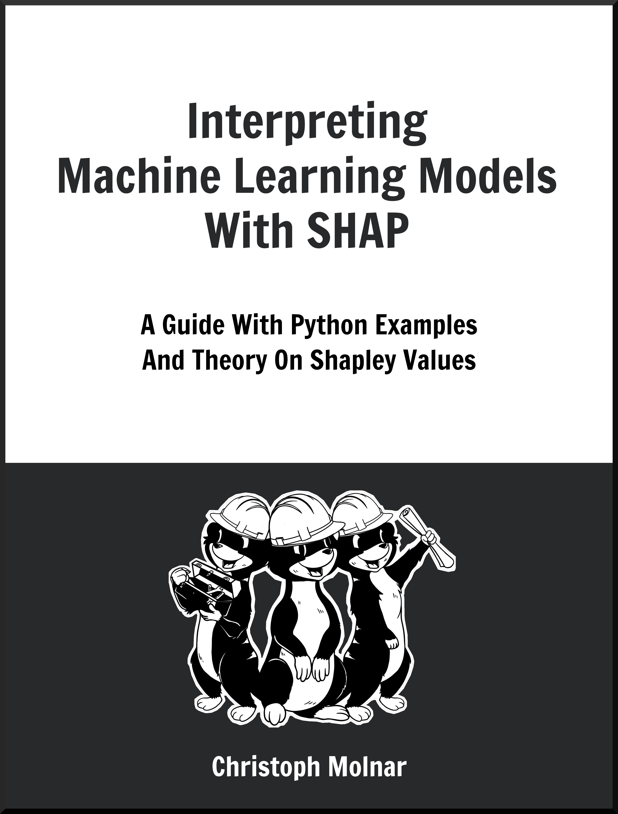
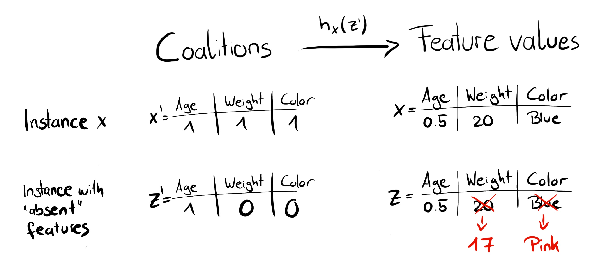
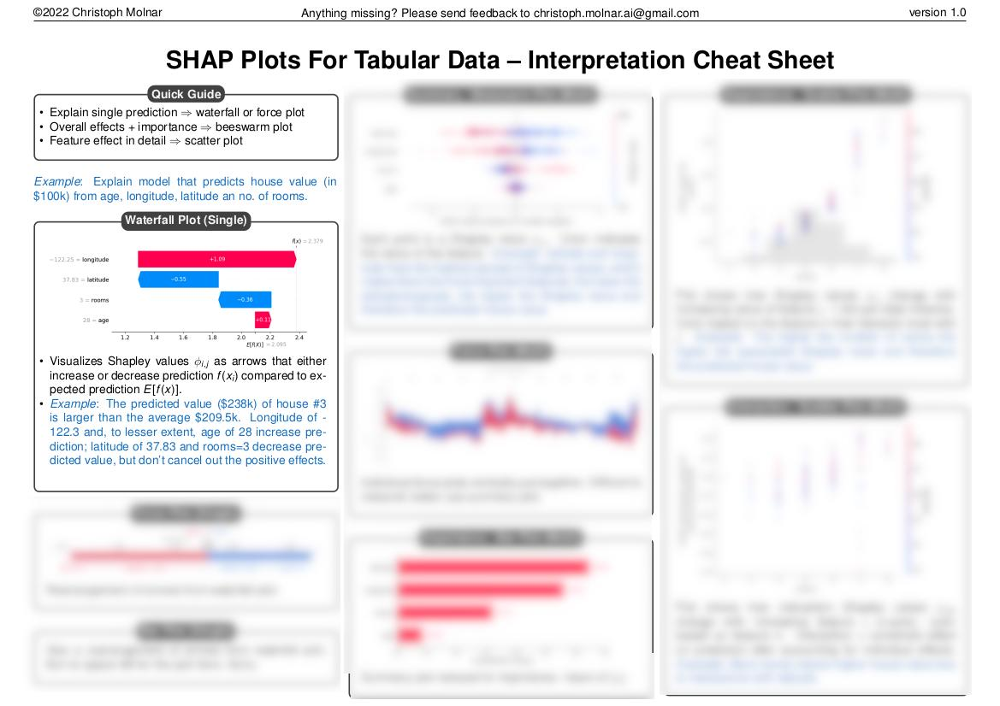
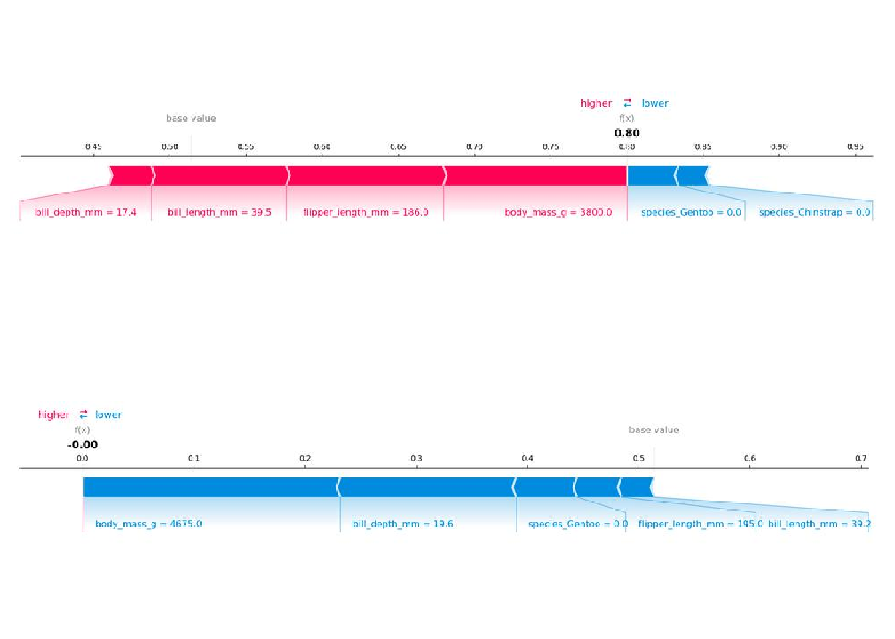
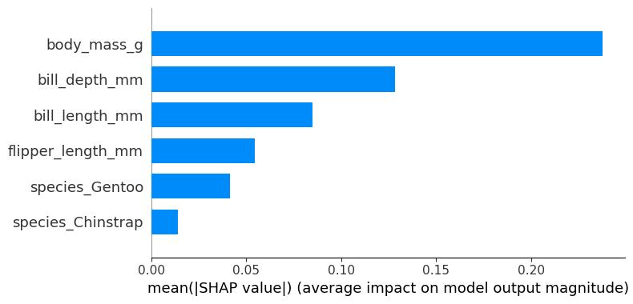
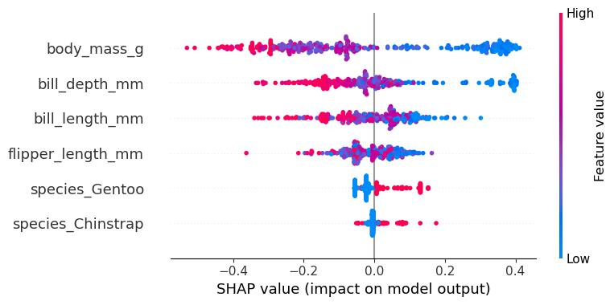
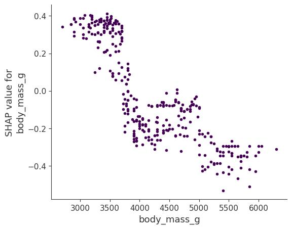
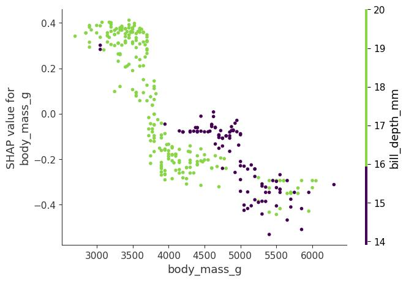
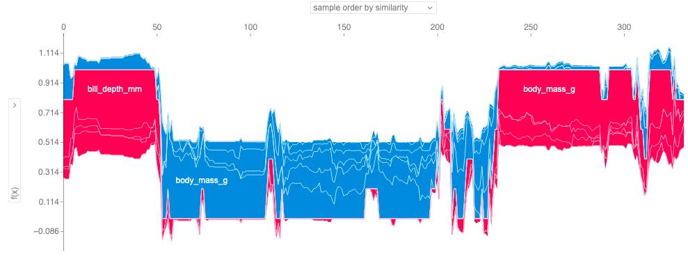

# فصل ۱۸: شپ (SHAP)

> **عنوان اصلی:** SHAP  
> **منبع:** [https://christophm.github.io/interpretable-ml-book/shap.html](https://christophm.github.io/interpretable-ml-book/shap.html)  
> **نویسنده:** Christoph Molnar  
> **مترجم:** مریم محمودی

---

شپ (SHAP: SHapley Additive exPlanations) که توسط لاندبرگ و لی (۲۰۱۷) معرفی شد، روشی برای توضیح پیش‌بینی‌های منفرد است. شپ بر پایه مقادیر شپلی (Shapley values) از نظریه بازی‌ها استوار است که از نظر تئوری بهینه‌ترین راه‌حل ممکن را ارائه می‌دهد. پیش از خواندن این فصل، توصیه می‌شود فصل مربوط به مقادیر شپلی را مطالعه کنید.

برای درک اینکه چرا شپ به‌عنوان مفهومی مستقل — و نه صرفاً امتدادی از مقادیر شپلی — مطرح است، مروری تاریخی لازم است. در سال ۱۹۵۳، لوید شپلی مفهوم مقادیر شپلی را در چارچوب نظریه بازی‌ها معرفی کرد. کاربرد این مقادیر برای توضیح پیش‌بینی‌های یادگیری ماشین نخستین بار توسط اشتروملج و کونوننکو (۲۰۱۱ و ۲۰۱۴) پیشنهاد شد، اما چندان مورد استقبال قرار نگرفت. چند سال بعد، لاندبرگ و لی (۲۰۱۷) شپ را معرفی کردند: رویکردی نوین برای تخمین مقادیر شپلی در تفسیر پیش‌بینی‌های یادگیری ماشین، همراه با چارچوبی نظری که مقادیر شپلی را با لایم (LIME) و سایر روش‌های انتساب پسینی (post-hoc attribution) پیوند می‌دهد.

شاید بگویید شپ چیزی جز نام‌گذاری دوباره مقادیر شپلی نیست — و این سخن چندان بی‌راه هم نیست — اما این دیدگاه یک واقعیت مهم را نادیده می‌گیرد: شپ نقطه عطفی در محبوبیت و کاربرد مقادیر شپلی بود، روش‌های جدیدی برای تخمین و تجمیع آن‌ها معرفی کرد، و کاربرد مقادیر شپلی را به مدل‌های متنی و تصویری گسترش داد.

هرچند این فصل می‌توانست بخشی از فصل مقادیر شپلی باشد، می‌توان آن را «مقادیر شپلی ۲.۰» برای تفسیر مدل‌های یادگیری ماشین دانست. در اینجا بر روش‌های نوین تخمین مقادیر شپلی و انواع جدید نمودارها تمرکز خواهیم کرد. اما ابتدا، مروری بر مبانی نظری.

> **نکته**
> به دنبال راهنمایی جامع و کاربردی درباره شپ و مقادیر شپلی هستید؟ کتاب *Interpreting Machine Learning Models with SHAP* با مثال‌های عملی پایتون و بسته `shap`، از مدل‌های ساده تا پیچیده را پوشش می‌دهد. این کتاب به مکانیزم‌های شپ می‌پردازد، الگوهای تفسیر ارائه می‌دهد، و محدودیت‌های کلیدی را روشن می‌سازد.
>
> 

---

## مبانی نظری شپ

هدف شپ، توضیح پیش‌بینی یک نمونه $x$ با محاسبه سهم هر ویژگی در آن پیش‌بینی است. شپ مقادیر شپلی را از نظریه بازی‌های ائتلافی محاسبه می‌کند — همان چیزی که در فصل مقادیر شپلی بررسی کردیم. مقادیر ویژگی یک نمونه داده نقش بازیکنان را در یک ائتلاف بازی می‌کنند. مقادیر شپلی به ما می‌گویند چگونه «پرداخت» (یعنی پیش‌بینی) را به‌طور عادلانه میان ویژگی‌ها تقسیم کنیم. یک بازیکن می‌تواند یک مقدار ویژگی منفرد باشد — مثلاً در داده‌های جدولی — یا گروهی از مقادیر ویژگی. برای مثال، در توضیح یک تصویر، پیکسل‌ها می‌توانند در ابرپیکسل‌ها (superpixels) گروه‌بندی شده و پیش‌بینی میان آن‌ها توزیع شود.

یکی از نوآوری‌های اصلی شپ این است که توضیح مقادیر شپلی به‌صورت یک **روش انتساب ویژگی افزایشی** (additive feature attribution method) — یعنی یک مدل خطی — نمایش داده می‌شود. این دیدگاه، لایم و مقادیر شپلی را به هم پیوند می‌دهد. شپ توضیح را به‌صورت زیر تعریف می‌کند:

$$g(z') = \phi\_0 + \sum\_{j=1}^{M} \phi\_j z'\_j$$

که در آن $g$ مدل توضیح است، $z' \in \{0,1\}^M$ بردار ائتلاف، $M$ حداکثر اندازه ائتلاف، و $\phi\_j \in \mathbb{R}$ انتساب ویژگی $j$، یعنی همان مقادیر شپلی است. آنچه من «بردار ائتلاف» می‌نامم، در مقاله اصلی شپ «ویژگی‌های ساده‌شده» (simplified features) نام دارد — احتمالاً چون در داده‌های تصویری، تصاویر نه در سطح پیکسل، بلکه در سطح ابرپیکسل نمایش داده می‌شوند. مفید است به $z'$ به‌عنوان توصیفگر ائتلاف‌ها بیندیشیم: مقدار ۱ نشان‌دهنده حضور ویژگی متناظر و مقدار ۰ نشان‌دهنده غیاب آن است.

برای محاسبه مقادیر شپلی، شبیه‌سازی می‌کنیم که تنها برخی مقادیر ویژگی «حاضر» و برخی «غایب» هستند. برای نمونه مورد نظر $x$، بردار ائتلاف $x'$ برداری از یک‌های کامل است — یعنی همه ویژگی‌ها حاضرند. فرمول به شکل ساده‌تر زیر درمی‌آید:

$$f(x) = \phi\_0 + \sum\_{j=1}^{M} \phi\_j$$

این فرمول را می‌توانید با نمادگذاری مشابهی در فصل مقادیر شپلی بیابید.

### خواص $\phi\_j$

مقادیر شپلی تنها راه‌حلی هستند که خواص **کارایی** (Efficiency)، **تقارن** (Symmetry)، **بازیکن ساکت** (Dummy)، و **جمع‌پذیری** (Additivity) را به‌طور همزمان برآورده می‌سازند. شپ نیز این خواص را دارد، چون مقادیر شپلی را محاسبه می‌کند. در مقاله اصلی لاندبرگ و لی (۲۰۱۷)، سه ویژگی مطلوب برای شپ تعریف شده‌اند:

**۱) دقت محلی (Local Accuracy)**

$$f(x) = g(x') = \phi\_0 + \sum\_{j=1}^{M} \phi\_j x'\_j$$

با تعریف $\phi\_0 = E\_X[\hat{f}(x)]$ و قرار دادن همه $x'\_j$ برابر ۱، این همان خاصیت کارایی شپلی است — فقط با نامی متفاوت و با بهره‌گیری از بردار ائتلاف.

$$f(x) = \phi\_0 + \sum\_{j=1}^{M} \phi\_j = E\_X[\hat{f}(X)] + \sum\_{j=1}^{M} \phi\_j$$

**۲) غیاب (Missingness)**

$$x'\_j = 0 \Rightarrow \phi\_j = 0$$

این خاصیت می‌گوید ویژگی غایب، انتساب صفر دریافت می‌کند. توجه داشته باشید که $x'\_j = 0$ نشان‌دهنده غیاب یک مقدار ویژگی در ائتلاف است. این خاصیت در مقادیر شپلی معمول وجود ندارد؛ لاندبرگ آن را «خاصیت کتابداری جزئی» می‌نامد. از نظر نظری، یک ویژگی غایب می‌توانست مقدار شپلی دلخواهی داشته باشد بدون اینکه دقت محلی نقض شود، چون با $x'\_j = 0$ ضرب می‌شود. خاصیت غیاب اجبار می‌کند که این ویژگی‌ها دقیقاً مقدار صفر دریافت کنند — در عمل، این فقط برای ویژگی‌های ثابت اهمیت دارد.

**۳) سازگاری (Consistency)**

فرض کنید $f\_x(z') = f(h\_x(z'))$ و $z' \setminus j$ نشان‌دهنده $z'\_j = 0$ باشد. برای هر دو مدل $f$ و $f'$ که برای همه ورودی‌های $z'$ داریم:

$$f'\_x(z') - f'\_x(z' \setminus j) \geq f\_x(z') - f\_x(z' \setminus j)$$

آنگاه:

$$\phi\_j(f', x) \geq \phi\_j(f, x)$$

سازگاری می‌گوید: اگر مدل به‌گونه‌ای تغییر کند که مشارکت نهایی یک ویژگی افزایش یابد یا ثابت بماند، مقدار شپلی آن نیز افزایش می‌یابد یا ثابت می‌ماند. از این خاصیت، خواص خطی‌بودن، بازیکن ساکت، و تقارن شپلی نتیجه می‌شوند.

---

## تخمین مقادیر شپ

این بخش سه روش تخمین مقادیر شپلی را بررسی می‌کند: **KernelSHAP**، **روش جایگشت** (Permutation Method)، و **TreeSHAP**.

### KernelSHAP

وضعیت KernelSHAP کمی گیج‌کننده است: این روش انگیزه اصلی معرفی شپ بود، شپ را با لایم پیوند داد، و در مقاله اصلی لاندبرگ و لی (۲۰۱۷) ارائه شد. بسیاری از مطالب آموزشی درباره شپ هم بر KernelSHAP تمرکز دارند. با این حال، KernelSHAP در مقایسه با TreeSHAP و روش جایگشت کُند است و به همین دلیل دیگر به‌عنوان روش پیش‌فرض در بسته پایتون `shap` استفاده نمی‌شود. با وجود این، KernelSHAP برای درک مقادیر شپلی و ارتباط آن‌ها با لایم ارزشمند است و برخی پیاده‌سازی‌ها هنوز از آن استفاده می‌کنند.

تخمین KernelSHAP پنج مرحله دارد:

۱. نمونه‌برداری از بردارهای ائتلاف $z'\_k \in \{0,1\}^M$ (۱ = ویژگی حاضر، ۰ = ویژگی غایب).
۲. دریافت پیش‌بینی برای هر $z'\_k$ از طریق تبدیل آن به فضای ویژگی اصلی و اعمال مدل $\hat{f}$.
۳. محاسبه وزن هر ائتلاف $z'\_k$ با هسته (kernel) شپ.
۴. برازش یک مدل رگرسیون خطی وزن‌دار.
۵. بازگرداندن مقادیر شپلی $\phi\_j$ به‌عنوان ضرایب مدل خطی.

برای ساختن یک ائتلاف تصادفی، به‌سادگی رشته‌ای از صفر و یک را با پرتاب سکه تولید می‌کنیم. برای مثال، بردار $(1, 0, 1, 0)$ نشان‌دهنده ائتلافی از ویژگی اول و سوم است. این ائتلاف‌های نمونه‌برداری‌شده، داده‌های مجموعه رگرسیون را تشکیل می‌دهند و هدف رگرسیون، پیش‌بینی مدل برای آن ائتلاف است.

اما مدل برای داده‌های باینری ائتلاف آموزش ندیده و نمی‌تواند برای آن‌ها پیش‌بینی کند! برای گذار از ائتلاف‌های ویژگی به نمونه‌های داده معتبر، به تابع $h\_x(z') = z$ نیاز داریم. این تابع مقادیر ۱ را به مقادیر متناظر از نمونه $x$ مورد توضیح نگاشت می‌کند. برای داده‌های جدولی، مقادیر ۰ به مقادیر نمونه دیگری که از داده نمونه‌برداری شده نگاشت می‌شوند — به این معنا که «غیاب ویژگی» معادل «جایگزینی با مقدار تصادفی از داده» است. شکل ۱۸.۱ این نگاشت را نمایش می‌دهد.

برای داده‌های جدولی، $h\_x$ ویژگی $j$ را با فرض استقلال از سایر ویژگی‌ها در نظر می‌گیرد و بر توزیع حاشیه‌ای انتگرال می‌گیرد:

$$\hat{f}(h\_x(z')) = E\_{X\_{-j}}[\hat{f}(x\_j, X\_{-j})]$$

نمونه‌برداری از توزیع حاشیه‌ای به معنای نادیده‌گرفتن ساختار وابستگی میان ویژگی‌های حاضر و غایب است. به همین دلیل، KernelSHAP از همان مشکل سایر روش‌های تفسیری مبتنی بر جایگشت رنج می‌برد: تخمین ممکن است به نمونه‌های غیرمحتمل وزن بدهد و نتایج را غیرقابل اعتماد کند.

اگر از توزیع شرطی نمونه‌برداری شود، تابع ارزش و در نتیجه بازی تغییر می‌کند و مقادیر شپلی تفسیر متفاوتی پیدا می‌کنند. برای مثال، ویژگی‌ای که مدل اصلاً از آن استفاده نمی‌کند می‌تواند در نمونه‌برداری شرطی مقدار شپلی غیرصفر داشته باشد — در حالی که در بازی حاشیه‌ای، چنین ویژگی‌ای همواره مقدار صفر می‌گیرد تا اصل بازیکن ساکت نقض نشود. نسخه شرطی شپ توسط آس، یولوم، و لوولند (۲۰۲۱) پیشنهاد شده است.

> **هشدار: مقادیر شپلی شرطی ممکن است به ویژگی‌های بدون تأثیر، مقدار غیرصفر بدهند**
> مشکل انتظار شرطی این است که ویژگی‌هایی که هیچ تأثیری بر تابع پیش‌بینی $f$ ندارند می‌توانند تخمین TreeSHAP غیرصفر دریافت کنند — همان‌طور که سوندارارجان و نجمی (۲۰۲۰) و یانزینگ، مینوریکس، و بلوباوم (۲۰۲۰) نشان داده‌اند. این اتفاق زمانی می‌افتد که ویژگی با ویژگی دیگری که واقعاً تأثیرگذار است همبسته باشد.

برای تصاویر، تابع نگاشت $h\_x$ ابرپیکسل‌ها را مدیریت می‌کند: ابرپیکسل‌های حاضر به بخش متناظر از تصویر اصلی نگاشت می‌شوند و ابرپیکسل‌های غایب خاکستری می‌شوند (شکل ۱۸.۲).

تفاوت اصلی شپ با لایم در **وزن‌دهی نمونه‌ها در مدل رگرسیون** است. لایم نمونه‌ها را بر اساس نزدیکی به نمونه اصلی وزن می‌دهد. شپ نمونه‌ها را بر اساس وزنی که آن ائتلاف در تخمین مقادیر شپلی دریافت می‌کند وزن می‌دهد. ائتلاف‌های کوچک (تعداد کمی ۱) و ائتلاف‌های بزرگ (تعداد زیادی ۱) بیشترین وزن را می‌گیرند، چون بیشترین اطلاعات را درباره تأثیر منفرد ویژگی‌ها ارائه می‌دهند. ائتلاف‌هایی با نیمی از ویژگی‌ها اطلاعات کمتری درباره سهم هر ویژگی منفرد می‌دهند، زیرا ترکیب‌های بسیاری وجود دارد.

هسته شپ که لاندبرگ و لی (۲۰۱۷) پیشنهاد دادند:

$$\pi\_{x}(z') = \frac{(M-1)}{\binom{M}{|z'|} |z'|(M-|z'|)}$$

که در آن $M$ حداکثر اندازه ائتلاف و $|z'|$ تعداد ویژگی‌های حاضر در $z'$ است. لاندبرگ و لی نشان دادند که رگرسیون خطی با این وزن‌های هسته، مقادیر شپلی را به دست می‌دهد. جالب است که اگر هسته شپ را در لایم روی داده‌های ائتلاف به کار بگیریم، لایم هم مقادیر شپلی را تخمین می‌زند!

می‌توان در نمونه‌برداری ائتلاف‌ها هوشمندانه‌تر عمل کرد: ائتلاف‌های کوچک و بزرگ بیشترین وزن را دارند، پس بهتر است بخشی از بودجه نمونه‌برداری $B$ را به آن‌ها اختصاص دهیم. با شروع از همه ائتلاف‌های ممکن با ۱ و $M-1$ ویژگی ($2M$ ائتلاف در مجموع)، به‌تدریج ائتلاف‌های بزرگ‌تر را اضافه می‌کنیم و از ائتلاف‌های باقی‌مانده با وزن‌های تعدیل‌شده نمونه‌برداری می‌کنیم.

حال داده، هدف، و وزن داریم — همه آنچه برای رگرسیون خطی وزن‌دار نیاز است:

$$L(f, g, \pi\_{x}) = \sum\_{z' \in Z} \left[ f(h\_x(z')) - g(z') \right]^2 \pi\_{x}(z')$$

مدل خطی $g$ را با کمینه‌سازی این تابع زیان — همان مجموع مربعات خطاها — آموزش می‌دهیم. ضرایب تخمین‌زده‌شده مدل، یعنی $\phi\_j$‌ها، همان مقادیر شپلی هستند.

از آنجا که در چارچوب رگرسیون خطی هستیم، می‌توانیم از جعبه‌ابزار استاندارد رگرسیون بهره ببریم. برای مثال، افزودن جمله تنظیم‌کننده (regularization) می‌تواند توضیح‌های تُنُک (sparse) تولید کند. با افزودن جریمه L1 به تابع زیان $L$، توضیح‌های تُنُک به دست می‌آیند — البته مطمئن نیستم ضرایب حاصل همچنان مقادیر شپلی معتبر باشند.

### TreeSHAP

لاندبرگ، اریون، و لی (۲۰۱۹) TreeSHAP را برای مدل‌های یادگیری ماشین مبتنی بر درخت — مانند درخت‌های تصمیم، جنگل‌های تصادفی (Random Forest)، و درخت‌های تقویت‌شده با گرادیان (Gradient Boosting) — پیشنهاد دادند. TreeSHAP جایگزینی سریع و مدل-اختصاصی برای KernelSHAP است. پیچیدگی محاسباتی آن از $O(TL2^M)$ در KernelSHAP دقیق به $O(TLD^2)$ کاهش می‌یابد، که در آن $T$ تعداد درخت‌ها، $L$ حداکثر تعداد برگ‌ها، و $D$ حداکثر عمق هر درخت است.

TreeSHAP در دو نسخه ارائه می‌شود:

- **مداخله‌ای** (Interventional): مقادیر کلاسیک شپلی را محاسبه می‌کند.
- **وابسته به مسیر درخت** (Tree-path dependent): چیزی مشابه مقادیر شپلی شرطی محاسبه می‌کند.

پیاده‌سازی اصلی در بسته پایتون `shap` در ابتدا نسخه وابسته به مسیر بود، اما اکنون نسخه مداخله‌ای به‌عنوان پیش‌فرض استفاده می‌شود.

از آنجا که الگوریتم‌های هر دو نسخه پیچیده هستند، ایده کلی را توضیح می‌دهم. TreeSHAP از ساختار درخت بهره می‌گیرد تا مقادیر شپلی را کارآمدتر محاسبه کند.

**TreeSHAP مداخله‌ای** مقادیر شپلی معمول را محاسبه می‌کند. برای یک درخت منفرد، نمونه $x$ برای توضیح، و مجموعه پس‌زمینه با تنها یک نمونه $z$، ایده به این صورت است: مقادیر شپلی معمول با تشکیل مکرر ائتلاف‌ها محاسبه می‌شوند، اما در بسیاری از این ائتلاف‌ها، افزودن یک ویژگی از $x$ پیش‌بینی را تغییر نمی‌دهد — چون یک درخت تصمیم تنها تعداد محدودی پیش‌بینی مجزا دارد (مثلاً یک درخت دودویی با عمق ۵ حداکثر ۳۲ پیش‌بینی ممکن دارد). TreeSHAP مداخله‌ای به‌جای بررسی همه ائتلاف‌ها، مسیرهای درخت را کاوش می‌کند تا تنها با ائتلاف‌هایی کار کند که واقعاً پیش‌بینی را تغییر می‌دهند. وزن‌دهی و ترکیب صحیح این مشارکت‌های نهایی، الگوریتم را پیچیده می‌کند — به‌علاوه بازگشت (recursion) اجتناب‌ناپذیر. برای انسامبل‌هایی مانند جنگل تصادفی، مقادیر شپلی هر درخت به همان شیوه‌ای ترکیب می‌شوند که پیش‌بینی‌ها ترکیب می‌شوند — در جنگل تصادفی، میانگین‌گیری.

**TreeSHAP وابسته به مسیر** نیز از ساختار درخت بهره می‌گیرد: ایده اصلی رانش همزمان همه زیرمجموعه‌های ائتلاف $S$ در طول درخت و پیگیری تعداد نمونه‌ها برای هر زیرمجموعه در هر انشعاب است.

### روش جایگشت (Permutation Method)

کارآمدترین روش تخمین مدل-مستقل، روش جایگشت است. ایده اصلی نمونه‌برداری هوشمندانه از ائتلاف‌ها از طریق ایجاد جایگشت‌های ویژگی‌ها است.

یک مثال (برگرفته از کتاب *Interpreting Machine Learning Models with SHAP*) با چهار مقدار ویژگی: $x\_1$، $x\_2$، $x\_3$، و $x\_4$ را در نظر بگیرید (برای اختصار، $x\_j$ را $j$ می‌نویسیم).

یک جایگشت تصادفی می‌تواند این باشد:

$$3 \to 1 \to 4 \to 2$$

بر اساس این جایگشت، مشارکت‌های نهایی را از چپ به راست می‌سازیم:

- افزودن ۳ به $\emptyset$
- افزودن ۱ به $\{3\}$
- افزودن ۴ به $\{3,1\}$
- افزودن ۲ به $\{3,1,4\}$

و همین را معکوس انجام می‌دهیم:

- افزودن ۲ به $\emptyset$
- افزودن ۴ به $\{2\}$
- افزودن ۱ به $\{2,4\}$
- افزودن ۳ به $\{2,4,1\}$

جایگشت یک ویژگی را در هر مرحله تغییر می‌دهد. این موضوع تعداد فراخوانی مدل را کاهش می‌دهد، چون جمله دوم یک مشارکت نهایی برای محاسبه مشارکت نهایی بعدی هم مورد نیاز است. برای مثال، ائتلاف $\{3,1\}$ هم برای محاسبه مشارکت نهایی ۴ به $\{3,1\}$ و هم مشارکت ۱ به $\{3\}$ استفاده می‌شود.

با تعریف مقادیر شپلی بر حسب جایگشت‌ها — نه ائتلاف‌ها — اگر $p!$ جایگشت ممکن وجود داشته باشد و $\pi\_k$ جایگشت k-ام باشد، مقدار شپلی ویژگی $j$ چنین است:

$$\phi\_j = \frac{1}{p!} \sum\_{\pi} \delta^\pi\_j$$

که در آن $\delta^\pi\_j$ مشارکت نهایی $j$-ام در جایگشت $\pi$ است. یعنی مقدار شپلی میانگین ساده‌ای از همه مشارکت‌ها است. از آنجا که محاسبه همه جایگشت‌ها بسیار هزینه‌بر است، می‌توان از آن‌ها نمونه‌برداری کرد. با پیمایش رفت و برگشت، مقدار شپلی به‌صورت زیر محاسبه می‌شود:

$$\phi\_j = \frac{1}{K} \sum\_{k=1}^{K} \hat{\phi}\_{j,k}^+ + \hat{\phi}\_{j,k}^-$$

که در آن $\pi^-$ نسخه معکوس جایگشت $\pi$ است. این روش پیمایش رفت-برگشت — که نمونه‌برداری آنتی‌تتیک (antithetic sampling) نام دارد — در مقایسه با سایر روش‌های نمونه‌برداری مقادیر شپ عملکرد بسیار خوبی دارد (میچل و همکاران، ۲۰۲۲). روش جایگشت همچنین تضمین می‌کند که اصل کارایی همواره برقرار باشد — یعنی مجموع مقادیر شپ برابر با پیش‌بینی منهای میانگین پیش‌بینی باشد. برای تصوری از تعداد جایگشت‌های مورد نیاز: بسته `shap` پیش‌فرض را ۱۰ قرار داده است.

---

## مثال

یک طبقه‌بند جنگل تصادفی با ۱۰۰ درخت برای پیش‌بینی جنس پنگوئن‌ها آموزش دادم. از شپ برای توضیح پیش‌بینی‌های منفرد استفاده می‌کنیم. از آنجا که جنگل تصادفی انسامبلی از درخت‌ها است، می‌توانیم از روش سریع TreeSHAP مداخله‌ای به‌جای KernelSHAP کُندتر استفاده کنیم. در این مثال از توزیع حاشیه‌ای استفاده شده — نه توزیع شرطی. تابع TreeSHAP پایتون با توزیع حاشیه‌ای کُندتر است، اما همچنان سریع‌تر از KernelSHAP، چون به‌صورت خطی با تعداد سطرهای داده مقیاس می‌یابد.

چون از توزیع حاشیه‌ای استفاده می‌کنیم، تفسیر همانند فصل مقادیر شپلی است. اما بسته پایتون `shap` یک تجسم متفاوت ارائه می‌دهد: انتساب‌های ویژگی مانند مقادیر شپلی به‌صورت «نیروها» نمایش داده می‌شوند. هر مقدار ویژگی نیرویی است که پیش‌بینی را افزایش یا کاهش می‌دهد. پیش‌بینی از پایه (baseline) — که میانگین همه پیش‌بینی‌ها است — شروع می‌شود. در نمودار، هر مقدار شپلی فلشی است که پیش‌بینی را بالا (مقدار مثبت) یا پایین (مقدار منفی) می‌کشد. این نیروها در پیش‌بینی واقعی نمونه داده به تعادل می‌رسند.

> **نکته**
> بسته پایتون `shap` تجسم‌های متنوعی دارد که می‌تواند گیج‌کننده باشد. به همین دلیل آن‌ها را در [SHAP Plots Cheatsheet](https://christophm.github.io/interpretable-ml-book/) خلاصه کرده‌ام، همراه با راهنمای تفسیر هر نمودار.
>
> 

شکل ۱۸.۳ نمودارهای نیروی شپ را برای دو پنگوئن از مجموعه داده پنگوئن‌های پالمر نشان می‌دهد: پنگوئن اول به دلیل طول منقار کوچک احتمال بالایی برای بودن از گونه Adelie دارد. پنگوئن دوم به دلیل طول منقار و طول بال بزرگ، احتمال پایینی برای Adelie بودن دارد.

---

## نمودارهای تجمیع شپ

بخش قبلی توضیح‌هایی برای پیش‌بینی‌های منفرد ارائه داد. مقادیر شپلی را می‌توان در توضیح‌های سراسری ترکیب کرد. اگر شپ را برای هر نمونه اجرا کنیم، یک ماتریس از مقادیر شپلی به دست می‌آوریم — یک سطر به ازای هر نمونه و یک ستون به ازای هر ویژگی. با تحلیل این ماتریس می‌توان کل مدل را تفسیر کرد.

### اهمیت ویژگی شپ (SHAP Feature Importance)

ایده پشت اهمیت ویژگی شپ ساده است: ویژگی‌هایی با مقادیر شپلی قدرمطلق بزرگ، مهم‌ترند. برای اهمیت سراسری، میانگین مقادیر شپلی قدرمطلق هر ویژگی را در کل داده حساب می‌کنیم:

$$I\_j = \frac{1}{n} \sum\_{i=1}^{n} |\phi\_j^{(i)}|$$

سپس ویژگی‌ها را بر اساس اهمیت نزولی مرتب و نمایش می‌دهیم. شکل ۱۸.۴ اهمیت ویژگی شپ را برای جنگل تصادفی طبقه‌بندی پنگوئن‌ها نشان می‌دهد. توده بدنی مهم‌ترین ویژگی بود و احتمال پیش‌بینی‌شده را تا ۲۵ درصد تغییر داد.

اهمیت ویژگی شپ جایگزینی برای اهمیت ویژگی جایگشتی (permutation feature importance) است. تفاوت اصلی این است که اهمیت ویژگی جایگشتی بر کاهش عملکرد مدل مبتنی است، در حالی که شپ بر بزرگی انتساب‌های ویژگی.

### نمودار خلاصه شپ (SHAP Summary Plot)

نمودار خلاصه، اهمیت ویژگی را با اثرات ویژگی ترکیب می‌کند. هر نقطه در این نمودار یک مقدار شپلی برای یک ویژگی و یک نمونه است. محور y ویژگی را مشخص می‌کند و محور x مقدار شپلی را. رنگ نشان‌دهنده مقدار ویژگی از کم به زیاد است. نقاط هم‌پوشان در جهت y پراکنده می‌شوند تا توزیع مقادیر شپلی هر ویژگی قابل مشاهده باشد. ویژگی‌ها بر اساس اهمیت مرتب شده‌اند.

در نمودار خلاصه (شکل ۱۸.۵) نشانه‌های اولیه‌ای از رابطه میان مقدار ویژگی و تأثیر بر پیش‌بینی دیده می‌شود. توده بدنی بیشتر، سهم منفی در احتمال ماده بودن دارد. همچنین توده بدنی بیشترین دامنه اثرات را در میان پنگوئن‌های مختلف نشان می‌دهد.

### نمودار وابستگی شپ (SHAP Dependence Plot)

وابستگی ویژگی شپ شاید ساده‌ترین نمودار تفسیر سراسری باشد:

۱. یک ویژگی انتخاب کنید.
۲. برای هر نمونه داده، نقطه‌ای با مقدار ویژگی در محور x و مقدار شپلی متناظر در محور y رسم کنید.
۳. تمام.

به‌صورت ریاضی، نمودار شامل این نقاط است: $\{(x\_j^{(i)}, \phi\_j^{(i)})\}\_{i=1}^n$

شکل ۱۸.۶ وابستگی ویژگی شپ برای توده بدنی را نشان می‌دهد: هر چه پنگوئن سنگین‌تر، احتمال ماده بودنش کمتر.

نمودارهای وابستگی شپ جایگزینی برای روش‌های سراسری اثر ویژگی مانند نمودارهای وابستگی جزئی (PDP) و اثرات محلی تجمعی (ALE) هستند. در حالی که PDP و ALE اثرات میانگین را نشان می‌دهند، وابستگی شپ واریانس را نیز در محور y نمایش می‌دهد. به‌ویژه در صورت وجود تعاملات، نمودار وابستگی شپ پراکندگی بیشتری در محور y خواهد داشت. برجسته‌سازی تعاملات ویژگی می‌تواند نمودار وابستگی را غنی‌تر کند.

### مقادیر تعامل شپ (SHAP Interaction Values)

اثر تعامل، اثر ترکیبی اضافه‌ای است که پس از احتساب اثرات منفرد هر ویژگی باقی می‌ماند. شاخص تعامل شپلی از نظریه بازی‌ها به‌صورت زیر تعریف می‌شود:

$$\Phi\_{i,j} = \sum\_{S \subseteq M \setminus \{i,j\}} \frac{|S|!(M-|S|-2)!}{2(M-1)!} \delta\_{ij}(S)$$

برای $i \neq j$، که:

$$\delta\_{ij}(S) = \hat{f}\_{x}(S \cup \{i,j\}) - \hat{f}\_{x}(S \cup \{i\}) - \hat{f}\_{x}(S \cup \{j\}) + \hat{f}\_{x}(S)$$

این فرمول اثر اصلی ویژگی‌ها را کم می‌کند تا اثر تعامل خالص به دست آید. ارزش‌ها را میانگین‌گیری می‌کنیم، مشابه محاسبه مقادیر شپلی. وقتی مقادیر تعامل شپ را برای همه ویژگی‌ها محاسبه می‌کنیم، یک ماتریس $M \times M$ برای هر نمونه به دست می‌آوریم.

یک کاربرد: رنگ‌آمیزی خودکار نمودار وابستگی شپ با قوی‌ترین تعامل، مانند شکل ۱۸.۷. در اینجا توده بدنی با عمق منقار تعامل دارد.

> **نکته: تحلیل عمیق‌تر تعاملات**
> موضوع تعاملات در شپ بسیار گسترده است. برای تحلیل پیشرفته‌تر تعاملات شپ، بسته `shapiq` (موشالیک و همکاران، ۲۰۲۴) را پیشنهاد می‌کنم.

### خوشه‌بندی مقادیر شپلی

می‌توان داده‌ها را با کمک مقادیر شپلی خوشه‌بندی کرد. هدف خوشه‌بندی یافتن گروه‌هایی از نمونه‌های مشابه است. خوشه‌بندی معمول بر اساس ویژگی‌ها انجام می‌شود، اما ویژگی‌ها اغلب مقیاس‌های متفاوتی دارند و محاسبه فاصله میان آن‌ها دشوار می‌شود.

خوشه‌بندی شپ بر اساس مقادیر شپلی هر نمونه انجام می‌شود — یعنی نمونه‌ها بر اساس شباهت توضیح خوشه‌بندی می‌شوند. همه مقادیر شپ یک واحد مشترک دارند: واحد فضای پیش‌بینی. هر الگوریتم خوشه‌بندی قابل استفاده است.

شکل ۱۸.۸ از خوشه‌بندی تجمعی سلسله‌مراتبی برای مرتب‌سازی نمونه‌ها استفاده می‌کند. نمودار از بسیاری نمودار نیروی چرخیده‌شده به حالت عمودی در کنار هم تشکیل شده که بر اساس شباهت خوشه‌بندی کنار هم قرار گرفته‌اند.

---

## نقاط قوت

از آنجا که شپ مقادیر شپلی را محاسبه می‌کند، همه مزایای مقادیر شپلی را به ارث می‌برد: پایه نظری محکم در نظریه بازی‌ها، توزیع عادلانه پیش‌بینی میان مقادیر ویژگی، و توضیح‌های تقابلی که پیش‌بینی را با پیش‌بینی میانگین مقایسه می‌کنند.

شپ لایم و مقادیر شپلی را به هم پیوند می‌دهد — پیوندی که درک هر دو روش را عمیق‌تر می‌کند و به یکپارچه‌سازی حوزه یادگیری ماشین تفسیرپذیر کمک می‌کند.

پیاده‌سازی سریع TreeSHAP برای مدل‌های مبتنی بر درخت، به باور من کلید محبوبیت شپ بود — چون بزرگترین مانع پذیرش مقادیر شپلی، محاسبات کُند آن است.

محاسبات سریع این امکان را فراهم می‌کند که مقادیر شپلی زیادی برای تفسیرهای سراسری مدل محاسبه شوند. تفسیرهای سراسری شامل اهمیت ویژگی، وابستگی ویژگی، تعاملات، خوشه‌بندی، و نمودار خلاصه می‌شوند. با شپ، تفسیرهای سراسری با توضیح‌های محلی سازگار هستند — چون مقادیر شپلی «واحد اتمی» تفسیرهای سراسری هستند. در مقابل، اگر از لایم برای توضیح محلی و از نمودار وابستگی جزئی به‌علاوه اهمیت ویژگی جایگشتی برای تفسیر سراسری استفاده کنید، پایه مشترکی ندارید.

---

## محدودیت‌ها

**KernelSHAP کُند است.** این روش را برای محاسبه مقادیر شپلی برای تعداد زیادی نمونه ناعملی می‌کند — و همه روش‌های سراسری شپ به محاسبه مقادیر شپلی برای نمونه‌های فراوانی نیاز دارند.

**KernelSHAP وابستگی ویژگی را نادیده می‌گیرد.** بیشتر روش‌های تفسیری مبتنی بر جایگشت این مشکل را دارند. جایگزینی مقادیر ویژگی با مقادیر نمونه‌های تصادفی اغلب معادل نمونه‌برداری از توزیع حاشیه‌ای است. اگر ویژگی‌ها وابسته — مثلاً همبسته — باشند، این روش به نقاط داده غیرمحتمل وزن زیادی می‌دهد.

**TreeSHAP وابسته به مسیر می‌تواند انتساب‌های ناشهودی تولید کند.** TreeSHAP مشکل برون‌یابی به نقاط غیرمحتمل را حل می‌کند، اما با تغییر تابع ارزش. با تکیه بر پیش‌بینی انتظاری شرطی، ویژگی‌هایی که هیچ تأثیری بر پیش‌بینی ندارند می‌توانند مقدار TreeSHAP غیرصفر دریافت کنند.

**معایب مقادیر شپلی نیز به شپ منتقل می‌شوند:** مقادیر شپلی را می‌توان اشتباه تفسیر کرد. همچنین امکان ساخت تفسیرهای گمراه‌کننده با شپ وجود دارد که می‌تواند سوگیری‌ها را پنهان کند (اسلک و همکاران، ۲۰۲۰). برای دریافت‌کنندگان توضیح شپ، این یک محدودیت واقعی است: نمی‌توانند از صحت توضیح اطمینان حاصل کنند.

---

## نرم‌افزار

لاندبرگ شپ را در بسته پایتون `shap` پیاده‌سازی کرد که اکنون توسط تیم بزرگ‌تری نگهداری می‌شود.

این پیاده‌سازی با مدل‌های آموزش‌دیده با کتابخانه `scikit-learn` پایتون سازگار است. بسته `shap` برای مثال‌های این فصل نیز استفاده شد. شپ در چارچوب‌های تقویت درخت `xgboost` و `LightGBM` ادغام شده و در `PiML` — کتابخانه عمومی‌تری برای تفسیرپذیری — نیز یافت می‌شود. در R، بسته‌های `shapper` و `fastshap` و همچنین بسته `xgboost` در R شپ را پشتیبانی می‌کنند. برای تعاملات شپ به‌طور اختصاصی، بسته پایتون `shapiq` در دسترس است.
