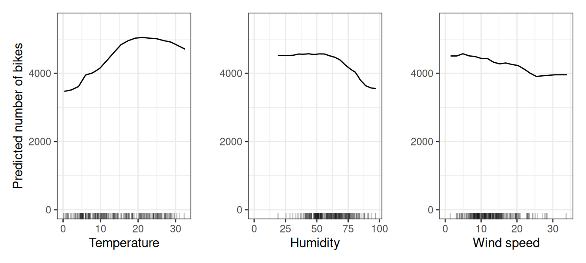
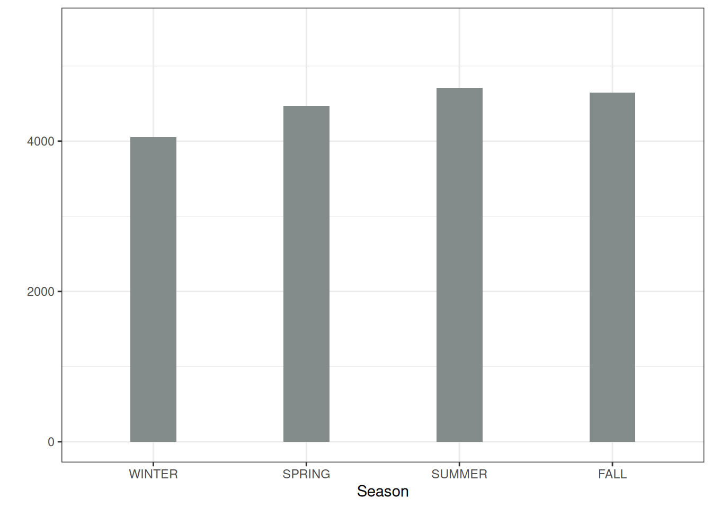
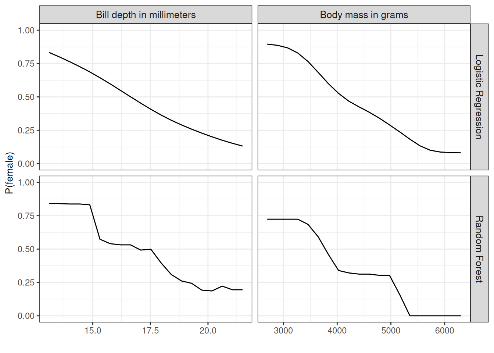
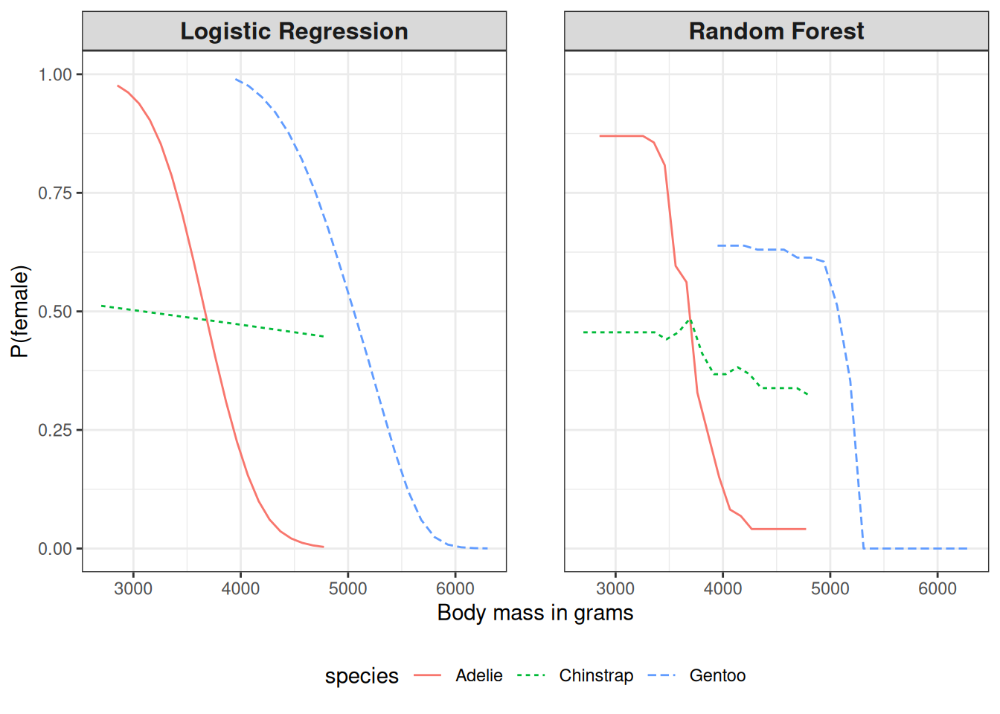
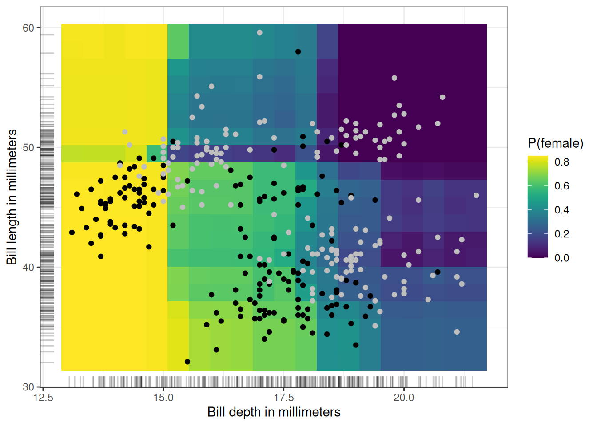

# فصل ۱۹: نمودار وابستگی جزئی (PDP)

> **عنوان اصلی:** Partial Dependence Plot (PDP)  
> **منبع:** [https://christophm.github.io/interpretable-ml-book/pdp.html](https://christophm.github.io/interpretable-ml-book/pdp.html)  
> **نویسنده:** Christoph Molnar  
> **مترجم:** مریم محمودی

---

نمودار وابستگی جزئی (به اختصار PDP یا PD plot) اثر حاشیه‌ای یک یا دو ویژگی را بر پیش‌بینی خروجی یک مدل یادگیری ماشین نشان می‌دهد (Friedman 2001). این نمودار می‌تواند آشکار کند که رابطهٔ میان هدف و یک ویژگی خطی است، یکنواخت است، یا شکل پیچیده‌تری دارد. برای مثال، هنگامی که PDP روی یک مدل رگرسیون خطی اعمال می‌شود، همواره یک رابطهٔ خطی را نمایش می‌دهد.

## تعریف و برآورد

تابع وابستگی جزئی برای رگرسیون به صورت زیر تعریف می‌شود:

$$\hat{f}_S(\mathbf{x}_S) = \mathbb{E}_{\mathbf{X}_C}\left[\hat{f}(\mathbf{x}_S, X_C)\right] = \int \hat{f}(\mathbf{x}_S, X_C) \, d\mathbb{P}(\mathbf{X}_C)$$

$\mathbf{x}_S$ ویژگی‌هایی هستند که تابع وابستگی جزئی برای آن‌ها رسم می‌شود، و $X_C$ ویژگی‌های دیگری هستند که در مدل یادگیری ماشین $\hat{f}$ به کار رفته‌اند و در اینجا به‌عنوان متغیرهای تصادفی در نظر گرفته می‌شوند. معمولاً مجموعهٔ $S$ تنها یک یا دو ویژگی دارد؛ این‌ها همان ویژگی‌هایی هستند که می‌خواهیم اثرشان بر پیش‌بینی را بررسی کنیم. بردارهای ویژگی $\mathbf{x}_S$ و $\mathbf{x}_C$ در کنار هم دادهٔ کامل $\mathbf{X}$ را تشکیل می‌دهند.

وابستگی جزئی با حاشیه‌سازی خروجی مدل یادگیری ماشین بر روی توزیع ویژگی‌های مجموعهٔ $C$ عمل می‌کند. به این ترتیب، تابع به‌دست‌آمده تنها به ویژگی‌های مجموعهٔ $S$ وابسته است و تعاملات آن‌ها با سایر ویژگی‌ها نیز در آن لحاظ شده است.

تابع جزئی $\hat{f}_S$ با محاسبهٔ میانگین روی داده‌های آموزشی برآورد می‌شود — روشی که به روش مونته‌کارلو نیز شناخته می‌شود:

$$\hat{f}_S(\mathbf{x}_S) = \frac{1}{n} \sum_{i=1}^{n} \hat{f}(\mathbf{x}_S, \mathbf{x}_C^{(i)})$$

این معادل میانگین‌گیری از تمام منحنی‌های ICE (آی‌سی‌ای، Individual Conditional Expectation) یک مجموعه‌داده است. تابع جزئی برای مقادیر مشخصی از ویژگی‌های مجموعهٔ $S$، اثر حاشیه‌ای میانگین بر پیش‌بینی را نشان می‌دهد. در این فرمول، $\mathbf{x}_C^{(i)}$ مقادیر واقعی ویژگی‌های موجود در مجموعه‌داده برای ویژگی‌هایی هستند که مورد بررسی نیستند، و $n$ تعداد نمونه‌های مجموعه‌داده است.

PDP ویژگی‌های مجموعهٔ $C$ را صرف‌نظر از همبستگی‌شان با ویژگی‌های مجموعهٔ $S$ در نظر می‌گیرد. در صورت وجود همبستگی، میانگین‌های محاسبه‌شده برای نمودار وابستگی جزئی ممکن است شامل نقاط داده‌ای بسیار نامحتمل یا حتی غیرممکن باشند (به بخش معایب مراجعه کنید).

> **⚠️ هشدار — ویژگی‌های همبسته مشکل‌ساز هستند**
>
> هنگام تفسیر PDP برای ویژگی‌های (به‌شدت) همبسته احتیاط کنید: در این حالت، نمودار وابستگی جزئی شامل نمونه‌های داده‌ای غیرواقعی می‌شود.

برای مسائل دسته‌بندی که مدل احتمال خروجی می‌دهد، نمودار وابستگی جزئی احتمال تعلق به یک کلاس خاص را در برابر مقادیر مختلف ویژگی‌های مجموعهٔ $S$ نمایش می‌دهد. ساده‌ترین راه برای مدیریت چند کلاس، رسم یک منحنی یا نمودار جداگانه برای هر کلاس است.

نمودار وابستگی جزئی یک روش سراسری است: این روش تمام نمونه‌ها را در نظر می‌گیرد و دربارهٔ رابطهٔ کلی یک ویژگی با پیش‌بینی اظهار می‌کند.

### ویژگی‌های طبقه‌ای

تا اینجا تنها ویژگی‌های عددی را بررسی کردیم. برای ویژگی‌های طبقه‌ای، محاسبهٔ وابستگی جزئی بسیار ساده است. برای هر یک از طبقات، یک برآورد PDP به دست می‌آید؛ به این صورت که تمام نمونه‌های داده مجبور می‌شوند همان طبقه را داشته باشند. برای مثال، اگر مجموعه‌دادهٔ اجارهٔ دوچرخه را در نظر بگیریم و بخواهیم نمودار وابستگی جزئی برای فصل را بررسی کنیم، چهار عدد به دست می‌آید — یکی برای هر فصل. برای محاسبهٔ مقدار مربوط به «تابستان»، فصل تمام نمونه‌های داده را «تابستان» قرار داده و میانگین پیش‌بینی‌ها را حساب می‌کنیم.

## مثال‌ها

در عمل، مجموعهٔ $S$ معمولاً تنها یک ویژگی دارد، یا حداکثر دو ویژگی؛ چون یک ویژگی نمودار دوبُعدی تولید می‌کند و دو ویژگی نمودار سه‌بُعدی. هر چیزی فراتر از آن به‌خوبی قابل تجسم نیست.

به مثال رگرسیون باز می‌گردیم؛ همان‌جا که تعداد دوچرخه‌های اجاره‌شده در یک روز مشخص را پیش‌بینی می‌کنیم. ابتدا یک مدل یادگیری ماشین برازش می‌دهیم، سپس وابستگی‌های جزئی را تحلیل می‌کنیم. در اینجا یک Random Forest برای پیش‌بینی تعداد دوچرخه‌ها برازش داده‌ایم و از نمودار وابستگی جزئی برای مصورسازی روابطی که مدل آموخته استفاده کرده‌ایم (شکل ۱۹.۱). اثر ویژگی‌های آب‌وهوایی بر تعداد پیش‌بینی‌شدهٔ دوچرخه‌ها در نمودار زیر نمایش داده شده است. بیشترین تفاوت‌ها در دمای هوا مشاهده می‌شود: هرچه هوا گرم‌تر باشد، دوچرخه‌های بیشتری اجاره می‌شوند. این روند تا ۲۰ درجهٔ سلسیوس صعودی است، سپس صاف می‌شود و حدود ۳۰ درجه کمی کاهش می‌یابد.

با افزایش رطوبت بیش از ۶۰٪، تمایل مردم به اجارهٔ دوچرخه کاهش می‌یابد. همچنین، هرچه باد بیشتر بوزد، دوچرخه‌سواران کمتری دیده می‌شوند — که البته منطقی است. نکتهٔ جالب این است که تعداد پیش‌بینی‌شدهٔ اجاره‌ها با افزایش سرعت باد از ۲۵ تا ۳۵ کیلومتر بر ساعت کاهش نمی‌یابد؛ اما داده‌های آموزشی در این بازه اندک هستند و مدل احتمالاً نتوانسته پیش‌بینی معناداری برای این محدوده بیاموزد. از نظر شهودی، انتظار می‌رود تعداد دوچرخه‌ها با افزایش سرعت باد کاهش یابد، به‌ویژه هنگامی که سرعت آن بسیار زیاد باشد.

برای نمایش نمودار وابستگی جزئی با یک ویژگی طبقه‌ای، اثر ویژگی فصل را بر پیش‌بینی اجارهٔ دوچرخه بررسی می‌کنیم (شکل ۱۹.۲). تمام فصل‌ها اثر مشابهی بر پیش‌بینی‌های مدل دارند؛ تنها در زمستان مدل تعداد اجارهٔ کمتری پیش‌بینی می‌کند و در بهار نیز اندکی کمتر.

همچنین وابستگی جزئی را برای دسته‌بندی جنسیت پنگوئن‌ها (نر/ماده) محاسبه می‌کنیم. برای تنوع، هم رویکرد Random Forest و هم رگرسیون لجستیک را تحلیل می‌کنیم. هر دو مدل $P(\text{female})$ را بر اساس اندازه‌گیری‌های بدن پیش‌بینی می‌کنند. وابستگی جزئی احتمال ماده بودن را بر اساس وزن بدن و عمق منقار برای Random Forest محاسبه و مصورسازی می‌کنیم (شکل ۱۹.۳). هرچه پنگوئن سنگین‌تر باشد، احتمال ماده بودنش کمتر است. الگوی مشابهی برای عمق منقار نیز دیده می‌شود. نمودار PDP مربوط به Random Forest به دلیل ماهیت درخت تصمیم، بسیار ناهموارتر است.

شکل ۱۹.۳ یک مشکل اساسی دارد: تمام گونه‌های پنگوئن را با هم در نظر می‌گیرد. اما می‌توان PDPها را به‌تفکیک گونه نیز محاسبه کرد. برای این کار کافی است داده‌ها را زیرمجموعه‌سازی کنیم و منحنی‌ها را در یک نمودار رسم کنیم (شکل ۱۹.۴). تفسیری دقیق‌تر پدیدار می‌شود: برای گونهٔ Adelie، افزایش وزن با کاهش احتمال ماده بودن همراه است. برای Chinstrap، وزن تأثیر چندانی بر احتمال ندارد. پنگوئن‌های Gentoo به‌طورکلی سنگین‌تر هستند، اما همان الگوی «نرها سنگین‌ترند» را نیز نشان می‌دهند. همچنین، همان‌طور که انتظار می‌رود، رگرسیون لجستیک منحنی هموارتری دارد و احتمالات Random Forest به سمت میانگین کشیده می‌شوند.

می‌توان وابستگی جزئی دو ویژگی را نیز به‌صورت همزمان مصورسازی کرد (شکل ۱۹.۵): اینجا عمق منقار و طول منقار. مدل مورد بررسی Random Forest است. تعاملی میان این دو ویژگی وجود دارد؛ در عمق‌های کم منقار، طول منقار تفاوتی ایجاد نمی‌کند، اما برای منقارهای بلندتر، $P(\text{female})$ کاهش می‌یابد.

> **💡 نکته — کاهش تعاملات، بهبود تفسیرپذیری PDP**
>
> اگرچه PDP یک روش مستقل از مدل است، داشتن مدلی با تعاملات کمتر و اثرات همگن‌تر تفسیر PDP را ساده‌تر می‌کند و برخی خطرات سوءتفسیر را کاهش می‌دهد. از جملهٔ این روش‌ها: کاهش عمق درخت هنگام استفاده از روش‌های مبتنی بر درخت، یا افزودن قیدهای یکنواختی. همچنین می‌توان به شیوه‌ای مستقل از مدل، تعاملات کمتر، تُنُکی بیشتر، و اثرات کم‌پیچیدگی‌تر را بهینه کرد، ر.ک. Molnar, Casalicchio, and Bischl (2020).

## اهمیت ویژگی مبتنی بر PDP

Greenwell, Boehmke, and McCarthy (2018) یک معیار سادهٔ اهمیت ویژگی مبتنی بر وابستگی جزئی پیشنهاد دادند. انگیزهٔ اصلی این است که یک PDP صاف نشان‌دهندهٔ بی‌اهمیت بودن ویژگی است، و هرچه PDP تغییرات بیشتری داشته باشد، ویژگی مهم‌تر است. برای ویژگی‌های عددی، اهمیت به صورت انحراف هر مقدار منحصربه‌فرد ویژگی از منحنی میانگین تعریف می‌شود:

$$I(\mathbf{x}_S) = \sqrt{\frac{1}{K-1} \sum_{k=1}^{K} \left(\hat{f}_S(\mathbf{x}_S^{(k)}) - \frac{1}{K}\sum_{k=1}^{K} \hat{f}_S(\mathbf{x}_S^{(k)})\right)^2}$$

توجه داشته باشید که در اینجا $\mathbf{x}_S^{(1)}, \ldots, \mathbf{x}_S^{(K)}$ مقادیر $K$ منحصربه‌فرد ویژگی $X_S$ هستند. برای ویژگی‌های طبقه‌ای داریم:

$$I(X_S) = \frac{\max_k(\hat{f}_S(\mathbf{x}_S^{(k)})) - \min_k(\hat{f}_S(\mathbf{x}_S^{(k)}))}{4}$$

این مقدار، دامنهٔ مقادیر PDP برای طبقات منحصربه‌فرد تقسیم بر چهار است. این شیوهٔ محاسبهٔ انحراف — که «قانون دامنه» نامیده می‌شود — تخمینی کلی از انحراف معیار فراهم می‌کند، آن‌گاه که تنها دامنهٔ داده در دسترس است. عدد چهار در مخرج از توزیع نرمال استاندارد گرفته شده است: در این توزیع، ۹۵٪ داده‌ها در فاصلهٔ منهای دو تا مثبت دو انحراف معیار از میانگین قرار دارند؛ بنابراین دامنه تقسیم بر چهار، تخمینی کلی به دست می‌دهد که احتمالاً واریانس واقعی را دست کم می‌گیرد.

این معیار اهمیت ویژگی مبتنی بر PDP را باید با احتیاط تفسیر کرد. این معیار تنها اثر اصلی ویژگی را اندازه می‌گیرد و تعاملات احتمالی با سایر ویژگی‌ها را نادیده می‌گیرد. ممکن است ویژگی‌ای بر اساس روش‌های دیگر — مانند اهمیت ویژگی مبتنی بر جابجایی — بسیار مهم باشد، اما PDP آن صاف به نظر برسد؛ چون آن ویژگی عمدتاً از طریق تعامل با ویژگی‌های دیگر بر پیش‌بینی تأثیر می‌گذارد. نقطهٔ ضعف دیگر این معیار آن است که بر روی مقادیر منحصربه‌فرد تعریف شده است: یک مقدار منحصربه‌فرد با تنها یک نمونه، وزن برابری با مقداری دارد که نمونه‌های بسیار بیشتری از آن وجود دارد.

## نقاط قوت

محاسبهٔ نمودار وابستگی جزئی **به شکل شهودی قابل فهم** است: مقدار تابع وابستگی جزئی در یک مقدار خاص از ویژگی، نمایانگر میانگین پیش‌بینی است؛ به شرطی که همهٔ نقاط داده مجبور به داشتن آن مقدار ویژگی شوند. به تجربه، افراد غیرمتخصص معمولاً ایدهٔ اصلی PDP را به‌سرعت درک می‌کنند.

اگر ویژگی‌ای که PDP برای آن محاسبه شده با سایر ویژگی‌ها همبستگی نداشته باشد، نمودار وابستگی جزئی به‌طور دقیق نشان می‌دهد که آن ویژگی به‌طور میانگین چه اثری بر پیش‌بینی دارد. در حالت بدون همبستگی، **تفسیر روشن** است: نمودار وابستگی جزئی نشان می‌دهد که با تغییر ویژگی $j$-ام، میانگین پیش‌بینی در مجموعه‌داده چگونه تغییر می‌کند. در صورت وجود همبستگی بین ویژگی‌ها، تفسیر پیچیده‌تر می‌شود (به بخش محدودیت‌ها مراجعه کنید).

**پیاده‌سازی** نمودار وابستگی جزئی **ساده** است.

محاسبهٔ نمودار وابستگی جزئی **تفسیری علّی** دارد. ما روی یک ویژگی مداخله می‌کنیم و تغییرات پیش‌بینی‌ها را اندازه می‌گیریم. به این ترتیب، رابطهٔ علّی میان ویژگی و پیش‌بینی را تحلیل می‌کنیم (Zhao and Hastie 2019). این رابطه برای مدل علّی است — چون خروجی را به‌صراحت به‌عنوان تابعی از ویژگی‌ها مدل می‌کنیم — اما لزوماً در دنیای واقعی علّی نیست.

## محدودیت‌ها

حداکثر تعداد واقع‌بینانهٔ ویژگی‌هایی که می‌توان در یک تابع وابستگی جزئی به‌صورت معنادار مصورسازی کرد، **دو ویژگی** است. این محدودیت از PDP نیست، بلکه از نمایش دوبُعدی (کاغذ یا صفحهٔ نمایش) و ناتوانی ما در تصور بیش از ۳ بُعد ناشی می‌شود. البته همچنان می‌توان PDPهای مرتبهٔ بالاتر را محاسبه کرد.

برخی نمودارهای PD **توزیع ویژگی** را نمایش نمی‌دهند. حذف توزیع می‌تواند گمراه‌کننده باشد، چون ممکن است مناطقی با داده‌های بسیار اندک را بیش از حد تفسیر کنیم. این مشکل به‌سادگی با نمایش یک rug (نشانه‌گذاری نقاط داده روی محور افقی) یا یک هیستوگرام قابل حل است.

**فرض استقلال** بزرگ‌ترین مشکل PDPها است. فرض بر این است که ویژگی‌هایی که وابستگی جزئی برای آن‌ها محاسبه می‌شود با سایر ویژگی‌ها همبستگی ندارند. برای مثال، فرض کنید می‌خواهیم سرعت راه رفتن یک فرد را بر اساس وزن و قد او پیش‌بینی کنیم. برای محاسبهٔ وابستگی جزئی یکی از ویژگی‌ها — مثلاً قد — فرض می‌کنیم ویژگی دیگر (وزن) با قد همبستگی ندارد، که فرضیه‌ای آشکارا نادرست است. هنگام محاسبهٔ PDP برای یک مقدار مشخص از قد (مثلاً ۲۰۰ سانتی‌متر)، میانگین را روی توزیع حاشیه‌ای وزن حساب می‌کنیم؛ توزیعی که ممکن است شامل وزن‌هایی زیر ۵۰ کیلوگرم باشد — که برای یک فرد ۲ متری کاملاً غیرواقعی است. به عبارت دیگر: وقتی ویژگی‌ها همبسته‌اند، نقاط داده‌ای جدیدی در مناطقی از فضای ویژگی می‌سازیم که احتمال واقعی بسیار پایینی دارند. یکی از راه‌حل‌های این مشکل، نمودارهای اثر محلی انباشته (ALE plots — Accumulated Local Effect) است که به جای توزیع حاشیه‌ای، با توزیع شرطی کار می‌کنند.

**اثرات ناهمگن** ممکن است پنهان بمانند، چون PDPها تنها اثرات حاشیه‌ای میانگین را نشان می‌دهند. فرض کنید برای یک ویژگی، نیمی از نمونه‌ها رابطهٔ مثبت با پیش‌بینی دارند — هرچه مقدار ویژگی بیشتر، پیش‌بینی بیشتر — و نیمی دیگر رابطهٔ منفی — هرچه مقدار ویژگی کمتر، پیش‌بینی بیشتر. منحنی PD ممکن است یک خط افقی باشد، چون اثرات این دو نیمه یکدیگر را خنثی می‌کنند. در این حالت به اشتباه نتیجه می‌گیریم که ویژگی هیچ اثری بر پیش‌بینی ندارد. با رسم منحنی‌های ICE به‌جای خط تجمیعی، می‌توان اثرات ناهمگن را آشکار کرد. اما منحنی‌های ICE نمی‌توانند نشان دهند که اثر مثبت است یا منفی — جنبه‌ای که برای تفسیر اهمیت دارد. اگر جهت اثر (مثبت یا منفی) به ویژگی دیگری وابسته باشد — برای مثال، وقتی مقدار آن ویژگی از آستانه‌ای خاص بیشتر باشد اثر مثبت، و در غیر این صورت منفی است — نمودارهای اثر ویژگی منطقه‌ای (regional feature effect plots) (Herbinger et al. 2024; Herbinger, Bischl, and Casalicchio 2022; Britton 2019; Gkolemis et al., n.d.) این مشکل را با تقسیم‌بندی داده‌ها بر اساس ویژگی شرطی‌کننده و محاسبهٔ PDPهای اختصاصی برای هر زیرگروه برطرف می‌کنند. این رویکرد به‌روشنی نشان می‌دهد که در چه شرایطی اثر مثبت یا منفی است و ناهمگنی کلی را کاهش می‌دهد.

## نرم‌افزار و جایگزین‌ها

چندین بستهٔ R برای پیاده‌سازی PDPها وجود دارد. در مثال‌های این فصل از بستهٔ `iml` استفاده شده، اما بسته‌های `pdp` و `DALEX` نیز در دسترس هستند. در Python، نمودار وابستگی جزئی در کتابخانهٔ `scikit-learn` تعبیه شده و همچنین در `PDPBox` و `effector` نیز پیاده‌سازی شده است. کتابخانهٔ Python Interpretable Machine Learning یا `PiML` نیز گزینهٔ دیگری است. بستهٔ `effector` همچنین نمودارهای PDP منطقه‌ای را پشتیبانی می‌کند.

جایگزین‌های PDP که در این کتاب معرفی شده‌اند عبارتند از: نمودارهای ALE و منحنی‌های ICE.
