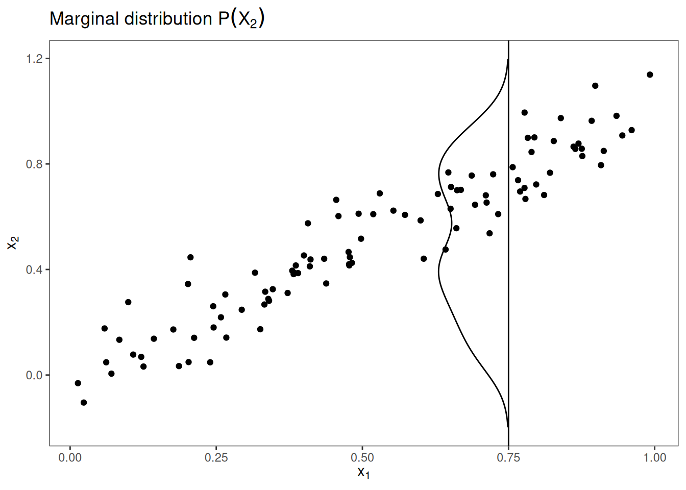
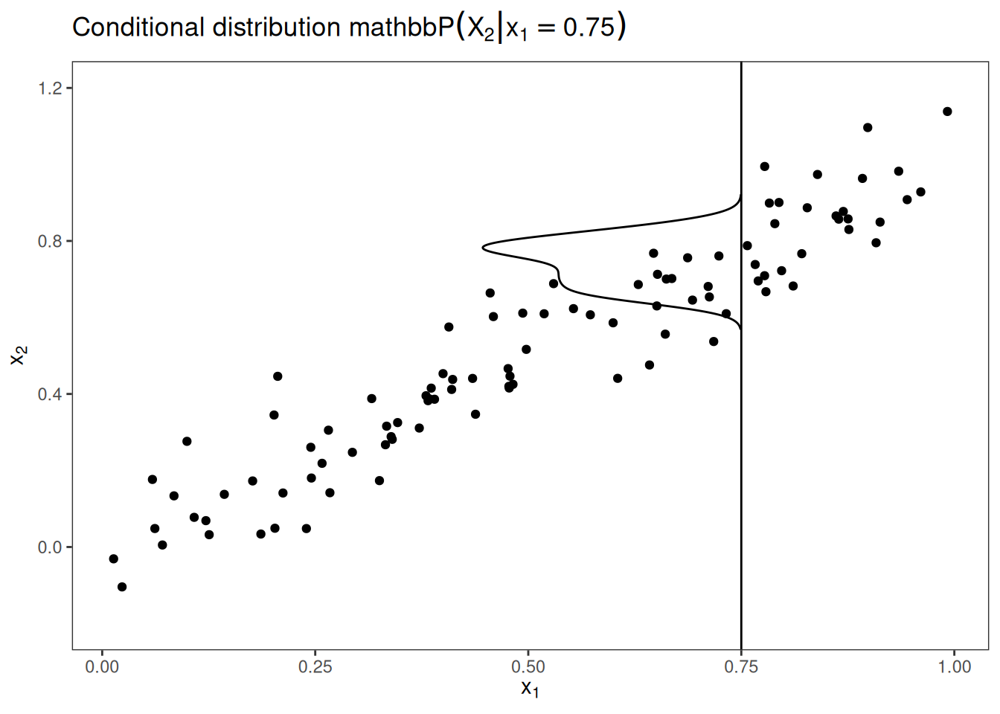
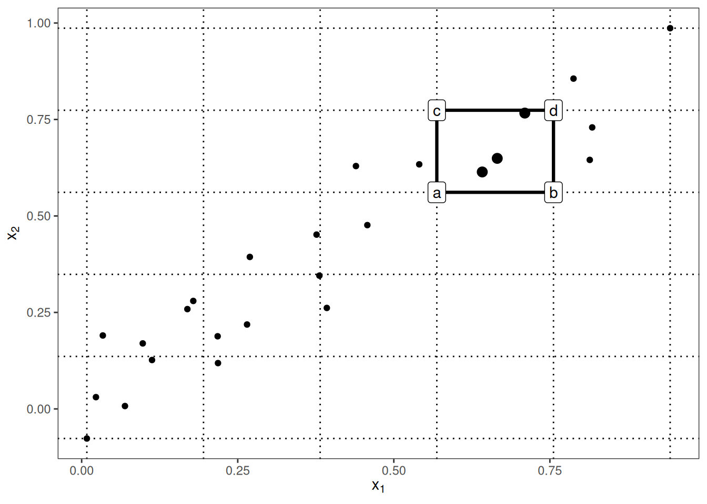
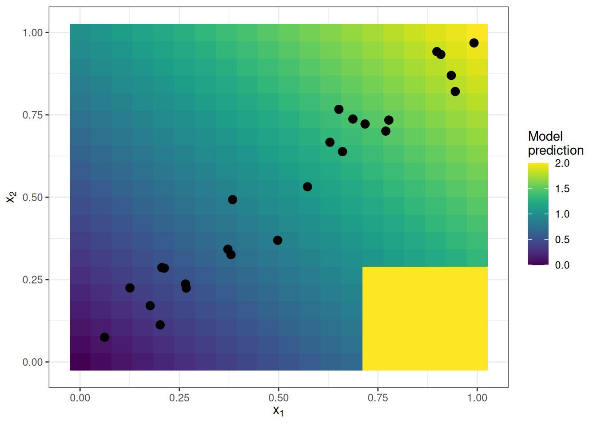
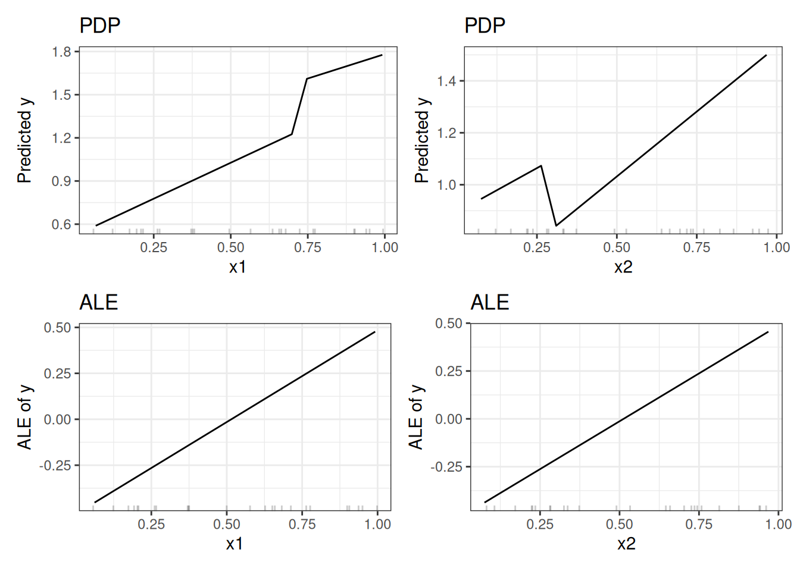
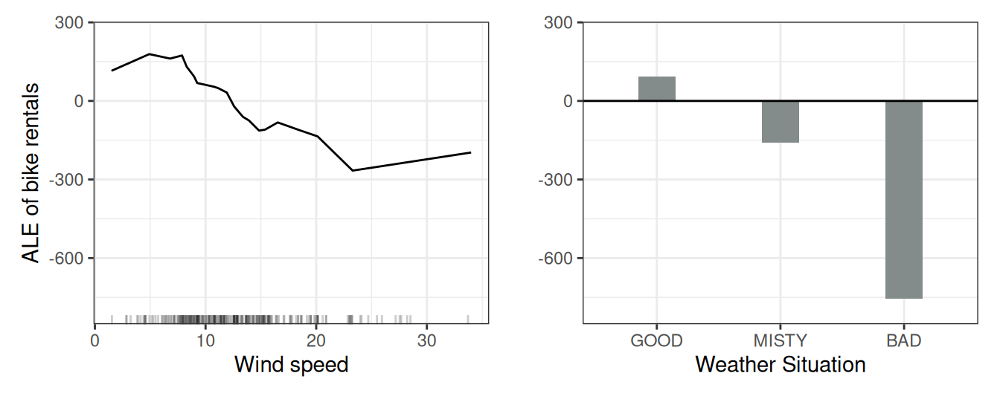
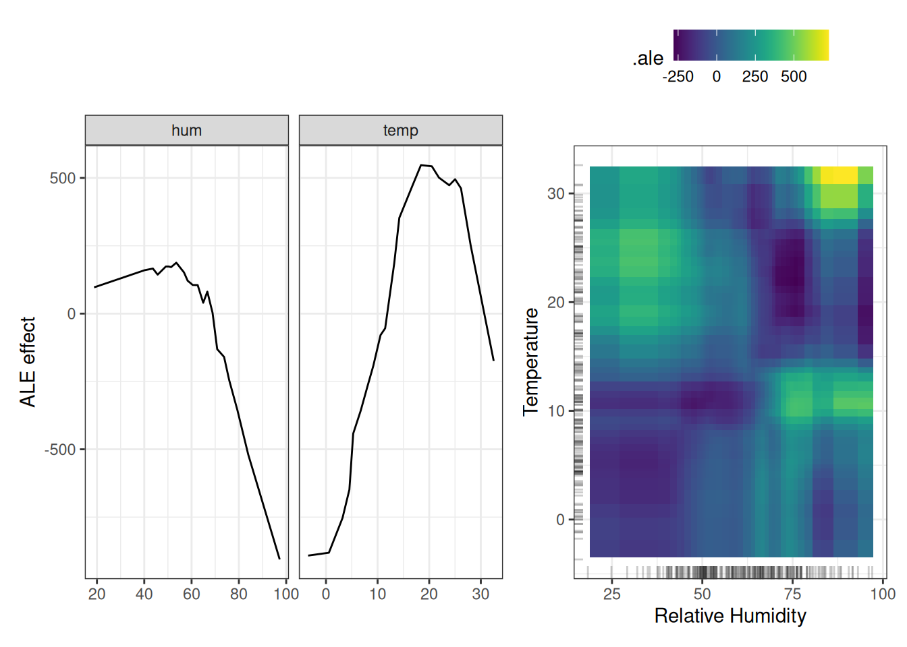
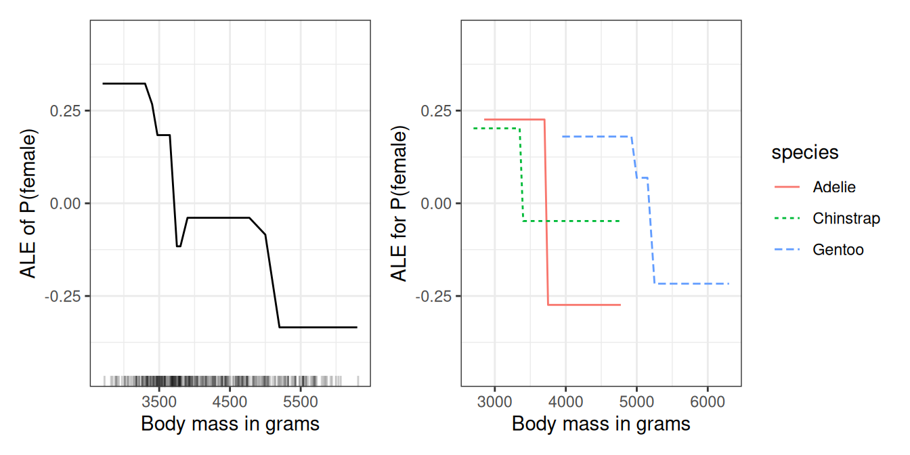

# فصل ۲۰: اثرات محلی انباشته (ALE)

> **عنوان اصلی:** Accumulated Local Effects (ALE)  
> **منبع:** [https://christophm.github.io/interpretable-ml-book/ale.html](https://christophm.github.io/interpretable-ml-book/ale.html)  
> **نویسنده:** Christoph Molnar  
> **مترجم:** مریم محمودی

---

اثرات محلی انباشته (Apley and Zhu 2020) توصیف می‌کنند که ویژگی‌ها به‌طور میانگین چه تأثیری بر پیش‌بینی یک مدل یادگیری ماشین دارند. نمودارهای ALE جایگزینی سریع‌تر و بدون تورش برای نمودارهای وابستگی جزئی (PDP) هستند.

پیشنهاد می‌کنم پیش از این فصل، فصل مربوط به نمودارهای وابستگی جزئی را مطالعه کنید؛ درک آن‌ها آسان‌تر است و هر دو روش هدف مشترکی دارند: توصیف اینکه یک ویژگی به‌طور میانگین چه تأثیری بر پیش‌بینی می‌گذارد. در ادامه نشان خواهم داد که نمودارهای وابستگی جزئی هنگامی که ویژگی‌ها با هم همبسته‌اند، با مشکل جدی روبه‌رو می‌شوند.

## انگیزه و شهود

اگر ویژگی‌های یک مدل یادگیری ماشین با هم همبسته باشند، نمی‌توان به نمودار وابستگی جزئی اعتماد کرد. محاسبه این نمودار برای ویژگی‌ای که با سایر ویژگی‌ها همبستگی قوی دارد، مستلزم میانگین‌گیری روی پیش‌بینی‌هایی است که از نمونه‌های داده مصنوعی به دست می‌آیند — نمونه‌هایی که در واقعیت بعید به نظر می‌رسند. این امر می‌تواند تخمین اثر ویژگی را به‌شدت متورش کند.

فرض کنید می‌خواهیم نمودار وابستگی جزئی را برای مدلی محاسبه کنیم که ارزش خانه را بر اساس تعداد اتاق‌ها و مساحت نشیمن پیش‌بینی می‌کند، و به اثر مساحت نشیمن بر ارزش پیش‌بینی‌شده علاقه‌مند هستیم. مراحل محاسبه نمودار وابستگی جزئی به این شکل است: ۱) انتخاب ویژگی. ۲) تعریف شبکه. ۳) برای هر مقدار شبکه: الف) جایگزینی ویژگی با مقدار شبکه و ب) میانگین‌گیری از پیش‌بینی‌ها. ۴) رسم منحنی. برای محاسبه اولین مقدار شبکه PDP — مثلاً ۳۰ متر مربع — مساحت نشیمن همه نمونه‌ها را با ۳۰ متر مربع جایگزین می‌کنیم؛ حتی برای خانه‌هایی با ۱۰ اتاق. این ترکیب بسیار غیرمعمول به نظر می‌رسد. نمودار وابستگی جزئی این خانه‌های غیرواقع‌بینانه را در تخمین اثر ویژگی لحاظ می‌کند، انگار که همه چیز طبیعی است. شکل ۲۰.۱ دو ویژگی همبسته را نشان می‌دهد و توضیح می‌دهد که چرا روش PDP ناگزیر پیش‌بینی ترکیب‌های بعید را در محاسبه دخالت می‌دهد.

پس چه می‌توان کرد تا تخمین اثر ویژگی، همبستگی میان ویژگی‌ها را رعایت کند؟ می‌توانیم به جای میانگین‌گیری بر اساس توزیع حاشیه‌ای (marginal distribution)، روی توزیع شرطی (conditional distribution) میانگین بگیریم؛ یعنی در یک مقدار شبکه مانند $x_1$، پیش‌بینی نمونه‌هایی را میانگین بگیریم که مقدار مشابهی برای $x_1$ دارند. روشی که اثر ویژگی را با استفاده از توزیع شرطی محاسبه می‌کند، «نمودارهای حاشیه‌ای» یا M-Plots نام دارد (نامی که می‌تواند گیج‌کننده باشد، چون این نمودارها بر پایه توزیع شرطی‌اند، نه حاشیه‌ای). اما صبر کنید — مگر قرار نبود از نمودارهای ALE صحبت کنیم؟ درست است؛ M-Plots راه‌حل مطلوب ما نیستند. چرا؟

اگر پیش‌بینی همه خانه‌هایی با حدوداً ۳۰ متر مربع مساحت نشیمن را میانگین بگیریم، اثر ترکیبی مساحت نشیمن و تعداد اتاق‌ها را تخمین می‌زنیم، چون این دو ویژگی با هم همبسته‌اند. فرض کنید مساحت نشیمن هیچ تأثیری بر ارزش پیش‌بینی‌شده خانه ندارد و تنها تعداد اتاق‌ها اهمیت دارد. M-Plot همچنان نشان می‌دهد که با افزایش مساحت نشیمن، ارزش پیش‌بینی‌شده بالا می‌رود؛ چون تعداد اتاق‌ها با مساحت نشیمن افزایش می‌یابد. شکل ۲۰.۲ نشان می‌دهد که چگونه M-Plots روی توزیع شرطی میانگین می‌گیرند.

M-Plots از میانگین‌گیری روی نمونه‌های داده بعید جلوگیری می‌کنند، اما اثر یک ویژگی را با اثر ویژگی‌های همبسته‌اش درهم می‌آمیزند. نمودارهای ALE این مشکل را با محاسبه **تفاضل** پیش‌بینی‌ها — به جای میانگین آن‌ها — حل می‌کنند؛ آن هم بر اساس توزیع شرطی ویژگی‌ها. برای تخمین اثر مساحت نشیمن در ۳۰ متر مربع، روش ALE همه خانه‌هایی با حدوداً ۳۰ متر مربع را انتخاب می‌کند، پیش‌بینی مدل را با فرض ۳۱ متر مربع محاسبه می‌کند، و از پیش‌بینی با فرض ۲۹ متر مربع کم می‌کند. این رویکرد اثر خالص مساحت نشیمن را جدا می‌کند و آن را با اثر ویژگی‌های همبسته نمی‌آمیزد. استفاده از تفاضل، اثر سایر ویژگی‌ها را مسدود می‌کند. شکل ۲۰.۳ شهودی درباره نحوه محاسبه نمودارهای ALE ارائه می‌دهد.

در خلاصه، هر یک از سه روش (PDP، M، ALE) اثر ویژگی را در یک مقدار شبکه $v$ به این شکل محاسبه می‌کند:

- **نمودارهای وابستگی جزئی (PDP):** «نشان می‌دهم که مدل به‌طور میانگین، زمانی که هر نمونه داده مقدار $v$ را برای آن ویژگی دارد، چه پیش‌بینی می‌کند. اینکه مقدار $v$ برای همه نمونه‌ها منطقی است یا نه، برایم مهم نیست.»
- **M-Plots:** «نشان می‌دهم که مدل به‌طور میانگین، برای نمونه‌هایی که مقادیر آن ویژگی‌شان نزدیک به $v$ است، چه پیش‌بینی می‌کند. این اثر ممکن است ناشی از آن ویژگی باشد یا از ویژگی‌های همبسته‌اش.»
- **نمودارهای ALE:** «نشان می‌دهم که پیش‌بینی‌های مدل، در یک 'پنجره' کوچک از ویژگی در اطراف $v$، برای نمونه‌های داده درون آن پنجره، چقدر تغییر می‌کند.»

## نظریه

PDP، M-Plot و نمودار ALE از نظر ریاضی چه تفاوتی دارند؟ وجه مشترک هر سه روش این است که تابع پیش‌بینی پیچیده $\hat{f}$ را به تابعی تقلیل می‌دهند که تنها به یک (یا دو) ویژگی وابسته است. هر سه روش این کار را از طریق میانگین‌گیری روی اثر سایر ویژگی‌ها انجام می‌دهند، اما در این جزئیات تفاوت دارند: اینکه آیا میانگین پیش‌بینی‌ها محاسبه می‌شود یا میانگین تفاضل‌ها، و اینکه میانگین‌گیری روی توزیع حاشیه‌ای انجام می‌شود یا توزیع شرطی.

نمودارهای وابستگی جزئی پیش‌بینی‌ها را روی توزیع حاشیه‌ای میانگین می‌گیرند:

$$\hat{f}_{S,PDP}(\mathbf{x}_S) = \mathbb{E}_{X_C}\left[\hat{f}(\mathbf{x}_S, X_C)\right] = \int \hat{f}(\mathbf{x}_S, x_C) \, d\mathbb{P}(x_C)$$

این مقدار تابع پیش‌بینی $\hat{f}$ را در مقادیر ویژگی‌های $\mathbf{x}_S$، میانگین‌گرفته‌شده روی همه ویژگی‌های مجموعه $C$ (که به‌عنوان متغیرهای تصادفی در نظر گرفته می‌شوند)، نشان می‌دهد. برای محاسبه عملی، کافی است همه نمونه‌های داده را مجبور کنیم مقدار خاصی از شبکه را برای ویژگی‌های $S$ داشته باشند و پیش‌بینی‌ها را میانگین بگیریم.

M-Plots پیش‌بینی‌ها را روی توزیع شرطی میانگین می‌گیرند:

$$\hat{f}_{S,M}(\mathbf{x}_S) = \mathbb{E}_{X_C|X_S}\left[\hat{f}(X_S, X_C) \mid X_S = \mathbf{x}_S\right] = \int \hat{f}(x_S, X_C) \, d\mathbb{P}(X_C \mid X_S = \mathbf{x}_S)$$

تنها تفاوت با PDP این است که به جای فرض توزیع حاشیه‌ای در هر مقدار شبکه، پیش‌بینی‌ها را مشروط بر هر مقدار ویژگی موردنظر میانگین می‌گیریم. در عمل باید یک همسایگی تعریف کنیم؛ مثلاً برای محاسبه اثر ۳۰ متر مربع بر ارزش خانه، می‌توانیم پیش‌بینی همه خانه‌های بین ۲۸ تا ۳۲ متر مربع را میانگین بگیریم.

نمودارهای ALE تغییرات پیش‌بینی‌ها را میانگین می‌گیرند و آن‌ها را روی شبکه انباشته می‌کنند (جزئیات بیشتر در بخش محاسبه):

$$\hat{f}_{S,ALE}(\mathbf{x}_S) = \int_{\mathbf{z}_{0,S}}^{\mathbf{x}_S} \mathbb{E}_{X_C|X_S = \mathbf{z}_S}\left[\hat{f}^S(X_S, X_C) \mid X_S = \mathbf{z}_S\right] d\mathbf{z}_S - \text{constant}$$

این فرمول سه تفاوت با M-Plots دارد. اول اینکه به جای پیش‌بینی‌ها، تغییرات پیش‌بینی‌ها میانگین گرفته می‌شوند. این تغییر به‌صورت مشتق جزئی تعریف می‌شود (که در محاسبه عملی با تفاضل پیش‌بینی‌ها در یک بازه جایگزین می‌شود):

$$\hat{f}^S(\mathbf{x}_S, \mathbf{x}_C) = \frac{\partial \hat{f}(\mathbf{x}_S, \mathbf{x}_C)}{\partial \mathbf{x}_S}$$

تفاوت دوم، انتگرال اضافی روی $\mathbf{z}$ است. مشتقات جزئی محلی را در دامنه ویژگی‌های $S$ انباشته می‌کنیم تا اثر ویژگی بر پیش‌بینی به دست آید. در محاسبه عملی، $\mathbf{z}$‌ها با یک شبکه از بازه‌ها جایگزین می‌شوند که تغییرات پیش‌بینی را روی آن‌ها حساب می‌کنیم. به جای اینکه مستقیماً پیش‌بینی‌ها را میانگین بگیریم، روش ALE تفاضل پیش‌بینی‌ها را مشروط بر ویژگی‌های $S$ حساب می‌کند و مشتق را روی $S$ انتگرال می‌گیرد. شاید در نگاه اول این کار بی‌معنی به نظر برسد — معمولاً مشتق‌گیری و انتگرال‌گیری یکدیگر را خنثی می‌کنند، مثل اینکه عددی را کم و سپس اضافه کنید. اما اینجا این رویکرد معنا دارد: مشتق (یا تفاضل در بازه) اثر ویژگی موردنظر را ایزوله می‌کند و از نفوذ ویژگی‌های همبسته جلوگیری می‌کند.

تفاوت سوم نمودارهای ALE با M-Plots این است که یک ثابت از نتایج کسر می‌شود. این مرحله نمودار ALE را مرکزگرایی می‌کند، به‌طوری که میانگین اثر روی کل داده برابر صفر می‌شود.

یک مشکل باقی می‌ماند: همه مدل‌ها گرادیان ندارند — مثلاً Random Forest گرادیان صریحی ندارد. اما همان‌طور که خواهید دید، محاسبه عملی بدون نیاز به گرادیان و با استفاده از بازه‌ها انجام می‌شود. بیایید نگاهی دقیق‌تر به تخمین نمودارهای ALE داشته باشیم.

## تخمین

ابتدا نحوه تخمین نمودارهای ALE برای یک ویژگی عددی را توضیح می‌دهم، سپس برای دو ویژگی عددی و یک ویژگی طبقه‌ای. برای تخمین اثرات محلی، ویژگی را به بازه‌های متعددی تقسیم می‌کنیم و تفاضل پیش‌بینی‌ها را محاسبه می‌کنیم. این رویکرد مشتقات را تقریب می‌زند و برای مدل‌هایی که مشتق ندارند نیز کاربرد دارد.

ابتدا اثر مرکزگرایی‌نشده را تخمین می‌زنیم:

$$\hat{\tilde{f}}_{j,ALE}(\mathbf{x}) = \sum_{k=1}^{k_j(\mathbf{x})} \frac{1}{n_j(k)} \sum_{i: x_j^{(i)} \in N_j(k)} \left[\hat{f}(z_{k,j}, \mathbf{x}_{-j}^{(i)}) - \hat{f}(z_{k-1,j}, \mathbf{x}_{-j}^{(i)})\right]$$

بیایید این فرمول را از سمت راست تجزیه کنیم. نام «اثرات محلی انباشته» به‌خوبی اجزای این فرمول را بازتاب می‌دهد. در هسته روش ALE، تفاضل پیش‌بینی‌ها محاسبه می‌شود؛ جایی که ویژگی موردنظر با مقادیر شبکه $z_{k,j}$ جایگزین می‌شود. این تفاضل پیش‌بینی، _اثر_ ویژگی برای یک نمونه مشخص در یک بازه معین است. جمع سمت راست، اثر همه نمونه‌های درون یک بازه را جمع می‌زند — که در فرمول به‌صورت همسایگی $N_j(k)$ نمایش داده می‌شود. این جمع بر تعداد نمونه‌های درون بازه تقسیم می‌شود تا تفاضل میانگین پیش‌بینی‌ها در آن بازه به دست آید. این میانگین درون بازه همان «محلی» در نام ALE است. سمبل جمع سمت چپ نیز نشان می‌دهد که اثرات میانگین را روی تمام بازه‌ها انباشته می‌کنیم. ALE مرکزگرایی‌نشده یک مقدار ویژگی که مثلاً در بازه سوم قرار دارد، برابر مجموع اثرات بازه‌های اول، دوم و سوم است. کلمه «انباشته» در ALE دقیقاً همین مفهوم را بیان می‌کند.

سپس این اثر مرکزگرایی می‌شود تا میانگین اثر برابر صفر گردد:

$$\hat{f}_{j,ALE}(\mathbf{x}) = \hat{\tilde{f}}_{j,ALE}(\mathbf{x}) - \frac{1}{n} \sum_{i=1}^{n} \hat{\tilde{f}}_{j,ALE}(x_j^{(i)})$$

مقدار ALE را می‌توان به این شکل تفسیر کرد: اثر اصلی ویژگی در یک مقدار مشخص در مقایسه با پیش‌بینی میانگین روی کل داده. مثلاً اگر تخمین ALE در $x = 3$ برابر ۲- باشد، یعنی وقتی ویژگی $j$ام مقدار ۳ دارد، پیش‌بینی در مقایسه با پیش‌بینی میانگین، ۲ واحد کمتر است.

چندک‌های توزیع ویژگی به‌عنوان شبکه‌ای استفاده می‌شوند که بازه‌ها را تعریف می‌کنند. استفاده از چندک‌ها تضمین می‌کند که در هر بازه تعداد نمونه‌های یکسانی وجود داشته باشد. البته چندک‌ها این عیب را دارند که می‌توانند بازه‌هایی با طول‌های بسیار متفاوت ایجاد کنند. این موضوع اگر ویژگی موردنظر چولگی زیادی داشته باشد — مثلاً مقادیر کم فراوان و مقادیر خیلی زیاد نادر — ممکن است به نمودارهای ALE عجیبی منجر شود.

### نمودارهای ALE برای تعامل دو ویژگی

نمودارهای ALE می‌توانند اثر تعاملی (interaction effect) دو ویژگی را نیز نشان دهند. اصول محاسبه همانند یک ویژگی است، با این تفاوت که به جای بازه، با سلول‌های مستطیلی کار می‌کنیم چون باید اثرات را در دو بعد انباشته کنیم. علاوه بر تنظیم میانگین کلی، اثرات اصلی هر دو ویژگی را نیز تنظیم می‌کنیم. این یعنی ALE دوویژگیه، اثر مرتبه دوم (second-order effect) را تخمین می‌زند که شامل اثرات اصلی ویژگی‌ها نمی‌شود؛ به عبارت دیگر، تنها اثر تعاملی اضافی دو ویژگی نمایش داده می‌شود. شکل زیر محاسبه ALE دوبعدی را نشان می‌دهد.

در شکل بالا، بسیاری از سلول‌ها به دلیل همبستگی خالی هستند. در نمودار ALE می‌توان این سلول‌ها را با رنگ خاکستری یا تیره‌تر مشخص کرد. همچنین می‌توان تخمین ALE سلول خالی را با تخمین نزدیک‌ترین سلول غیرخالی جایگزین کرد.

از آنجا که تخمین‌های ALE دوویژگیه تنها اثر مرتبه دوم را نشان می‌دهند، تفسیر آن‌ها نیاز به دقت بیشتری دارد. اثر مرتبه دوم، اثر تعاملی اضافی ویژگی‌هاست پس از اینکه اثرات اصلی آن‌ها را در نظر گرفته‌ایم. فرض کنید دو ویژگی با هم تعامل ندارند، اما هر کدام اثر خطی مستقلی روی متغیر هدف دارند. در نمودار ALE یک‌بعدی هر ویژگی، یک خط مستقیم می‌بینیم. اما در نمودار ALE دوبعدی، مقادیر باید نزدیک به صفر باشند، چون اثر مرتبه دوم تنها اثر تعاملی اضافی را نشان می‌دهد. نمودارهای ALE و PDP در این زمینه تفاوت دارند: PDP همیشه اثر کلی را نشان می‌دهد، در حالی که ALE اثر مرتبه اول یا دوم را نمایش می‌دهد. این‌ها تصمیم‌های طراحی هستند و به ریاضیات روش بستگی ندارند. می‌توان اثرات مرتبه پایین‌تر را از PDP کسر کرد تا اثرات خالص اصلی یا مرتبه دوم به دست آیند؛ یا می‌توان ALE کل را با صرف‌نظر از کسر اثرات مرتبه پایین‌تر تخمین زد.

اثرات محلی انباشته را می‌توان برای مرتبه‌های اختیاری بالاتر (تعامل سه ویژگی یا بیشتر) نیز محاسبه کرد، اما همان‌طور که در فصل PDP استدلال شد، بالاتر از دو ویژگی دیگر قابل تجسم یا تفسیر معناداری نیست.

### ALE برای ویژگی‌های طبقه‌ای

روش اثرات محلی انباشته — بنا بر تعریف — نیاز دارد که مقادیر ویژگی دارای ترتیب باشند، چون اثرات در یک جهت مشخص انباشته می‌شوند. ویژگی‌های طبقه‌ای (categorical features) ترتیب طبیعی ندارند. برای محاسبه نمودار ALE یک ویژگی طبقه‌ای، باید به نوعی ترتیبی برای آن ایجاد یا پیدا کنیم. ترتیب دسته‌ها روی محاسبه و تفسیر اثرات محلی انباشته تأثیر می‌گذارد.

یک راه‌حل این است که دسته‌ها را بر اساس شباهت‌شان، با توجه به سایر ویژگی‌ها، مرتب کنیم. فاصله بین دو دسته، مجموع فاصله‌ها در هر ویژگی است. فاصله ویژگی‌محور، یا توزیع تجمعی دو دسته را مقایسه می‌کند — که فاصله کولموگروف-اسمیرنوف (Kolmogorov-Smirnov distance) نامیده می‌شود (برای ویژگی‌های عددی) — یا جدول فراوانی‌های نسبی را (برای ویژگی‌های طبقه‌ای). پس از محاسبه فاصله‌های بین همه دسته‌ها، از مقیاس‌بندی چندبعدی (multi-dimensional scaling) استفاده می‌کنیم تا ماتریس فاصله را به یک معیار فاصله یک‌بعدی تقلیل دهیم. این کار یک ترتیب مبتنی بر شباهت برای دسته‌ها به دست می‌دهد.

برای روشن‌تر شدن موضوع، مثالی می‌زنیم: فرض کنید دو ویژگی طبقه‌ای «فصل» و «آب‌وهوا» و یک ویژگی عددی «دما» داریم. می‌خواهیم ALE ویژگی طبقه‌ای اول (فصل) را محاسبه کنیم. این ویژگی دارای دسته‌های «بهار»، «تابستان»، «پاییز» و «زمستان» است. ابتدا فاصله بین دسته‌های «بهار» و «تابستان» را حساب می‌کنیم. فاصله برابر مجموع فاصله‌ها در ویژگی‌های دما و آب‌وهوا است. برای ویژگی دما، همه نمونه‌های فصل «بهار» را برمی‌داریم، تابع توزیع تجمعی تجربی را محاسبه می‌کنیم، همین کار را برای «تابستان» انجام می‌دهیم و فاصله‌شان را با آماره کولموگروف-اسمیرنوف اندازه می‌گیریم. برای ویژگی آب‌وهوا، احتمال هر نوع آب‌وهوا را برای نمونه‌های «بهار» محاسبه می‌کنیم، همین کار را برای «تابستان» انجام می‌دهیم و مجموع قدر مطلق تفاضل توزیع احتمال را حساب می‌کنیم. اگر «بهار» و «تابستان» از نظر دما و آب‌وهوا بسیار متفاوت باشند، فاصله کل دسته زیاد خواهد بود. این رویکرد را برای سایر جفت‌های فصلی تکرار می‌کنیم و ماتریس فاصله حاصل را با مقیاس‌بندی چندبعدی به یک بعد تقلیل می‌دهیم.

> **نکته: از ترتیب طبیعی دسته‌ها استفاده کنید**
>
> اگر دسته‌های یک ویژگی طبقه‌ای ترتیب معناداری دارند، از همان ترتیب برای محاسبه ALE استفاده کنید.

## ALE در برابر PDP

بیایید نمودارهای ALE را در عمل ببینیم. یک سناریوی ساختگی طراحی کرده‌ام که در آن نمودارهای وابستگی جزئی شکست می‌خورند. سناریوی شکل ۲۰.۴ شامل یک مدل پیش‌بینی و دو ویژگی با همبستگی قوی است. مدل پیش‌بینی عمدتاً یک رگرسیون خطی است، با این تفاوت که در ترکیبی از دو ویژگی که هرگز در داده مشاهده نشده، رفتار عجیبی دارد. این ناحیه «عجیب» از توزیع داده (ابر نقاط) فاصله دارد، عملکرد مدل را تحت تأثیر قرار نمی‌دهد، و قابل بحث است که نباید بر تفسیر مدل هم تأثیر بگذارد.

آیا این سناریو واقع‌بینانه و مرتبط است؟ وقتی یک مدل آموزش می‌بینید، الگوریتم یادگیری خطا را برای نمونه‌های موجود در داده آموزشی کمینه می‌کند. خارج از توزیع داده آموزشی، رفتارهای عجیبی ممکن است رخ دهد چون مدل برای این ناحیه‌ها جریمه نمی‌شود. خروج از توزیع داده «برون‌یابی» (extrapolation) نامیده می‌شود که می‌تواند برای فریب مدل‌های یادگیری ماشین نیز به کار رود، همان‌طور که در فصل مربوط به نمونه‌های دشمن‌ساز (adversarial examples) توضیح داده شده است. شکل ۲۰.۵ نشان می‌دهد که نمودارهای وابستگی جزئی در مقایسه با نمودارهای ALE چه رفتاری دارند. تخمین‌های PDP تحت تأثیر رفتار عجیب مدل خارج از توزیع داده قرار می‌گیرند (پرش‌های تند در نمودارها). نمودارهای ALE به‌درستی تشخیص می‌دهند که مدل یادگیری ماشین رابطه‌ای خطی بین ویژگی‌ها و پیش‌بینی‌ها دارد و از نواحی بدون داده صرف‌نظر می‌کنند.

اما آیا جالب نیست که مدل ما در $x_1 > 0.7$ و $x_2 < 0.3$ رفتار عجیبی دارد؟ پاسخ هم بله است و هم خیر. از آنجا که این نمونه‌های داده ممکن است از نظر فیزیکی غیرممکن یا بسیار بعید باشند، معمولاً بررسی آن‌ها اهمیت چندانی ندارد. اما اگر گمان می‌کنید توزیع داده آزمایشی ممکن است کمی متفاوت باشد و برخی نمونه‌ها واقعاً در آن محدوده قرار بگیرند، بررسی این ناحیه در محاسبه اثرات ویژگی ارزش دارد. در هر حال، این باید یک تصمیم آگاهانه برای درج نواحی بدون داده باشد، نه اثر جانبی ناخواسته روش انتخابی مانند PDP. اگر مشکوک هستید که مدل بعداً با داده‌های با توزیع متفاوت استفاده می‌شود، استفاده از نمودارهای ALE و شبیه‌سازی توزیع مورد انتظار را توصیه می‌کنم.

> **نکته: هر دو نمودار PDP و ALE را رسم کنید**
>
> مشاهده تجربی: در کاربردهای من، نمودارهای ALE و PDP با وجود همبستگی، اغلب مشابه به نظر می‌رسیدند. همبستگی می‌تواند تفسیرپذیری را خراب کند، اما لزوماً چنین نمی‌کند. اگر برای یک ویژگی همبسته، ALE و PDP منحنی‌های یکسانی نشان دهند، PDP را تفسیر کنید چون تفسیر ساده‌تری دارد.

## مثال‌ها

حالا به یک مجموعه داده واقعی می‌پردازیم: پیش‌بینی تعداد دوچرخه‌های اجاره‌شده بر اساس آب‌وهوا و روز. از Random Forest برای پیش‌بینی استفاده می‌کنیم و با نمودارهای ALE بررسی می‌کنیم که سرعت باد و وضعیت آب‌وهوا چه تأثیری بر پیش‌بینی‌ها دارند.

شکل ۲۰.۶ (چپ) نشان می‌دهد که افزایش سرعت باد تأثیر منفی بر اجاره دوچرخه دارد. برای وضعیت آب‌وهوا (راست) می‌بینیم که به‌ویژه آب‌وهوای بد تأثیر منفی شدیدی بر تعداد دوچرخه‌های اجاره‌شده دارد. هر دو اثر با دانش حوزه‌ای همخوانی دارند که نشانه خوبی است.

سپس اثرات رطوبت و دما و تعامل آن‌ها بر تعداد پیش‌بینی‌شده دوچرخه را بررسی می‌کنیم. به یاد بیاورید که اثر مرتبه دوم، اثر تعاملی اضافی دو ویژگی است و شامل اثرات اصلی نمی‌شود. این یعنی مثلاً در نمودار ALE مرتبه دوم، اثر اصلی رطوبت بالا بر کاهش تعداد دوچرخه‌های پیش‌بینی‌شده مشاهده نمی‌شود. شکل ۲۰.۷ هم اثرات اصلی دما و رطوبت و هم تعامل آن‌ها را نشان می‌دهد. نمودار یک تعامل را آشکار می‌کند: هوای سرد و مرطوب باعث افزایش پیش‌بینی می‌شود. این نکته را مدنظر داشته باشید که هر دو اثر اصلی رطوبت و دما نشان می‌دهند که تعداد پیش‌بینی‌شده دوچرخه در هوای سرد و مرطوب کاهش می‌یابد. در هوای سرد و مرطوب، اثر ترکیبی دما و رطوبت بزرگ‌تر از مجموع اثرات اصلی است.

می‌توانید اثر کلی را نیز با جمع کردن دو اثر اصلی و پیش‌بینی میانگین به دست آورید. اگر تنها به تعامل علاقه‌مند هستید، به اثرات مرتبه دوم توجه کنید، چون اثر کلی، اثرات اصلی را نیز درون خود دارد. اما اگر می‌خواهید اثر ترکیبی ویژگی‌ها را بدانید، باید اثر کلی را بررسی کنید. با این حال، در سناریویی که دو ویژگی تعامل ندارند، اثر کلی آن‌ها ممکن است گمراه‌کننده باشد؛ چون احتمالاً منظره‌ای پیچیده نشان می‌دهد که وانمود می‌کند تعاملی وجود دارد، در حالی که صرفاً حاصلضرب دو اثر اصلی است. اثر خالص مرتبه دوم فوراً نشان می‌دهد که هیچ تعاملی وجود ندارد.

به اندازه کافی دوچرخه! بیایید به یک مسئله طبقه‌بندی بپردازیم. یک Random Forest برای پیش‌بینی جنسیت پنگوئن بر اساس اندازه‌گیری‌های بدن آموزش می‌دهیم. وزن بدن چه تأثیری بر احتمال ماده‌بودن یک پنگوئن دارد؟ شکل ۲۰.۸ (چپ) نمودار ALE را برای جرم بدن نشان می‌دهد. هرچه پنگوئن سنگین‌تر باشد، احتمال ماده‌بودن آن کمتر است. تصویر کامل‌تری وقتی به دست می‌آید که نمودارهای ALE را بر اساس گونه ببینیم (شکل ۲۰.۸، راست). هر گونه یک نقطه آستانه مشخص دارد که بالاتر از آن، جرم بدن بیشتر نشانه نرها است. به‌طور کلی، این اثرات با نمودارهای PDP در فصل مربوطه بسیار مشابه‌اند.

## نقاط قوت

نمودارهای ALE **بدون تورش** هستند؛ یعنی حتی وقتی ویژگی‌ها همبسته‌اند نیز به‌درستی کار می‌کنند. نمودارهای وابستگی جزئی در این سناریو شکست می‌خورند چون ترکیب‌های بعید یا حتی غیرممکن از مقادیر ویژگی را حاشیه‌ای می‌کنند.

نمودارهای ALE نسبت به PDP **سریع‌تر** محاسبه می‌شوند و مقیاس $O(n)$ دارند، چون بیشترین تعداد ممکن بازه‌ها برابر تعداد نمونه‌هاست. PDP به $n$ برابر تعداد نقاط شبکه پیش‌بینی نیاز دارد. با ۲۰ نقطه شبکه، PDP ۲۰ برابر بیشتر از بدترین حالت ALE — که به ازای هر نمونه یک بازه دارد — پیش‌بینی نیاز دارد.

تفسیر (محلی) نمودارهای ALE **روشن** است: با توجه به یک مقدار مشخص از ویژگی، تأثیر نسبی تغییر آن ویژگی بر پیش‌بینی را می‌توان از نمودار ALE خواند. نمودارهای ALE حول صفر مرکزگرایی می‌شوند که تفسیر را ساده می‌کند؛ مقدار در هر نقطه از منحنی ALE نشان‌دهنده تفاضل نسبت به پیش‌بینی میانگین است. نمودار ALE دوبعدی تنها تعامل را نشان می‌دهد؛ اگر دو ویژگی تعاملی نداشته باشند، نمودار چیزی نمایش نمی‌دهد.

کل تابع پیش‌بینی را می‌توان به مجموعی از توابع ALE با ابعاد پایین‌تر تجزیه کرد، همان‌طور که در فصل تجزیه تابعی (functional decomposition) توضیح داده می‌شود.

در مجموع، در اکثر موقعیت‌ها نمودارهای ALE را به PDP ترجیح می‌دهم، چون ویژگی‌ها معمولاً تا حدودی با هم همبسته هستند.

## محدودیت‌ها

تفسیر اثر در بین بازه‌ها **مجاز نیست** اگر ویژگی‌ها به‌شدت همبسته باشند. تصور کنید ویژگی‌ها همبستگی بالایی دارند و به انتهای چپ یک نمودار ALE یک‌بعدی نگاه می‌کنید. منحنی ALE ممکن است این تفسیر نادرست را برانگیزد: «منحنی ALE نشان می‌دهد وقتی به تدریج مقدار ویژگی را برای یک نمونه داده تغییر می‌دهیم و سایر مقادیر ویژگی ثابت می‌مانند، پیش‌بینی‌ها به‌طور میانگین چقدر تغییر می‌کنند.» اثرات به ازای هر بازه (به‌صورت محلی) محاسبه می‌شوند و بنابراین تفسیر اثر تنها در سطح محلی معتبر است. برای راحتی، اثرات درون بازه‌ها انباشته می‌شوند تا منحنی نرمی شکل بگیرد، اما باید به یاد داشت که هر بازه با نمونه‌های داده متفاوتی ساخته می‌شود.

اثرات ALE ممکن است با ضرایب یک مدل رگرسیون خطی مطابقت نداشته باشند، زمانی که ویژگی‌ها با هم تعامل داشته و همبسته باشند. Grömping (2020) نشان داد که در یک مدل خطی با دو ویژگی همبسته و یک جمله تعاملی اضافی ($x_1 \cdot x_2$)، نمودارهای ALE مرتبه اول خط مستقیمی نمایش نمی‌دهند. در عوض، کمی انحناء دارند چون بخشی از تعامل ضربی ویژگی‌ها را در خود دارند. برای درک بهتر این پدیده، مطالعه فصل تجزیه تابعی را توصیه می‌کنم. به‌طور خلاصه، ALE اثرات مرتبه اول (یا یک‌بعدی) را متفاوت از فرمول خطی تعریف می‌کند. این لزوماً اشتباه نیست، چون وقتی ویژگی‌ها همبسته‌اند، نسبت‌دهی تعاملات چندان مشخص نیست. اما قطعاً غیرشهودی است که ALE و ضرایب خطی با هم مطابقت ندارند.

نمودارهای ALE با تعداد بالای بازه‌ها ممکن است **ناهموار** شوند (با بالا و پایین‌های کوچک متعدد). در این حالت، کاهش تعداد بازه‌ها تخمین‌ها را پایدارتر می‌کند، اما برخی پیچیدگی‌های واقعی مدل پیش‌بینی را نیز هموار و پنهان می‌کند. هیچ راه‌حل کاملی برای تعیین تعداد بازه‌ها وجود ندارد. اگر تعداد خیلی کم باشد، نمودارهای ALE ممکن است دقت کافی نداشته باشند. اگر خیلی زیاد باشد، منحنی ناهموار می‌شود. برای توازن بین هموار بودن و دقت، Gkolemis و همکاران (2023) یک رویکرد خودکار تقسیم بازه را پیشنهاد کردند که به‌تدریج بازه‌ها را بزرگ‌تر می‌کند (برای تخمین‌های پایدارتر) تا زمانی که اثرات محلی درون آن‌ها نسبتاً ثابت بمانند (برای حفظ پیچیدگی واقعی مدل).

بر خلاف PDP، نمودارهای ALE با **منحنی‌های ICE** همراه نمی‌شوند. در PDP، منحنی‌های ICE ارزشمندند چون می‌توانند ناهمگونی در اثر ویژگی را آشکار کنند؛ یعنی اثر یک ویژگی برای زیرگروه‌هایی از داده متفاوت به نظر می‌رسد. در نمودارهای ALE، تنها می‌توان به ازای هر بازه بررسی کرد که آیا اثر بین نمونه‌ها متفاوت است یا نه، اما از آنجا که هر بازه نمونه‌های متفاوتی دارد، این کار معادل منحنی‌های ICE نیست.

تخمین‌های ALE مرتبه دوم در نقاط مختلف فضای ویژگی **پایداری متفاوتی** دارند که در هیچ نموداری به‌نمایش درنمی‌آید. علت این است که هر تخمین اثر محلی در یک سلول از تعداد متفاوتی از نمونه‌های داده استفاده می‌کند. در نتیجه، همه تخمین‌ها دقت متفاوتی دارند (اما همچنان بهترین تخمین‌های ممکن هستند). این مشکل در نسخه خفیف‌تری در نمودارهای ALE اثر اصلی هم وجود دارد. تعداد نمونه‌ها در همه بازه‌ها یکسان است — به لطف استفاده از چندک‌ها به‌عنوان شبکه — اما در برخی ناحیه‌ها بازه‌های کوتاه زیادی وجود دارند و منحنی ALE از تخمین‌های بیشتری تشکیل شده است. اما برای بازه‌های طولانی که ممکن است بخش بزرگی از کل منحنی را تشکیل دهند، نمونه‌های نسبتاً کمتری وجود دارد.

نمودارهای اثر مرتبه دوم تفسیرشان **کمی ناخوشایند** است، چون باید همیشه اثرات اصلی را نیز مدنظر داشته باشید. وسوسه‌انگیز است که نقشه‌های گرمایی را به‌عنوان اثر کلی دو ویژگی بخوانید، در حالی که فقط اثر تعاملی اضافی را نشان می‌دهند. اثر خالص مرتبه دوم برای کشف و بررسی تعاملات مفید است، اما برای تفسیر اینکه اثر چه شکلی دارد، به نظر می‌رسد منطقی‌تر باشد که اثرات اصلی را نیز در نمودار لحاظ کنیم.

**پیاده‌سازی** نمودارهای ALE در مقایسه با نمودارهای وابستگی جزئی **پیچیده‌تر** و کمتر شهودی است.

حتی اگر نمودارهای ALE در حالت وجود همبستگی بدون تورش باشند، تفسیر همچنان **دشوار** است وقتی ویژگی‌ها به‌شدت همبسته‌اند. چون اگر همبستگی بسیار قوی باشد، تنها تحلیل اثر تغییر همزمان هر دو ویژگی معنا دارد، نه هر کدام به تنهایی. این محدودیت مختص نمودارهای ALE نیست، بلکه یک مشکل عمومی در ویژگی‌های با همبستگی قوی است.

اگر ویژگی‌ها همبسته نباشند و زمان محاسبه مشکلی نباشد، PDP کمی ارجح است چون فهمیدنش آسان‌تر است و می‌توان همراه با منحنی‌های ICE رسمش کرد.

فهرست معایب کمی طولانی شد، اما تعداد کلمات گمراه‌کننده نباشد. به‌عنوان قاعده کلی: اگر ویژگی‌ها همبسته نیستند، از PDP استفاده کنید. اگر همبسته‌اند اما ALE و PDP منحنی‌های تقریباً یکسانی نشان می‌دهند، تفسیر ساده‌تر PDP را انتخاب کنید. اگر ویژگی‌ها همبسته‌اند و ALE و PDP با هم تفاوت دارند، ALE را انتخاب کنید.

## نرم‌افزار و جایگزین‌ها

آیا گفتم که نمودارهای وابستگی جزئی و منحنی‌های ICE جایگزین هستند؟ =)

نمودارهای ALE در R در بسته `ALEPlot` — نوشته خود مبتکر روش — و همچنین در بسته `iml` پیاده‌سازی شده‌اند. برای Python نیز چند پیاده‌سازی وجود دارد: `effector`، `ALEPython`، `Alibi` و `PiML`.
