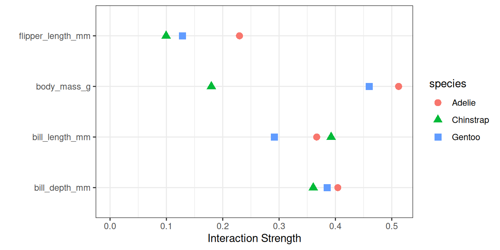

# فصل ۲۱: تعامل ویژگی‌ها

> **عنوان اصلی:** Feature Interaction  
> **منبع:** [https://christophm.github.io/interpretable-ml-book/interaction.html](https://christophm.github.io/interpretable-ml-book/interaction.html)  
> **نویسنده:** Christoph Molnar  
> **مترجم:** مریم محمودی

---

هنگامی که ویژگی‌ها در یک مدل پیش‌بینی با یکدیگر تعامل دارند، نمی‌توان پیش‌بینی را به صورت مجموع اثرات تک‌تک ویژگی‌ها بیان کرد، زیرا اثر یک ویژگی به مقدار ویژگی دیگر وابسته است. گزارهٔ ارسطو که «کل چیزی فراتر از مجموع اجزای آن است» در حضور تعاملات مصداق پیدا می‌کند.

## تعامل ویژگی‌ها چیست؟

اگر یک مدل یادگیری ماشین بر اساس دو ویژگی پیش‌بینی做出 می‌کند، می‌توانیم پیش‌بینی را به چهار بخش تجزیه کنیم: یک مقدار ثابت، یک عبارت برای ویژگی اول، یک عبارت برای ویژگی دوم، و یک عبارت برای تعامل بین دو ویژگی. تعامل بین دو ویژگی، تغییری در پیش‌بینی است که با تغییر دادن ویژگی‌ها پس از لحاظ کردن اثرات تکی آن‌ها رخ می‌دهد.

برای مثال، مدلی ارزش یک خانه را با استفاده از اندازه (بزرگ یا کوچک) و موقعیت (خوب یا بد) به عنوان ویژگی پیش‌بینی می‌کند که چهار پیش‌بینی ممکن را به دست می‌دهد، مطابق جدول ۲۱.۱.

| موقعیت | اندازه | پیش‌بینی   |
|--------|--------|------------|
| خوب    | بزرگ   | ۳۰۰,۰۰۰   |
| خوب    | کوچک   | ۲۰۰,۰۰۰   |
| بد     | بزرگ   | ۲۵۰,۰۰۰   |
| بد     | کوچک   | ۱۵۰,۰۰۰   |

جدول ۲۱.۱: مثال پیش‌بینی‌ها برای قیمت خانه بدون تعامل

پیش‌بینی مدل را به بخش‌های زیر تجزیه می‌کنیم: یک مقدار ثابت (۱۵۰,۰۰۰)، یک اثر برای ویژگی اندازه (۱۰۰,۰۰۰+ اگر بزرگ باشد؛ ۰+ اگر کوچک باشد)، و یک اثر برای موقعیت (۵۰,۰۰۰+ اگر خوب باشد؛ ۰+ اگر بد باشد). این تجزیه به طور کامل پیش‌بینی‌های مدل را توضیح می‌دهد. هیچ اثر تعاملی وجود ندارد، زیرا پیش‌بینی مدل مجموع اثرات تکی ویژگی‌های اندازه و موقعیت است. وقتی یک خانهٔ کوچک را بزرگ می‌کنید، پیش‌بینی همواره ۱۰۰,۰۰۰ واحد افزایش می‌یابد، صرف‌نظر از موقعیت. همچنین، تفاوت پیش‌بینی بین موقعیت خوب و بد همواره ۵۰,۰۰۰ است، صرف‌نظر از اندازه.

حال به مثالی با تعامل در جدول ۲۱.۲ نگاه می‌کنیم.

| موقعیت | اندازه | پیش‌بینی   |
|--------|--------|------------|
| خوب    | بزرگ   | ۴۰۰,۰۰۰   |
| خوب    | کوچک   | ۲۰۰,۰۰۰   |
| بد     | بزرگ   | ۲۵۰,۰۰۰   |
| بد     | کوچک   | ۱۵۰,۰۰۰   |

جدول ۲۱.۲: مثال پیش‌بینی‌ها برای قیمت خانه با تعامل

جدول پیش‌بینی را به بخش‌های زیر تجزیه می‌کنیم: یک مقدار ثابت (۱۵۰,۰۰۰)، یک اثر برای ویژگی اندازه (۱۰۰,۰۰۰+ اگر بزرگ باشد؛ ۰+ اگر کوچک باشد)، و یک اثر برای موقعیت (۵۰,۰۰۰+ اگر خوب باشد؛ ۰+ اگر بد باشد). برای این جدول، به یک عبارت اضافی برای تعامل نیاز داریم: ۱۰۰,۰۰۰+ اگر خانه بزرگ و در موقعیت خوب باشد. پس برای یک خانهٔ بزرگ در موقعیت خوب داریم: ۱۵۰,۰۰۰ (پایه) + ۵۰,۰۰۰ (موقعیت خوب) + ۱۰۰,۰۰۰ (بزرگ) + ۱۰۰,۰۰۰ (تعامل) = ۴۰۰,۰۰۰. این یک تعامل بین اندازه و موقعیت است، زیرا در این حالت تفاوت پیش‌بینی بین خانهٔ بزرگ و کوچک به موقعیت بستگی دارد.

یک راه برای برآورد قدرت تعامل این است که اندازه بگیریم چه مقدار از تغییرات پیش‌بینی به تعامل ویژگی‌ها وابسته است. این معیار آمارهٔ H نام دارد که توسط فریدمن و پوپسکو (Friedman and Popescu 2008) معرفی شده است.

## آمارهٔ H فریدمن

ما با دو حالت سروکار داریم: اول، یک معیار تعامل دوسویه که نشان می‌دهد آیا دو ویژگی در مدل با یکدیگر تعامل دارند یا خیر و تا چه اندازه؛ دوم، یک معیار تعامل کل که نشان می‌دهد آیا یک ویژگی در مدل با تمام ویژگی‌های دیگر تعامل دارد یا خیر و تا چه اندازه. در تئوری، تعاملات دلخواه بین هر تعداد از ویژگی‌ها قابل اندازه‌گیری است، اما این دو حالت جالب‌ترین موارد هستند.

اگر دو ویژگی تعامل نداشته باشند، می‌توانیم تابع وابستگی جزئی (PD) را به صورت زیر تجزیه کنیم (با فرض اینکه توابع وابستگی جزئی در صفر مرکزی شده‌اند):

$$PD_{jk}(\mathbf{x}_j, \mathbf{x}_k) = PD_j(\mathbf{x}_j) + PD_k(\mathbf{x}_k)$$

که در آن $PD_{jk}(\mathbf{x}_j, \mathbf{x}_k)$ تابع وابستگی جزئی دوسویهٔ هر دو ویژگی است، و $PD_j(\mathbf{x}_j)$ و $PD_k(\mathbf{x}_k)$ توابع وابستگی جزئی تک‌تک ویژگی‌ها هستند.

به همین ترتیب، اگر یک ویژگی با هیچ‌یک از ویژگی‌های دیگر تعامل نداشته باشد، می‌توانیم تابع پیش‌بینی $\hat{f}(\mathbf{x})$ را به صورت مجموع توابع وابستگی جزئی بیان کنیم، که جملهٔ اول تنها به $j$ و جملهٔ دوم به تمام ویژگی‌های دیگر به جز $j$ وابسته است:

$$\hat{f}(\mathbf{x}) = PD_j(x_j) + PD_{-j}(\mathbf{x}_{-j})$$

که در آن $PD_{-j}(\mathbf{x}_{-j})$ تابع وابستگی جزئی است که به همهٔ ویژگی‌ها به جز ویژگی $j$ام وابسته است.

این تجزیه، تابع وابستگی جزئی (یا پیش‌بینی کامل) را بدون تعامل (بین ویژگی‌های $j$ و $k$، یا به ترتیب $j$ و همهٔ ویژگی‌های دیگر) بیان می‌کند. در گام بعدی، تفاوت بین تابع وابستگی جزئی مشاهده‌شده و تابع تجزیه‌شده بدون تعامل را اندازه می‌گیریم. واریانس خروجی وابستگی جزئی (برای اندازه‌گیری تعامل بین دو ویژگی) یا کل تابع (برای اندازه‌گیری تعامل بین یک ویژگی و همهٔ ویژگی‌های دیگر) را محاسبه می‌کنیم. مقدار واریانسی که توسط تعامل (تفاوت بین PD مشاهده‌شده و PD بدون تعامل) توضیح داده می‌شود، به عنوان معیار قدرت تعامل استفاده می‌شود. این آماره در صورت عدم وجود تعامل ۰ است، و اگر تمام واریانس $PD_{jk}$ یا $\hat{f}$ توسط مجموع توابع وابستگی جزئی توضیح داده شود، ۱ است. آمارهٔ تعامل ۱ بین دو ویژگی به این معناست که هر تابع PD تکی ثابت است و اثر بر پیش‌بینی تنها از طریق تعامل حاصل می‌شود. آمارهٔ H می‌تواند بزرگتر از ۱ نیز باشد که تفسیر آن دشوارتر است. این حالت زمانی رخ می‌دهد که واریانس تعامل دوسویه از واریانس نمودار وابستگی جزئی دو‌بعدی بزرگتر باشد.

از نظر ریاضی، آمارهٔ H پیشنهادی فریدمن و پوپسکو برای تعامل بین ویژگی $j$ و $k$ به صورت زیر است:

$$H^2_{jk} = \frac{\sum_{i=1}^n\left[PD_{jk}(x_{j}^{(i)},x_k^{(i)})-PD_j(x_j^{(i)}) - PD_k(x_{k}^{(i)})\right]^2}{\sum_{i=1}^n\left({PD}_{jk}(x_j^{(i)},x_k^{(i)})\right)^2}$$

همین امر برای اندازه‌گیری اینکه آیا ویژگی $j$ با هر ویژگی دیگری تعامل دارد نیز صدق می‌کند:

$$H^2_{j} = \frac{\sum_{i=1}^n\left[\hat{f}(\mathbf{x}^{(i)}) - PD_j(x^{(i)}_j) - PD_{-j}(\mathbf{x}_{-j}^{(i)})\right]^2}{\sum_{i=1}^n \left(\hat{f}(\mathbf{x}^{(i)})\right)^2}$$

آمارهٔ H محاسباتی پرهزینه است، زیرا روی تمام نقاط داده تکرار می‌شود و در هر نقطه وابستگی جزئی باید ارزیابی شود که خود با همهٔ n نقطه داده انجام می‌شود. در بدترین حالت، برای محاسبهٔ آمارهٔ H دوسویه ($j$ در مقابل $k$) به $2n^2$ فراخوانی تابع پیش‌بینی مدل یادگیری ماشین نیاز داریم و برای آمارهٔ H کل ($j$ در مقابل همه) به $3n^2$ فراخوانی. برای سرعت بخشیدن به محاسبه، می‌توانیم از n نقطه داده نمونه‌برداری کنیم. این کار باعث افزایش واریانس برآوردهای وابستگی جزئی می‌شود که آمارهٔ H را ناپایدار می‌کند. بنابراین اگر از نمونه‌برداری برای کاهش بار محاسباتی استفاده می‌کنید، مطمئن شوید که به اندازهٔ کافی نقطه داده نمونه‌برداری می‌کنید.

فریدمن و پوپسکو همچنین یک آمارهٔ آزمون برای ارزیابی اینکه آیا آمارهٔ H به طور معناداری از صفر متفاوت است، پیشنهاد می‌کنند. فرض صفر عدم وجود تعامل است. برای تولید آمارهٔ تعامل تحت فرض صفر، باید بتوانید مدل را طوری تنظیم کنید که هیچ تعاملی بین ویژگی $j$ و $k$ یا سایرین نداشته باشد. این کار برای همهٔ انواع مدل‌ها ممکن نیست. بنابراین، این آزمون خاص مدل است، نه مستقل از مدل، و در اینجا پوشش داده نمی‌شود.

آمارهٔ قدرت تعامل را می‌توان در مسائل دسته‌بندی نیز به کار برد، به شرطی که پیش‌بینی به صورت احتمال باشد.

## مثال‌ها

بیایید ببینیم تعامل ویژگی‌ها در عمل چگونه است! ما تعاملات بین ویژگی‌ها را در یک جنگل تصادفی که برای پیش‌بینی جنسیت پنگوئن (data.html#penguins) بر اساس اندازه‌گیری‌های بدنی آموزش دیده است، تحلیل می‌کنیم. شکل ۲۱.۱ (بالا) را ببینید. تودهٔ بدنی بیشترین قدرت تعامل را دارد. پس از بررسی تعاملات ویژگی هر ویژگی با سایر ویژگی‌ها، می‌توانیم یکی از ویژگی‌ها را انتخاب کرده و به عمق تمام تعاملات دوسویه بین آن ویژگی و سایر ویژگی‌ها نگاه کنیم. تودهٔ بدنی قوی‌ترین تعامل را دارد، بنابراین اجازه دهید در شکل ۲۱.۱ (پایین) نگاه عمیق‌تری بیندازیم. نمودار نشان می‌دهد که تودهٔ بدنی بیشتر با عمق نوک و گونه تعامل دارد.

بعلاوه: ما به همهٔ تعاملات بر حسب گونه علاقه‌مندیم که در شکل ۲۱.۲ مصور شده است. به ویژه برای تودهٔ بدنی، قدرت تعامل بین گونه‌ها متفاوت است.

## نقاط قوت

آمارهٔ تعامل H دارای یک **نظریهٔ زیربنایی** از طریق تجزیه وابستگی جزئی است.

آمارهٔ H یک **تفسیر معنادار** دارد: تعامل به عنوان سهم واریانسی تعریف می‌شود که توسط تعامل توضیح داده می‌شود.

از آنجا که آماره **بی‌بعد** است، در سراسر ویژگی‌ها و حتی در سراسر مدل‌ها قابل مقایسه است.

این آماره **همهٔ انواع تعاملات** را بدون توجه به شکل خاص آن‌ها تشخیص می‌دهد.

با آمارهٔ H، امکان تحلیل **تعاملات مرتبهٔ بالاتر** دلخواه، مانند قدرت تعامل بین ۳ یا بیشتر ویژگی، نیز وجود دارد.

## محدودیت‌ها

اولین چیزی که متوجه خواهید شد: محاسبهٔ آمارهٔ تعامل H زمان زیادی می‌برد، زیرا **از نظر محاسباتی پرهزینه** است.

محاسبه شامل برآورد توزیع‌های حاشیه‌ای است. این **برآوردها خود دارای واریانس مشخصی** هستند اگر از تمام نقاط داده استفاده نکنیم. این بدان معناست که با نمونه‌برداری از نقاط، برآوردها نیز از اجرایی به اجرای دیگر تغییر می‌کنند و **نتایج می‌توانند ناپایدار** باشند. توصیه می‌کنم محاسبهٔ آمارهٔ H را چند بار تکرار کنید تا ببینید آیا دادهٔ کافی برای نتیجه‌گیری پایدار دارید.

مشخص نیست که آیا یک تعامل به طور معناداری بزرگتر از ۰ است یا خیر. برای این کار به یک آزمون آماری نیاز داریم، اما این **آزمون (هنوز) در نسخهٔ مستقل از مدل در دسترس نیست**.

در ارتباط با مسئلهٔ آزمون، گفتن اینکه چه زمانی آمارهٔ H به اندازهٔ کافی بزرگ است تا تعامل را «قوی» در نظر بگیریم، دشوار است.

همچنین، **آمارهٔ H می‌تواند بزرگتر از ۱ باشد** که تفسیر را دشوار می‌کند.

زمانی که اثر کل دو ویژگی ضعیف است اما عمدتاً از تعامل تشکیل شده باشد، آمارهٔ H بسیار بزرگ خواهد شد. این تعاملات کاذب نیاز به مخرج کوچکی از آمارهٔ H دارند و زمانی که ویژگی‌ها همبسته هستند، بدتر می‌شوند. **یک تعامل کاذب ممکن است بیش از حد تفسیر شود** به عنوان یک اثر تعاملی قوی، در حالی که در واقعیت هر دو ویژگی نقش جزئی در مدل دارند. یک راه‌حل ممکن، مصورسازی نسخهٔ نرمال‌نشدهٔ آمارهٔ H است که جذر صورت آمارهٔ H است (Inglis, Parnell, and Hurley 2022). این کار آمارهٔ H را به سطح پاسخ، حداقل برای رگرسیون، مقیاس می‌کند و تأکید کمتری بر تعاملات کاذب می‌گذارد.

$$H^{*}_{jk} = \sqrt{\sum_{i=1}^n\left[PD_{jk}(x_{j}^{(i)},x_k^{(i)})-PD_j(x_j^{(i)}) - PD_k(x_{k}^{(i)})\right]^2}$$

آمارهٔ H قدرت تعاملات را به ما می‌گوید، **اما نحوهٔ شکل تعاملات را نشان نمی‌دهد**. نمودارهای وابستگی جزئی (PDP) برای این منظور هستند. یک workflow معنادار این است که ابتدا قدرت تعاملات را اندازه‌گیری کنیم و سپس نمودارهای وابستگی جزئی دو‌بعدی برای تعاملات مورد نظر ایجاد کنیم.

آمارهٔ تعامل بر این فرض کار می‌کند که بتوانیم ویژگی‌ها را مستقل از یکدیگر جابه‌جا کنیم. اگر ویژگی‌ها به شدت همبسته باشند، این فرض نقض می‌شود و **روی ترکیب‌هایی از ویژگی‌ها انتگرال می‌گیریم که در واقعیت بسیار نامحتمل هستند**. این همان مشکلی است که نمودارهای وابستگی جزئی نیز دارند. ویژگی‌های همبسته می‌توانند به مقادیر بزرگ آمارهٔ H منجر شوند.

گاهی اوقات نتایج عجیب هستند و در شبیه‌سازی‌های کوچک **نتایج مورد انتظار را به دست نمی‌دهند**. اما این بیشتر یک مشاهدهٔ حکایتی است.

## نرم‌افزارها و جایگزین‌ها

برای مثال‌های این کتاب، از بستهٔ R به نام `iml` استفاده کرده‌ام که در CRAN و نسخهٔ در حال توسعهٔ آن در GitHub موجود است. پیاده‌سازی‌های دیگری نیز وجود دارند که بر مدل‌های خاص تمرکز دارند: بستهٔ R به نام `pre`، RuleFit و آمارهٔ H را پیاده‌سازی می‌کند. بستهٔ R به نام `gbm` مدل‌های بوست گرادیانی و آمارهٔ H را پیاده‌سازی می‌کند. در پایتون، می‌توانید پیاده‌سازی را در بستهٔ `PiML` پیدا کنید.

آمارهٔ H تنها راه اندازه‌گیری تعاملات نیست:

شبکه‌های تعامل متغیر (VIN) توسط هوکر (Hooker 2004) رویکردی است که تابع پیش‌بینی را به اثرات اصلی و تعاملات ویژگی‌ها تجزیه می‌کند. سپس تعاملات بین ویژگی‌ها به صورت یک شبکه مصورسازی می‌شوند. متأسفانه، هنوز نرم‌افزاری در دسترس نیست.

تعامل ویژگی مبتنی بر وابستگی جزئی توسط گرین‌ول، بومکه و مک‌کارتی (Greenwell, Boehmke, and McCarthy 2018) تعامل بین دو ویژگی را اندازه‌گیری می‌کند. این رویکرد اهمیت ویژگی (تعریف‌شده به عنوان واریانس تابع وابستگی جزئی) یک ویژگی را به شرط نقاط ثابت مختلف از ویژگی دیگر اندازه‌گیری می‌کند. اگر واریانس زیاد باشد، ویژگی‌ها با یکدیگر تعامل دارند؛ اگر صفر باشد، تعامل ندارند. بستهٔ R مربوطه به نام `vip` در GitHub در دسترس است. این بسته همچنین نمودارهای وابستگی جزئی و اهمیت ویژگی را پوشش می‌دهد.
