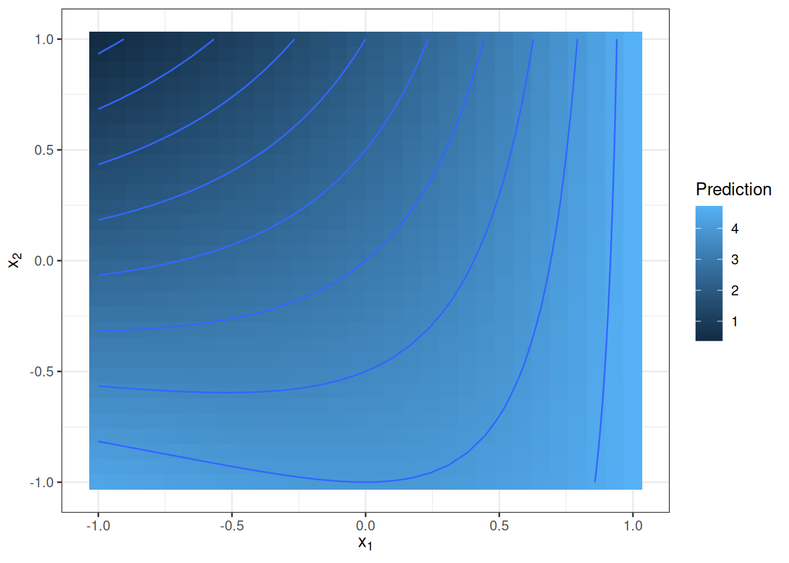
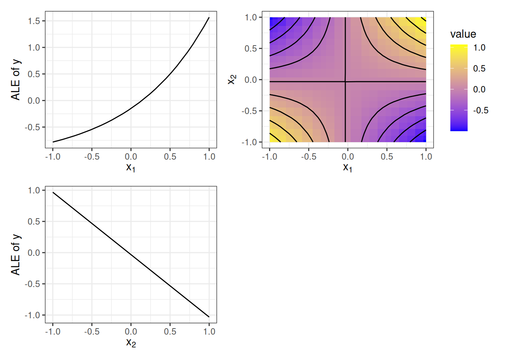

# فصل ۲۲: تجزیه تابعی

> **عنوان اصلی:** Functional Decomposition  
> **منبع:** [https://christophm.github.io/interpretable-ml-book/decomposition.html](https://christophm.github.io/interpretable-ml-book/decomposition.html)  
> **نویسنده:** Christoph Molnar  
> **مترجم:** مریم محمودی

---

یک مدل یادگیری ماشین نظارت‌شده را می‌توان به‌صورت تابعی در نظر گرفت که یک بردار ویژگی (feature vector) چندبُعدی را به‌عنوان ورودی دریافت می‌کند و یک پیش‌بینی یا امتیاز طبقه‌بندی تولید می‌نماید. تجزیه تابعی (Functional Decomposition) یک روش تفسیرپذیری است که این تابع چندبُعدی را به اجزای کوچک‌تر تقسیم می‌کند و آن را به‌صورت مجموعی از اثرات تکی ویژگی‌ها و اثرات تعاملی بیان می‌نماید؛ اجزایی که به‌راحتی قابل تجسم هستند. علاوه بر این، تجزیه تابعی یک اصل بنیادین است که زیربنای بسیاری از روش‌های تفسیرپذیری را تشکیل می‌دهد و درک عمیق‌تری از سایر روش‌های تفسیر به ما می‌دهد.

بیایید مستقیم وارد بحث شویم و یک تابع خاص را بررسی کنیم. این تابع دو ویژگی را به‌عنوان ورودی می‌گیرد و یک خروجی یک‌بُعدی تولید می‌کند:

$$f(x\_1, x\_2) = x\_1 \cdot e^{x\_1} - x\_2 + x\_1 \cdot x\_2$$

این تابع را مانند یک مدل یادگیری ماشین تصور کنید. می‌توانیم آن را با یک نمودار سه‌بُعدی یا یک نقشه حرارتی با خطوط تراز مانند شکل ۲۲.۱ نمایش دهیم.

تابع زمانی مقادیر بزرگ می‌گیرد که $x\_1$ بزرگ و $x\_2$ کوچک باشد، و زمانی مقادیر کوچک می‌گیرد که $x\_2$ بزرگ و $x\_1$ کوچک باشد. تابع پیش‌بینی صرفاً یک اثر جمعی ساده بین دو ویژگی نیست، بلکه یک تعامل (interaction) بین آن‌هاست. این تعامل در نمودار نیز مشهود است — اثر تغییر مقادیر ویژگی $x\_1$ به مقداری که ویژگی $x\_2$ دارد بستگی دارد.

وظیفه ما اکنون این است که این تابع را به اثرات اصلی ویژگی‌های $x\_1$ و $x\_2$ و یک جمله تعاملی تجزیه کنیم. برای یک تابع دوبُعدی $f$ که تنها به دو ویژگی ورودی وابسته است — $f(x\_1, x\_2)$ — می‌خواهیم هر مؤلفه نماینده یک اثر اصلی ($f\_1$ و $f\_2$)، یک تعامل ($f\_{12}$)، یا یک عرض از مبدأ ($f\_0$) باشد:

$$f(x\_1, x\_2) = f\_0 + f\_1(x\_1) + f\_2(x\_2) + f\_{12}(x\_1, x\_2)$$

اثرات اصلی نشان می‌دهند که هر ویژگی چگونه پیش‌بینی را تحت‌تأثیر قرار می‌دهد، مستقل از مقادیر ویژگی دیگر. اثر تعاملی نشان‌دهنده اثر مشترک ویژگی‌هاست. عرض از مبدأ یک مقدار ثابت است که بخشی از تمام پیش‌بینی‌ها محسوب می‌شود؛ اگر همه مقادیر ویژگی‌ها صفر بودند، پیش‌بینی تنها از عرض از مبدأ تشکیل می‌شد. توجه داشته باشید که مؤلفه‌ها (به‌جز عرض از مبدأ) خود توابعی با بُعدهای ورودی متفاوت هستند.

فعلاً مؤلفه‌ها را مستقیم ارائه می‌کنم و بعداً توضیح می‌دهم که از کجا می‌آیند. عرض از مبدأ برابر است با $f\_0 = 1.59$. از آنجا که سایر مؤلفه‌ها توابع هستند، می‌توان آن‌ها را در شکل ۲۲.۲ تجسم کرد.

آیا این مؤلفه‌ها با فرمول اصلی بالا منطقی به نظر می‌رسند — البته با چشم‌پوشی از اینکه مقدار عرض از مبدأ کمی تصادفی به نظر می‌رسد؟ ویژگی $x\_1$ یک اثر اصلی نمایی دارد و $x\_2$ یک اثر خطی منفی. جمله تعاملی شبیه تراشه پرینگلز به نظر می‌رسد؛ یا به زبان کمتر خوراکی و ریاضی‌تر، یک پارابولوئید هذلولی است، که دقیقاً همان چیزی است که از $x\_1 \cdot x\_2$ انتظار داریم. پیش‌آگاهی: این تجزیه بر پایه نمودارهای اثر محلی انباشته (ALE) صورت گرفته است.

اما چرا باید به این روش اهمیت داد؟ نگاهی به فرمول پاسخ تجزیه را مستقیم به ما می‌دهد، پس نیازی به روش‌های پیچیده نیست، مگر نه؟ برای ویژگی $x\_1$ می‌توانیم تمام جملاتی را که فقط شامل $x\_1$ هستند به‌عنوان مؤلفه آن ویژگی در نظر بگیریم: یعنی $x\_1 \cdot e^{x\_1}$ و $x\_2$ برای ویژگی $x\_2$. تعامل نیز $x\_1 \cdot x\_2$ خواهد بود. اگرچه این پاسخ درستی است (تا حد ثابت‌ها)، اما دو مشکل وجود دارد:

**مشکل اول:** اگرچه در این مثال فرمول را در دست داشتیم، در واقعیت تنها مدل‌های یادگیری ماشین با ساختار ساده را می‌توان با چنین فرمول مرتبی بیان کرد.

**مشکل دوم** ظریف‌تر است و به تعریف تعامل مربوط می‌شود. تابع ساده $f(x\_1, x\_2) = x\_1 \cdot x\_2$ را در نظر بگیرید، که هر دو ویژگی مقادیری بزرگ‌تر از صفر می‌گیرند و از یکدیگر مستقل هستند. با استفاده از تاکتیک «نگاه به فرمول»، نتیجه می‌گیریم که بین $x\_1$ و $x\_2$ تعامل وجود دارد، اما هیچ اثر اصلی مستقلی وجود ندارد. اما آیا واقعاً می‌توان گفت که ویژگی $x\_1$ هیچ اثر فردی بر تابع پیش‌بینی ندارد؟ بدون توجه به مقدار $x\_2$، با افزایش $x\_1$، پیش‌بینی افزایش می‌یابد. برای مثال، وقتی $x\_2 = 1$ است، اثر $x\_1$ برابر $x\_1$ است، و وقتی $x\_2 = 2$ اثر برابر $2x\_1$ می‌شود. بنابراین روشن است که ویژگی $x\_1$ اثر مثبتی بر پیش‌بینی دارد، مستقل از $x\_2$، و این اثر صفر نیست.

برای حل مشکل اول — نداشتن دسترسی به فرمول مرتب — به روشی نیاز داریم که تنها از تابع پیش‌بینی یا امتیاز طبقه‌بندی استفاده کند. برای حل مشکل دوم — نبود تعریف دقیق — به اصول موضوعه‌ای نیاز داریم که مشخص کنند مؤلفه‌ها باید چه شکلی داشته باشند و چه رابطه‌ای با یکدیگر دارند. اما ابتدا باید تجزیه تابعی را دقیق‌تر تعریف کنیم.

## تجزیه یک تابع

یک تابع پیش‌بینی $p$ ویژگی را به‌عنوان ورودی می‌گیرد — $x = (x\_1, \ldots, x\_p)$ — و یک خروجی تولید می‌کند. این می‌تواند یک تابع رگرسیون، احتمال طبقه‌بندی برای یک کلاس مشخص، یا امتیاز برای یک خوشه (یادگیری ماشین بدون نظارت) باشد. در حالت کاملاً تجزیه‌شده، می‌توان تابع پیش‌بینی را به‌صورت مجموع مؤلفه‌های تابعی نوشت:

$$\hat{f}(x) = \hat{f}\_0 + \sum\_{j=1}^{p} \hat{f}\_j(x\_j) + \sum\_{j < k} \hat{f}\_{jk}(x\_j, x\_k) + \ldots$$

فرمول تجزیه را می‌توان با نمایه‌گذاری بر روی تمام زیرمجموعه‌های ممکن از ترکیبات ویژگی زیباتر نوشت: $S \subseteq \{1, \ldots, p\}$. این مجموعه شامل عرض از مبدأ ($S = \emptyset$)، اثرات اصلی ($|S| = 1$)، و تمام تعاملات ($|S| \geq 2$) است. با این تعریف:

$$\hat{f}(x) = \sum\_{S \subseteq \{1,\ldots,p\}} \hat{f}\_S(x\_S)$$

در این فرمول، $x\_S$ بردار ویژگی‌های موجود در مجموعه نمایه $S$ است. هر زیرمجموعه $S$ یک مؤلفه تابعی را نشان می‌دهد — برای مثال، اگر $S$ تنها یک ویژگی داشته باشد، یک اثر اصلی است، و اگر $|S| \geq 2$، یک تعامل.

چند مؤلفه در فرمول بالا وجود دارد؟ پاسخ به تعداد زیرمجموعه‌های ممکن $S$ از مجموعه ویژگی‌ها $\{1, \ldots, p\}$ بستگی دارد، که $2^p$ زیرمجموعه است! برای مثال، اگر تابعی ۱۰ ویژگی داشته باشد، می‌توان آن را به ۱٬۰۲۴ مؤلفه تجزیه کرد: ۱ عرض از مبدأ، ۱۰ اثر اصلی، ۹۰ تعامل دوطرفه، ۷۲۰ تعامل سه‌طرفه، و به همین ترتیب. با اضافه شدن هر ویژگی جدید، تعداد مؤلفه‌ها دو برابر می‌شود. آشکار است که برای اکثر توابع، محاسبه تمام مؤلفه‌ها عملی نیست. دلیل دیگر برای عدم محاسبه همه مؤلفه‌ها این است که مؤلفه‌هایی با $|S| > 2$ به‌سختی قابل تجسم و تفسیر هستند.

تا اینجا از چگونگی تعریف و محاسبه مؤلفه‌ها صحبت نکرده‌ام. تنها محدودیت‌هایی که به‌طور ضمنی مطرح شدند عبارت بودند از: تعداد و ابعاد مؤلفه‌ها، و اینکه مجموع مؤلفه‌ها باید تابع اصلی را بازتولید کند. اما بدون محدودیت‌های بیشتر، مؤلفه‌ها یکتا نیستند. این به آن معناست که می‌توانیم اثرات را بین اثرات اصلی و تعاملات، یا بین تعاملات مرتبه پایین‌تر (تعداد کمتر ویژگی) و مرتبه بالاتر (تعداد بیشتر ویژگی) جابه‌جا کنیم. در مثال ابتدای فصل، می‌توانستیم هر دو اثر اصلی را صفر بگذاریم و اثرات آن‌ها را به جمله تعاملی منتقل کنیم.

مثال افراطی‌تری برای نشان دادن نیاز به محدودیت‌ها: فرض کنید یک تابع سه‌بُعدی دارید. شکل دقیق این تابع اهمیتی ندارد، اما تجزیه زیر همیشه جواب می‌دهد: $f\_\emptyset = 0.12$. $f\_1 = f\_2 = f\_3 = f\_{12} = f\_{13} = f\_{23} = 0$. و برای اینکه این ترفند جواب دهد، $f\_{123}(x\_1, x\_2, x\_3) = \hat{f}(x\_1, x\_2, x\_3) - 0.12$ را تعریف می‌کنیم. به این ترتیب، جمله تعاملی شامل همه ویژگی‌ها تمام اثرات باقی‌مانده را در خود جذب می‌کند — که از نظر ریاضی همیشه صادق است — اما چنین تجزیه‌ای به هیچ وجه معنادار نخواهد بود و اگر به‌عنوان تفسیر مدل ارائه شود، بسیار گمراه‌کننده است.

برای جلوگیری از این ابهام، باید محدودیت‌های بیشتری تعریف کنیم یا روش‌های محاسباتی خاصی برای مؤلفه‌ها مشخص نماییم. در این فصل، رویکردهای مختلف تجزیه تابعی را بررسی می‌کنیم:

- آنالیز واریانس تابعی (و حالت تعمیم‌یافته آن)
- اثرات محلی انباشته (ALE)
- مدل‌های رگرسیون آماری
- تجزیه مجموعه‌درختان

## آنالیز واریانس تابعی

آنالیز واریانس تابعی (Functional ANOVA) توسط Hooker (2004) پیشنهاد شد. یک پیش‌نیاز این رویکرد این است که تابع پیش‌بینی مدل $\hat{f}$ مربع‌انتگرال‌پذیر باشد. مانند هر تجزیه تابعی، ANOVA تابعی تابع را به مؤلفه‌هایی تجزیه می‌کند:

$$\hat{f}(x) = \sum\_{S \subseteq \{1,\ldots,p\}} \hat{f}\_S(x\_S)$$

Hooker (2004) هر مؤلفه را با فرمول زیر تعریف می‌کند:

$$\hat{f}\_S(x\_S) = \int \hat{f}(x) \, d x\_{\bar{S}} - \sum\_{V \subsetneq S} \hat{f}\_V(x\_V)$$

بیایید این فرمول را باز کنیم. می‌توان آن را به شکل زیر بازنویسی کرد:

$$\hat{f}\_S(x\_S) = \int\_{x\_{\bar{S}}} \hat{f}(x) \, d x\_{\bar{S}} - \sum\_{V \subsetneq S} \hat{f}\_V(x\_V)$$

سمت چپ انتگرال تابع پیش‌بینی را نسبت به ویژگی‌های خارج از مجموعه $S$ — که با $\bar{S}$ نشان داده می‌شوند — محاسبه می‌کند. برای مثال، اگر مؤلفه تعاملی دوطرفه برای ویژگی‌های ۲ و ۳ را محاسبه کنیم، انتگرال را روی ویژگی‌های ۱، ۴، ۵، … می‌گیریم. این انتگرال را می‌توان به‌عنوان مقدار مورد انتظار تابع پیش‌بینی نسبت به $x\_{\bar{S}}$ نیز در نظر گرفت، با فرض اینکه همه ویژگی‌ها دارای توزیع یکنواخت از کمینه تا بیشینه هستند. از این مقدار، تمام مؤلفه‌های متناظر با زیرمجموعه‌های $S$ کسر می‌شوند. این تفریق اثر تمام مؤلفه‌های مرتبه پایین‌تر را حذف کرده و اثر را مرکزگرا می‌کند. برای مؤلفه $\hat{f}\_{12}$، اثرات اصلی هر دو ویژگی $\hat{f}\_1$ و $\hat{f}\_2$، و همچنین عرض از مبدأ $\hat{f}\_0$ کسر می‌شوند. حضور این اثرات مرتبه پایین‌تر فرمول را بازگشتی می‌کند: باید از سلسله‌مراتب زیرمجموعه‌ها تا عرض از مبدأ پیش برویم و تمام این مؤلفه‌ها را محاسبه کنیم. برای مؤلفه عرض از مبدأ $\hat{f}\_\emptyset$، زیرمجموعه خالی است ($S = \emptyset$) و بنابراین $\bar{S}$ شامل همه ویژگی‌هاست:

$$\hat{f}\_0 = \int \hat{f}(x) \, dx$$

این به‌سادگی انتگرال تابع پیش‌بینی روی همه ویژگی‌هاست. عرض از مبدأ را می‌توان به‌عنوان مقدار مورد انتظار تابع پیش‌بینی تفسیر کرد، با فرض توزیع یکنواخت برای همه ویژگی‌ها. حالا که $\hat{f}\_0$ را می‌دانیم، می‌توانیم $\hat{f}\_1$ (و به‌همین شکل $\hat{f}\_2$) را محاسبه کنیم:

$$\hat{f}\_1(x\_1) = \int \hat{f}(x\_1, x\_2) \, dx\_2 - \hat{f}\_0$$

برای تکمیل محاسبه مؤلفه $\hat{f}\_{12}$، همه چیز را کنار هم می‌گذاریم:

$$\hat{f}\_{12}(x\_1, x\_2) = \int \hat{f}(x\_1, x\_2) \, dx\_3 \ldots dx\_p - \hat{f}\_1(x\_1) - \hat{f}\_2(x\_2) - \hat{f}\_0$$

این مثال نشان می‌دهد که چگونه هر اثر مرتبه بالاتر با انتگرال‌گیری روی سایر ویژگی‌ها تعریف می‌شود، اما همزمان همه اثرات مرتبه پایین‌تر — که زیرمجموعه‌های مجموعه ویژگی موردنظر هستند — کسر می‌شوند.

Hooker (2004) نشان داده است که این تعریف از مؤلفه‌های تابعی سه اصل موضوعه مطلوب را برآورده می‌کند:

**میانگین صفر:** $\int \hat{f}\_S(x\_S) \, dx\_j = 0$ برای هر $j \in S$.

**متعامدبودن:** $\int \hat{f}\_S(x\_S) \cdot \hat{f}\_V(x\_V) \, dx = 0$ برای $S \neq V$.

**تجزیه واریانس:** اگر $\sigma^2 = \text{Var}(\hat{f}(X))$ باشد، آنگاه $\sigma^2 = \sum\_S \sigma\_S^2$، که در آن $\sigma\_S^2 = \text{Var}(\hat{f}\_S(X\_S))$.

اصل میانگین صفر به این معناست که تمام اثرات و تعاملات حول صفر مرکز می‌شوند. در نتیجه، تفسیر در یک نقطه $x\_S$ نسبت به پیش‌بینی مرکزگراشده است، نه پیش‌بینی مطلق.

اصل متعامدبودن به این معناست که مؤلفه‌ها اطلاعات مشترک ندارند. برای مثال، اثر اصلی ویژگی $x\_1$ و جمله تعاملی $x\_1$ و $x\_2$ با یکدیگر همبسته نیستند. به‌دلیل متعامدبودن، تمام مؤلفه‌ها «خالص» هستند — اثرات مختلف در هم نمی‌آمیزند. بدیهی است که مؤلفه مربوط به ویژگی $x\_1$ باید مستقل از جمله تعاملی $x\_1$ و $x\_2$ باشد. نتیجه جالب‌تر زمانی است که متعامدبودن را برای مؤلفه‌های سلسله‌مراتبی — که در آن یک مؤلفه شامل ویژگی‌های مؤلفه دیگر است — در نظر بگیریم؛ برای مثال، تعامل بین $x\_1$ و $x\_2$، و اثر اصلی $x\_1$. در مقابل، یک نمودار وابستگی جزئی دوبُعدی برای $x\_1$ و $x\_2$ چهار اثر را در خود دارد: عرض از مبدأ، دو اثر اصلی $x\_1$ و $x\_2$، و تعامل بین آن‌ها. اما مؤلفه ANOVA تابعی برای $\{x\_1, x\_2\}$ تنها تعامل خالص را در بر می‌گیرد.

تجزیه واریانس امکان تقسیم واریانس تابع $\hat{f}$ بین مؤلفه‌ها را فراهم می‌کند و تضمین می‌کند که جمع آن‌ها با واریانس کل تابع برابر باشد. این ویژگی همچنین توضیح می‌دهد که چرا این روش ANOVA تابعی نامیده می‌شود. در آمار، ANOVA مخفف ANalysis Of VAriance (تحلیل واریانس) است و به مجموعه‌ای از روش‌ها اشاره دارد که تفاوت‌های میانگین یک متغیر هدف را تحلیل می‌کنند. ANOVA این کار را با تقسیم واریانس و نسبت دادن آن به متغیرها انجام می‌دهد. بنابراین، ANOVA تابعی را می‌توان گسترش این مفهوم به هر تابعی دانست.

مشکلاتی زمانی پیش می‌آیند که ویژگی‌ها با یکدیگر همبسته باشند. Hooker (2007) به‌عنوان راه‌حل، ANOVA تابعی تعمیم‌یافته را پیشنهاد کرد.

## آنالیز واریانس تابعی تعمیم‌یافته برای ویژگی‌های وابسته

مانند اکثر روش‌های تفسیرپذیری مبتنی بر نمونه‌گیری (مانند PDP)، ANOVA تابعی می‌تواند زمانی که ویژگی‌ها همبسته هستند، نتایج گمراه‌کننده‌ای تولید کند. اگر روی توزیع یکنواخت انتگرال بگیریم، اما در واقعیت ویژگی‌ها وابسته باشند، مجموعه داده جدیدی می‌سازیم که از توزیع توأم منحرف شده و به ترکیب‌های بعیدی از مقادیر ویژگی تعمیم پیدا می‌کند.

Hooker (2007) آنالیز واریانس تابعی تعمیم‌یافته (Generalized Functional ANOVA) را پیشنهاد کرد — تجزیه‌ای که برای ویژگی‌های وابسته نیز کارایی دارد. این روش تعمیم ANOVA تابعی معمولی است، به این معنا که ANOVA تابعی یک حالت خاص از این روش محسوب می‌شود. مؤلفه‌ها به‌صورت تصویرهای $\hat{f}$ بر روی فضای توابع جمعی تعریف می‌شوند:

$$\hat{f}\_S = \arg\min\_{g\_S} \int \left(\hat{f}(x) - \sum\_{S} g\_S(x\_S)\right)^2 w(x) \, dx$$

$$\text{s.t.} \quad \int g\_S(x\_S) w\_S(x\_S) \, dx\_j = 0, \quad \forall j \in S$$

به‌جای متعامدبودن، مؤلفه‌ها یک شرط متعامدبودن سلسله‌مراتبی را برآورده می‌کنند:

$$\int \hat{f}\_S(x\_S) \hat{f}\_V(x\_V) w(x) \, dx = 0, \quad \forall V \subsetneq S$$

متعامدبودن سلسله‌مراتبی با متعامدبودن معمولی متفاوت است. برای دو مجموعه ویژگی $S$ و $V$ که هیچ‌کدام زیرمجموعه دیگری نیستند (برای مثال، $S = \{1, 2\}$ و $V = \{2, 3\}$)، الزامی نیست که $\hat{f}\_S$ و $\hat{f}\_V$ برای برقراری شرط متعامدبودن سلسله‌مراتبی متعامد باشند. اما تمام مؤلفه‌های مربوط به تمام زیرمجموعه‌های $S$ باید با $\hat{f}\_S$ متعامد باشند. در نتیجه، تفسیر به شیوه‌ای مهم متفاوت می‌شود: مشابه M-Plot در فصل ALE، مؤلفه‌های ANOVA تابعی تعمیم‌یافته می‌توانند اثرات حاشیه‌ای ویژگی‌های همبسته را در هم بیامیزند. اینکه مؤلفه‌ها اثرات حاشیه‌ای را با هم درهم می‌آمیزند یا نه، به انتخاب تابع وزن $w$ نیز بستگی دارد. اگر $w$ معیار یکنواخت روی مکعب واحد باشد، به همان ANOVA تابعی بخش قبل می‌رسیم. انتخاب طبیعی برای $w$، تابع توزیع توأم است؛ اما این توزیع معمولاً ناشناخته و دشوار برای تخمین است. یک راه‌حل عملی این است که با معیار یکنواخت روی مکعب واحد شروع کنیم و نواحی بدون داده را حذف کنیم.

تخمین روی یک شبکه از نقاط در فضای ویژگی انجام می‌شود و به‌صورت یک مسئله بهینه‌سازی مطرح می‌گردد که می‌توان آن را با روش‌های رگرسیون حل کرد. اما مؤلفه‌ها نه به‌صورت مستقل از یکدیگر و نه به‌صورت سلسله‌مراتبی قابل محاسبه هستند؛ بلکه باید یک دستگاه معادلات پیچیده شامل سایر مؤلفه‌ها حل شود. بنابراین، محاسبه این روش بسیار پیچیده و از نظر محاسباتی هزینه‌بر است.

## اثرات محلی انباشته

نمودارهای ALE (Apley و Zhu 2020) نیز یک تجزیه تابعی ارائه می‌کنند، به این معنا که جمع تمام نمودارهای ALE — از عرض از مبدأ، نمودارهای ALE یک‌بُعدی، دوبُعدی، و به همین ترتیب — تابع پیش‌بینی را بازتولید می‌کند. ALE از ANOVA تابعی (تعمیم‌یافته و معمولی) متمایز است، چراکه مؤلفه‌هایش نه متعامد، بلکه — به تعبیر نویسندگان — شبه‌متعامد (pseudo-orthogonal) هستند.

برای درک شبه‌متعامدبودن، باید عملگر $\mathcal{A}\_S$ را تعریف کنیم که تابع $f$ را دریافت می‌کند و آن را به نمودار ALE برای زیرمجموعه ویژگی $S$ نگاشت می‌دهد. برای مثال، عملگر $\mathcal{A}\_{\{1,2\}}$ یک مدل یادگیری ماشین را به‌عنوان ورودی می‌گیرد و نمودار ALE دوبُعدی برای ویژگی‌های ۱ و ۲ تولید می‌کند: $\mathcal{A}\_{\{1,2\}}(\hat{f}) = \hat{f}\_{\{1,2\}}^{ALE}$. اگر همین عملگر را دو بار اعمال کنیم، همان نمودار ALE را به دست می‌آوریم. پس از یک‌بار اعمال $\mathcal{A}\_{\{1,2\}}$ بر $\hat{f}$، نمودار $\hat{f}\_{\{1,2\}}^{ALE}$ را داریم. سپس عملگر را دوباره — نه بر $\hat{f}$، بلکه بر $\hat{f}\_{\{1,2\}}^{ALE}$ — اعمال می‌کنیم. این ممکن است چون مؤلفه ALE دوبُعدی خود یک تابع است. نتیجه دوباره $\hat{f}\_{\{1,2\}}^{ALE}$ خواهد بود، یعنی می‌توان همین عملگر را چندین بار اعمال کرد و همواره همان نمودار ALE را گرفت. این بخش اول از شبه‌متعامدبودن است.

اما اگر دو عملگر مختلف برای مجموعه‌های ویژگی متفاوت را اعمال کنیم چه می‌شود؟ برای مثال، $\mathcal{A}\_{\{1\}}$ و $\mathcal{A}\_{\{2\}}$، یا $\mathcal{A}\_{\{1,2\}}$ و $\mathcal{A}\_{\{3\}}$؟ جواب صفر است. اگر ابتدا عملگر ALE $\mathcal{A}\_S$ را روی تابع اعمال کنیم و سپس عملگر $\mathcal{A}\_V$ را روی نتیجه اعمال نماییم — با $S \neq V$ — نتیجه صفر می‌شود. به عبارت دیگر: نمودار ALE یک نمودار ALE صفر است، مگر اینکه همان نمودار ALE دو بار اعمال شود. به عبارت ساده‌تر، نمودار ALE برای مجموعه ویژگی $S$ هیچ نمودار ALE دیگری را در خود ندارد. یا به زبان ریاضی، عملگر ALE توابع را به زیرفضاهای متعامد یک فضای حاصل‌ضرب داخلی نگاشت می‌دهد.

همان‌طور که Apley و Zhu (2020) اشاره می‌کنند، شبه‌متعامدبودن ممکن است نسبت به متعامدبودن سلسله‌مراتبی مطلوب‌تر باشد، زیرا اثرات حاشیه‌ای ویژگی‌ها را در هم نمی‌آمیزد. علاوه بر این، ALE نیازی به تخمین توزیع توأم ندارد؛ مؤلفه‌ها به‌صورت سلسله‌مراتبی قابل تخمین هستند، به این معنا که محاسبه ALE دوبُعدی برای ویژگی‌های ۱ و ۲ تنها به محاسبه مؤلفه‌های ALE فردی ویژگی‌های ۱ و ۲ و جمله عرض از مبدأ نیاز دارد.

آیا نمودار وابستگی جزئی (PDP) نیز یک تجزیه تابعی ارائه می‌کند؟ پاسخ کوتاه: خیر. پاسخ بلندتر: نمودار وابستگی جزئی برای یک مجموعه ویژگی $S$ همیشه تمام اثرات سلسله‌مراتب را در خود دارد — PDP برای $\{x\_1, x\_2\}$ نه تنها تعامل، بلکه اثرات فردی هر دو ویژگی را نیز در بر می‌گیرد. در نتیجه، جمع تمام PDPها برای تمام زیرمجموعه‌ها تابع اصلی را بازتولید نمی‌کند و بنابراین یک تجزیه معتبر نیست. البته می‌توانستیم PDP را با حذف تمام اثرات مرتبه پایین‌تر تعدیل کنیم و به چیزی شبیه ANOVA تابعی برسیم. اما به‌جای انتگرال‌گیری روی توزیع یکنواخت، PDP روی توزیع حاشیه‌ای $x\_{\bar{S}}$ انتگرال می‌گیرد که با نمونه‌گیری مونت‌کارلو تخمین زده می‌شود.

## تجزیه مجموعه‌درختان

Yang و همکاران (2024) یک تجزیه تابعی برای مجموعه‌درختان (tree ensembles) — مثلاً مدل‌های آموزش‌دیده با XGBoost — پیشنهاد کردند. پیشنهاد آن‌ها از دو بخش تشکیل می‌شود: یک روش تجزیه و یک مجموعه محدودیت‌های آموزشی برای تفسیرپذیرتر کردن تجزیه.

برای رسیدن از مجموعه‌درختان به تجزیه تابعی، سه مرحله طی می‌شود: تجمیع، تصفیه، و انتساب. ابتدا، هر درخت به قوانین تصمیم تجزیه می‌شود، به‌طوری که هر گره برگ یک قانون تصمیم می‌شود. سپس این قوانین بر اساس ویژگی‌هایی که استفاده می‌کنند مرتب می‌شوند. برای مثال، تمام قوانینی که فقط از ویژگی $x\_1$ استفاده می‌کنند جمع‌آوری شده و برای تخمین اثر اصلی $\hat{f}\_1$ به‌کار می‌روند. همین کار برای تمام اثرات اصلی و تعاملات دیگر انجام می‌شود. اما این تجزیه یکتا نخواهد بود — برای مثال، می‌توان اثر اصلی $x\_1$ را در جمله تعاملی $x\_1$ و $x\_2$ جذب کرد. مرحله تصفیه با اعمال شرط میانگین صفر و متعامدبودن (که تاکنون آشناست) مؤلفه‌ها را یکتا می‌کند. در مرحله انتساب، مشارکت‌های ویژگی برای هر نقطه داده محاسبه و در سراسر داده تجمیع می‌شوند تا مقادیر اهمیت جهانی برای هر ویژگی به دست آید. این مشارکت‌های فردی معادل مقادیر شپلی (Shapley values) هستند.

پیشنهاد دیگر مقاله اضافه کردن محدودیت‌هایی به فرایند آموزش است تا تجزیه تابعی تفسیرپذیرتر شود. این شامل مواردی ساده مانند تنظیم حداکثر عمق درخت در سطح پایین است تا حداکثر تعداد ویژگی‌های دخیل در تعاملات کنترل شود. برای مثال، تنظیم حداکثر عمق روی ۲ باعث می‌شود مدل تنها اثرات اصلی و تعاملات دوطرفه داشته باشد و هیچ تعامل مرتبه بالاتری وجود نداشته باشد. پیشنهادهای دیگر شامل محدودیت‌های یکنوایی، کاهش تعداد bins، و محدودیت‌های تعاملی است. همچنین یک مرحله پس‌پردازش برای هرس اثرات از تجزیه تابعی معرفی شده است.

## مدل‌های رگرسیون آماری

این رویکرد با مدل‌های قابل تفسیر — به‌ویژه مدل‌های جمعی تعمیم‌یافته (GAM) — پیوند دارد. به‌جای تجزیه یک تابع پیچیده، می‌توان محدودیت‌ها را مستقیماً در فرایند مدل‌سازی گنجاند تا مؤلفه‌های فردی به‌راحتی قابل خواندن باشند. اگر تجزیه را روشی از بالا به پایین (top-down) در نظر بگیریم — که از یک تابع چندبُعدی شروع کرده و آن را تجزیه می‌کنیم — مدل‌های جمعی تعمیم‌یافته رویکرد پایین به بالا (bottom-up) را ارائه می‌دهند: مدل از مؤلفه‌های ساده ساخته می‌شود. هر دو رویکرد هدف مشترکی دارند: ارائه مؤلفه‌های فردی و قابل تفسیر. در مدل‌های آماری، تعداد مؤلفه‌ها محدود می‌شود تا نیازی به برازش همه $2^p$ مؤلفه نباشد. ساده‌ترین نسخه، رگرسیون خطی است:

$$\hat{f}(x) = \beta\_0 + \beta\_1 x\_1 + \ldots + \beta\_p x\_p$$

این فرمول شباهت زیادی به تجزیه تابعی دارد، اما با دو تغییر اساسی:
- **تغییر اول:** تمام اثرات تعاملی حذف شده‌اند و تنها عرض از مبدأ و اثرات اصلی باقی مانده‌اند.
- **تغییر دوم:** اثرات اصلی فقط می‌توانند خطی در ویژگی‌ها باشند: $\hat{f}\_j(x\_j) = \beta\_j x\_j$.

اگر رگرسیون خطی را از دریچه تجزیه تابعی ببینیم، درمی‌یابیم که این مدل خود نمایانگر یک تجزیه تابعی از تابع واقعی نگاشت ویژگی‌ها به هدف است — اما زیر فرض‌های قوی مبنی بر خطی بودن اثرات و نبود تعاملات.

مدل جمعی تعمیم‌یافته (GAM) فرض دوم را با اجازه دادن به توابع انعطاف‌پذیرتر $\hat{f}\_j$ از طریق اسپلاین‌ها تخفیف می‌دهد. تعاملات نیز قابل اضافه شدن هستند، اما این فرایند نسبتاً دستی است. رویکردهایی مثل GA2M تلاش می‌کنند تعاملات دوطرفه را به‌صورت خودکار به یک GAM اضافه کنند (Caruana و همکاران ۲۰۱۵).

نگاه به رگرسیون خطی یا GAM از منظر تجزیه تابعی می‌تواند گاهی منجر به سردرگمی شود. اگر رویکردهای تجزیه توضیح‌داده‌شده در ابتدای فصل (ANOVA تابعی تعمیم‌یافته و اثرات محلی انباشته) را اعمال کنید، ممکن است به مؤلفه‌هایی متفاوت از آنچه مستقیماً از GAM خوانده می‌شود برسید. این اتفاق می‌افتد زمانی که اثرات تعاملی ویژگی‌های همبسته در GAM مدل می‌شوند؛ تفاوت به این دلیل است که رویکردهای مختلف تجزیه تابعی، اثرات را به شیوه‌های متفاوتی بین تعاملات و اثرات اصلی تقسیم می‌کنند.

پس چه زمانی باید از GAM به‌جای یک مدل پیچیده + تجزیه استفاده کرد؟ GAM زمانی مناسب است که اکثر تعاملات صفر باشند، به‌ویژه وقتی هیچ تعاملی با سه ویژگی یا بیشتر وجود نداشته باشد. اگر بدانیم که حداکثر تعداد ویژگی‌های دخیل در تعاملات دو است ($\max |S| \leq 2$)، می‌توانیم از رویکردهایی مثل MARS یا GA2M استفاده کنیم. در نهایت، عملکرد مدل روی داده آزمایش می‌تواند نشان دهد که آیا یک GAM کافی است یا یک مدل پیچیده‌تر به طور قابل‌توجهی بهتر عمل می‌کند.

## نقاط قوت

تجزیه تابعی را یک مفهوم کلیدی در تفسیرپذیری یادگیری ماشین می‌دانم که به درک عمیق‌تری از بسیاری از روش‌های دیگر کمک می‌کند.

تجزیه تابعی توجیه نظری لازم برای تجزیه مدل‌های یادگیری ماشین پیچیده و چندبُعدی به اثرات فردی و تعاملات را فراهم می‌کند — گامی ضروری که تفسیر اثرات فردی را ممکن می‌سازد. تجزیه تابعی ایده اصلی روش‌هایی مانند مدل‌های رگرسیون آماری، ALE، ANOVA تابعی (و حالت تعمیم‌یافته آن)، PDP، آماره H، و منحنی‌های ICE است.

تجزیه تابعی همچنین درک بهتری از سایر روش‌ها به ما می‌دهد. برای مثال، اهمیت ویژگی با جایگشت (Permutation Feature Importance) ارتباط بین یک ویژگی و هدف را می‌شکند. از دریچه تجزیه تابعی می‌بینیم که این جایگشت اثر تمام مؤلفه‌هایی را که آن ویژگی در آن‌ها حضور دارد از بین می‌برد — هم اثر اصلی ویژگی و هم تمام تعاملاتش با سایر ویژگی‌ها. مثال دیگر، مقادیر شپلی هستند که پیش‌بینی را به اثرات جمعی ویژگی‌های فردی تجزیه می‌کنند. اما تجزیه تابعی به ما می‌گوید که باید اثرات تعاملی هم در تجزیه وجود داشته باشند — پس کجا رفته‌اند؟ مقادیر شپلی یک انتساب عادلانه از اثرات به ویژگی‌های فردی ارائه می‌کنند، به این معنا که تمام تعاملات نیز به‌طور عادلانه به ویژگی‌ها نسبت داده شده و در مقادیر شپلی تقسیم می‌شوند.

در میان ابزارهای تجزیه تابعی، نمودارهای ALE مزایای بسیاری دارند: محاسبه سریع، پیاده‌سازی نرم‌افزاری موجود (به فصل ALE مراجعه کنید)، و ویژگی‌های مطلوب شبه‌متعامدبودن.

## محدودیت‌ها

مفهوم تجزیه تابعی برای مؤلفه‌های چندبُعدی فراتر از تعاملات بین دو ویژگی به سرعت به حد خود می‌رسد. نه تنها انفجار نمایی در تعداد مؤلفه‌ها عملی بودن روش را محدود می‌کند — چرا که تجسم تعاملات مرتبه بالاتر دشوار است — بلکه اگر بخواهیم همه تعاملات را محاسبه کنیم، زمان محاسباتی نیز به شکلی نجومی افزایش می‌یابد.

هر روش تجزیه تابعی معایب مخصوص به خود را دارد. رویکرد پایین به بالا — ساختن مدل‌های رگرسیون — فرایندی نسبتاً دستی است و محدودیت‌های زیادی بر مدل اعمال می‌کند که می‌توانند بر عملکرد پیش‌بینی تأثیر بگذارند. ANOVA تابعی به استقلال ویژگی‌ها نیاز دارد. ANOVA تابعی تعمیم‌یافته تخمین بسیار دشواری دارد. نمودارهای اثر محلی انباشته تجزیه واریانس ارائه نمی‌کنند.

رویکرد تجزیه تابعی برای تحلیل داده‌های جدولی مناسب‌تر از متن یا تصویر است.
