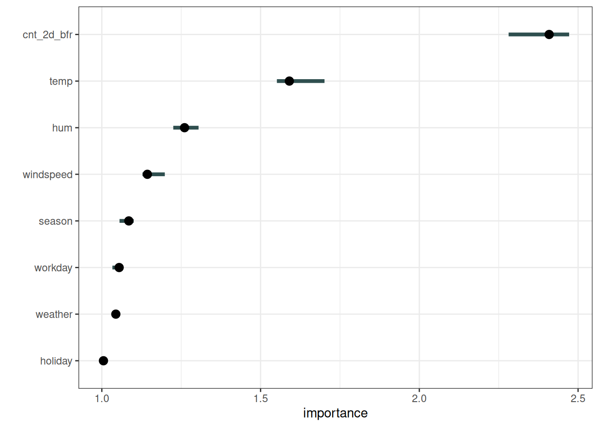
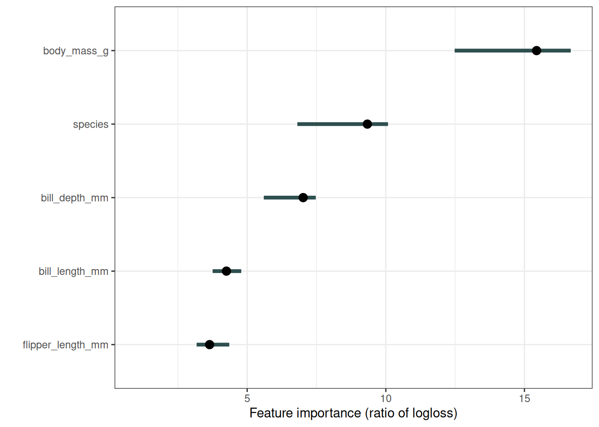
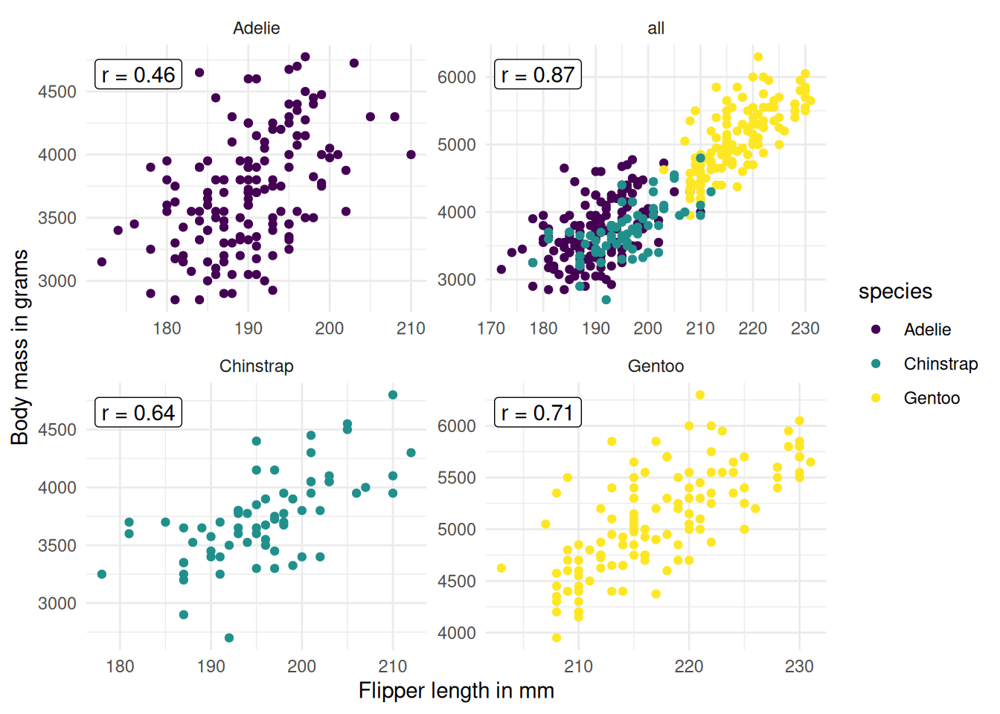
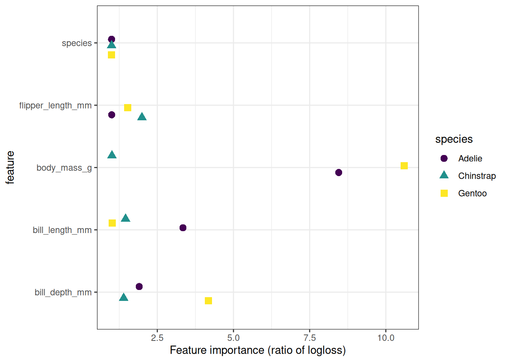

# فصل ۲۳: اهمیت ویژگی با جایگشت

> **عنوان اصلی:** Permutation Feature Importance  
> **منبع:** [https://christophm.github.io/interpretable-ml-book/feature-importance.html](https://christophm.github.io/interpretable-ml-book/feature-importance.html)  
> **نویسنده:** Christoph Molnar  
> **مترجم:** مریم محمودی

---

اهمیت ویژگی با جایگشت (Permutation Feature Importance یا PFI) افزایش خطای پیش‌بینی مدل را پس از جایگشت مقادیر یک ویژگی اندازه می‌گیرد؛ فرایندی که رابطهٔ میان آن ویژگی و نتیجهٔ واقعی را از بین می‌برد.

مفهوم بسیار ساده است: یک ویژگی «مهم» است اگر درهم‌ریختن مقادیرش خطای مدل را افزایش دهد، چرا که در این صورت مدل برای پیش‌بینی به آن ویژگی متکی بوده است. برعکس، یک ویژگی «بی‌اهمیت» است اگر درهم‌ریختن مقادیرش تغییری در خطای مدل ایجاد نکند، چرا که مدل آن ویژگی را در پیش‌بینی نادیده گرفته است.

## نظریه

اندازه‌گیری اهمیت ویژگی با جایگشت نخستین بار توسط Breiman (2001) برای جنگل‌های تصادفی (Random Forest) معرفی شد. بر پایهٔ این ایده، Fisher، Rudin و Dominici (2019) نسخه‌ای مدل‌-مستقل از اهمیت ویژگی را پیشنهاد کردند و آن را «وابستگی مدل» (model reliance) نامیدند. آن‌ها همچنین ایده‌های پیشرفته‌تری دربارهٔ اهمیت ویژگی مطرح کردند؛ از جمله نسخه‌ای (مدل‌-خاص) که احتمال وجود مدل‌های پیش‌بینی متعدد با عملکرد مشابه را در نظر می‌گیرد. مطالعهٔ مقالهٔ آن‌ها را توصیه می‌کنم.

الگوریتم اهمیت ویژگی با جایگشت بر اساس Fisher، Rudin و Dominici (2019):

**ورودی:** مدل آموزش‌دیده $\hat{f}$، ماتریس ویژگی $X$، بردار هدف $y$، معیار خطا $L$.

۱. خطای اولیهٔ مدل $e_{\text{orig}} = \frac{1}{n_{\text{test}}} \sum_{i=1}^{n_{\text{test}}} L(y^{(i)}, \hat{f}(x^{(i)}))$ را تخمین بزنید (مثلاً میانگین مجذور خطاها).
۲. برای هر ویژگی $j$:
   - ماتریس ویژگی $X_{\text{perm}}$ را با جایگشت ستون $j$ در دادهٔ $X$ بسازید. این عمل رابطهٔ میان ویژگی $j$ و نتیجهٔ واقعی $y$ را از بین می‌برد.
   - خطای جدید $e_{\text{perm}} = \frac{1}{n_{\text{test}}} \sum_{i=1}^{n_{\text{test}}} L(y^{(i)}, \hat{f}(x_{\text{perm}}^{(i)}))$ را بر اساس پیش‌بینی‌های دادهٔ جایگشت‌یافته تخمین بزنید.
   - اهمیت ویژگی با جایگشت را به صورت نسبت $FI_j = e_{\text{perm}} / e_{\text{orig}}$ یا تفاوت $FI_j = e_{\text{perm}} - e_{\text{orig}}$ محاسبه کنید.
۳. ویژگی‌ها را بر اساس $FI$ به صورت نزولی مرتب کنید.

> **نکته — معکوس کردن معیارهای مثبت**
> می‌توان از PFI با معیارهایی که مقادیر بزرگ‌تر بهتر هستند نیز استفاده کرد، مانند دقت (accuracy) یا AUC. کافی است جای $e_{\text{orig}}$ و $e_{\text{perm}}$ را در نسبت یا تفاوت عوض کنید.

Fisher، Rudin و Dominici (2018) در مقاله‌شان پیشنهاد می‌کنند مجموعه داده را به دو نیمه تقسیم کرده و مقادیر ویژگی $j$ را میان دو نیمه جابه‌جا کنید، به جای اینکه آن را به‌طور کامل جایگشت دهید. اگر دقت کنید، این دقیقاً معادل جایگشت ویژگی $j$ است. برای تخمین دقیق‌تر، می‌توان خطای جایگشت هر ویژگی را از طریق جفت کردن هر نمونه با مقدار ویژگی $j$ تمام نمونه‌های دیگر (به جز خودش) تخمین زد. این روش مجموعه داده‌ای به اندازهٔ $n(n-1)$ می‌سازد و زمان محاسباتی زیادی می‌طلبد. استفاده از روش $n(n-1)$ را تنها در مواردی توصیه می‌کنم که به تخمین‌های بسیار دقیق نیاز دارید.

> **هشدار — از داده‌های آموزش‌ندیده برای PFI استفاده کنید**
> PFI را روی داده‌هایی محاسبه کنید که در آموزش مدل استفاده نشده‌اند، تا از نتایج بیش از حد خوش‌بینانه جلوگیری شود، به‌ویژه در مدل‌های دچار بیش‌برازش. PFI روی داده‌های آموزشی ممکن است به اشتباه ویژگی‌های نامرتبط را به دلیل بیش‌برازش مهم نشان دهد.
>
> برای درک اینکه مدل واقعاً از کدام ویژگی‌ها استفاده کرده، گزینه‌های جایگزین مانند اهمیت SHAP یا اهمیت PDP را در نظر بگیرید که به معیارهای خطا متکی نیستند.

در مثال‌های این فصل، از داده‌های آزمایش برای محاسبهٔ اهمیت ویژگی با جایگشت استفاده شده است.

## مثال و تفسیر

در اولین مثال، مدل ماشین بردار پشتیبان (Support Vector Machine) آموزش‌دیده برای پیش‌بینی تعداد دوچرخه‌های اجاره‌ای بر اساس شرایط آب‌وهوایی و اطلاعات تقویمی را تفسیر می‌کنیم. از میانگین قدرمطلق خطاها به عنوان معیار خطا استفاده می‌شود. شکل ۲۳.۱ نتایج اهمیت ویژگی با جایگشت را نشان می‌دهد. مهم‌ترین ویژگی `cnt_2d_bfr` و کم‌اهمیت‌ترین آن `holiday` بود.

حال به مثال پنگوئن‌ها می‌پردازیم. ۳ مدل رگرسیون لجستیک برای پیش‌بینی جنسیت پنگوئن‌ها آموزش دادم؛ ۲/۳ داده‌ها برای آموزش و ۱/۳ برای محاسبهٔ اهمیت استفاده شد. معیار خطا، log loss است. ویژگی‌هایی که با افزایش خطای مدل به اندازهٔ ۱ (یعنی بدون تغییر) همراه بودند، برای پیش‌بینی جنسیت پنگوئن اهمیتی نداشتند، همان‌طور که شکل ۲۳.۲ نشان می‌دهد.

اهمیت هر ویژگی در پیش‌بینی جنسیت پنگوئن‌ها با مدل‌های رگرسیون لجستیک. مهم‌ترین ویژگی `body_mass_g` بود. جایگشت `body_mass_g` منجر به افزایش ۱۵.۴ برابری خطای طبقه‌بندی شد. اما صبر کنید — چطور `species` هم ویژگی مهمی است، در حالی که در واقع ۳ مدل جداگانه آموزش دادم؟ در اینجا هر ۳ مدل را به عنوان یک Black Box Model در نظر گرفتم. برای این تابع کلی، `species` صرفاً یک ویژگی معمولی به حساب می‌آید که در پشت صحنه داده را تقسیم می‌کند و به سه مدل رگرسیون لجستیک ارجاع می‌دهد.

## اهمیت ویژگی شرطی

مانند تمام روش‌های مدل‌-مستقل، اهمیت ویژگی با جایگشت هنگام وابستگی میان ویژگی‌ها با مشکل مواجه می‌شود. جایگشت، نقاط داده‌ای غیرواقعی یا دست‌کم نامحتمل تولید می‌کند که برای محاسبهٔ اهمیت ویژگی به کار می‌روند — و این ایده‌آل نیست. مشکل اینجاست که نسخهٔ حاشیه‌ای (marginal) PFI وابستگی‌های میان ویژگی‌ها را نادیده می‌گیرد. در مقابل، مفهوم اهمیت شرطی نیز وجود دارد. نسخهٔ شرطی به جای نمونه‌گیری از توزیع حاشیه‌ای $p(x_j)$ (که جایگشت نوعی نمونه‌گیری از آن است)، از توزیع شرطی $p(x_j \mid x_{-j})$ نمونه‌گیری می‌کند و بدین ترتیب نقاط دادهٔ واقع‌گرایانه‌تری تولید می‌کند.

با این حال، نمونه‌گیری از توزیع شرطی دشوار است؛ حتی دشوارتر از خود وظیفهٔ یادگیری ماشین اصلی. اما با فرض‌هایی ساده‌کننده مانند همبستگی خطی میان ویژگی‌ها، می‌توان این مسئله را ساده‌تر کرد. برخی گزینه‌ها برای نمونه‌گیری شرطی:

- محاسبهٔ PFI در زیرگروه‌های داده و تجمیع آن‌ها؛ زیرگروه‌ها بر اساس تقسیم‌بندی روی ویژگی‌های همبسته تعریف می‌شوند (Molnar et al. 2023).
- استفاده از تکنیک‌های تطابق (matching) و برون‌یابی (imputation) برای تولید نمونه از توزیع شرطی (Fisher, Rudin, and Dominici 2019).
- استفاده از knockoff‌ها (Watson and Wright 2021).
- برای جنگل‌های تصادفی، پیاده‌سازی مدل‌-خاص Debeer و Strobl (2020) بر پایهٔ اهمیت اصلی جنگل تصادفی (Breiman 2001) وجود دارد.

اهمیت ویژگی شرطی تفسیر متفاوتی نسبت به PFI حاشیه‌ای دارد:

- PFI افزایش خطا ناشی از از دست دادن اطلاعات یک ویژگی را اندازه می‌گیرد.
- اهمیت شرطی افزایش خطا ناشی از از دست دادن اطلاعات **منحصر به آن ویژگی** را اندازه می‌گیرد — اطلاعاتی که در ویژگی‌های دیگر وجود ندارد.

اهمیت شرطی می‌تواند تفسیر کمی دشوارتر باشد، چرا که به درک وابستگی‌های میان ویژگی‌ها نیز نیاز دارد. از همین رو، رویکرد زیرگروه‌بندی را ترجیح می‌دهم (و مقاله‌ای درباره‌اش نوشته‌ام): محاسبهٔ PFI به تفکیک گروه، امکان حفظ تفسیر حاشیه‌ای را فراهم می‌کند.

> **هشدار — ویژگی‌های همبسته اهمیت شرطی پایین‌تری دارند**
> ویژگی‌های شدیداً وابسته معمولاً اهمیت شرطی بسیار پایینی دارند، حتی اگر مدل از آن‌ها استفاده کند.

## مثال PFI گروهی

به پنگوئن‌ها برمی‌گردیم. از آنجا که PFI ویژگی‌هایی مانند جرم بدن با جایگشت در کل داده محاسبه می‌شود، مقادیر جرم بدن از گونه‌های مختلف با هم مخلوط می‌شوند. اما می‌توان PFI را با تقسیم داده بر اساس گونه و جایگشت جداگانه برای هر زیرمجموعه تطبیق داد؛ به این ترتیب یک PFI به ازای هر ویژگی و هر گونه به دست می‌آید. شکل ۲۳.۳ نشان می‌دهد که زیرگروه‌بندی بر اساس گونه همبستگی را کاهش می‌دهد.

پس اهمیت ویژگی با جایگشت را دوباره، این بار به تفکیک گونه، محاسبه می‌کنیم. یعنی ویژگی‌ها درون هر گونه جایگشت می‌یابند، به طوری که مثلاً جرم بدن یک Gentoo سنگین به یک Adelie سبک‌وزن نسبت داده نمی‌شود. اگرچه گروه‌بندی مشکل همبستگی را کاهش می‌دهد، اما کاملاً حل نمی‌کند، همان‌طور که در شکل ۲۳.۳ می‌بینیم. برای مثال، همچنان ممکن است یک پنگوئن Gentoo با جرم بدن ۴۰۰۰ گرم، طول باله‌ای معادل ۲۳۰ میلی‌متر دریافت کند که یک نقطهٔ دادهٔ غیرواقعی است. پس تفسیر نتایج همچنان با محدودیت‌هایی همراه است. نتایج در شکل ۲۳.۴ نشان داده شده‌اند. تصویر متفاوتی پدیدار می‌شود: جرم بدن برای طبقه‌بندی جنسیت در Gentoo اهمیت بالایی دارد، در Adelie کمتر، و در Chinstrap بسیار کمتر. توجه کنید که برای سه مدل رگرسیون لجستیک، طبیعی است که آن‌ها را سه مدل پیش‌بینی جداگانه بدانیم و برای هر یک PFI مجزا محاسبه کنیم. اما از آنجا که PFI مدل‌-مستقل است، می‌توان همین کار را برای یک جنگل تصادفی که گونه را به عنوان یک ویژگی استفاده می‌کند نیز انجام داد. یا اینکه داده را بر اساس هر متغیر دیگری، حتی متغیرهایی که مدل از آن‌ها استفاده نکرده، به زیرگروه تقسیم کرد.

## نقاط قوت

**تفسیر روشن:** اهمیت ویژگی به معنای افزایش خطای مدل پس از از بین بردن اطلاعات آن ویژگی است.

**فشرده‌سازی رفتار مدل:** اهمیت ویژگی دیدی فشرده و جهانی از رفتار مدل ارائه می‌دهد.

**مفید برای کاوش در داده:** اگر هدف یادگیری دربارهٔ داده باشد و مدل صرفاً ابزاری برای این منظور باشد، PFI گزینهٔ مناسبی است؛ چرا که به عملکرد پیش‌بینی (از طریق تابع خطا) متکی است. اگر ویژگی‌ای برای پیش‌بینی داده نامرتبط باشد ولی مدل همچنان از آن استفاده کند، PFI در انتظار، اهمیت نزدیک به صفر برای آن ویژگی نشان می‌دهد. معیارهای اهمیتی که مبتنی بر خطای پیش‌بینی نیستند — مانند اهمیت SHAP — برای ویژگی‌هایی که صرفاً به بیش‌برازش کمک می‌کنند نیز اثر نشان می‌دهند.

**مقایسه‌پذیری:** استفاده از نسبت خطا به جای تفاوت خطا، مقایسهٔ اهمیت ویژگی‌ها را در مسائل مختلف ممکن می‌سازد.

**در نظر گرفتن تعاملات:** معیار اهمیت به‌طور خودکار تمام تعاملات با ویژگی‌های دیگر را در نظر می‌گیرد. با جایگشت یک ویژگی، اثرات تعامل آن با ویژگی‌های دیگر نیز از بین می‌روند. به این ترتیب، PFI هم اثر اصلی ویژگی و هم اثرات تعاملی آن روی عملکرد مدل را لحاظ می‌کند. البته این ویژگی یک محدودیت نیز هست؛ زیرا اهمیت تعامل میان دو ویژگی در اهمیت هر دو آن‌ها محاسبه می‌شود. بنابراین جمع اهمیت‌های ویژگی با کاهش کل عملکرد برابر نیست، بلکه از آن بیشتر است. تنها در صورت نبود تعامل — مانند مدل خطی — اهمیت‌ها به‌طور تقریبی با هم جمع می‌شوند.

**بدون نیاز به آموزش مجدد:** اهمیت ویژگی با جایگشت نیازی به آموزش مجدد مدل ندارد. برخی روش‌های دیگر پیشنهاد می‌کنند ویژگی را حذف کرده، مدل را دوباره آموزش دهید و سپس خطای مدل را مقایسه کنید. از آنجا که آموزش مجدد یک مدل یادگیری ماشین ممکن است زمان زیادی ببرد، «صرفاً» جایگشت یک ویژگی در وقت صرفه‌جویی قابل توجهی ایجاد می‌کند.

## محدودیت‌ها

**وابستگی به خطای مدل:** اهمیت ویژگی با جایگشت به خطای مدل گره خورده است. این لزوماً بد نیست، اما در برخی موارد آنچه نیاز دارید نیست. گاهی ترجیح می‌دهید بدانید خروجی مدل در برابر تغییر یک ویژگی چقدر تغییر می‌کند، بدون در نظر گرفتن تأثیر آن بر عملکرد. برای مثال، می‌خواهید بدانید خروجی مدل در برابر دستکاری ویژگی‌ها چقدر مقاوم است. در این حالت، واریانس خروجی مدل که توسط هر ویژگی توضیح داده می‌شود مورد نظر است، نه کاهش عملکرد پس از جایگشت. واریانس مدل (توضیح‌داده‌شده توسط ویژگی‌ها) و اهمیت ویژگی زمانی که مدل به‌خوبی تعمیم می‌یابد (یعنی بیش‌برازش ندارد) همبستگی قوی دارند.

**عدم بیان چگونگی تأثیر:** اهمیت ویژگی نشان نمی‌دهد که ویژگی چگونه روی پیش‌بینی تأثیر می‌گذارد، بلکه تنها نشان می‌دهد چقدر روی تابع خطا تأثیر دارد. حتی اگر اهمیت یک ویژگی را بدانید، نمی‌دانید: آیا افزایش ویژگی، پیش‌بینی را افزایش می‌دهد؟ آیا تعاملی با ویژگی‌های دیگر وجود دارد؟ اهمیت ویژگی صرفاً یک رتبه‌بندی است.

**نیاز به نتایج واقعی:** باید به نتایج واقعی دسترسی داشته باشید. اگر کسی تنها مدل و داده‌های بدون برچسب در اختیار شما بگذارد — و نه نتیجهٔ واقعی — نمی‌توانید اهمیت ویژگی با جایگشت را محاسبه کنید.

**تصادفی بودن:** اهمیت ویژگی با جایگشت به درهم‌ریختن ویژگی وابسته است که تصادفی بودنی به اندازه‌گیری اضافه می‌کند. با تکرار جایگشت، نتایج ممکن است تفاوت زیادی داشته باشند. تکرار جایگشت و میانگین‌گیری از اهمیت‌ها در طول تکرارها، معیار را پایدارتر می‌کند، اما زمان محاسبه را افزایش می‌دهد.

**مشکل همبستگی ویژگی‌ها:** اگر ویژگی‌ها با یکدیگر همبسته باشند، اهمیت ویژگی با جایگشت می‌تواند به دلیل نمونه‌های دادهٔ غیرواقعی، جانب‌دارانه (biased) باشد. این مشکل همانند نمودارهای وابستگی جزئی (Partial Dependence Plot) است: جایگشت ویژگی‌ها هنگامی که دو یا چند ویژگی همبسته هستند، نمونه‌های دادهٔ نامحتمل تولید می‌کند. وقتی همبستگی مثبت وجود داشته باشد (مانند قد و وزن یک فرد) و یکی از آن‌ها جایگشت بیابد، نمونه‌های جدیدی تولید می‌شوند که نامحتمل یا حتی از نظر فیزیکی غیرممکن هستند (مثلاً فردی ۲ متری با وزن ۳۰ کیلوگرم)، اما برای اندازه‌گیری اهمیت از همین نمونه‌ها استفاده می‌شود. به عبارت دیگر، برای اهمیت ویژگی‌های همبسته، می‌سنجیم عملکرد مدل چقدر کاهش می‌یابد وقتی ویژگی را با مقادیری جایگزین می‌کنیم که هرگز در واقعیت مشاهده نخواهیم کرد. پیش از استفاده، همبستگی میان ویژگی‌ها را بررسی کرده و در تفسیر نتایج احتیاط نمایید. توجه داشته باشید که همبستگی‌های دوتایی ممکن است برای آشکار کردن همهٔ مشکلات کافی نباشند.

**تقسیم اهمیت میان ویژگی‌های همبسته:** افزودن یک ویژگی همبسته می‌تواند اهمیت ویژگی مرتبط را با تقسیم اهمیت میان هر دو کاهش دهد. مثالی برای روشن شدن مفهوم «تقسیم» اهمیت ویژگی: می‌خواهیم احتمال بارش باران را پیش‌بینی کنیم و از دمای ساعت ۸ صبح روز قبل به همراه ویژگی‌های ناهمبسته دیگر استفاده می‌کنیم. یک جنگل تصادفی آموزش می‌دهم و مشخص می‌شود دما مهم‌ترین ویژگی است و همه چیز خوب است. حالا سناریوی دیگری را تصور کنید که در آن دمای ساعت ۹ صبح را هم اضافه می‌کنم — ویژگی‌ای که شدیداً با دمای ۸ صبح همبسته است. دمای ۹ صبح اطلاعات زیادی به دمای ۸ صبح اضافه نمی‌کند، اما داشتن ویژگی‌های بیشتر همیشه خوب است، درست است؟ حال یک جنگل تصادفی با دو ویژگی دما و ویژگی‌های ناهمبسته آموزش می‌دهم. برخی درخت‌های جنگل از دمای ۸ صبح استفاده می‌کنند، برخی از دمای ۹ صبح، برخی از هر دو، و برخی از هیچکدام. دو ویژگی دما با هم کمی اهمیت بیشتری نسبت به ویژگی دمای تکی دارند، اما به جای اینکه در صدر فهرست باشند، هر یک در جایی در میانه قرار می‌گیرند. با اضافه کردن یک ویژگی همبسته، مهم‌ترین ویژگی از صدر رتبه‌بندی به میانه افتاد. از یک طرف، این منطقی است، چرا که رفتار مدل پایه‌ای — اینجا جنگل تصادفی — را منعکس می‌کند؛ دمای ۸ صبح کم‌اهمیت‌تر شده زیرا مدل اکنون می‌تواند به دمای ۹ صبح هم متکی باشد. از طرف دیگر، تفسیر اهمیت ویژگی را به‌طور قابل توجهی دشوارتر می‌کند. تصور کنید می‌خواهید ویژگی‌ها را از نظر خطای اندازه‌گیری بررسی کنید. این بررسی پرهزینه است و تصمیم می‌گیرید فقط ۳ ویژگی مهم‌تر را چک کنید. در حالت اول، دما را بررسی می‌کنید؛ در حالت دوم، هیچ ویژگی دمایی را انتخاب نمی‌کنید چون اهمیت‌شان تقسیم شده است. حتی اگر مقادیر اهمیت از نظر رفتار مدل منطقی باشند، وجود ویژگی‌های همبسته سردرگم‌کننده است.

## نرم‌افزار و جایگزین‌ها

برای مثال‌ها از پکیج R به نام `iml` استفاده شده است. پکیج‌های R به نام‌های `DALEX` و `vip`، و کتابخانه‌های Python به نام‌های `alibi`، `eli5`، `scikit-learn` و `rfpimp` نیز اهمیت ویژگی با جایگشت مدل‌-مستقل را پیاده‌سازی کرده‌اند.

الگوریتمی به نام PIMP، الگوریتم اهمیت ویژگی با جایگشت را برای ارائهٔ p-value برای اهمیت‌ها تطبیق می‌دهد. جایگزین دیگری مبتنی بر تابع خطا، LOFO است که ویژگی را از داده‌های آموزشی حذف می‌کند، مدل را دوباره آموزش می‌دهد و افزایش خطا را اندازه می‌گیرد. جایگشت یک ویژگی و اندازه‌گیری افزایش خطا تنها راه سنجش اهمیت ویژگی نیست. معیارهای مختلف اهمیت را می‌توان به روش‌های مدل‌-خاص و مدل‌-مستقل تقسیم کرد. اهمیت Gini برای جنگل‌های تصادفی، یا ضرایب رگرسیون استانداردشده برای مدل‌های رگرسیونی، نمونه‌هایی از معیارهای مدل‌-خاص هستند.

جایگزین مدل‌-مستقل برای اهمیت ویژگی با جایگشت، معیارهای مبتنی بر واریانس هستند. معیارهای اهمیت ویژگی مبتنی بر واریانس مانند شاخص‌های Sobol یا ANOVA تابعی (functional ANOVA)، اهمیت بیشتری به ویژگی‌هایی می‌دهند که واریانس بالایی در تابع پیش‌بینی ایجاد می‌کنند. اهمیت SHAP نیز شباهت‌هایی به معیار مبتنی بر واریانس دارد. اگر تغییر یک ویژگی خروجی را به شدت تغییر دهد، آن ویژگی مهم است. این تعریف از اهمیت با تعریف مبتنی بر تابع خطا — مانند اهمیت ویژگی با جایگشت — تفاوت دارد. این تفاوت در مواردی که مدل دچار بیش‌برازش است آشکار می‌شود: اگر مدل بیش‌برازش داشته باشد و از ویژگی نامرتبط با خروجی استفاده کند، اهمیت ویژگی با جایگشت اهمیت صفر به آن ویژگی می‌دهد، چرا که این ویژگی در تولید پیش‌بینی‌های درست سهمی ندارد. اما یک معیار مبتنی بر واریانس ممکن است اهمیت بالایی به آن ویژگی بدهد، چرا که با تغییر ویژگی، پیش‌بینی نیز تغییر می‌کند.

مروری جامع بر تکنیک‌های مختلف اهمیت‌سنجی در مقالهٔ Wei، Lu و Song (2015) ارائه شده است.
