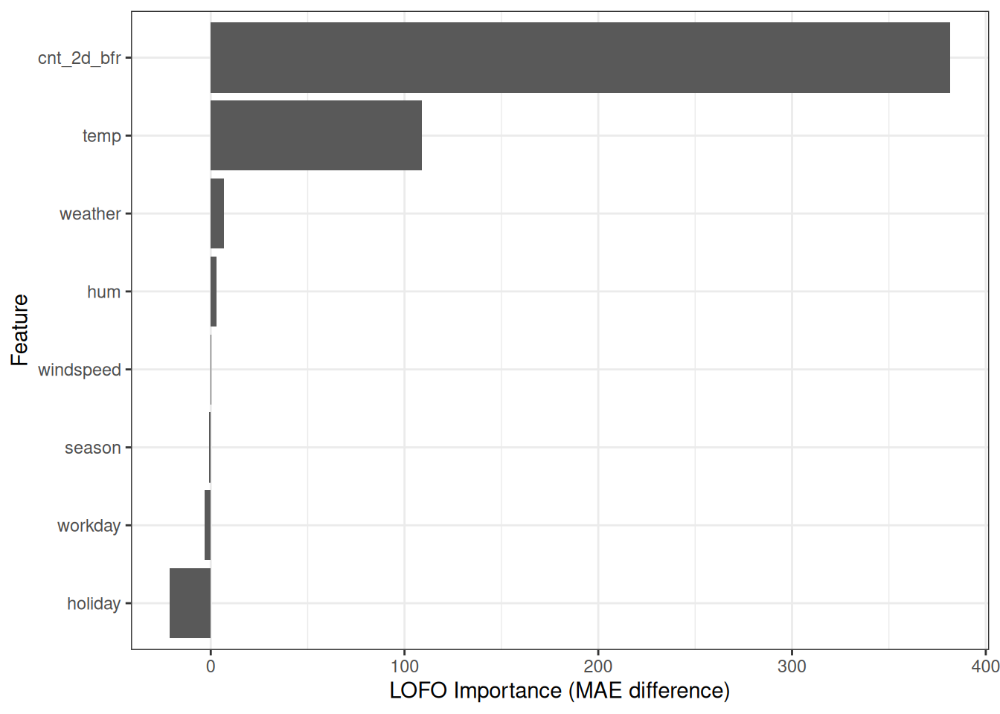
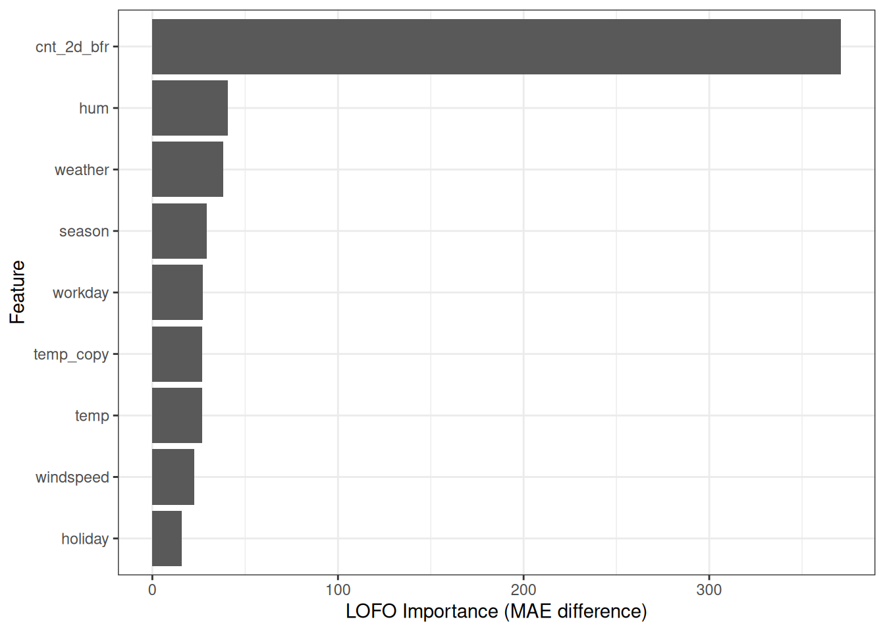
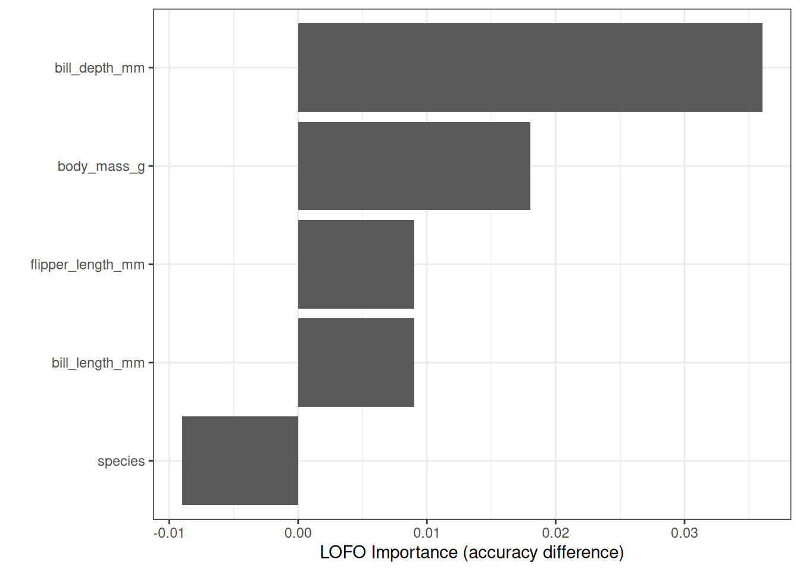

# فصل ۲۴: اهمیت حذف یک ویژگی (LOFO)

> **عنوان اصلی:** Leave One Feature Out (LOFO) Importance  
> **منبع:** [https://christophm.github.io/interpretable-ml-book/lofo.html](https://christophm.github.io/interpretable-ml-book/lofo.html)  
> **نویسنده:** Christoph Molnar  
> **مترجم:** مریم محمودی

---

اهمیت حذف یک ویژگی (LOFO Importance) با بازآموزش مدل بدون یک ویژگی و مقایسه عملکرد پیش‌بینی اندازه می‌گیرد که آن ویژگی چقدر اهمیت دارد.[^1]

شهود پشت LOFO این است: اگر حذف یک ویژگی باعث افت عملکرد پیش‌بینی شود، آن ویژگی مهم بوده است. اگر حذفش تغییری ایجاد نکند، اهمیتی نداشته است. اهمیت LOFO حتی می‌تواند منفی باشد، یعنی حذف ویژگی عملکرد مدل را بهبود می‌بخشد. از آنجا که الگوریتم مدل جدیدی آموزش می‌بیند، افت عملکرد مشروط بر سایر ویژگی‌های باقیمانده در مدل است، همان‌طور که در مثال‌ها خواهیم دید.

برای محاسبه اهمیت LOFO برای تمام $p$ ویژگی، باید مدل را $p$ بار بازآموزش دهیم؛ هر بار با یک ویژگی متفاوت حذف‌شده از داده‌های آموزشی، و سپس عملکرد مدل جدید را روی داده‌های آزمایش اندازه بگیریم. همین سادگی است که LOFO را به یک الگوریتم سرراست تبدیل می‌کند. الگوریتم را به صورت رسمی بیان می‌کنیم:

**ورودی:** مدل آموزش‌دیده $\hat{f}$، داده‌های آموزشی $D\_{train}$، داده‌های آزمایش $D\_{test}$، و معیار خطا $L$.

**رویه:**

۱. خطای مدل اصلی را اندازه بگیرید:

$$e\_{orig} = L(\hat{f}, D\_{test})$$

۲. برای هر ویژگی $j$:

   - ویژگی $j$ را از مجموعه داده حذف کنید و مجموعه‌های داده جدید $D\_{train}^{-j}$ و $D\_{test}^{-j}$ بسازید.
   - مدل جدید $\hat{f}^{-j}$ را روی $D\_{train}^{-j}$ آموزش دهید.
   - خطای جدید را روی مجموعه آزمایش تغییریافته اندازه بگیرید:

$$e^{-j} = L(\hat{f}^{-j}, D\_{test}^{-j})$$

   - اهمیت LOFO هر ویژگی را محاسبه کنید.

به صورت نسبت:

$$\text{LOFO}^{(j)} = \frac{e^{-j}}{e\_{orig}}$$

یا به صورت تفاضل:

$$\text{LOFO}^{(j)} = e^{-j} - e\_{orig}$$

۳. ویژگی‌ها را بر اساس اهمیت $\text{LOFO}^{(j)}$ به صورت نزولی مرتب و نمایش دهید.

هنگام استفاده از معیارهای عملکرد به جای معیارهای خطا — مانند دقت که مقدار بزرگ‌تر بهتر است — مطمئن شوید که تفاضل را در منفی یک ضرب کنید، یا ترتیب صورت و مخرج کسر را جابجا کنید. برای آموزش و بازآموزش مدل از داده‌های آموزشی، و برای اندازه‌گیری عملکرد از داده‌های آزمایش استفاده کنید.

## مثال‌ها

تعداد اجاره دوچرخه را بر اساس اطلاعات آب‌وهوایی و تقویمی پیش‌بینی می‌کنیم؛ یک Random Forest (جنگل تصادفی) روی ۲/۳ داده‌ها آموزش دیده است. شکل ۲۴.۱ نشان می‌دهد که دما و تعداد اجاره قبلی دوچرخه، مهم‌ترین ویژگی‌ها طبق LOFO هستند. ویژگی تعطیلات اهمیت منفی دارد که پیامدی برای انتخاب ویژگی (feature selection) دارد: بر اساس نحوه کار الگوریتمی LOFO، اکنون می‌دانیم که حذف ویژگی تعطیلات عملکرد مدل را بهبود می‌بخشد.

حال آزمایشی انجام می‌دهیم. برای شبیه‌سازی نسخه‌ای افراطی از ویژگی‌های همبسته، یک مجموعه داده دوچرخه جدید ساختم که دو ستون دما دارد: temp و temp_copy. همان‌طور که حدس می‌زنید، temp_copy دقیقاً همان مقادیر temp را دارد، یعنی همبستگی ۱۰۰٪. دوباره یک Random Forest روی این مجموعه داده جدید آموزش دادم. ببینیم اهمیت‌های LOFO چه تغییری می‌کنند.

شکل ۲۴.۲ پدیده جالبی نشان می‌دهد: اهمیت‌های LOFO هر دو ویژگی دما اکنون تقریباً صفر است.[^2] اما اگر مثلاً temp_copy را حذف کنیم، به مدل اصلی می‌رسیم که در آن دما مهم‌ترین ویژگی بود. واضح است که نتیجه‌گیری درباره اینکه این مدل جدید اصلاً به دما وابسته نیست، اشتباه خواهد بود. هر دو ویژگی temp و temp_copy اهمیت پایینی می‌گیرند؛ چون طبق تعریف LOFO، مهم نیستند. وقتی ویژگی temp را حذف می‌کنیم، هیچ اطلاعاتی از دست نمی‌رود، زیرا temp_copy همان اطلاعات را نگه می‌دارد. LOFO تفسیر شرطی دارد: با توجه به سایر ویژگی‌ها، حذف یک ویژگی چقدر عملکرد پیش‌بینی مدل را بدتر می‌کند؟ نتیجه‌گیری‌ها:

- اهمیت LOFO ویژگی‌های کاملاً همبسته همیشه پایین است و حتی می‌تواند منفی باشد،[^3] زیرا اهمیت LOFO باید مشروط بر اطلاعات سایر ویژگی‌ها تفسیر شود. اگر یک ویژگی دما در داده‌ها دارید، نسخه کاملاً یکسان آن اطلاعات جدید مهمی به حساب نمی‌آید.
- وقتی از اهمیت LOFO برای انتخاب ویژگی استفاده می‌کنید، مراقب تفسیر باشید: LOFO فقط نشان می‌دهد که عملکرد مدل به حذف تک‌تک ویژگی‌ها چه واکنشی نشان می‌دهد. همان‌طور که شکل ۲۴.۲ نشان داد، LOFO اطلاعاتی درباره تغییر عملکرد هنگام حذف همزمان ۲ یا بیشتر ویژگی ارائه نمی‌دهد.

با این دانش، LOFO را برای یک Random Forest که جنسیت پنگوئن را از اندازه‌های بدن پیش‌بینی می‌کند امتحان می‌کنیم. یک Random Forest روی ۲/۳ داده‌ها آموزش داده‌ام و ۱/۳ باقیمانده را برای تخمین خطا کنار گذاشته‌ام. شکل ۲۴.۳ نشان می‌دهد که عمق منقار مهم‌ترین ویژگی طبق LOFO بوده است.

توجه داشته باشید که چون از دقت استفاده کردم (که مقدار بزرگ‌تر بهتر است)، اهمیت را در منفی یک ضرب کردم. LOFO همچنین نشان می‌دهد که می‌توان ویژگی‌های species و flipper_length را بدون مشکل حذف کرد. با این حال، نگه داشتن species ضروری است، زیرا مدل باید بتواند بین گونه‌های مختلف تمایز قائل شود.

## LOFO در برابر PFI

LOFO با سایر روش‌های ارائه‌شده در این کتاب متفاوت است، زیرا اکثر روش‌های دیگر نیازی به بازآموزش مدل ندارند. می‌توان گفت LOFO یک روش پس‌از‌آموزش (post-hoc) و مدل‌آزاد (model-agnostic) است؛ چون روی هر مدلی قابل اعمال است و بازآموزش، مدل اصلی موردنظر را تغییر نمی‌دهد. اما به دلیل بازآموزش، تفسیر از تحلیل یک مدل واحد به تفسیر الگوریتم یادگیری و نحوه واکنش آموزش مدل به تغییرات ویژگی‌ها تغییر می‌کند.

به نظر من، بزرگ‌ترین سؤال این است: LOFO چه تفاوتی با PFI دارد و کِی باید از کدام استفاده کرد؟ ابتدا شباهت‌ها: هر دو PFI و LOFO معیارهای اهمیت مبتنی بر عملکرد هستند؛ هر دو اهمیت را با «حذف» اطلاعات یک ویژگی محاسبه می‌کنند، هرچند به روش‌های متفاوت؛ و هر دو در ساده‌ترین نسخه‌شان به صورت یک‌به‌یک عمل می‌کنند. اما در جنبه‌های دیگری با هم فرق دارند. همان‌طور که در شکل ۲۴.۲ دیدیم، LOFO تفسیر شرطی از اهمیت دارد و فقط ارزش پیش‌بینی اضافی یک ویژگی را نشان می‌دهد. این ویژگی، LOFO را از PFI حاشیه‌ای (marginal PFI) متمایز می‌کند. LOFO بیشتر شبیه PFI شرطی (conditional PFI) است و هر دو تفسیرهایی مشروط بر سایر ویژگی‌ها دارند.

اما از آنجا که PFI شرطی و LOFO به شیوه‌های متفاوتی کار می‌کنند، در تفسیرهایشان نیز تفاوت دارند. PFI شرطی تفسیری است که تنها مدل موردنظر را در بر می‌گیرد. اهمیت LOFO بیشتر بر الگوریتم یادگیری ماشین تمرکز دارد، زیرا شامل بازآموزش است و تفسیر حالا چندین مدل با آموزش‌های متفاوت را دربر می‌گیرد. این بدان معناست که اهمیت LOFO تحت تأثیر نحوه برخورد الگوریتم با یک مجموعه داده فاقد آن ویژگی قرار می‌گیرد. یک الگوریتم درخت تصمیم ممکن است درخت کاملاً متفاوتی تولید کند. بنابراین تفسیر LOFO هم درباره مدل موردنظر است و هم درباره الگوریتم یادگیری ماشین و نحوه واکنش آن به حذف یک ویژگی.

## نقاط قوت

**پیاده‌سازی LOFO ساده است.** مثال‌های این فصل دقیقاً با همین رویکرد ساخته شده‌اند. می‌توانید خودتان آن را پیاده‌سازی کنید و نیازی به هیچ بسته‌ای ندارید.

LOFO **برای انتخاب ویژگی مفید است:** یک ویژگی با اهمیت LOFO زیر صفر را می‌توان حذف کرد تا عملکرد مدل بهبود یابد؛ یک ویژگی با اهمیت صفر نیز بدون تأثیر بر عملکرد قابل حذف است. با این حال، توجه داشته باشید که LOFO تحت تأثیر تصادفی بودن فرآیند آموزش و نمونه داده قرار دارد. مطمئن شوید که هر بار تنها یک ویژگی را بر اساس نتایج LOFO حذف می‌کنید. اگر می‌خواهید دو ویژگی را حذف کنید، باید این کار را به صورت متوالی انجام دهید: اهمیت LOFO را محاسبه کنید، ویژگی کم‌اهمیت را حذف کنید، LOFO را دوباره محاسبه کنید، و دوباره کم‌اهمیت‌ترین را حذف کنید. همچنین می‌توانید LOFO را به LTFO (حذف دو ویژگی) گسترش دهید تا اهمیت مشترک را محاسبه کنید. سایر روش‌های اهمیت‌سنجی، مانند PFI یا اهمیت SHAP، مستقیماً اطلاعات کاربردی برای انتخاب ویژگی ارائه نمی‌دهند.

LOFO **برخلاف برخی روش‌ها مانند PFI حاشیه‌ای، داده‌های غیرواقع‌بینانه تولید نمی‌کند**؛ زیرا ویژگی را حذف می‌کند و مدل را با داده‌های نمونه‌برداری‌شده جدید آزمایش نمی‌کند.

LOFO **در مرحله مدل‌سازی به دلیل بینش‌های کاربردی برای انتخاب ویژگی مفید است.** همچنین وقتی تمرکز بیشتر بر **درک پدیده زیربنایی** باشد تا خود مدل، ارزش دارد. با این حال، توجه داشته باشید که نحوه واکنش الگوریتم خاص به حذف ویژگی‌ها نیز بر مقادیر اهمیت LOFO تأثیر می‌گذارد.

LOFO زمانی معنا می‌دهد که هدف تفسیر، فهمیدن پدیده (نه خود مدل) یا رفتار الگوریتم یادگیری باشد.

## محدودیت‌ها

**LOFO پرهزینه است:** برای محاسبه اهمیت LOFO همه ویژگی‌ها، باید مدل را $p$ بار بازآموزش دهید. این می‌تواند گران‌قیمت باشد، به‌ویژه در مقایسه با اهمیت ویژگی با جایگشت (PFI).

LOFO **بهترین روش برای درک یک مدل خاص نیست.** در سناریوی ممیزی مدل، LOFO مناسب نیست، زیرا تفسیر بر پایه آموزش مدل‌های جدید است. یعنی نتایج نه‌تنها بر مدل موردبررسی بلکه بر سایر مدل‌های تولیدشده توسط الگوریتم یادگیری ماشین نیز مبتنی‌اند و باید در قالب رفتار الگوریتم تفسیر شوند.

همچنین **کمی مبهم است که چگونه باید تنظیم هایپرپارامترها (hyperparameter tuning) را مدیریت کرد:** آیا باید با همان هایپرپارامترهای اولیه آموزش داد، یا بهینه‌سازی هایپرپارامترها را از نو اجرا کرد؟ ثابت نگه داشتن هایپرپارامترها از نظر محاسباتی ارزان‌تر است و تمرکز LOFO را بیشتر به سمت همان مدل می‌برد، زیرا مدل‌های جدید احتمالاً به آن شبیه‌تر خواهند بود. اجرای بهینه‌سازی هایپرپارامترها برای هر یک از $p$ مدل پرهزینه است، اما نتایج LOFO را برای انتخاب ویژگی و کشف روابط میان ویژگی‌ها و متغیر هدف اطلاعات‌رسان‌تر می‌کند، زیرا عدم‌قطعیت ناشی از خطاهای مدل کاهش می‌یابد.

**ویژگی‌های کاملاً همبسته اهمیت LOFO پایینی می‌گیرند.** این نتیجه طبیعی نحوه کار LOFO است، اما دامی است که هنگام نگاه به نمودارهای اهمیت به‌راحتی فراموش می‌شود. پیش از تفسیر اهمیت‌های LOFO، بررسی ساختار همبستگی داده‌ها ضروری است. همچنین می‌توانید ویژگی‌های کاملاً همبسته را گروه‌بندی کنید و آن‌ها را با هم حذف کنید تا تفسیر از شرطی به حاشیه‌ای تبدیل شود.

## نرم‌افزار و جایگزین‌ها

LOFO یک [پیاده‌سازی پایتون](https://github.com/aerdem4/lofo-importance) دارد. البته این الگوریتمی است که به‌راحتی می‌توانید خودتان پیاده‌سازی کنید.

جایگزین LOFO، PFI شرطی است. همچنین می‌توان به جای حذف ویژگی، نسخه جایگشت‌یافته آن را اضافه کرد و سپس مدل جدیدی آموزش داد. این رویکرد مزیت مقایسه دو مدل با تعداد ویژگی یکسان را دارد، اما منبع دیگری از عدم‌قطعیت معرفی می‌کند (زیرا خود جایگشت تصادفی است).

روش انتخاب ویژگی «انتخاب ویژگی متوالی رو به عقب» (backward sequential feature selection) اساساً همان LOFO است که با حذف متوالی ویژگی‌ها ترکیب شده است.

---

[^1]: اولین توصیف رسمی LOFO که از آن آگاهم، توسط Lei و همکاران (۲۰۱۸) ارائه شده است. آن‌ها این روش را Leave One Covariate Out (LOCO) می‌نامند و مقاله عمدتاً درباره آزمون توزیع‌آزاد (distribution-free testing) است.

[^2]: ویژگی‌های temp و temp_copy اهمیت‌های LOFO مشابه اما نه برابر دارند که به دلیل تصادفی بودن فرآیند آموزش مدل است.

[^3]: در اینجا باید فرض کنیم که الگوریتم یادگیری با تکیه بیشتر بر سایر ویژگی‌ها می‌تواند حذف یک ویژگی را جبران کند. از هیچ الگوریتم یادگیری ماشینی که این توانایی را نداشته باشد آگاه نیستم.
