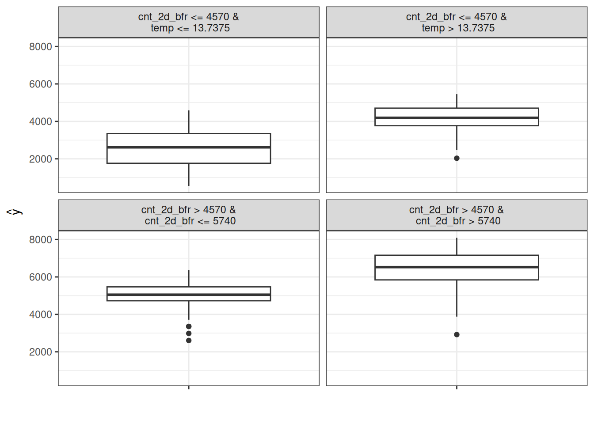
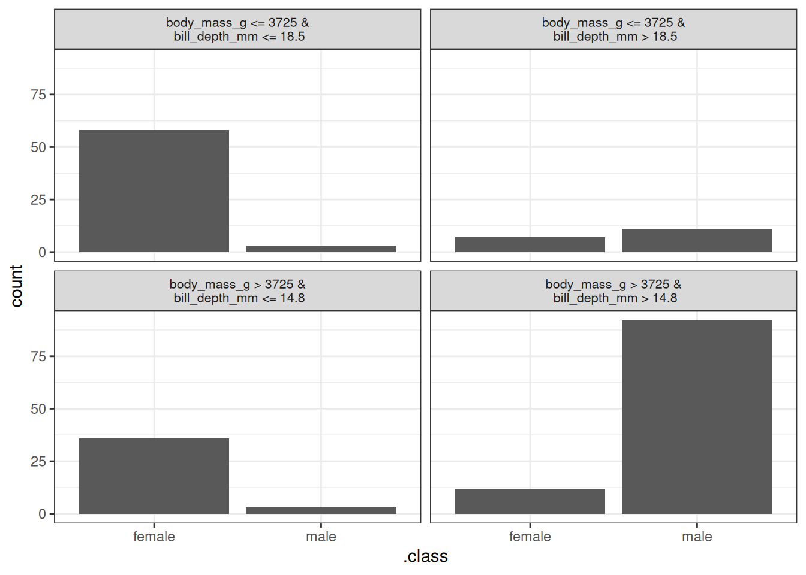

# فصل ۲۵: مدل‌های نیابتی (Surrogate Models)

> **عنوان اصلی:** Global Surrogate Models  
> **منبع:** [https://christophm.github.io/interpretable-ml-book/global.html](https://christophm.github.io/interpretable-ml-book/global.html)  
> **نویسنده:** Christoph Molnar  
> **مترجم:** مریم محمودی

---

مدل نیابتی سراسری (Global Surrogate Model) یک مدل تفسیرپذیر است که برای تقریب پیش‌بینی‌های یک مدل جعبه سیاه آموزش می‌بیند. با تفسیر مدل نیابتی می‌توان نتیجه‌گیری‌هایی درباره مدل جعبه سیاه به دست آورد. حل مسئله تفسیرپذیری یادگیری ماشین از طریق یادگیری ماشین بیشتر!

## نظریه

مدل‌های نیابتی در مهندسی نیز کاربرد دارند: هرگاه اندازه‌گیری یک خروجی مورد نظر هزینه‌بر، زمان‌بر یا به هر دلیلی دشوار باشد (مثلاً هنگامی که از یک شبیه‌سازی پیچیده رایانه‌ای به دست می‌آید)، می‌توان به جای آن از یک مدل نیابتی سریع و ارزان استفاده کرد. تفاوت مدل‌های نیابتی در مهندسی با مدل‌های نیابتی در یادگیری ماشین تفسیرپذیر در این است که مدل پایه یک مدل یادگیری ماشین است (نه یک شبیه‌سازی) و مدل نیابتی باید تفسیرپذیر باشد. هدف از مدل‌های نیابتی (تفسیرپذیر) آن است که پیش‌بینی‌های مدل پایه را تا حد ممکن دقیق تقریب بزنند و در عین حال تفسیرپذیر باشند. ایده مدل‌های نیابتی با نام‌های مختلفی مطرح می‌شود: مدل تقریبی (Approximation model)، فرامدل (Metamodel)، مدل سطح پاسخ (Response surface model)، شبیه‌ساز (Emulator) و غیره.

درباره نظریه: در واقع برای درک مدل‌های نیابتی نیاز به دانش نظری زیادی نیست. هدف این است که تابع پیش‌بینی مدل جعبه سیاه $f$ را تا حد ممکن با تابع پیش‌بینی مدل نیابتی $g$ تقریب بزنیم، با این قید که $g$ تفسیرپذیر باشد. برای $g$ می‌توان از هر مدل تفسیرپذیری استفاده کرد.

برای نمونه، یک مدل خطی:

$$g(\mathbf{x}) = \beta_0 + \beta_1 x_1 + \ldots + \beta_p x_p$$

یا یک درخت تصمیم:

$$g(\mathbf{x}) = \sum_{m=1}^M c_m I\{\mathbf{x} \in R_m\}$$

آموزش مدل نیابتی یک روش مستقل از مدل (Model-agnostic) است، چرا که نیازی به اطلاع از ساختار داخلی مدل جعبه سیاه ندارد و تنها دسترسی به داده و تابع پیش‌بینی کافی است. اگر مدل یادگیری ماشین پایه با مدل دیگری جایگزین شود، می‌توان همچنان از روش نیابتی استفاده کرد. انتخاب نوع مدل جعبه سیاه و نوع مدل نیابتی از یکدیگر مستقل است.

برای به دست آوردن یک مدل نیابتی، مراحل زیر را طی کنید:

۱. یک مجموعه داده $\mathbf{X}$ انتخاب کنید. این می‌تواند همان مجموعه داده‌ای باشد که برای آموزش مدل جعبه سیاه استفاده شده، یا مجموعه‌ای جدید از همان توزیع. بسته به کاربرد، می‌توان زیرمجموعه‌ای از داده‌ها یا یک شبکه از نقاط را انتخاب کرد.
۲. برای مجموعه داده $\mathbf{X}$، پیش‌بینی‌های مدل جعبه سیاه را به دست آورید.
۳. یک نوع مدل تفسیرپذیر انتخاب کنید (مدل خطی، درخت تصمیم و ...).
۴. مدل تفسیرپذیر را روی مجموعه داده $\mathbf{X}$ و پیش‌بینی‌های آن آموزش دهید.
۵. تبریک! اکنون یک مدل نیابتی دارید.
۶. بسنجید که مدل نیابتی تا چه حد پیش‌بینی‌های مدل جعبه سیاه را بازتولید می‌کند.
۷. مدل نیابتی را تفسیر کنید.

ممکن است با رویکردهایی برای مدل‌های نیابتی روبه‌رو شوید که گام‌های اضافی دارند یا اندکی متفاوتند، اما ایده کلی معمولاً همان چیزی است که در اینجا توضیح داده شد.

یکی از روش‌های سنجش کیفیت تقریب مدل نیابتی نسبت به مدل جعبه سیاه، معیار R-مجذور (R-squared) است:

$$R^2=1 - \frac{SSE}{SST} = 1 - \frac{\sum_{i=1}^n (\hat{y}_*^{(i)} - \hat{y}^{(i)})^2}{\sum_{i=1}^n (\hat{y}^{(i)} - \bar{\hat{y}})^2}$$

که در آن $\hat{y}_*^{(i)}$ پیش‌بینی مدل نیابتی برای نمونه $i$-ام، $\hat{y}^{(i)}$ پیش‌بینی مدل جعبه سیاه، و $\bar{\hat{y}}$ میانگین پیش‌بینی‌های مدل جعبه سیاه است. SSE مخفف مجموع مربعات خطا (Sum of Squares Error) و SST مخفف مجموع مربعات کل (Sum of Squares Total) است. معیار R-مجذور را می‌توان به صورت درصد واریانسی تفسیر کرد که مدل نیابتی توضیح می‌دهد. اگر R-مجذور به ۱ نزدیک باشد (یعنی SSE پایین باشد)، مدل تفسیرپذیر رفتار مدل جعبه سیاه را بسیار خوب تقریب می‌زند. در این حالت، شاید بتوان مدل پیچیده را با مدل تفسیرپذیر جایگزین کرد. اگر R-مجذور به صفر نزدیک باشد (یعنی SSE بالا باشد)، مدل تفسیرپذیر در توضیح مدل جعبه سیاه ناموفق است.

توجه داشته باشید که در اینجا هیچ بحثی درباره عملکرد مدل جعبه سیاه پایه، یعنی کیفیت پیش‌بینی خروجی واقعی، مطرح نشده است. عملکرد مدل جعبه سیاه در آموزش مدل نیابتی نقشی ندارد. تفسیر مدل نیابتی همچنان معتبر است، زیرا گزاره‌هایی درباره مدل بیان می‌کند، نه درباره دنیای واقعی. البته اگر مدل جعبه سیاه ضعیف باشد، تفسیر مدل نیابتی نیز بی‌اهمیت خواهد شد، چرا که خود مدل جعبه سیاه بی‌اهمیت است.

همچنین می‌توان مدل نیابتی را بر اساس زیرمجموعه‌ای از داده‌های اصلی ساخت یا وزن نمونه‌ها را تغییر داد. به این ترتیب توزیع ورودی مدل نیابتی تغییر می‌کند و تمرکز تفسیر جابجا می‌شود (در این حالت دیگر واقعاً سراسری نیست). اگر داده‌ها را بر اساس یک نمونه خاص به صورت محلی وزن‌دهی کنیم (هرچه نمونه‌ها به نمونه انتخاب‌شده نزدیک‌تر باشند وزن بیشتری دارند)، به یک مدل نیابتی محلی می‌رسیم که می‌تواند پیش‌بینی فردی آن نمونه را توضیح دهد.

## مثال

برای نمایش مدل‌های نیابتی، یک مثال رگرسیون و یک مثال طبقه‌بندی را بررسی می‌کنیم.

ابتدا یک ماشین بردار پشتیبان (Support Vector Machine) برای پیش‌بینی [تعداد روزانه دوچرخه‌های کرایه‌ای](https://christophm.github.io/interpretable-ml-book/data.html#bike-data) بر اساس اطلاعات آب‌وهوایی و تقویمی آموزش می‌دهیم. از آنجا که ماشین بردار پشتیبان چندان تفسیرپذیر نیست، با استفاده از داده‌های آموزشی اصلی، یک مدل نیابتی به شکل درخت تصمیم CART آموزش می‌دهیم تا رفتار ماشین بردار پشتیبان را تقریب بزند. مدل نیابتی نشان‌داده‌شده در شکل ۲۵.۱ دارای R-مجذور (واریانس توضیح‌داده‌شده) برابر با ۰.۷۶ روی داده‌های آزمون است؛ یعنی رفتار مدل جعبه سیاه پایه را نسبتاً خوب تقریب می‌زند، اما نه کامل. اگر برازش کامل بود، می‌توانستیم ماشین بردار پشتیبان را کنار بگذاریم و به جایش از درخت استفاده کنیم. توزیع‌های موجود در گره‌ها نشان می‌دهد که درخت نیابتی تعداد بیشتری دوچرخه کرایه‌ای را پیش‌بینی می‌کند، هنگامی که دما بالای ۱۳ درجه سانتی‌گراد باشد و تعداد دو روز پیش بالاتر بوده باشد.

در مثال دوم، جنسیت [پنگوئن‌ها (نر یا ماده)](https://christophm.github.io/interpretable-ml-book/data.html#penguins) را با یک Random Forest طبقه‌بندی می‌کنیم و دوباره یک درخت تصمیم روی مجموعه داده اصلی آموزش می‌دهیم، اما این بار خروجی، پیش‌بینی Random Forest است نه کلاس‌های واقعی داده (نر/ماده). مدل نیابتی نشان‌داده‌شده در شکل ۲۵.۲ دارای R-مجذور برابر با ۰.۷۱ است، یعنی Random Forest را تا حدودی تقریب می‌زند، اما نه کامل.

## نقاط قوت

روش مدل نیابتی **انعطاف‌پذیر** است: هر مدل تفسیرپذیری را می‌توان به کار گرفت. این یعنی نه‌تنها می‌توان مدل تفسیرپذیر را عوض کرد، بلکه مدل جعبه سیاه پایه را هم می‌توان جایگزین کرد. فرض کنید مدلی پیچیده ساخته‌اید و می‌خواهید آن را برای تیم‌های مختلف شرکت توضیح دهید. یک تیم با مدل‌های خطی آشناست و تیم دیگر درخت‌های تصمیم را می‌فهمد. می‌توان دو مدل نیابتی (مدل خطی و درخت تصمیم) برای مدل جعبه سیاه اصلی آموزش داد و دو نوع توضیح ارائه کرد. اگر مدل جعبه سیاهی با عملکرد بهتر پیدا کردید، نیازی به تغییر روش تفسیر نیست، چرا که می‌توان از همان کلاس مدل‌های نیابتی استفاده کرد.

این رویکرد بسیار **شهودی** و ساده است. یعنی هم پیاده‌سازی آن آسان است و هم توضیح دادنش به افرادی که با علم داده یا یادگیری ماشین آشنایی ندارند.

با **معیار R-مجذور** می‌توان به‌سادگی سنجید که مدل‌های نیابتی تا چه حد پیش‌بینی‌های مدل جعبه سیاه را تقریب می‌زنند.

## محدودیت‌ها

باید توجه داشت که **نتیجه‌گیری‌ها درباره مدل است، نه درباره داده**، چرا که مدل نیابتی هرگز خروجی واقعی را نمی‌بیند.

مشخص نیست **آستانه مناسب R-مجذور** برای اطمینان از کافی بودن تقریب مدل نیابتی چقدر است. آیا ۸۰٪ واریانس توضیح‌داده‌شده کافی است؟ ۵۰٪؟ ۹۹٪؟

می‌توان نزدیکی مدل نیابتی به مدل جعبه سیاه را اندازه گرفت. فرض کنید نزدیکی کافی حاصل شده باشد، اما نه کامل. ممکن است مدل تفسیرپذیر برای **یک زیرمجموعه از داده‌ها بسیار نزدیک، اما برای زیرمجموعه دیگری کاملاً منحرف** باشد. در این صورت تفسیر مدل ساده برای همه نقاط داده به یک اندازه معتبر نخواهد بود.

مدل تفسیرپذیری که به عنوان مدل نیابتی انتخاب می‌شود **تمام مزایا و معایب خود را با خود می‌آورد**.

برخی استدلال می‌کنند که به طور کلی **هیچ مدل ذاتاً تفسیرپذیری وجود ندارد** (حتی مدل‌های خطی و درخت‌های تصمیم) و توهم تفسیرپذیری حتی می‌تواند خطرناک باشد. اگر این دیدگاه را دارید، این روش برای شما مناسب نخواهد بود.

## نرم‌افزار

در مثال‌های این فصل از بسته `iml` در R استفاده شده است. اگر بتوانید یک مدل یادگیری ماشین آموزش دهید، پیاده‌سازی مدل‌های نیابتی نیز برایتان دشوار نخواهد بود. کافی است یک مدل تفسیرپذیر آموزش دهید که پیش‌بینی‌های مدل جعبه سیاه را پیش‌بینی کند.
