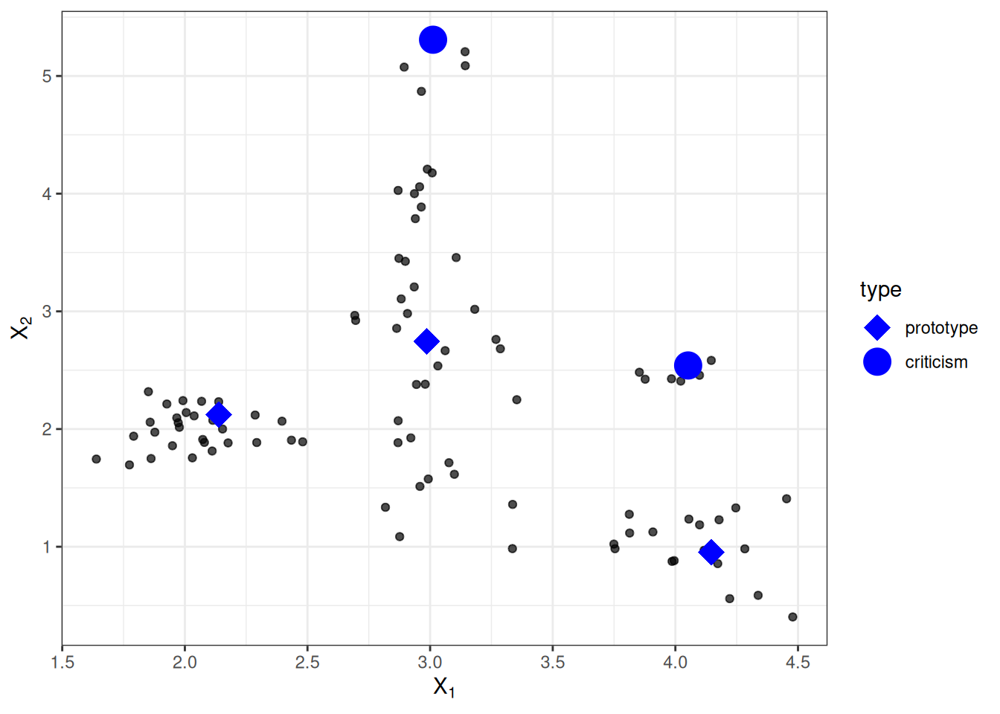
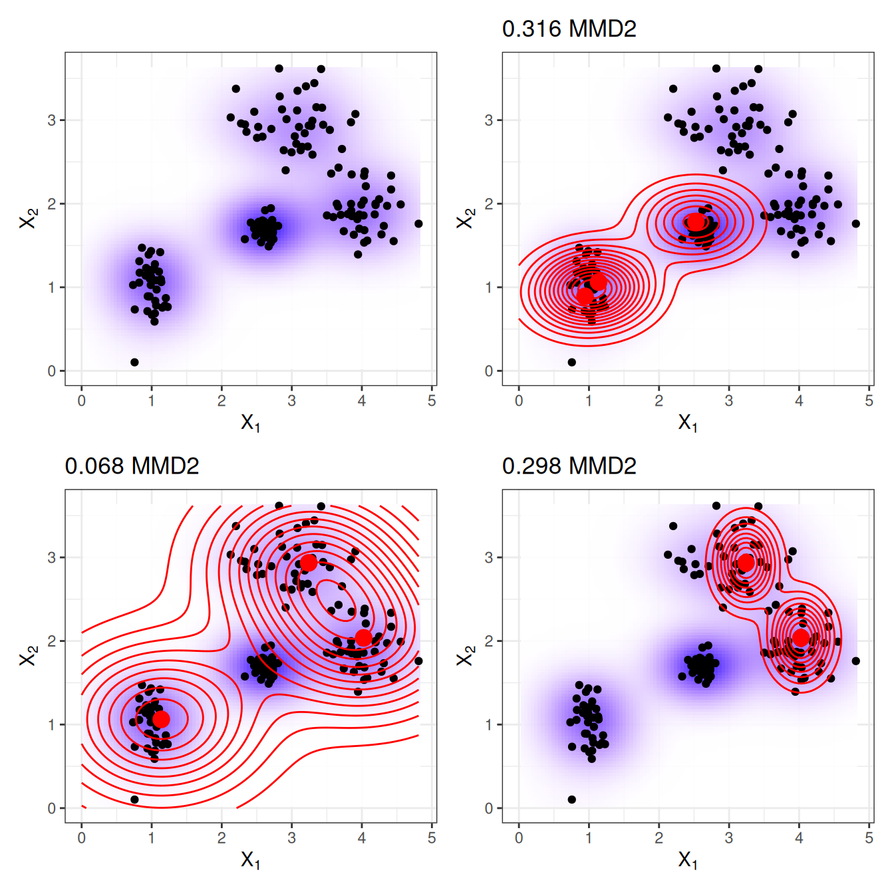
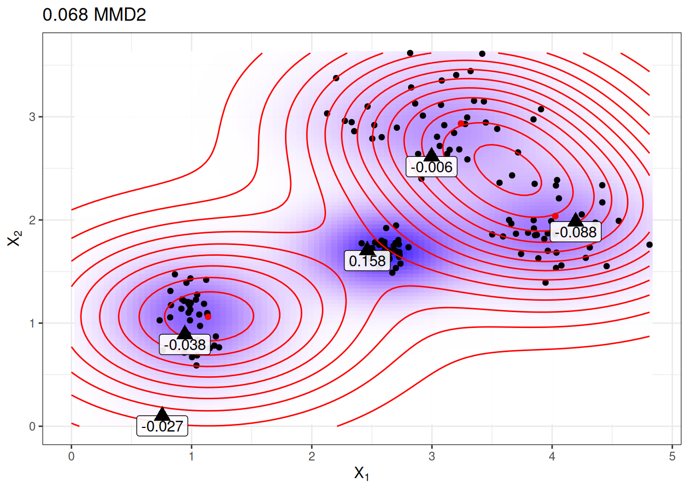
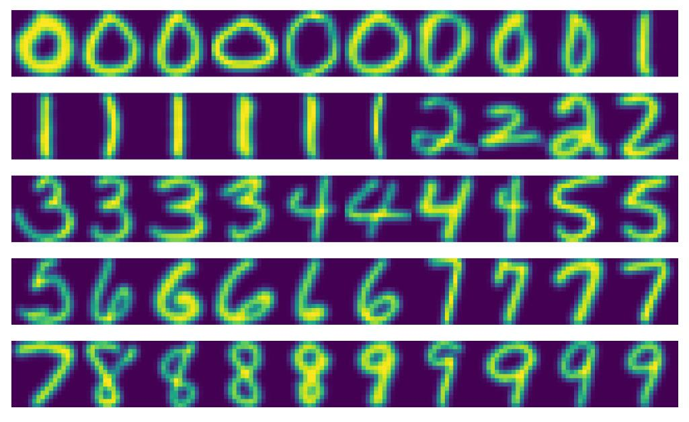

# فصل ۲۶: پروتوتایپ‌ها و انتقادها

> **عنوان اصلی:** Prototypes and Criticisms  
> **منبع:** [https://christophm.github.io/interpretable-ml-book/proto.html](https://christophm.github.io/interpretable-ml-book/proto.html)  
> **نویسنده:** Christoph Molnar  
> **مترجم:** مریم محمودی

---

یک **پروتوتایپ** (نمونه‌ی نماینده) یک نمونه‌ی داده است که نماینده‌ی کل داده‌هاست. یک **انتقاد** (criticism) نمونه‌ی داده‌ای است که توسط مجموعه‌ی پروتوتایپ‌ها به‌خوبی بازنمایی نمی‌شود. هدف از انتقادها ارائه‌ی بینش‌هایی در کنار پروتوتایپ‌هاست، به‌ویژه برای نقاط داده‌ای که پروتوتایپ‌ها آن‌ها را به‌درستی نمایندگی نمی‌کنند. پروتوتایپ‌ها و انتقادها را می‌توان مستقل از هر مدل یادگیری ماشین برای توصیف داده‌ها به‌کار برد، اما می‌توان از آن‌ها برای ساخت مدلی تفسیرپذیر یا تفسیرپذیر کردن یک مدل جعبه‌سیاه نیز استفاده کرد.

در این فصل از اصطلاح «نقطه‌ی داده» برای اشاره به یک نمونه‌ی منفرد استفاده می‌کنم تا بر این تفسیر تأکید شود که هر نمونه در عین حال نقطه‌ای در یک فضای مختصاتی است که هر ویژگی یک بُعد از آن را تشکیل می‌دهد. شکل ۲۶.۱ توزیع داده‌ای شبیه‌سازی‌شده را نشان می‌دهد که در آن برخی نمونه‌ها به‌عنوان پروتوتایپ و برخی دیگر به‌عنوان انتقاد انتخاب شده‌اند. نقاط کوچک داده‌ها هستند، نقاط بزرگ انتقادها و مربع‌های بزرگ پروتوتایپ‌ها. پروتوتایپ‌ها در این مثال به‌صورت دستی انتخاب شده‌اند تا مراکز توزیع داده را پوشش دهند، و انتقادها نقاطی در خوشه‌ای هستند که پروتوتایپی برای آن وجود ندارد. پروتوتایپ‌ها و انتقادها همواره نمونه‌های واقعی از داده‌ها هستند.

من پروتوتایپ‌ها را به‌صورت دستی انتخاب کردم، روشی که مقیاس‌پذیر نیست و احتمالاً به نتایج ضعیفی منجر می‌شود. رویکردهای متعددی برای یافتن پروتوتایپ در داده‌ها وجود دارد. یکی از آن‌ها k-medoids است، الگوریتمی خوشه‌بندی مرتبط با الگوریتم k-means. هر الگوریتم خوشه‌بندی که نقاط داده‌ی واقعی را به‌عنوان مراکز خوشه بازگرداند، برای انتخاب پروتوتایپ مناسب است. اما اغلب این روش‌ها تنها پروتوتایپ می‌یابند و انتقادی ارائه نمی‌دهند. این فصل روش MMD-critic معرفی‌شده توسط Kim، Khanna و Koyejo (۲۰۱۶) را ارائه می‌دهد؛ رویکردی که پروتوتایپ‌ها و انتقادها را در یک چارچوب واحد ترکیب می‌کند.

MMD-critic توزیع داده‌ها و توزیع پروتوتایپ‌های انتخاب‌شده را با یکدیگر مقایسه می‌کند. این مفهوم محوری برای درک روش MMD-critic است. این روش پروتوتایپ‌هایی را انتخاب می‌کند که اختلاف بین دو توزیع را به حداقل برساند. نقاط داده در مناطق با چگالی بالا پروتوتایپ‌های خوبی هستند، به‌ویژه وقتی نقاط از «خوشه‌های داده‌ای» مختلف انتخاب شوند. نقاط داده‌ای که توسط پروتوتایپ‌ها به‌خوبی توضیح داده نمی‌شوند به‌عنوان انتقاد انتخاب می‌گردند.

## نظریه

رویه‌ی MMD-critic را می‌توان در سطح بالا به‌اختصار چنین خلاصه کرد:

۱. تعداد پروتوتایپ‌ها و انتقادهایی را که می‌خواهید بیابید انتخاب کنید.
۲. پروتوتایپ‌ها را با جستجوی حریصانه (greedy search) بیابید. پروتوتایپ‌ها به‌گونه‌ای انتخاب می‌شوند که توزیع آن‌ها به توزیع داده نزدیک باشد.
۳. انتقادها را با جستجوی حریصانه بیابید. نقاطی به‌عنوان انتقاد انتخاب می‌شوند که توزیع پروتوتایپ‌ها در آن‌ها با توزیع داده تفاوت دارد.

برای یافتن پروتوتایپ‌ها و انتقادها در یک مجموعه داده با روش MMD-critic به چند عنصر اساسی نیاز داریم. ابتدایی‌ترین این عناصر یک **تابع هسته** (kernel function) برای تخمین چگالی داده است. هسته تابعی است که دو نقطه‌ی داده را بر اساس مجاورتشان وزن‌دهی می‌کند. بر پایه‌ی تخمین‌های چگالی، به معیاری نیاز داریم که میزان تفاوت دو توزیع را بسنجد تا بتوانیم تعیین کنیم آیا توزیع پروتوتایپ‌های انتخاب‌شده به توزیع داده نزدیک است یا نه. این مسئله با اندازه‌گیری **بیشینه‌ی اختلاف میانگین** (Maximum Mean Discrepancy یا MMD) حل می‌شود. همچنین بر اساس تابع هسته، به **تابع شاهد** (witness function) نیاز داریم که نشان دهد دو توزیع در یک نقطه‌ی داده‌ی مشخص چقدر با هم تفاوت دارند. با تابع شاهد می‌توانیم انتقادها را شناسایی کنیم؛ یعنی نقاط داده‌ای که توزیع پروتوتایپ‌ها و داده در آن‌ها از هم فاصله می‌گیرد و تابع شاهد مقادیر قدرمطلق بزرگی می‌گیرد. آخرین عنصر یک **راهبرد جستجو** برای یافتن پروتوتایپ‌ها و انتقادهای مناسب است که با **جستجوی حریصانه‌ی ساده** حل می‌شود.

بگذارید با **بیشینه‌ی اختلاف میانگین (MMD)** شروع کنیم که اختلاف بین دو توزیع را می‌سنجد. انتخاب پروتوتایپ‌ها یک توزیع چگالی از پروتوتایپ‌ها ایجاد می‌کند. می‌خواهیم ارزیابی کنیم که آیا توزیع پروتوتایپ‌ها با توزیع داده تفاوت دارد. هر دو را با توابع چگالی هسته تخمین می‌زنیم. بیشینه‌ی اختلاف میانگین تفاوت بین دو توزیع را اندازه می‌گیرد، که برابر است با کران بالای تفاوت امیدریاضی‌ها بر روی یک فضای تابعی نسبت به دو توزیع. آیا کاملاً واضح است؟ شخصاً این مفاهیم را وقتی نحوه‌ی محاسبه با داده را می‌بینم بهتر درک می‌کنم. فرمول زیر نحوه‌ی محاسبه‌ی معیار MMD به توان دو (MMD2) را نشان می‌دهد:

$$\text{MMD}^2 = \frac{1}{m^2} \sum_{i,j=1}^m k(\mathbf{z}_i, \mathbf{z}_j) - \frac{2}{mn} \sum_{i=1}^m \sum_{j=1}^n k(\mathbf{z}_i, \mathbf{x}_j) + \frac{1}{n^2} \sum_{i,j=1}^n k(\mathbf{x}_i, \mathbf{x}_j)$$

$k$ تابع هسته‌ای است که شباهت دو نقطه را می‌سنجد، که بعداً بیشتر درباره‌اش توضیح خواهیم داد. $m$ تعداد پروتوتایپ‌های $\mathbf{z}$ و $n$ تعداد نقاط داده‌ی $\mathbf{x}$ در مجموعه داده‌ی اصلی است. پروتوتایپ‌های $\mathbf{z}$ زیرمجموعه‌ای از نقاط داده‌ی $\mathbf{x}$ هستند. هر نقطه چندبُعدی است، یعنی می‌تواند چندین ویژگی داشته باشد. هدف MMD-critic کمینه کردن $\text{MMD}^2$ است. هرچه $\text{MMD}^2$ به صفر نزدیک‌تر باشد، توزیع پروتوتایپ‌ها با داده بهتر تطابق دارد. کلید رساندن $\text{MMD}^2$ به صفر، جمله‌ی میانی است که میانگین مجاورت بین پروتوتایپ‌ها و همه‌ی نقاط داده را محاسبه می‌کند (ضرب در ۲). اگر این جمله با جمع جمله‌ی اول (میانگین مجاورت پروتوتایپ‌ها با یکدیگر) و جمله‌ی آخر (میانگین مجاورت نقاط داده با یکدیگر) برابر شود، پروتوتایپ‌ها داده را به‌طور کامل توضیح می‌دهند. امتحان کنید ببینید اگر همه‌ی $n$ نقطه داده را به‌عنوان پروتوتایپ استفاده کنید چه اتفاقی برای فرمول می‌افتد.

شکل ۲۶.۲ معیار $\text{MMD}^2$ را نشان می‌دهد. نمودار اول نقاط داده را با دو ویژگی نمایش می‌دهد و تخمین چگالی داده با پس‌زمینه‌ی سایه‌دار نشان داده شده است. هر یک از نمودارهای دیگر انتخاب‌های متفاوتی از پروتوتایپ‌ها را به همراه مقدار $\text{MMD}^2$ در عنوان نمودار نشان می‌دهد. پروتوتایپ‌ها نقاط بزرگ هستند و توزیعشان با خطوط هم‌تراز نمایش داده شده است. انتخابی از پروتوتایپ‌ها که داده را در این سناریوها بهتر پوشش می‌دهد (پایین چپ) کمترین مقدار اختلاف را دارد.

یک انتخاب برای هسته، هسته‌ی تابع پایه‌ی شعاعی (radial basis function kernel) است:

$$k(\mathbf{x}, \mathbf{x}^\prime)=\exp\left(-\gamma||\mathbf{x}-\mathbf{x}^\prime||^2\right)$$

که در آن $||\mathbf{x}-\mathbf{x}^\prime||^2$ فاصله‌ی اقلیدسی بین دو نقطه و $\gamma$ یک پارامتر مقیاس‌بندی است. مقدار هسته با افزایش فاصله بین دو نقطه کاهش می‌یابد و بین صفر و یک متغیر است: صفر وقتی دو نقطه بی‌نهایت از هم فاصله دارند و یک وقتی دو نقطه برابرند.

معیار MMD2، هسته و جستجوی حریصانه را در یک الگوریتم برای یافتن پروتوتایپ ترکیب می‌کنیم:

* با یک فهرست خالی از پروتوتایپ‌ها شروع کنید.
* تا زمانی که تعداد پروتوتایپ‌ها به تعداد انتخاب‌شده‌ی $m$ نرسیده است:
  + برای هر نقطه در مجموعه داده بررسی کنید افزودن آن نقطه به فهرست پروتوتایپ‌ها چقدر MMD2 را کاهش می‌دهد. نقطه‌ی داده‌ای که MMD2 را بیشتر کمینه می‌کند به فهرست اضافه شود.
* فهرست پروتوتایپ‌ها را برگردانید.

عنصر باقی‌مانده برای یافتن انتقادها تابع شاهد است که نشان می‌دهد دو تخمین چگالی در یک نقطه‌ی خاص چقدر با هم تفاوت دارند. می‌توان آن را به‌صورت زیر تخمین زد:

$$\mathrm{witness}(\mathbf{x})=\frac{1}{n}\sum_{i=1}^{n}k(\mathbf{x}, \mathbf{x}^{(i)})-\frac{1}{m}\sum_{j=1}^{m}k(\mathbf{x}, \mathbf{z}^{(j)})$$

برای دو مجموعه داده (با ویژگی‌های یکسان)، تابع شاهد به شما امکان می‌دهد ارزیابی کنید که نقطه‌ی $\mathbf{x}$ با کدام توزیع تجربی بهتر تناسب دارد. برای یافتن انتقادها، به دنبال مقادیر شدید تابع شاهد در هر دو جهت مثبت و منفی هستیم. جمله‌ی اول در تابع شاهد میانگین مجاورت نقطه‌ی $\mathbf{x}$ با داده است، و به‌ترتیب جمله‌ی دوم میانگین مجاورت نقطه‌ی $\mathbf{x}$ با پروتوتایپ‌هاست. اگر تابع شاهد برای نقطه‌ی $\mathbf{x}$ به صفر نزدیک باشد، تابع چگالی داده و پروتوتایپ‌ها به هم نزدیک هستند، یعنی توزیع پروتوتایپ‌ها در نقطه‌ی $\mathbf{x}$ شبیه به توزیع داده است. تابع شاهد منفی در نقطه‌ی $\mathbf{x}$ یعنی توزیع پروتوتایپ توزیع داده را بیش از حد تخمین می‌زند (برای مثال اگر پروتوتایپی انتخاب کنیم اما نقاط داده‌ی کمی در اطرافش وجود داشته باشد)؛ تابع شاهد مثبت در نقطه‌ی $\mathbf{x}$ یعنی توزیع پروتوتایپ توزیع داده را کمتر از حد واقعی تخمین می‌زند (برای مثال اگر نقاط داده‌ی زیادی اطراف $\mathbf{x}$ وجود داشته باشد اما هیچ پروتوتایپی در مجاورت آن انتخاب نشده باشد).

برای درک بهتر، پروتوتایپ‌هایی که در نمودار قبلی با کمترین MMD2 نشان داده شدند را دوباره استفاده می‌کنیم و تابع شاهد را برای چند نقطه‌ی انتخاب‌شده‌ی دستی نمایش می‌دهیم. برچسب‌ها در شکل ۲۶.۳ مقدار تابع شاهد را برای نقاط مختلف علامت‌گذاری‌شده با مثلث نشان می‌دهند. تنها نقطه‌ی میانی مقدار قدرمطلق بالایی دارد و بنابراین نامزد خوبی برای یک انتقاد است.

تابع شاهد به ما امکان می‌دهد به‌صراحت به دنبال نمونه‌های داده‌ای بگردیم که توسط پروتوتایپ‌ها به‌خوبی بازنمایی نشده‌اند. انتقادها نقاطی با مقدار قدرمطلق بالا در تابع شاهد هستند. مانند پروتوتایپ‌ها، انتقادها نیز از طریق جستجوی حریصانه یافت می‌شوند. اما به‌جای کاهش کلی $\text{MMD}^2$، به دنبال نقاطی هستیم که یک تابع هزینه شامل تابع شاهد و یک جمله‌ی تنظیم‌کننده را بیشینه کنند. جمله‌ی اضافی در تابع بهینه‌سازی تنوع بین نقاط را تضمین می‌کند که لازم است تا نقاط از خوشه‌های مختلف باشند.

این مرحله‌ی دوم مستقل از نحوه‌ی یافتن پروتوتایپ‌هاست. می‌توانستم پروتوتایپ‌ها را به‌صورت دستی انتخاب کنم و از همین رویه برای یادگیری انتقادها استفاده کنم. یا پروتوتایپ‌ها می‌توانستند از هر روش خوشه‌بندی دیگری مانند k-medoids بیایند.

این بود بخش‌های مهم نظریه‌ی MMD-critic. یک سؤال باقی می‌ماند: **چگونه می‌توان از MMD-critic برای یادگیری ماشین تفسیرپذیر استفاده کرد؟**

MMD-critic می‌تواند به سه روش تفسیرپذیری را افزایش دهد: با کمک به درک بهتر توزیع داده؛ با ساخت یک مدل تفسیرپذیر؛ و با تفسیرپذیر کردن یک مدل جعبه‌سیاه.

اگر MMD-critic را روی داده‌های خود اعمال کنید تا پروتوتایپ‌ها و انتقادها را بیابید، درک شما از داده بهبود می‌یابد، به‌ویژه اگر توزیع داده‌ای پیچیده با موارد استثنایی داشته باشید. اما با MMD-critic می‌توان بیشتر از این هم به دست آورد!

برای مثال، می‌توانید یک مدل پیش‌بینی تفسیرپذیر بسازید: به اصطلاح «مدل نزدیک‌ترین پروتوتایپ» (nearest prototype model). تابع پیش‌بینی به‌صورت زیر تعریف می‌شود:

$$\hat{f}(\mathbf{x})=\arg\max_{i\in S}k(\mathbf{x},\mathbf{x}_i)$$

یعنی از مجموعه‌ی پروتوتایپ‌های $S$، پروتوتایپی $i$ را انتخاب می‌کنیم که به نقطه‌ی داده‌ی جدید نزدیک‌ترین باشد، به این معنا که بیشترین مقدار تابع هسته را به دست دهد. خود پروتوتایپ به‌عنوان توضیحی برای پیش‌بینی بازگردانده می‌شود. این رویه سه پارامتر تنظیمی دارد: نوع هسته، پارامتر مقیاس‌بندی هسته و تعداد پروتوتایپ‌ها. همه‌ی پارامترها می‌توانند درون یک حلقه‌ی اعتبارسنجی متقاطع بهینه شوند. در این رویکرد از انتقادها استفاده نمی‌شود.

به‌عنوان گزینه‌ی سوم، می‌توانیم از MMD-critic برای توضیح‌پذیر کردن سراسری هر مدل یادگیری ماشین استفاده کنیم، با بررسی پروتوتایپ‌ها و انتقادها در کنار پیش‌بینی‌های مدل. رویه به‌صورت زیر است:

۱. پروتوتایپ‌ها و انتقادها را با MMD-critic بیابید.
۲. مدل یادگیری ماشین را به روش معمول آموزش دهید.
۳. نتایج را برای پروتوتایپ‌ها و انتقادها با مدل یادگیری ماشین پیش‌بینی کنید.
۴. پیش‌بینی‌ها را تحلیل کنید: در چه مواردی الگوریتم اشتباه کرده است؟ اکنون مجموعه‌ای از نمونه‌ها دارید که داده را به‌خوبی نمایندگی می‌کنند و به شما کمک می‌کنند نقاط ضعف مدل یادگیری ماشین را پیدا کنید.

این چه کمکی می‌کند؟ به یاد دارید وقتی دسته‌بند تصویر Google سیاه‌پوستان را به‌عنوان گوریل شناسایی کرد؟ شاید باید از رویه‌ی توصیف‌شده در اینجا پیش از استقرار مدل تشخیص تصویر استفاده می‌کردند. صرف بررسی عملکرد مدل کافی نیست، چون اگر دقت آن ۹۹٪ بود، این مشکل همچنان می‌توانست در آن ۱٪ پنهان باشد. برچسب‌ها هم می‌توانند اشتباه باشند! بررسی همه‌ی داده‌های آموزشی و انجام یک بررسی سلامت برای شناسایی پیش‌بینی‌های مشکل‌دار امکان‌پذیر نیست. اما انتخاب — مثلاً چند هزار — پروتوتایپ و انتقاد امکان‌پذیر است و می‌توانست مشکلی در داده‌ها آشکار کند: ممکن بود نشان دهد که تصاویر افراد با پوست تیره کمیاب هستند، که نشان‌دهنده‌ی مشکلی در تنوع مجموعه داده است. یا ممکن بود یک یا چند تصویر از فردی با پوست تیره به‌عنوان پروتوتایپ یا (احتمالاً) به‌عنوان انتقاد با دسته‌بندی بدنام «گوریل» نمایش داده شود. ادعا نمی‌کنم که MMD-critic قطعاً این نوع اشتباهات را شناسایی می‌کند، اما یک بررسی سلامت مناسب است.

## مثال‌ها

مثال زیر از MMD-critic از یک مجموعه داده‌ی ارقام دست‌نویس استفاده می‌کند. با نگاه کردن به پروتوتایپ‌های واقعی در شکل ۲۶.۴، ممکن است متوجه شوید که تعداد تصاویر به‌ازای هر رقم متفاوت است. این به آن دلیل است که تعداد ثابتی از پروتوتایپ‌ها در کل مجموعه داده جستجو شده‌اند، نه با تعداد ثابت به‌ازای هر کلاس. همان‌طور که انتظار می‌رود، پروتوتایپ‌ها روش‌های مختلف نوشتن ارقام را نشان می‌دهند.

## نقاط قوت

در یک مطالعه‌ی کاربری، نویسندگان MMD-critic تصاویری را در اختیار شرکت‌کنندگان قرار دادند که می‌بایست آن‌ها را به‌صورت بصری با یکی از دو مجموعه‌ی تصویر تطبیق می‌دادند، که هر مجموعه نمایانگر یکی از دو کلاس بود (مثلاً دو نژاد سگ). **شرکت‌کنندگان بهترین عملکرد را داشتند وقتی مجموعه‌ها پروتوتایپ‌ها و انتقادها را نشان می‌دادند** به‌جای تصاویر تصادفی از یک کلاس.

**شما آزادید تعداد پروتوتایپ‌ها و انتقادها را انتخاب کنید.**

MMD-critic با تخمین‌های چگالی داده کار می‌کند. این **با هر نوع داده و هر نوع مدل یادگیری ماشین قابل استفاده است**.

الگوریتم **پیاده‌سازی آسانی دارد**.

MMD-critic در شیوه‌ی استفاده برای افزایش تفسیرپذیری **انعطاف‌پذیر** است. می‌توان از آن برای درک توزیع‌های داده‌ی پیچیده استفاده کرد. می‌توان از آن برای ساخت یک مدل یادگیری ماشین تفسیرپذیر بهره برد. یا می‌تواند نور را بر تصمیم‌گیری یک مدل یادگیری ماشین جعبه‌سیاه بتاباند.

**یافتن انتقادها مستقل از فرایند انتخاب پروتوتایپ‌هاست.** اما انتخاب پروتوتایپ‌ها بر اساس MMD-critic منطقی است، چون در آن صورت هم پروتوتایپ‌ها و هم انتقادها با همان روش مقایسه‌ی چگالی پروتوتایپ‌ها و داده ساخته می‌شوند.

## محدودیت‌ها

اگرچه از نظر ریاضی پروتوتایپ‌ها و انتقادها به‌گونه‌ی متفاوتی تعریف می‌شوند، **تمایز آن‌ها بر اساس یک مقدار آستانه** (تعداد پروتوتایپ‌ها) استوار است. فرض کنید تعداد پروتوتایپ‌های انتخابی خیلی کم است و توزیع داده را به‌خوبی پوشش نمی‌دهد. انتقادها در مناطقی قرار می‌گیرند که توضیح چندانی برایشان وجود ندارد. اما اگر پروتوتایپ‌های بیشتری اضافه شود، آن‌ها هم در همان مناطق قرار می‌گیرند. هر تفسیری باید این را در نظر بگیرد که انتقادها به‌شدت به پروتوتایپ‌های موجود و مقدار آستانه‌ی (دلخواه) تعداد پروتوتایپ‌ها وابسته هستند.

**باید تعداد پروتوتایپ‌ها و انتقادها را انتخاب کنید.** هرچند این می‌تواند مزیتی باشد، اما یک عیب هم هست. چند پروتوتایپ و انتقاد واقعاً نیاز داریم؟ هرچه بیشتر بهتر؟ هرچه کمتر بهتر؟ یک راه‌حل، انتخاب تعداد پروتوتایپ‌ها و انتقادها بر اساس زمانی است که انسان‌ها برای بررسی تصاویر دارند، که به کاربرد خاص بستگی دارد. تنها زمانی که از MMD-critic برای ساخت یک دسته‌بند استفاده می‌کنیم، روشی برای بهینه‌سازی مستقیم آن داریم. یک راه‌حل می‌تواند یک نمودار شیب (scree plot) باشد که تعداد پروتوتایپ‌ها را روی محور x و معیار $\text{MMD}^2$ را روی محور y نشان می‌دهد. تعداد پروتوتایپ‌هایی را انتخاب می‌کنیم که در آنجا منحنی $\text{MMD}^2$ صاف می‌شود.

پارامترهای دیگر انتخاب هسته و پارامتر مقیاس‌بندی هسته هستند. همان مشکل تعداد پروتوتایپ‌ها و انتقادها را داریم: **چگونه یک هسته و پارامتر مقیاس‌بندی آن را انتخاب کنیم؟** دوباره، وقتی از MMD-critic به‌عنوان دسته‌بند نزدیک‌ترین پروتوتایپ استفاده می‌کنیم، می‌توانیم پارامترهای هسته را تنظیم کنیم. اما برای موارد استفاده‌ی بدون نظارت MMD-critic، موضوع نامشخص است. (شاید در این مورد کمی سخت‌گیرانه قضاوت می‌کنم، چون همه‌ی روش‌های بدون نظارت این مشکل را دارند.)

این روش همه‌ی ویژگی‌ها را به‌عنوان ورودی می‌گیرد، **بدون توجه به اینکه برخی ویژگی‌ها ممکن است برای پیش‌بینی نتیجه‌ی موردنظر مرتبط نباشند.** یک راه‌حل استفاده از ویژگی‌های مرتبط است، برای مثال embedding‌های تصویر به‌جای پیکسل‌های خام. این در صورتی کارآمد است که روشی برای تصویر کردن نمونه‌ی اصلی روی یک بازنمایی حاوی تنها اطلاعات مرتبط داشته باشیم.

کدهایی در دسترس هستند، اما **هنوز به‌صورت نرم‌افزار بسته‌بندی‌شده و مستندشده‌ی مناسبی پیاده‌سازی نشده‌اند**.

## نرم‌افزار و جایگزین‌ها

پیاده‌سازی MMD-critic را می‌توان در [مخزن GitHub نویسندگان](https://github.com/BeenKim/MMD-critic) یافت. پیاده‌سازی Python دیگری به نام [mmd-critic](https://pypi.org/project/mmd-critic/) نیز وجود دارد که از طریق pip قابل نصب است.

اخیراً یک توسعه‌ی MMD-critic با نام Protodash معرفی شده است. نویسندگان در [مقاله‌ی](https://arxiv.org/pdf/1707.01212.pdf) خود مزایایی نسبت به MMD-critic ادعا می‌کنند. پیاده‌سازی Protodash در ابزار [IBM AIX360](https://github.com/Trusted-AI/AIX360) موجود است.

ساده‌ترین جایگزین برای یافتن پروتوتایپ‌ها [k-medoids](https://en.wikipedia.org/wiki/K-medoids) اثر Rdusseeun و Kaufman (۱۹۸۷) است.

---

Kim, Been, Rajiv Khanna, and Oluwasanmi Koyejo. 2016. "Examples Are Not Enough, Learn to Criticize! Criticism for Interpretability." In *Proceedings of the 30th International Conference on Neural Information Processing Systems*, 2288–96. NIPS'16. Red Hook, NY, USA: Curran Associates Inc.

Rdusseeun, LKPJ, and P Kaufman. 1987. "Clustering by Means of Medoids." In *Proceedings of the Statistical Data Analysis Based on the L1 Norm Conference, Neuchatel, Switzerland*. Vol. 31.
