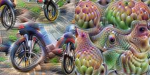
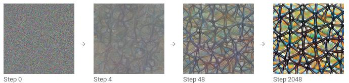
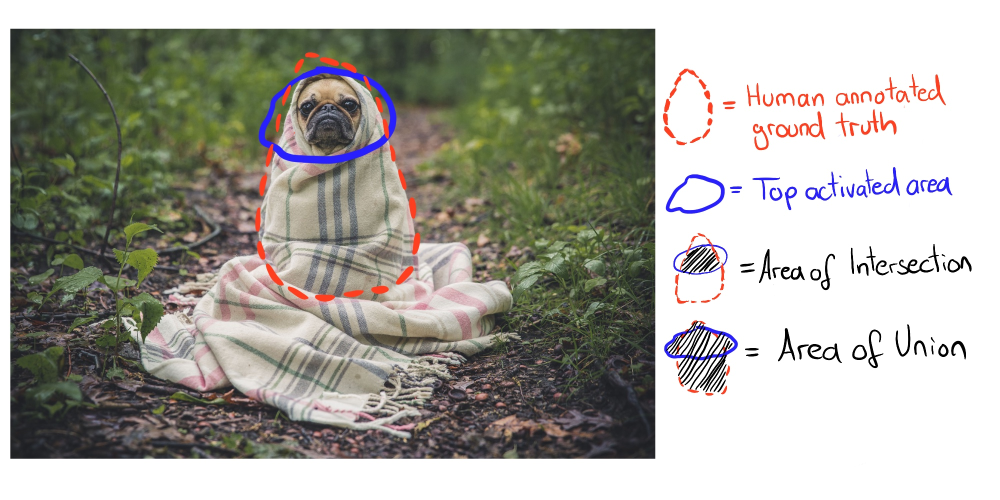
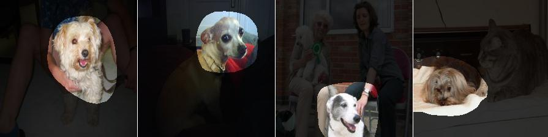

# فصل ۲۷: ویژگی‌های آموخته‌شده

> **عنوان اصلی:** Learned Features  
> **منبع:** [https://christophm.github.io/interpretable-ml-book/cnn-features.html](https://christophm.github.io/interpretable-ml-book/cnn-features.html)  
> **نویسنده:** Christoph Molnar  
> **مترجم:** مریم محمودی

---

شبکه‌های عصبی کانولوشنی (Convolutional Neural Networks یا CNN) ویژگی‌ها و مفاهیم انتزاعی را مستقیماً از پیکسل‌های خام تصویر می‌آموزند. **تجسم ویژگی** (Feature Visualization) این ویژگی‌های آموخته‌شده را از طریق بیشینه‌سازی فعال‌سازی نمایان می‌سازد. **تشریح شبکه** (Network Dissection) واحدهای شبکه‌ی عصبی (مانند کانال‌ها) را با مفاهیم قابل‌فهم برای انسان برچسب‌گذاری می‌کند.

شبکه‌های عصبی عمیق ویژگی‌های سطح‌بالا را در لایه‌های پنهان می‌آموزند؛ این یکی از بزرگ‌ترین مزیت‌های آن‌هاست و نیاز به مهندسی ویژگی دستی را کاهش می‌دهد. فرض کنید می‌خواهید یک طبقه‌بند تصویر با استفاده از ماشین بردار پشتیبان (SVM) بسازید. ماتریس‌های پیکسل خام بهترین ورودی برای آموزش SVM نیستند؛ بنابراین ویژگی‌های جدیدی بر اساس رنگ، دامنه‌ی فرکانسی، آشکارکننده‌های لبه و موارد دیگر می‌سازید. اما در شبکه‌های عصبی کانولوشنی، تصویر در قالب خام خود (پیکسل) وارد شبکه می‌شود و شبکه تصویر را بارها دگرگون می‌کند. ابتدا تصویر از لایه‌های کانولوشنی متعددی می‌گذرد و در هر لایه، شبکه ویژگی‌های جدید و پیچیده‌تری می‌آموزد (شکل ۲۷.۱). سپس اطلاعات تصویر پردازش‌شده از لایه‌های کاملاً متصل (Fully Connected) عبور می‌کند و به یک دسته‌بندی یا پیش‌بینی تبدیل می‌شود.

- اولین لایه(های) کانولوشنی ویژگی‌هایی مانند لبه‌ها و بافت‌های ساده می‌آموزند.
- لایه‌های کانولوشنی میانی ویژگی‌هایی مانند بافت‌ها و الگوهای پیچیده‌تر می‌آموزند.
- آخرین لایه‌های کانولوشنی ویژگی‌هایی مانند اشیاء یا بخش‌هایی از اشیاء می‌آموزند.
- لایه‌های کاملاً متصل یاد می‌گیرند که فعال‌سازی‌های ویژگی‌های سطح‌بالا را به کلاس‌های مجزای مورد پیش‌بینی نگاشت کنند.

## تجسم ویژگی

رویکرد آشکارسازی ویژگی‌های آموخته‌شده، **تجسم ویژگی** (Feature Visualization) نامیده می‌شود. تجسم ویژگی برای یک واحد از شبکه‌ی عصبی با یافتن ورودی‌ای انجام می‌شود که فعال‌سازی آن واحد را بیشینه کند. «واحد» می‌تواند به نورون‌های منفرد، کانال‌ها (که نقشه‌های ویژگی نیز نامیده می‌شوند)، کل لایه‌ها، یا احتمال نهایی کلاس در دسته‌بندی (یا نورون پیش از softmax که توصیه می‌شود) اشاره داشته باشد. شکل ۲۷.۲ امکانات مختلف را نمایش می‌دهد.

نورون‌های منفرد، کوچک‌ترین واحدهای شبکه هستند و تجسم ویژگی برای هر نورون بیشترین اطلاعات را فراهم می‌کند. اما مشکلی وجود دارد: شبکه‌های عصبی اغلب میلیون‌ها نورون دارند و بررسی تجسم ویژگی هر نورون بسیار زمان‌بر خواهد بود. کانال‌ها (که گاهی نقشه‌های فعال‌سازی نامیده می‌شوند) انتخاب مناسبی برای تجسم ویژگی هستند. یک گام بیشتر می‌توان رفت و کل یک لایه‌ی کانولوشنی را تجسم کرد. لایه‌ها به عنوان واحد در DeepDream گوگل استفاده می‌شوند که ویژگی‌های تجسم‌یافته‌ی یک لایه را بارها به تصویر اصلی اضافه می‌کند و نسخه‌ای رویاگونه از ورودی می‌سازد.

*شکل ۲۷.۲: تجسم ویژگی برای واحدهای مختلف قابل انجام است. الف) نورون کانولوشنی، ب) کانال کانولوشنی، ج) لایه‌ی کانولوشنی، د) نورون، ه) لایه‌ی پنهان، و) نورون احتمال کلاس (یا نورون پیش از softmax)*

### تجسم ویژگی از طریق بهینه‌سازی

از نظر ریاضی، تجسم ویژگی یک مسئله‌ی بهینه‌سازی است. فرض می‌کنیم وزن‌های شبکه‌ی عصبی ثابت هستند؛ یعنی شبکه از پیش آموزش دیده. ما به دنبال تصویر جدیدی هستیم که فعال‌سازی (میانگین) یک واحد را بیشینه کند؛ در اینجا یک نورون منفرد:

$$\mathbf{x}^*=\arg\max\_{\mathbf{x}}h\_{n,u,v,z}(\mathbf{x})$$

تابع $h$ فعال‌سازی یک نورون خاص است، $\mathbf{x}$ ورودی شبکه (یک تصویر)، $u$ و $v$ موقعیت فضایی نورون را مشخص می‌کنند، $n$ لایه را تعیین می‌کند، و $z$ شاخص کانال است. برای بیشینه‌سازی میانگین فعال‌سازی کل کانال $z$ در لایه‌ی $n$، داریم:

$$\mathbf{x}^*=\arg\max\_{\mathbf{x}}\sum\_{u,v}h\_{n,u,v,z}(\mathbf{x})$$

در این فرمول، همه‌ی نورون‌های کانال $z$ وزن یکسانی دارند. همچنین می‌توان جهت‌های تصادفی را بیشینه کرد؛ یعنی نورون‌ها با پارامترهای مختلف، از جمله جهت‌های منفی، ضرب می‌شوند. به این ترتیب نحوه‌ی تعامل نورون‌ها در داخل کانال بررسی می‌شود. به جای بیشینه‌سازی فعال‌سازی، می‌توان آن را کمینه کرد (که معادل بیشینه‌سازی جهت منفی است). شکل ۲۷.۳ هر دو حالت را نشان می‌دهد. جالب اینجاست که بیشینه‌سازی جهت منفی، ویژگی‌های کاملاً متفاوتی برای همان واحد نمایان می‌سازد؛ در حالی که نورون با چرخ‌ها به حداکثر فعال‌سازی می‌رسد، به نظر می‌رسد چیزی که چشم دارد فعال‌سازی منفی ایجاد می‌کند.

یک راه برای حل این مسئله‌ی بهینه‌سازی، جستجو در میان تصاویر آموزشی و انتخاب آن‌هایی است که فعال‌سازی را بیشینه می‌کنند. این رویکرد معتبر است، اما استفاده از داده‌های آموزشی مشکلی دارد: عناصر تصویر ممکن است با هم همبستگی داشته باشند و نمی‌توان دریافت که شبکه‌ی عصبی واقعاً به دنبال چه چیزی است. اگر تصاویری که فعال‌سازی بالایی در یک کانال ایجاد می‌کنند هم سگ و هم توپ تنیس داشته باشند، مشخص نیست که شبکه به سگ نگاه می‌کند، به توپ تنیس، یا به هر دو.

رویکرد دیگر تولید تصاویر جدید است که از نویز تصادفی آغاز می‌شود (شکل ۲۷.۴). برای به‌دست‌آوردن تجسم‌های معنادار، معمولاً محدودیت‌هایی روی تصویر اعمال می‌شود؛ مثلاً تنها تغییرات کوچک مجاز هستند. برای کاهش نویز در تجسم ویژگی، می‌توان پیش از مرحله‌ی بهینه‌سازی، جابه‌جایی، چرخش یا مقیاس‌بندی به تصویر اعمال کرد. گزینه‌های منظم‌سازی دیگر شامل جریمه‌ی فرکانسی (مثلاً کاهش واریانس پیکسل‌های مجاور) یا تولید تصاویر با پیش‌بینی‌های آموخته‌شده‌اند، مانند استفاده از شبکه‌های مولد تخاصمی (GANs) (Nguyen و همکاران ۲۰۱۶) یا اتوانکودرهای حذف‌نویز (Nguyen و همکاران ۲۰۱۷).

برای مطالعه‌ی عمیق‌تر تجسم ویژگی، توصیه می‌شود به مجله‌ی آنلاین distill.pub مراجعه کنید، به‌ویژه مقاله‌ی تجسم ویژگی نوشته‌ی Olah، Mordvintsev و Schubert (۲۰۱۷) که بسیاری از تصاویر این بخش از آن گرفته شده است. مقاله‌ی «بلوک‌های سازنده‌ی تفسیرپذیری» (Olah و همکاران ۲۰۱۸) نیز توصیه می‌شود.

### ارتباط با نمونه‌های تخاصمی

میان تجسم ویژگی و نمونه‌های تخاصمی (Adversarial Examples) ارتباطی وجود دارد: هر دو روش فعال‌سازی یک واحد شبکه‌ی عصبی را بیشینه می‌کنند. در نمونه‌های تخاصمی، به دنبال بیشینه‌سازی فعال‌سازی نورون برای کلاس تخاصمی (= نادرست) هستیم. یک تفاوت در تصویر آغازین است: در نمونه‌های تخاصمی، تصویری است که می‌خواهیم نسخه‌ی تخاصمی آن را بسازیم؛ در تجسم ویژگی، بسته به رویکرد، نویز تصادفی است.

### داده‌های متنی و جدولی

پژوهش‌های موجود عمدتاً بر تجسم ویژگی در شبکه‌های عصبی کانولوشنی برای تشخیص تصویر متمرکز هستند. از نظر فنی، هیچ مانعی برای یافتن ورودی‌ای که فعال‌سازی نورون یک شبکه‌ی عصبی کاملاً متصل برای داده‌های جدولی یا یک شبکه‌ی عصبی بازگشتی (Recurrent Neural Network) برای داده‌های متنی را بیشینه کند وجود ندارد. البته دیگر نمی‌توان آن را تجسم ویژگی نامید، زیرا «ویژگی» یک ورودی جدولی یا متنی خواهد بود. در پیش‌بینی نکول اعتباری، ورودی‌ها ممکن است شامل تعداد اعتبارات قبلی، تعداد قراردادهای موبایل، آدرس و ده‌ها ویژگی دیگر باشند. در این صورت، ویژگی آموخته‌شده‌ی یک نورون ترکیب خاصی از همین ده‌ها ویژگی خواهد بود.

برای شبکه‌های عصبی بازگشتی، تجسم آنچه شبکه آموخته کمی جذاب‌تر است. Karpathy، Johnson و Fei-Fei (۲۰۱۵) نشان دادند که شبکه‌های عصبی بازگشتی واقعاً نورون‌هایی دارند که ویژگی‌های قابل تفسیر می‌آموزند. آن‌ها یک مدل در سطح کاراکتر آموزش دادند که کاراکتر بعدی را از کاراکترهای قبلی پیش‌بینی می‌کند. پس از ظاهر شدن پرانتز باز «(»، یکی از نورون‌ها به شدت فعال می‌شد و با ظاهر شدن پرانتز بسته‌ی متناظر «)» غیرفعال می‌شد. نورون‌های دیگر در پایان خط فعال می‌شدند و برخی در URLها. تفاوت با تجسم ویژگی در CNNها این است که نمونه‌ها از طریق بهینه‌سازی پیدا نشدند، بلکه با مطالعه‌ی فعال‌سازی نورون‌ها در داده‌های آموزشی به دست آمدند.

برخی از تصاویر تجسم ویژگی به نظر می‌رسد مفاهیم شناخته‌شده‌ای مانند پوزه‌ی سگ یا ساختمان را نشان می‌دهند. اما چطور می‌توانیم مطمئن باشیم؟ روش تشریح شبکه مفاهیم انسانی را با واحدهای منفرد شبکه‌ی عصبی پیوند می‌دهد. هشدار: تشریح شبکه به مجموعه‌داده‌های اضافه‌ای نیاز دارد که کسی آن‌ها را با مفاهیم انسانی برچسب‌گذاری کرده باشد.

## تشریح شبکه

رویکرد تشریح شبکه (Network Dissection) توسط Bau و همکاران (۲۰۱۷) تفسیرپذیری یک واحد از شبکه‌ی عصبی کانولوشنی را کمّی می‌کند. این رویکرد نواحی با فعال‌سازی بالای کانال‌های CNN را به مفاهیم انسانی (اشیاء، بخش‌ها، بافت‌ها، رنگ‌ها و …) پیوند می‌دهد.

کانال‌های یک شبکه‌ی عصبی کانولوشنی ویژگی‌های جدیدی می‌آموزند، همان‌طور که در بخش تجسم ویژگی دیدیم. اما این تجسم‌ها ثابت نمی‌کنند که یک واحد مفهوم خاصی آموخته است. معیاری هم برای سنجش اینکه یک واحد تا چه حد، مثلاً، آسمان‌خراش را تشخیص می‌دهد نداریم. پیش از پرداختن به جزئیات تشریح شبکه، باید درباره‌ی فرضیه‌ی اصلی این حوزه‌ی پژوهشی صحبت کنیم: «واحدهای یک شبکه‌ی عصبی (مانند کانال‌های کانولوشنی) مفاهیم جداافتاده‌ای می‌آموزند.» آیا واقعاً این‌طور است؟

### پرسش ویژگی‌های جداافتاده

آیا شبکه‌های عصبی (کانولوشنی) ویژگی‌های جداافتاده (Disentangled Features) می‌آموزند؟ ویژگی‌های جداافتاده به این معناست که واحدهای منفرد شبکه مفاهیم خاص دنیای واقعی را تشخیص می‌دهند. کانال ۳۹۴ کانولوشنی ممکن است آسمان‌خراش‌ها را تشخیص دهد، کانال ۱۲۱ پوزه‌ی سگ، کانال ۱۲ نوارهایی با زاویه‌ی ۳۰ درجه و … در مقابل، شبکه‌ی کاملاً درهم‌آمیخته قرار دارد که هیچ واحد منفردی برای تشخیص پوزه‌ی سگ ندارد و همه‌ی کانال‌ها در این تشخیص مشارکت دارند.

ویژگی‌های جداافتاده به این معنا هستند که شبکه به شدت تفسیرپذیر است. فرض کنید شبکه‌ای داریم با واحدهایی کاملاً جداافتاده که با مفاهیم شناخته‌شده برچسب‌گذاری شده‌اند. این امکان را فراهم می‌کند که فرایند تصمیم‌گیری شبکه را دنبال کنیم. برای مثال، می‌توانیم بررسی کنیم که شبکه چگونه گرگ را از هاسکی متمایز می‌کند. ابتدا «واحد هاسکی» را شناسایی می‌کنیم و می‌بینیم آیا این واحد به «پوزه‌ی سگ»، «خز پُر» و «برف» از لایه‌ی قبل وابسته است یا نه. اگر وابسته باشد، می‌دانیم که تصویر یک هاسکی با پس‌زمینه‌ی برفی را به اشتباه گرگ طبقه‌بندی خواهد کرد. در یک شبکه‌ی جداافتاده می‌توانستیم همبستگی‌های غیرعلّی مشکل‌ساز را شناسایی کنیم. می‌توانستیم به‌طور خودکار همه‌ی واحدهای با فعال‌سازی بالا و مفاهیم آن‌ها را فهرست کنیم تا پیش‌بینی منفردی توضیح داده شود. می‌توانستیم بایاس در شبکه را به آسانی تشخیص دهیم؛ مثلاً آیا شبکه ویژگی «پوست روشن» را برای پیش‌بینی حقوق آموخته است؟

هشدار: شبکه‌های عصبی کانولوشنی کاملاً جداافتاده نیستند. اکنون تشریح شبکه را با جزئیات بیشتری بررسی می‌کنیم تا ببینیم شبکه‌های عصبی تا چه حد تفسیرپذیر هستند.

### الگوریتم

تشریح شبکه سه مرحله دارد:

۱. تهیه‌ی تصاویر با مفاهیم بصری برچسب‌گذاری‌شده‌ی انسانی، از نوار تا آسمان‌خراش.
۲. اندازه‌گیری فعال‌سازی کانال‌های CNN برای این تصاویر.
۳. کمّی‌سازی هم‌ترازی فعال‌سازی‌ها و مفاهیم برچسب‌گذاری‌شده.

شکل ۲۷.۵ نحوه‌ی انتقال یک تصویر به یک کانال و تطبیق با مفاهیم برچسب‌گذاری‌شده را نمایش می‌دهد.

**مرحله‌ی اول: مجموعه‌داده‌ی Broden**

اولین مرحله‌ی دشوار اما حیاتی، جمع‌آوری داده است. تشریح شبکه به تصاویر برچسب‌گذاری‌شده‌ی پیکسلی با مفاهیم در سطوح مختلف انتزاع (از رنگ‌ها تا صحنه‌های شهری) نیاز دارد. Bau و Zhou و همکاران چند مجموعه‌داده با مفاهیم پیکسلی را ترکیب کردند و این مجموعه‌داده‌ی جدید را «Broden» نامیدند که مخفف «داده‌ی گسترده و چگال برچسب‌خورده» (Broadly and Densely Labeled) است. مجموعه‌داده‌ی Broden عمدتاً در سطح پیکسل تقسیم‌بندی شده؛ برای برخی مجموعه‌داده‌ها، کل تصویر برچسب خورده است. Broden شامل ۶۰٬۰۰۰ تصویر با بیش از ۱٬۰۰۰ مفهوم بصری در سطوح مختلف انتزاع است: ۴۶۸ صحنه، ۵۸۵ شیء، ۲۳۴ بخش، ۳۲ ماده، ۴۷ بافت، و ۱۱ رنگ.

**مرحله‌ی دوم: استخراج فعال‌سازی‌های شبکه**

در مرحله‌ی بعد، ماسک‌های نواحی با بیشترین فعال‌سازی به ازای هر کانال و هر تصویر ساخته می‌شوند. در این مرحله، برچسب‌های مفهوم هنوز دخیل نیستند.

- برای هر کانال کانولوشنی $k$:
  - برای هر تصویر $\mathbf{x}$ در مجموعه‌داده‌ی Broden:
    - تصویر $\mathbf{x}$ را به لایه‌ی هدف حاوی کانال $k$ انتشار دهید.
    - فعال‌سازی‌های پیکسلی کانال کانولوشنی $k$ را استخراج کنید: $A\_k(\mathbf{x})$.
  - توزیع فعال‌سازی‌های پیکسلی $\alpha\_k$ را روی همه‌ی تصاویر محاسبه کنید.
  - آستانه‌ی چندک ۰.۹۹۵ فعال‌سازی‌ها $\alpha\_k$ را به صورت $T\_k$ تعیین کنید. یعنی ۰.۵٪ از فعال‌سازی‌های کانال $k$ در مجموعه‌داده از $T\_k$ بزرگ‌ترند.
  - برای هر تصویر $\mathbf{x}$ در مجموعه‌داده‌ی Broden:
    - نقشه‌ی فعال‌سازی $A\_k(\mathbf{x})$ را (که ممکن است وضوح پایین‌تری داشته باشد) به وضوح تصویر $\mathbf{x}$ مقیاس‌بندی کنید. نتیجه را $S\_k(\mathbf{x})$ می‌نامیم.
    - نقشه‌ی فعال‌سازی را دودویی کنید: یک پیکسل یا فعال است یا غیرفعال، بسته به اینکه از آستانه‌ی $T\_k$ فراتر رفته یا نه. ماسک جدید $M\_k(\mathbf{x})=S\_k(\mathbf{x})\geq T\_k$ است.

**مرحله‌ی سوم: هم‌ترازی فعال‌سازی-مفهوم**

پس از مرحله‌ی دوم، به ازای هر کانال و هر تصویر یک ماسک فعال‌سازی داریم که نواحی با فعال‌سازی بالا را مشخص می‌کند. برای هر کانال، به دنبال مفهوم انسانی‌ای هستیم که آن کانال را فعال می‌کند. مفهوم را با مقایسه‌ی ماسک‌های فعال‌سازی با همه‌ی مفاهیم برچسب‌خورده پیدا می‌کنیم. هم‌ترازی بین ماسک فعال‌سازی $k$ و ماسک مفهوم $c$ را با امتیاز اشتراک بر اتحاد (Intersection over Union یا IoU) کمّی می‌کنیم:

$$IoU\_{k,c}=\frac{|M\_k(\mathbf{x})\cap L\_c(\mathbf{x})|}{|M\_k(\mathbf{x})\cup L\_c(\mathbf{x})|}$$

که در آن $|\cdot|$ اندازه‌ی مجموعه است. اشتراک بر اتحاد هم‌ترازی بین دو ناحیه را مقایسه می‌کند. $IoU\_{k,c}$ را می‌توان به عنوان دقت تشخیص مفهوم $c$ توسط واحد $k$ تفسیر کرد. واحد $k$ را زمانی آشکارساز مفهوم $c$ می‌نامیم که $IoU\_{k,c}>0.04$. این آستانه توسط Bau و Zhou و همکاران (۲۰۱۷) انتخاب شده است.

شکل ۲۷.۶ اشتراک و اتحاد ماسک فعال‌سازی و ماسک مفهوم را برای یک تصویر نشان می‌دهد، و شکل ۲۷.۷ واحدی را نشان می‌دهد که سگ را تشخیص می‌دهد.

### آزمایش‌ها

نویسندگان تشریح شبکه معماری‌های مختلف (AlexNet، VGG، GoogleNet، ResNet) را از ابتدا روی مجموعه‌داده‌های متفاوت (ImageNet، Places205، Places365) آموزش دادند. ImageNet شامل ۱.۶ میلیون تصویر از ۱٬۰۰۰ کلاس با تمرکز بر اشیاء است (Deng و همکاران ۲۰۰۹). Places205 و Places365 به ترتیب شامل ۲.۵ میلیون و ۱.۶ میلیون تصویر از ۲۰۵ و ۳۶۵ صحنه‌ی متفاوت هستند. نویسندگان همچنین AlexNet را روی وظایف آموزش خودناظر (Self-Supervised) مانند پیش‌بینی ترتیب فریم‌های ویدیویی یا رنگ‌آمیزی تصاویر آموزش دادند. برای بسیاری از این تنظیمات مختلف، تعداد آشکارسازهای مفهوم منحصربه‌فرد را به عنوان معیار تفسیرپذیری شمارش کردند. برخی از یافته‌ها عبارتند از:

- شبکه‌ها مفاهیم سطح‌پایین‌تر (رنگ‌ها، بافت‌ها) را در لایه‌های پایین‌تر و مفاهیم سطح‌بالاتر (بخش‌ها، اشیاء) را در لایه‌های بالاتر تشخیص می‌دهند. این را پیش‌تر در تجسم ویژگی دیدیم.
- نرمال‌سازی دسته‌ای (Batch Normalization) تعداد آشکارسازهای مفهوم منحصربه‌فرد را کاهش می‌دهد.
- واحدهای بسیاری مفهوم یکسانی را تشخیص می‌دهند. برای مثال، ۹۵ کانال (!) سگ در VGG آموزش‌دیده روی ImageNet وجود دارد که از $IoU \geq 0.04$ به عنوان آستانه‌ی تشخیص استفاده می‌شود (۴ کانال در conv4_3 و ۹۱ کانال در conv5_3، وب‌سایت پروژه).
- افزایش تعداد کانال‌ها در یک لایه، تعداد واحدهای تفسیرپذیر را افزایش می‌دهد.
- مقداردهی‌های اولیه‌ی تصادفی مختلف (آموزش با seed‌های تصادفی متفاوت) به تعداد کمی متفاوتی از واحدهای تفسیرپذیر منجر می‌شوند.
- ResNet معماری شبکه‌ای با بیشترین تعداد آشکارساز منحصربه‌فرد است، پس از آن VGG، GoogleNet، و AlexNet در آخر قرار دارند.
- بیشترین تعداد آشکارساز مفهوم منحصربه‌فرد برای Places365 آموخته می‌شود، سپس Places205 و ImageNet در آخر.
- تعداد آشکارسازهای مفهوم منحصربه‌فرد با افزایش تکرارهای آموزش بیشتر می‌شود.
- شبکه‌های آموزش‌دیده با وظایف خودناظر نسبت به شبکه‌های آموزش‌دیده با وظایف ناظر، آشکارسازهای منحصربه‌فرد کمتری دارند.
- در یادگیری انتقالی (Transfer Learning)، مفهوم یک کانال می‌تواند تغییر کند. برای مثال، یک آشکارساز سگ به آشکارساز آبشار تبدیل شد. این در مدلی اتفاق افتاد که ابتدا برای دسته‌بندی اشیاء آموزش دیده بود و سپس برای دسته‌بندی صحنه‌ها تنظیم دقیق شده بود.
- در یکی از آزمایش‌ها، نویسندگان کانال‌ها را به یک پایه‌ی چرخش‌یافته‌ی جدید تصویر کردند. این برای شبکه‌ی VGG آموزش‌دیده روی ImageNet انجام شد. «چرخش» در اینجا به معنای چرخش تصویر نیست؛ بلکه به این معناست که ۲۵۶ کانال از لایه‌ی conv5 را گرفتیم و ۲۵۶ کانال جدید به صورت ترکیب خطی کانال‌های اصلی محاسبه کردیم. در این فرایند، کانال‌ها در هم می‌آمیختند. چرخش تفسیرپذیری را کاهش می‌دهد؛ یعنی تعداد کانال‌های هم‌تراز با یک مفهوم کاهش می‌یابد. چرخش به گونه‌ای طراحی شد که عملکرد مدل ثابت بماند. نتیجه‌گیری اول: تفسیرپذیری CNNها به محور وابسته است. این یعنی ترکیب‌های تصادفی کانال‌ها کمتر احتمال دارد مفاهیم منحصربه‌فردی را تشخیص دهند. نتیجه‌گیری دوم: تفسیرپذیری از قدرت تمایز مستقل است. کانال‌ها می‌توانند با تبدیل‌های متعامد دگرگون شوند و قدرت تمایز ثابت بماند، اما تفسیرپذیری کاهش یابد.

نویسندگان همچنین تشریح شبکه را برای شبکه‌های مولد تخاصمی (GANs) به‌کار بردند. تشریح شبکه برای GANها را می‌توانید در وب‌سایت پروژه بیابید.

## نقاط قوت

تجسم ویژگی **بینش منحصربه‌فردی درباره‌ی عملکرد شبکه‌های عصبی** به دست می‌دهد، به‌ویژه برای تشخیص تصویر. با توجه به پیچیدگی و کدری شبکه‌های عصبی، تجسم ویژگی گامی مهم در تحلیل و توصیف آن‌هاست. از طریق تجسم ویژگی آموختیم که شبکه‌های عصبی ابتدا آشکارسازهای لبه و بافت ساده را می‌آموزند و در لایه‌های بالاتر به آشکارسازهای بخش و شیء انتزاعی‌تر می‌رسند. تشریح شبکه این بینش‌ها را گسترش می‌دهد و تفسیرپذیری واحدهای شبکه را قابل اندازه‌گیری می‌کند.

تشریح شبکه به ما امکان می‌دهد **واحدها را به طور خودکار به مفاهیم پیوند دهیم**، که بسیار مفید است.

تجسم ویژگی ابزار مناسبی برای **توضیح عملکرد شبکه‌های عصبی به شیوه‌ای غیرفنی** است.

با تشریح شبکه، می‌توانیم **مفاهیمی فراتر از کلاس‌های وظیفه‌ی دسته‌بندی را نیز آشکار کنیم**، هرچند به مجموعه‌داده‌هایی با مفاهیم برچسب‌خورده‌ی پیکسلی نیاز داریم.

تجسم ویژگی را می‌توان **با روش‌های انتساب ویژگی ترکیب کرد** که نشان می‌دهند کدام پیکسل‌ها برای دسته‌بندی مهم بوده‌اند. ترکیب هر دو روش امکان توضیح یک دسته‌بندی منفرد را به همراه تجسم محلی ویژگی‌های آموخته‌شده‌ی دخیل در آن فراهم می‌کند. به «بلوک‌های سازنده‌ی تفسیرپذیری» از distill.pub مراجعه کنید.

در نهایت، تجسم‌های ویژگی **کاغذدیواری‌های دسکتاپ و طرح‌های تی‌شرت فوق‌العاده‌ای** می‌سازند.

## محدودیت‌ها

**بسیاری از تصاویر تجسم ویژگی اصلاً قابل تفسیر نیستند**، بلکه حاوی ویژگی‌های انتزاعی‌اند که برای آن‌ها نه واژه داریم و نه مفهوم ذهنی. نمایش تجسم ویژگی در کنار داده‌های آموزشی می‌تواند کمک کند. با این حال، ممکن است هنوز نتوان فهمید شبکه‌ی عصبی به چه چیزی واکنش نشان داده و تنها بتوان گفت «شاید باید رنگ زرد در تصاویر باشد». حتی با تشریح شبکه نیز برخی کانال‌ها به مفهوم انسانی مرتبط نمی‌شوند. برای مثال، لایه‌ی conv5_3 از VGG آموزش‌دیده روی ImageNet دارای ۱۹۳ کانال (از ۵۱۲) است که با هیچ مفهوم انسانی تطبیق نیافتند.

**واحدهای بسیار زیادی برای بررسی وجود دارند**، حتی اگر «فقط» فعال‌سازی‌های کانال تجسم شود. برای معماری Inception V1 به تنهایی، بیش از ۵٬۰۰۰ کانال از نه لایه‌ی کانولوشنی وجود دارد. اگر بخواهیم فعال‌سازی‌های منفی را هم نشان دهیم و چند تصویر از داده‌های آموزشی که کانال را به حداکثر یا حداقل فعال می‌کنند (مثلاً چهار تصویر مثبت و چهار تصویر منفی) نمایش دهیم، باید بیش از ۵۰٬۰۰۰ تصویر نشان دهیم. دست‌کم می‌دانیم — به لطف تشریح شبکه — که نیازی به بررسی جهت‌های تصادفی نیست.

**توهم تفسیرپذیری؟** تجسم ویژگی می‌تواند این توهم را ایجاد کند که عملکرد شبکه‌ی عصبی را درک کرده‌ایم. اما آیا واقعاً می‌دانیم در شبکه‌ی عصبی چه اتفاقی می‌افتد؟ حتی اگر صدها یا هزاران تجسم ویژگی ببینیم، نمی‌توانیم شبکه‌ی عصبی را به طور کامل درک کنیم. کانال‌ها به شیوه‌ای پیچیده با هم تعامل دارند، فعال‌سازی‌های مثبت و منفی ارتباطی با هم ندارند، چندین نورون ممکن است ویژگی‌های بسیار مشابه بیاموزند، و برای بسیاری از ویژگی‌ها معادل مفهومی انسانی وجود ندارد. نباید در دام این باور افتاد که چون به نظر می‌رسد نورون ۳۴۹ در لایه‌ی ۷ با گل‌های بابونه فعال می‌شود، شبکه‌های عصبی را کاملاً می‌شناسیم. تشریح شبکه نشان داد که معماری‌هایی مانند ResNet یا Inception واحدهایی دارند که به مفاهیم خاصی واکنش نشان می‌دهند. اما مقدار IoU چندان بزرگ نیست، اغلب واحدهای زیادی به مفهوم یکسانی پاسخ می‌دهند و برخی به هیچ مفهومی. کانال‌ها کاملاً جداافتاده نیستند و نمی‌توان آن‌ها را به‌تنهایی تفسیر کرد.

برای تشریح شبکه، **به مجموعه‌داده‌هایی نیاز است که در سطح پیکسل با مفاهیم برچسب‌گذاری شده باشند**. جمع‌آوری این مجموعه‌داده‌ها زمان و تلاش زیادی می‌طلبد، زیرا هر پیکسل باید برچسب‌گذاری شود که معمولاً با رسم ناحیه‌های بسته دور اشیاء در تصویر انجام می‌شود.

تشریح شبکه تنها فعال‌سازی‌های مثبت کانال‌ها را با مفاهیم انسانی هم‌تراز می‌کند و فعال‌سازی‌های منفی را نادیده می‌گیرد. همان‌طور که تجسم ویژگی نشان داد، فعال‌سازی‌های منفی نیز به مفاهیمی مرتبط هستند. این مشکل ممکن است با بررسی چندک‌های پایین‌تر فعال‌سازی برطرف شود.

## نرم‌افزار و منابع بیشتر

یک پیاده‌سازی متن‌باز از تجسم ویژگی به نام [Lucid](https://github.com/tensorflow/lucid) موجود است. می‌توانید آن را مستقیماً در مرورگر با استفاده از لینک‌های notebook ارائه‌شده در صفحه‌ی GitHub آن امتحان کنید؛ نیازی به نرم‌افزار اضافی نیست. پیاده‌سازی‌های دیگر شامل [tf_cnnvis](https://github.com/InFoCusp/tf_cnnvis) برای TensorFlow، [Keras Filters](https://github.com/jacobgil/keras-filter-visualization) برای Keras، و [DeepVis](https://github.com/yosinski/deep-visualization-toolbox) برای Caffe هستند.

تشریح شبکه یک [وب‌سایت پروژه](http://netdissect.csail.mit.edu/) عالی دارد. علاوه بر مقاله، این وب‌سایت منابع اضافی از جمله کد، داده، و تجسم‌های ماسک فعال‌سازی را ارائه می‌دهد.

---

Bau, David, Bolei Zhou, Aditya Khosla, Aude Oliva, and Antonio Torralba. 2017. "Network Dissection: Quantifying Interpretability of Deep Visual Representations." In *2017 IEEE Conference on Computer Vision and Pattern Recognition (CVPR)*, 3319–27. <https://doi.org/10.1109/CVPR.2017.354>.

Deng, Jia, Wei Dong, Richard Socher, Li-Jia Li, Kai Li, and Li Fei-Fei. 2009. "ImageNet: A Large-Scale Hierarchical Image Database." In *2009 IEEE Conference on Computer Vision and Pattern Recognition*, 248–55. <https://doi.org/10.1109/CVPR.2009.5206848>.

Karpathy, Andrej, Justin Johnson, and Li Fei-Fei. 2015. "Visualizing and Understanding Recurrent Networks." arXiv. <https://doi.org/10.48550/arXiv.1506.02078>.

Nguyen, Anh, Jeff Clune, Yoshua Bengio, Alexey Dosovitskiy, and Jason Yosinski. 2017. "Plug & Play Generative Networks: Conditional Iterative Generation of Images in Latent Space." In *2017 IEEE Conference on Computer Vision and Pattern Recognition (CVPR)*, 3510–20. IEEE Computer Society. <https://doi.org/10.1109/CVPR.2017.374>.

Nguyen, Anh, Alexey Dosovitskiy, Jason Yosinski, Thomas Brox, and Jeff Clune. 2016. "Synthesizing the Preferred Inputs for Neurons in Neural Networks via Deep Generator Networks." In *Proceedings of the 30th International Conference on Neural Information Processing Systems*, 3395–3403. NIPS'16. Red Hook, NY, USA: Curran Associates Inc.

Olah, Chris, Alexander Mordvintsev, and Ludwig Schubert. 2017. "Feature Visualization." *Distill*. <https://doi.org/10.23915/distill.00007>.

Olah, Chris, Arvind Satyanarayan, Ian Johnson, Shan Carter, Ludwig Schubert, Katherine Ye, and Alexander Mordvintsev. 2018. "The Building Blocks of Interpretability." *Distill*. <https://doi.org/10.23915/distill.00010>.
