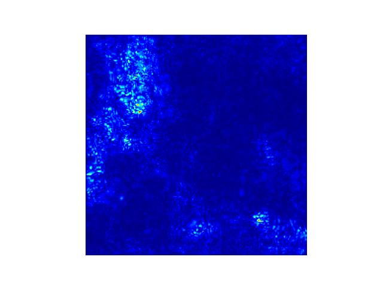
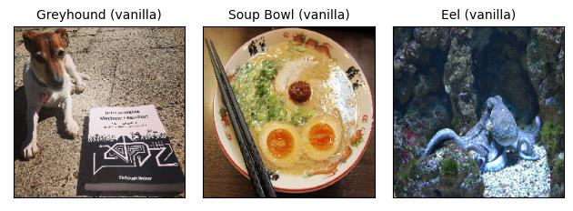
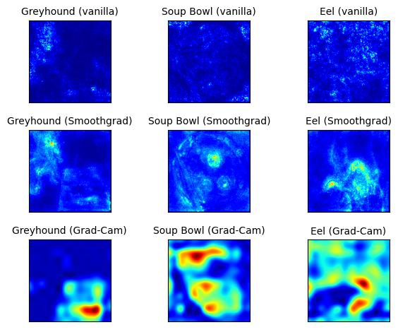

# فصل ۲۸: نقشه‌های برجستگی (Saliency Maps)

> **عنوان اصلی:** Saliency Maps  
> **منبع:** [https://christophm.github.io/interpretable-ml-book/pixel-attribution.html](https://christophm.github.io/interpretable-ml-book/pixel-attribution.html)  
> **نویسنده:** Christoph Molnar  
> **مترجم:** مریم محمودی

---

روش‌های انتساب پیکسلی (pixel attribution) پیکسل‌هایی را که در طبقه‌بندی یک تصویر توسط شبکه‌ی عصبی نقش داشته‌اند برجسته می‌کنند. شکل ۲۸.۱ نمونه‌ای از این نوع توضیح است.

در ادامه‌ی این فصل خواهیم دید که این تصویر دقیقاً چه اطلاعاتی را به ما می‌دهد. روش‌های انتساب پیکسلی با نام‌های گوناگونی شناخته می‌شوند: نقشه‌ی حساسیت (sensitivity map)، نقشه‌ی برجستگی (saliency map)، نقشه‌ی انتساب پیکسلی (pixel attribution map)، روش‌های انتساب مبتنی بر گرادیان (gradient-based attribution methods)، ربط ویژگی (feature relevance)، انتساب ویژگی (feature attribution) و مشارکت ویژگی (feature contribution).

انتساب پیکسلی نوع خاصی از انتساب ویژگی است که برای تصاویر به کار می‌رود. انتساب ویژگی، پیش‌بینی‌های منفرد را از طریق نسبت دادن سهم هر ویژگی ورودی — به میزان تأثیر مثبت یا منفی آن بر پیش‌بینی — توضیح می‌دهد. این ویژگی‌ها می‌توانند پیکسل‌های تصویر، داده‌های جدولی یا کلمات باشند. SHAP (شپ)، مقادیر شپلی (Shapley Values) و LIME (لایم) نمونه‌هایی از روش‌های عمومی انتساب ویژگی هستند.

در اینجا شبکه‌های عصبی‌ای را در نظر می‌گیریم که خروجی‌شان بردار طولِ $C$ است؛ رگرسیون نیز با $C=1$ در این چارچوب می‌گنجد. خروجی شبکه‌ی عصبی برای تصویر $\mathbf{x}$ را $S(\mathbf{x})=[S_1(\mathbf{x}),\ldots,S_C(\mathbf{x})]$ می‌نامیم. همه‌ی این روش‌ها ورودی $\mathbf{x} \in\mathbb{R}^p$ (که می‌تواند پیکسل‌های تصویر، داده‌های جدولی، کلمات و غیره باشد) با $p$ ویژگی را دریافت می‌کنند و برای هر یک از $p$ ویژگی ورودی یک امتیاز ربط (relevance score) به عنوان توضیح تولید می‌کنند: $\mathbf{R}^c=[R_1^c,\ldots,R_p^c]$. نماد $c$ نشان‌دهنده‌ی ربط برای خروجی $c$ام، یعنی $S_C(\mathbf{x})$، است.

گوناگونی رویکردهای انتساب پیکسلی ممکن است گیج‌کننده باشد. برای درک بهتر، می‌توان این روش‌ها را در دو دسته‌ی کلی جای داد:

**مبتنی بر پوشش یا اختلال (Occlusion- or perturbation-based):** روش‌هایی مثل SHAP و LIME با دستکاری بخش‌هایی از تصویر، توضیح تولید می‌کنند (مدل-مستقل).

**مبتنی بر گرادیان (Gradient-based):** بسیاری از روش‌ها گرادیان پیش‌بینی (یا امتیاز طبقه‌بندی) را نسبت به ویژگی‌های ورودی محاسبه می‌کنند. روش‌های مبتنی بر گرادیان — که تعداد زیادی دارند — عمدتاً در شیوه‌ی محاسبه‌ی گرادیان با یکدیگر تفاوت دارند.

وجه اشتراک هر دو رویکرد آن است که توضیح تولیدشده ابعادی همسان با تصویر ورودی دارد (یا دست‌کم می‌توان آن را به صورت معنادار روی تصویر نمایش داد) و به هر پیکسل مقداری نسبت می‌دهند که می‌توان آن را به عنوان میزان ربط آن پیکسل به پیش‌بینی یا طبقه‌بندی تصویر تفسیر کرد.

دسته‌بندی مفید دیگری برای روش‌های انتساب پیکسلی، پرسش درباره‌ی «تصویر مرجع» است:

**روش‌های صرفاً گرادیانی (Gradient-only methods)** به ما می‌گویند آیا تغییر در یک پیکسل، پیش‌بینی را تغییر می‌دهد یا نه. گرادیان ساده (Vanilla Gradient) و Grad-CAM (Selvaraju et al. 2017) از این دسته‌اند. تفسیر انتساب گرادیان-محور چنین است: اگر مقادیر رنگی آن پیکسل را افزایش دهیم، احتمال کلاس پیش‌بینی‌شده بالا می‌رود (گرادیان مثبت) یا پایین می‌آید (گرادیان منفی). هر چه قدر مطلق گرادیان بزرگ‌تر باشد، تأثیر تغییر در آن پیکسل قوی‌تر است.

**روش‌های انتساب مسیری (Path-attribution methods)** تصویر فعلی را با یک تصویر مرجع مقایسه می‌کنند؛ این مرجع می‌تواند یک تصویر «صفر» مصنوعی مثل تصویری کاملاً خاکستری باشد. تفاوت در پیش‌بینی واقعی و خط مبنا میان پیکسل‌ها تقسیم می‌شود. تصویر مرجع می‌تواند توزیعی از تصاویر هم باشد. این دسته شامل روش‌های گرادیانی مدل-محور مثل Deep Taylor و Integrated Gradients (Sundararajan, Taly, and Yan 2017) و نیز روش‌های مدل-مستقل مثل LIME و SHAP می‌شود. برخی روش‌های انتساب مسیری «کامل» هستند؛ یعنی مجموع امتیازات ربط همه‌ی ویژگی‌های ورودی برابر با تفاوت پیش‌بینی تصویر و پیش‌بینی تصویر مرجع است. SHAP و Integrated Gradients از این دسته‌اند. در روش‌های انتساب مسیری، تفسیر همواره نسبت به تصویر مرجع انجام می‌شود: تفاوت امتیازهای طبقه‌بندی تصویر واقعی و تصویر مرجع به پیکسل‌ها نسبت داده می‌شود.

> **نکته — انتخاب تصویر مرجع**
>
> انتخاب تصویر مرجع (یا توزیع مرجع) تأثیر زیادی بر توضیح نهایی دارد. فرض معمول این است که از یک تصویر (توزیع) «خنثی» استفاده شود. البته کاملاً ممکن است از سلفی مورد علاقه‌ی خود استفاده کنید، اما باید از خود بپرسید که آیا این در کاربرد موردنظر منطقی است. البته چنین کاری بین اعضای تیم پروژه نفوذ بی‌چون‌وچرایی ایجاد می‌کند.

در این مرحله معمولاً توضیح شهودی از نحوه‌ی کارکرد این روش‌ها ارائه می‌دهم، اما فکر می‌کنم بهتر است مستقیماً با روش گرادیان ساده (Vanilla Gradient) شروع کنیم، چرا که این روش دستور العمل کلی را که بسیاری از روش‌های دیگر دنبال می‌کنند به خوبی نشان می‌دهد.

## گرادیان ساده (Vanilla Gradient)

ایده‌ی گرادیان ساده که توسط Simonyan، Vedaldi و Zisserman (۲۰۱۴) به عنوان یکی از اولین رویکردهای انتساب پیکسلی معرفی شد، اگر پس‌انتشار (backpropagation) را بدانید، بسیار ساده است. (نام اصلی این روش «Image-Specific Class Saliency» بود، اما گرادیان ساده را ترجیح می‌دهم.) ما گرادیان تابع زیان برای کلاس مورد نظر را نسبت به پیکسل‌های ورودی محاسبه می‌کنیم. این کار نقشه‌ای به اندازه‌ی ویژگی‌های ورودی با مقادیر منفی تا مثبت تولید می‌کند.

دستور العمل این رویکرد به شرح زیر است:

۱. گذر رو به جلو (forward pass) تصویر مورد نظر را انجام دهید.
۲. گرادیان امتیاز کلاس مورد نظر را نسبت به پیکسل‌های ورودی محاسبه کنید:

$$E_{grad}(\mathbf{x}_0)=\frac{\delta S_c}{\delta \mathbf{x}}|_{\mathbf{x}=\mathbf{x}_0}$$

در اینجا همه‌ی کلاس‌های دیگر را برابر صفر قرار می‌دهیم.
۳. گرادیان‌ها را تجسم کنید. می‌توانید مقادیر قدرمطلق را نمایش دهید یا مشارکت‌های منفی و مثبت را جداگانه برجسته کنید.

به صورت رسمی‌تر، تصویر $\mathbf{x}$ داریم و شبکه‌ی عصبی کانولوشنی برای کلاس $c$ امتیاز $S_c(\mathbf{x})$ را به آن می‌دهد. این امتیاز تابعی بسیار غیرخطی از تصویر ماست. ایده‌ی استفاده از گرادیان این است که می‌توانیم این امتیاز را با اعمال بسط تیلور مرتبه‌ی اول تقریب بزنیم:

$$S_c(\mathbf{x}) \approx \mathbf{w}^T \mathbf{x} + b$$

که در آن $\mathbf{w}$ مشتق امتیاز ماست:

$$\mathbf{w} = \frac{\delta S_c}{\delta \mathbf{x}}|_{\mathbf{x}_0}$$

اکنون در نحوه‌ی انجام گذر رو به عقب (backward pass) گرادیان‌ها ابهامی وجود دارد، چرا که واحدهای غیرخطی مثل ReLU (Rectified Linear Unit، یکسوساز خطی) علامت را «حذف» می‌کنند. در نتیجه هنگام گذر رو به عقب نمی‌دانیم که فعال‌سازی مثبت بوده است یا منفی. با استفاده از هنر ASCII بی‌نظیرم، تابع ReLU چنین به نظر می‌رسد: _/ و به صورت $\text{ReLU}(\mathbf{x}_{l}) = \max(0, \mathbf{x}_l)$ تعریف می‌شود. این بدان معناست که وقتی فعال‌سازی یک نورون صفر است، نمی‌دانیم چه مقداری را باید پس‌انتشار دهیم. در گرادیان ساده، این ابهام به شکل زیر رفع می‌شود:

$$\frac{\delta f}{\delta \mathbf{x}_l} = \frac{\delta f}{\delta \mathbf{x}_{l+1}} \cdot I(\mathbf{x}_l > 0)$$

در اینجا $I$ تابع اندیکاتور عنصر به عنصر است که در جایی که فعال‌سازی لایه‌ی پایین‌تر منفی بوده صفر، و در جایی که مثبت یا صفر بوده یک است. گرادیان ساده گرادیانی را که تا لایه‌ی $l+1$ پس‌انتشار داده‌ایم می‌گیرد و سپس در جاهایی که فعال‌سازی لایه‌ی پایین‌تر منفی بوده گرادیان‌ها را صفر می‌کند.

مثالی ببینیم که در آن لایه‌های $\mathbf{x}_l$ و $\mathbf{x}_{l+1} = \text{ReLU}(\mathbf{x}_{l})$ داریم. فعال‌سازی فرضی در $\mathbf{x}_l$ چنین است:

$$
\begin{pmatrix}
1 & 0 \\
-1 & -10 \\
\end{pmatrix}
$$

و گرادیان‌های ما در $\mathbf{x}_{l+1}$ اینگونه‌اند:

$$
\begin{pmatrix}
0.4 & 1.1 \\
-0.5 & -0.1 \\
\end{pmatrix}
$$

در نتیجه گرادیان‌های ما در $\mathbf{x}_l$ به صورت زیر خواهند بود:

$$
\begin{pmatrix}
0.4 & 0 \\
0 & 0 \\
\end{pmatrix}
$$

گرادیان ساده مشکل اشباع (saturation) دارد، همان‌طور که Shrikumar، Greenside و Kundaje (۲۰۱۷) توضیح داده‌اند. وقتی از ReLU استفاده می‌شود و فعال‌سازی به زیر صفر می‌رود، فعال‌سازی در صفر محدود می‌شود و دیگر تغییر نمی‌کند؛ به این حالت اشباع می‌گویند. برای مثال: ورودی لایه دو نورون با وزن‌های $-1$ و $-1$ و یک بایاس $1$ دارد. پس از عبور از لایه‌ی ReLU، فعال‌سازی برابر نورون۱ + نورون۲ خواهد بود اگر مجموع هر دو نورون کمتر از $1$ باشد. اگر مجموع هر دو ورودی بزرگ‌تر از ۱ باشد، فعال‌سازی در مقدار اشباع‌شده‌ی ۱ باقی می‌ماند (چون وزن‌ها منفی هستند). همچنین گرادیان در این نقطه صفر خواهد بود و گرادیان ساده خواهد گفت که این نورون اهمیتی ندارد.

و اکنون، خوانندگان عزیز، روش دیگری را که تقریباً رایگان یاد می‌گیرید: DeconvNet.

## DeconvNet

DeconvNet که توسط Zeiler و Fergus (۲۰۱۴) معرفی شد، تقریباً یکسان با گرادیان ساده است. هدف DeconvNet معکوس کردن یک شبکه‌ی عصبی است و مقاله عملیاتی را پیشنهاد می‌دهد که معکوس لایه‌های فیلترسازی، تجمیع (pooling) و فعال‌سازی هستند. اگر مقاله را نگاه کنید، بسیار با گرادیان ساده متفاوت به نظر می‌رسد، اما به جز معکوس‌سازی لایه‌ی ReLU، DeconvNet معادل رویکرد گرادیان ساده است. در واقع گرادیان ساده را می‌توان تعمیمی از DeconvNet دانست. DeconvNet انتخاب متفاوتی برای پس‌انتشار گرادیان از طریق ReLU دارد:

$$R_n = R_{n+1} I(R_{n+1} > 0)$$

که در آن $R_n$ و $R_{n+1}$ بازسازی‌های لایه هستند و $I$ تابع اندیکاتور است. هنگام گذر رو به عقب از لایه‌ی $n$ به لایه‌ی $n-1$، DeconvNet «به یاد می‌آورد» کدام فعال‌سازی‌ها در لایه‌ی $n$ در گذر رو به جلو صفر شده بودند و آن‌ها را در لایه‌ی $n-1$ نیز صفر می‌کند. فعال‌سازی‌هایی با مقدار منفی در لایه‌ی $n$ در لایه‌ی $n-1$ صفر می‌شوند. گرادیان $\mathbf{X}_n$ برای مثال قبلی به این شکل در می‌آید:

$$
\begin{pmatrix}
0.4 & 1.1 \\
0 & 0  \\
\end{pmatrix}
$$

## Grad-CAM

Grad-CAM (Selvaraju et al. 2017) توضیحات تصویری برای تصمیمات شبکه‌های عصبی کانولوشنی (CNN) ارائه می‌دهد. بر خلاف سایر روش‌ها، گرادیان تمام مسیر تا تصویر پس‌انتشار داده نمی‌شود؛ بلکه (معمولاً) تا آخرین لایه‌ی کانولوشنی می‌رسد تا یک نقشه‌ی مکان‌یابی درشت (coarse localization map) تولید کند که نواحی مهم تصویر را برجسته می‌کند.

Grad-CAM مخفف Gradient-weighted Class Activation Map است و همان‌طور که از نامش پیداست، بر اساس گرادیان شبکه‌ی عصبی کار می‌کند. Grad-CAM، مانند دیگر تکنیک‌ها، به هر نورون امتیاز ربطی برای تصمیم مورد نظر نسبت می‌دهد. این تصمیم می‌تواند پیش‌بینی کلاس (که در لایه‌ی خروجی قرار دارد) باشد، اما از نظر تئوری می‌تواند هر لایه‌ی دیگری از شبکه‌ی عصبی هم باشد. Grad-CAM این اطلاعات را به آخرین لایه‌ی کانولوشنی پس‌انتشار می‌دهد. Grad-CAM با انواع مختلف CNN قابل استفاده است: با لایه‌های کاملاً متصل، برای خروجی‌های ساختارمند مثل توصیف تصویر (captioning)، در خروجی‌های چندوظیفه‌ای، و برای یادگیری تقویتی.

بیایید ابتدا به صورت شهودی Grad-CAM را بررسی کنیم. هدف Grad-CAM درک این است که یک لایه‌ی کانولوشنی برای طبقه‌بندی خاصی به کدام بخش‌های تصویر «نگاه می‌کند». یادآوری کنیم که اولین لایه‌ی کانولوشنی CNN تصویر را به عنوان ورودی می‌گیرد و نقشه‌های ویژگی (feature maps) را که ویژگی‌های آموخته‌شده را رمزگذاری می‌کنند، خروجی می‌دهد (به فصل ویژگی‌های آموخته‌شده مراجعه کنید). لایه‌های کانولوشنی سطح بالاتر همین کار را می‌کنند، اما نقشه‌های ویژگی لایه‌های کانولوشنی قبلی را به عنوان ورودی می‌گیرند. برای درک نحوه‌ی تصمیم‌گیری CNN، Grad-CAM تحلیل می‌کند کدام نواحی در نقشه‌های ویژگی آخرین لایه‌های کانولوشنی فعال شده‌اند. $k$ نقشه‌ی ویژگی در آخرین لایه‌ی کانولوشنی وجود دارد که آن‌ها را $A_1, A_2, \ldots, A_k$ می‌نامیم. چطور می‌توانیم از روی نقشه‌های ویژگی بفهمیم که شبکه‌ی عصبی کانولوشنی چه طبقه‌بندی‌ای انجام داده است؟ در اولین رویکرد می‌توانیم به سادگی مقادیر خام هر نقشه‌ی ویژگی را تجسم کنیم، میانگین بگیریم و این را روی تصویرمان بگذاریم. اما این مفید نیست چرا که نقشه‌های ویژگی اطلاعاتی را برای **همه‌ی کلاس‌ها** رمزگذاری می‌کنند، در حالی که ما به کلاس خاصی علاقه داریم. Grad-CAM باید تشخیص دهد هر یک از $k$ نقشه‌ی ویژگی چقدر برای کلاس $c$ مورد نظرمان اهمیت داشت. باید قبل از میانگین‌گیری، هر پیکسل از هر نقشه‌ی ویژگی را با گرادیان وزن‌دهی کنیم. این کار یک نقشه‌ی حرارتی (heatmap) تولید می‌کند که نواحی دارای تأثیر مثبت یا منفی بر کلاس مورد نظر را برجسته می‌کند. سپس این نقشه‌ی حرارتی از تابع ReLU عبور می‌کند، که به زبان ساده یعنی همه‌ی مقادیر منفی را صفر می‌کنیم. Grad-CAM همه‌ی مقادیر منفی را با استفاده از ReLU حذف می‌کند، با این استدلال که تنها به بخش‌هایی که به کلاس انتخابی $c$ کمک می‌کنند علاقه داریم، نه به کلاس‌های دیگر. واژه‌ی پیکسل در اینجا ممکن است گمراه‌کننده باشد چرا که نقشه‌ی ویژگی کوچک‌تر از تصویر است (به دلیل واحدهای تجمیع) اما به تصویر اصلی نگاشت می‌شود. سپس نقشه‌ی Grad-CAM را برای مقاصد تجسم به بازه‌ی $[0,1]$ نرمال می‌کنیم و روی تصویر اصلی می‌گذاریم.

دستور العمل Grad-CAM را ببینیم. هدف یافتن نقشه‌ی مکان‌یابی است که به صورت زیر تعریف می‌شود:

$$L^c_{\text{Grad-CAM}} \in \mathbb{R}^{U \times V} = \underbrace{\text{ReLU}}_{\text{انتخاب مقادیر مثبت}}\left(\sum_{k} \alpha_k^c A^k\right)$$

که در آن $U$ عرض، $V$ ارتفاع توضیح، و $c$ کلاس مورد نظر است.

۱. تصویر ورودی را از طریق شبکه‌ی عصبی کانولوشنی پیش‌انتشار (forward-propagate) دهید.
۲. امتیاز خام کلاس مورد نظر را بیابید، یعنی فعال‌سازی نورون قبل از لایه‌ی softmax.
۳. فعال‌سازی همه‌ی کلاس‌های دیگر را صفر کنید.
۴. گرادیان کلاس مورد نظر را تا آخرین لایه‌ی کانولوشنی قبل از لایه‌های کاملاً متصل پس‌انتشار دهید: $\frac{\delta y^c}{\delta A^k}$.
۵. هر «پیکسل» نقشه‌ی ویژگی را با گرادیان آن کلاس وزن‌دهی کنید. نماینده‌های $u$ و $v$ به ابعاد عرض و ارتفاع اشاره دارند:

$$\alpha_k^c = \overbrace{\frac{1}{Z}\sum_{u}\sum_{v}}^{\text{میانگین‌گیری سراسری}} \underbrace{\frac{\delta y^c}{\delta A_{uv}^k}}_{\text{گرادیان‌ها از طریق پس‌انتشار}}$$

این بدان معناست که گرادیان‌ها به صورت سراسری تجمیع می‌شوند.
۶. میانگین نقشه‌های ویژگی را محاسبه کنید، وزن‌دهی‌شده به ازای هر پیکسل با گرادیان مربوطه.
۷. ReLU را بر نقشه‌ی ویژگی میانگین‌گرفته‌شده اعمال کنید.
۸. برای تجسم: مقادیر را به بازه‌ی $[0, 1]$ مقیاس‌بندی کنید. تصویر را بزرگ‌نمایی کنید و روی تصویر اصلی بگذارید.
۹. گام اضافی برای Guided Grad-CAM: نقشه‌ی حرارتی را با نتیجه‌ی پس‌انتشار هدایت‌شده ضرب کنید.

## Guided Grad-CAM

از توضیح Grad-CAM می‌توان حدس زد که مکان‌یابی بسیار درشت است، چرا که آخرین نقشه‌های ویژگی کانولوشنی در مقایسه با تصویر ورودی وضوح بسیار کمتری دارند. در مقابل، سایر تکنیک‌های انتساب تمام مسیر را تا پیکسل‌های ورودی پس‌انتشار می‌دهند و بنابراین بسیار جزئی‌تر هستند و می‌توانند لبه‌های منفرد یا نقاطی که بیشترین نقش را در یک پیش‌بینی داشته‌اند نشان دهند. ترکیبی از هر دو روش Guided Grad-CAM نام دارد و فوق‌العاده ساده است. برای یک تصویر هم توضیح Grad-CAM و هم توضیح یک روش انتساب دیگر مثل گرادیان ساده را محاسبه می‌کنید. سپس خروجی Grad-CAM با درون‌یابی دوخطی (bilinear interpolation) بزرگ‌نمایی می‌شود و هر دو نقشه به صورت عنصر به عنصر ضرب می‌شوند. Grad-CAM مانند یک عدسی عمل می‌کند که روی بخش‌های خاصی از نقشه‌ی انتساب پیکسلی تمرکز می‌کند.

## SmoothGrad

ایده‌ی SmoothGrad که توسط Smilkov و همکاران (۲۰۱۷) مطرح شد، کاهش نویز توضیحات مبتنی بر گرادیان است از طریق افزودن نویز و میانگین‌گیری روی این گرادیان‌های نویزی مصنوعی. SmoothGrad یک روش توضیح مستقل نیست، بلکه افزونه‌ای برای هر روش توضیح مبتنی بر گرادیان است.

SmoothGrad به شرح زیر عمل می‌کند:

۱. چندین نسخه از تصویر مورد نظر با افزودن نویز به آن تولید کنید.
۲. نقشه‌های انتساب پیکسلی را برای همه‌ی تصاویر بسازید.
۳. نقشه‌های انتساب پیکسلی را میانگین بگیرید.

بله، به همین سادگی. چرا این باید کارساز باشد؟ تئوری این است که مشتق در مقیاس‌های کوچک نوسانات شدیدی دارد. شبکه‌های عصبی در طول آموزش انگیزه‌ای برای نگه داشتن گرادیان‌ها هموار ندارند؛ هدف آن‌ها صرفاً طبقه‌بندی درست تصاویر است. میانگین‌گیری روی چندین نقشه این نوسانات را «هموار» می‌کند:

$$R_{sg}(\mathbf{x})=\frac{1}{N}\sum_{i=1}^N R(\mathbf{x} + \mathbf{g}_i)$$

که در آن $\mathbf{g}_i \sim N(0, \sigma^2)$ بردارهای نویز نمونه‌گرفته‌شده از توزیع گاوسی هستند. سطح «ایده‌آل» نویز به تصویر ورودی و شبکه بستگی دارد. نویسندگان سطح نویز ۱۰٪ تا ۲۰٪ را پیشنهاد می‌کنند، به این معنا که $\frac{\sigma}{x_{max} - x_{min}}$ باید بین ۰.۱ و ۰.۲ باشد. حدود $x_{min}$ و $x_{max}$ به حداقل و حداکثر مقادیر پیکسلی تصویر اشاره دارند. پارامتر دیگر تعداد نمونه‌ها $n$ است که پیشنهاد شده $n = 50$ باشد، چرا که بالاتر از این مقدار بهبود چشمگیری حاصل نمی‌شود.

## مثال‌ها

بیایید ببینیم این نقشه‌ها چه شکلی هستند و روش‌ها از نظر کیفی چگونه با هم مقایسه می‌شوند. شبکه‌ی مورد بررسی VGG-16 (Simonyan and Zisserman 2015) است که روی ImageNet آموزش دیده و می‌تواند ۱٬۰۰۰ کلاس مختلف را تشخیص دهد. برای تصاویر زیر، توضیحاتی برای کلاس با بالاترین امتیاز طبقه‌بندی تولید می‌کنیم.

شکل ۲۸.۲ تصاویر و طبقه‌بندی آن‌ها توسط شبکه‌ی عصبی را نشان می‌دهد:

تصویر سمت چپ با سگ محترم نگهبان کتاب یادگیری ماشین تفسیرپذیر، با احتمال ۳۵٪ به عنوان «Greyhound» طبقه‌بندی شده است (به نظر می‌رسد «کتاب یادگیری ماشین تفسیرپذیر» جزء ۲۰ هزار کلاس نبوده). تصویر وسط کاسه‌ای از سوپ رامن خوشمزه را نشان می‌دهد و با احتمال ۵۰٪ به درستی به عنوان «Soup Bowl» طبقه‌بندی شده. تصویر سوم اختاپوسی را در بستر اقیانوس نشان می‌دهد که با احتمال بالای ۷۰٪ به اشتباه به عنوان «Eel» (مار آبی) طبقه‌بندی شده است.

شکل ۲۸.۳ انتسابات پیکسلی که طبقه‌بندی را توضیح می‌دهند نشان می‌دهد:

متأسفانه کمی آشفته است. اما بیایید توضیحات منفرد را بررسی کنیم، با شروع از سگ. هم گرادیان ساده و هم SmoothGrad خود سگ را برجسته می‌کنند که منطقی است. اما هر دو بخش‌هایی از اطراف کتاب را هم برجسته می‌کنند که عجیب است. Grad-CAM تنها ناحیه‌ی کتاب را برجسته می‌کند که اصلاً منطقی نیست. و از اینجا به بعد کمی آشفته‌تر می‌شود. به نظر می‌رسد روش گرادیان ساده برای هم سوپ و هم اختاپوس (یا همان‌طور که شبکه فکر می‌کند، مار آبی) شکست می‌خورد. هر دو تصویر مثل تصاویر ماندگار پس از نگاه کردن مستقیم به خورشید هستند. (لطفاً مستقیم به خورشید نگاه نکنید.) SmoothGrad کمک زیادی می‌کند؛ دست‌کم نواحی مشخص‌تری نشان می‌دهد. در مثال سوپ، برخی مواد مثل تخم‌مرغ و گوشت برجسته می‌شوند، اما ناحیه‌ی اطراف چاپستیک‌ها هم هستند. در تصویر اختاپوس، عمدتاً خود حیوان برجسته شده. برای کاسه‌ی سوپ، Grad-CAM بخش تخم‌مرغ و به دلایلی نامشخص، بخش بالایی کاسه را برجسته می‌کند. توضیحات Grad-CAM برای اختاپوس هم آشفته‌تر از این هستند.

از همین اینجا می‌توان دشواری‌های ارزیابی درستی توضیحات را دید. در گام اول باید در نظر بگیریم کدام بخش‌های تصویر حاوی اطلاعات مرتبط با طبقه‌بندی تصویر هستند. اما سپس باید در مورد آنچه شبکه‌ی عصبی ممکن است برای طبقه‌بندی استفاده کرده باشد هم فکر کنیم. شاید کاسه‌ی سوپ بر اساس ترکیب تخم‌مرغ و چاپستیک‌ها به درستی طبقه‌بندی شده، آن‌طور که SmoothGrad نشان می‌دهد؟ یا شاید شبکه‌ی عصبی شکل کاسه به همراه برخی مواد را تشخیص داده، آن‌طور که Grad-CAM پیشنهاد می‌دهد؟ ما نمی‌دانیم.

و این مشکل اصلی همه‌ی این روش‌هاست. برای توضیحات هیچ حقیقت زمینه‌ای (ground truth) نداریم. تنها می‌توانیم در گام اول توضیحاتی را که آشکارا بی‌معنی هستند رد کنیم (و حتی در این گام هم اطمینان زیادی نداریم). فرایند پیش‌بینی در شبکه‌ی عصبی بسیار پیچیده است.

## نقاط قوت

توضیحات **تصویری** هستند و ما به سرعت تصاویر را تشخیص می‌دهیم. به ویژه وقتی روش‌ها فقط پیکسل‌های مهم را برجسته می‌کنند، تشخیص سریع نواحی مهم تصویر آسان است.

روش‌های مبتنی بر گرادیان معمولاً **سریع‌تر از روش‌های مدل-مستقل محاسبه می‌شوند**. برای مثال، LIME و SHAP نیز می‌توانند برای توضیح طبقه‌بندی تصاویر استفاده شوند، اما محاسبه‌ی آن‌ها هزینه‌ی بیشتری دارد.

**روش‌های بسیاری برای انتخاب وجود دارند**.

## محدودیت‌ها

مانند اغلب روش‌های تفسیر، **تشخیص درستی یک توضیح دشوار است** و بخش بزرگی از ارزیابی صرفاً کیفی است («این توضیحات به نظر تقریباً درست می‌رسند، مقاله را منتشر کنیم»).

روش‌های انتساب پیکسلی می‌توانند بسیار **شکننده** باشند. Ghorbani، Abid و Zou (۲۰۱۹) نشان دادند که معرفی اغتشاشات کوچک (دشمنانه) به یک تصویر، که همچنان به همان پیش‌بینی منجر می‌شوند، می‌تواند باعث شود پیکسل‌های بسیار متفاوتی به عنوان توضیح برجسته شوند.

Kindermans و همکاران (۲۰۱۹) نیز نشان دادند که این روش‌های انتساب پیکسلی **می‌توانند کاملاً غیرقابل اعتماد باشند**. آن‌ها یک انتقال ثابت به داده‌های ورودی اضافه کردند، یعنی همان تغییرات پیکسلی را به همه‌ی تصاویر افزودند. سپس دو شبکه را مقایسه کردند: شبکه‌ی اصلی و شبکه‌ی «انتقال‌یافته» که بایاس اولین لایه‌اش برای انطباق با انتقال ثابت پیکسلی تغییر کرده. هر دو شبکه پیش‌بینی‌های یکسان تولید می‌کنند. علاوه بر این، گرادیان در هر دو یکسان است. اما توضیحات تغییر کردند، که خاصیتی نامطلوب است. این آزمایش روی DeepLift، گرادیان ساده و Integrated Gradients انجام شد.

> **هشدار — چندین روش را مقایسه کنید**
>
> هنگام تکیه‌ی صرف بر روش‌های انتساب پیکسلی برای تفسیر، احتیاط کنید. اغتشاشات کوچک در ورودی می‌توانند حتی اگر پیش‌بینی‌ها تغییر نکنند، به توضیحاتی کاملاً متفاوت منجر شوند. همیشه توضیحات را با روش‌های متعدد اعتبارسنجی کنید تا از استحکام آن‌ها اطمینان حاصل کنید.

مقاله‌ی «Sanity checks for saliency maps» (Adebayo et al. 2018) بررسی کرد آیا روش‌های برجستگی **نسبت به مدل و داده بی‌تفاوت هستند**. بی‌تفاوتی کاملاً نامطلوب است چرا که به این معنی خواهد بود که «توضیح» به مدل و داده ربطی ندارد. روش‌هایی که به مدل و داده‌های آموزشی حساسیت ندارند مشابه آشکارسازهای لبه (edge detectors) هستند. آشکارسازهای لبه صرفاً تغییرات شدید رنگ پیکسلی در تصاویر را برجسته می‌کنند و به هیچ مدل پیش‌بینی یا ویژگی‌های انتزاعی تصویر ربط ندارند و نیازی به آموزش هم ندارند. روش‌های آزمایش‌شده عبارت بودند از: گرادیان ساده، Gradient × Input، Integrated Gradients، Guided Backpropagation، Guided Grad-CAM و SmoothGrad (با گرادیان ساده). گرادیان ساده و Grad-CAM آزمون بی‌تفاوتی را گذراندند، در حالی که Guided Backpropagation و Guided Grad-CAM در آن شکست خوردند. اما خود مقاله‌ی بررسی‌های اعتبارسنجی توسط Tomsett و همکاران (۲۰۲۰) با مقاله‌ای به نام «Sanity checks for saliency metrics» (بله، همان اسم) مورد انتقاد قرار گرفت. آن‌ها کمبود سازگاری در معیارهای ارزیابی را یافتند (می‌دانم، موضوع خیلی فرامتنی شده). پس دوباره به همان جایی رسیدیم که بودیم... ارزیابی توضیحات تصویری همچنان دشوار است و این برای متخصصان بسیار چالش‌برانگیز است.

در مجموع، این **وضعیت رضایت‌بخشی نیست**. باید کمی صبر کنیم تا تحقیقات بیشتری در این زمینه انجام شود. و لطفاً، دیگر روش‌های برجستگی جدیدی اختراع نکنید؛ به جای آن بر نحوه‌ی ارزیابی آن‌ها دقت بیشتری داشته باشید.

## نرم‌افزار

پیاده‌سازی‌های نرم‌افزاری متعددی از روش‌های انتساب پیکسلی وجود دارد. برای این مثال از [tf-keras-vis](https://pypi.org/project/tf-keras-vis/) استفاده شده است. یکی از جامع‌ترین کتابخانه‌ها [iNNvestigate](https://github.com/albermax/innvestigate) (Alber et al. 2019) است که گرادیان ساده، SmoothGrad، DeconvNet، Guided Backpropagation، PatternNet، LRP (Bach et al. 2015) و موارد دیگر را پیاده‌سازی کرده است. بسیاری از روش‌ها در [DeepExplain Toolbox](https://github.com/marcoancona/DeepExplain) نیز پیاده‌سازی شده‌اند.

---

Bach, Sebastian, Alexander Binder, Grégoire Montavon, Frederick Klauschen, Klaus-Robert Müller, and Wojciech Samek. 2015. "On Pixel-Wise Explanations for Non-Linear Classifier Decisions by Layer-Wise Relevance Propagation." *PLOS ONE* 10 (7): e0130140. <https://doi.org/10.1371/journal.pone.0130140>.

Ghorbani, Amirata, Abubakar Abid, and James Zou. 2019. "Interpretation of Neural Networks Is Fragile." *Proceedings of the AAAI Conference on Artificial Intelligence* 33 (01): 3681–88. <https://doi.org/10.1609/aaai.v33i01.33013681>.

Kindermans, Pieter-Jan, Sara Hooker, Julius Adebayo, Maximilian Alber, Kristof T. Schütt, Sven Dähne, Dumitru Erhan, and Been Kim. 2019. "The (Un)reliability of Saliency Methods." In *Explainable AI: Interpreting, Explaining and Visualizing Deep Learning*, edited by Wojciech Samek, Grégoire Montavon, Andrea Vedaldi, Lars Kai Hansen, and Klaus-Robert Müller, 267–80. Cham: Springer International Publishing. <https://doi.org/10.1007/978-3-030-28954-6_14>.

Selvaraju, Ramprasaath R., Michael Cogswell, Abhishek Das, Ramakrishna Vedantam, Devi Parikh, and Dhruv Batra. 2017. "Grad-CAM: Visual Explanations from Deep Networks via Gradient-Based Localization." In *2017 IEEE International Conference on Computer Vision (ICCV)*, 618–26. <https://doi.org/10.1109/ICCV.2017.74>.

Shrikumar, Avanti, Peyton Greenside, and Anshul Kundaje. 2017. "Learning Important Features Through Propagating Activation Differences." In *Proceedings of the 34th International Conference on Machine Learning - Volume 70*, 3145–53. ICML'17. Sydney, NSW, Australia: JMLR.org.

Simonyan, Karen, Andrea Vedaldi, and Andrew Zisserman. 2014. "Deep Inside Convolutional Networks: Visualising Image Classification Models and Saliency Maps." arXiv. <https://doi.org/10.48550/arXiv.1312.6034>.

Simonyan, Karen, and Andrew Zisserman. 2015. "Very Deep Convolutional Networks for Large-Scale Image Recognition." arXiv. <https://doi.org/10.48550/arXiv.1409.1556>.

Smilkov, Daniel, Nikhil Thorat, Been Kim, Fernanda Viégas, and Martin Wattenberg. 2017. "SmoothGrad: Removing Noise by Adding Noise." arXiv. <https://doi.org/10.48550/arXiv.1706.03825>.

Sundararajan, Mukund, Ankur Taly, and Qiqi Yan. 2017. "Axiomatic Attribution for Deep Networks." In *Proceedings of the 34th International Conference on Machine Learning - Volume 70*, 3319–28. ICML'17. Sydney, NSW, Australia: JMLR.org.

Tomsett, Richard, Dan Harborne, Supriyo Chakraborty, Prudhvi Gurram, and Alun Preece. 2020. "Sanity Checks for Saliency Metrics." *Proceedings of the AAAI Conference on Artificial Intelligence* 34 (04): 6021–29. <https://doi.org/10.1609/aaai.v34i04.6064>.

Zeiler, Matthew D., and Rob Fergus. 2014. "Visualizing and Understanding Convolutional Networks." In *Computer Vision – ECCV 2014*, edited by David Fleet, Tomas Pajdla, Bernt Schiele, and Tinne Tuytelaars, 818–33. Cham: Springer International Publishing. <https://doi.org/10.1007/978-3-319-10590-1_53>.
