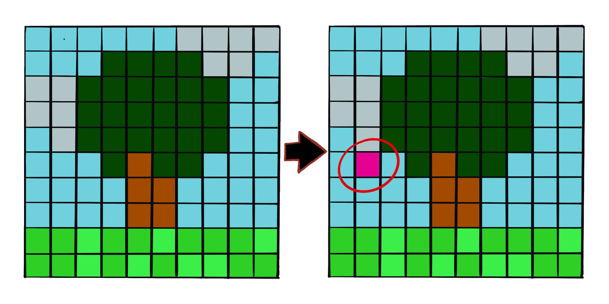
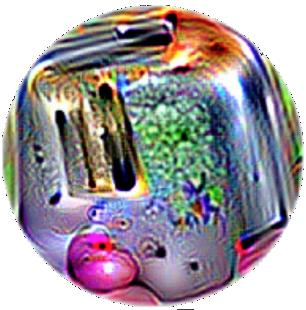
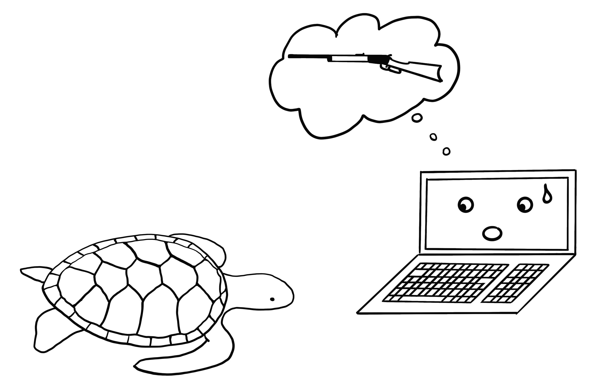

# فصل ۳۰: نمونه‌های متخاصم

> **عنوان اصلی:** Adversarial Examples  
> **منبع:** [https://christophm.github.io/interpretable-ml-book/adversarial.html](https://christophm.github.io/interpretable-ml-book/adversarial.html)  
> **نویسنده:** Christoph Molnar  
> **مترجم:** مریم محمودی

---

نمونه‌ی متخاصم (Adversarial Example) یک نمونه‌ی داده است که با اعمال تغییرات کوچک و عمدی در ویژگی‌هایش، مدل یادگیری ماشین را به پیش‌بینی اشتباه وادار می‌کند. پیش از مطالعه‌ی این فصل، پیشنهاد می‌شود فصل مربوط به [توضیحات پادواقعی](https://christophm.github.io/interpretable-ml-book/counterfactual.html) را مطالعه کنید، زیرا این دو مفهوم به‌شدت به هم شباهت دارند. نمونه‌های متخاصم در واقع همان توضیحات پادواقعی هستند، با این تفاوت که هدفشان فریب مدل است، نه تفسیر آن.

چرا به نمونه‌های متخاصم اهمیت می‌دهیم؟ مگر نه اینکه اینها صرفاً محصولات جانبی کنجکاوی‌برانگیز مدل‌های یادگیری ماشین هستند و کاربرد عملی ندارند؟ پاسخ قطعاً «خیر» است. نمونه‌های متخاصم مدل‌های یادگیری ماشین را در برابر حملات آسیب‌پذیر می‌کنند؛ چنانکه در سناریوهای زیر می‌بینیم.

یک خودروی خودران به خودروی دیگری برخورد می‌کند، چون یک تابلوی توقف را نادیده می‌گیرد. کسی تصویری روی آن تابلو چسبانده بود که برای انسان شبیه یک تابلوی توقف کثیف به نظر می‌رسید، اما طوری طراحی شده بود که نرم‌افزار تشخیص تابلوی خودرو آن را به‌عنوان تابلوی ممنوعیت پارک تفسیر کند.

یک سیستم تشخیص هرزنامه از دسته‌بندی یک ایمیل به‌عنوان اسپم ناکام می‌ماند. آن ایمیل هرزنامه طوری طراحی شده بود که شبیه یک ایمیل معمولی به نظر برسد، اما با نیت فریب گیرنده.

یک اسکنر مجهز به یادگیری ماشین در فرودگاه چمدان‌ها را برای یافتن سلاح بررسی می‌کند. چاقویی طراحی شده بود که سیستم، آن را به‌جای چاقو، چتر تشخیص دهد.

در ادامه به بررسی برخی روش‌های ساخت نمونه‌های متخاصم می‌پردازیم.

## روش‌ها و نمونه‌ها

تکنیک‌های متعددی برای ساخت نمونه‌های متخاصم وجود دارد. بیشتر رویکردها پیشنهاد می‌کنند فاصله‌ی بین نمونه‌ی متخاصم و نمونه‌ی اصلی را به حداقل برسانیم، در حالی که پیش‌بینی را به سمت نتیجه‌ی دلخواه (متخاصم) هدایت کنیم. برخی روش‌ها به گرادیان مدل دسترسی لازم دارند که البته تنها برای مدل‌های مبتنی بر گرادیان مانند شبکه‌های عصبی کارایی دارد، در حالی که روش‌های دیگر فقط به تابع پیش‌بینی دسترسی نیاز دارند و از این رو مدل-آگنوستیک هستند. روش‌های این بخش بر طبقه‌بندی تصاویر با شبکه‌های عصبی عمیق تمرکز دارند، چراکه پژوهش‌های فراوانی در این حوزه انجام شده و تجسم تصویری نمونه‌های متخاصم بسیار آموزنده است. نمونه‌های متخاصم برای تصاویر، تصاویری هستند با پیکسل‌های عمداً تغییریافته که هدفشان فریب مدل در زمان استفاده است. این نمونه‌ها به‌شکلی چشمگیر نشان می‌دهند که شبکه‌های عصبی عمیق برای تشخیص اشیا چقدر آسان می‌توانند با تصاویری که برای انسان بی‌خطر به نظر می‌رسند، فریب بخورند. اگر تاکنون این نمونه‌ها را ندیده‌اید، احتمالاً شگفت‌زده خواهید شد، چون تغییرات در پیش‌بینی‌ها برای یک ناظر انسانی کاملاً نامفهوم است. نمونه‌های متخاصم مانند توهمات بصری هستند، اما برای ماشین‌ها.

**چیزی با سگم درست نیست**

Szegedy و همکاران (۲۰۱۴) در اثر خود با عنوان «خواص شگفت‌انگیز شبکه‌های عصبی» از رویکرد بهینه‌سازی مبتنی بر گرادیان برای یافتن نمونه‌های متخاصم برای شبکه‌های عصبی عمیق استفاده کردند. یکی از نتایج آن را در شکل ۳۰.۱ می‌بینید.

این نمونه‌های متخاصم با به حداقل رساندن تابع زیر نسبت به $\mathbf{r}$ تولید شده‌اند:

$$\text{loss}(\hat{f}(\mathbf{x}+\mathbf{r}), l) + c \cdot |\mathbf{r}|$$

در این فرمول، $\mathbf{x}$ یک تصویر (به‌صورت بردار پیکسل‌ها) است، $\mathbf{r}$ تغییر در پیکسل‌ها برای ساخت تصویر متخاصم است ($\mathbf{x} + \mathbf{r}$ تصویر جدیدی تولید می‌کند)، $l$ کلاس نتیجه‌ی دلخواه است، و پارامتر $c$ برای ایجاد تعادل میان فاصله‌ی بین تصاویر و فاصله‌ی بین پیش‌بینی‌ها به‌کار می‌رود. جمله‌ی اول فاصله‌ی بین نتیجه‌ی پیش‌بینی‌شده‌ی نمونه‌ی متخاصم و کلاس دلخواه $l$ را اندازه می‌گیرد؛ جمله‌ی دوم فاصله‌ی بین نمونه‌ی متخاصم و تصویر اصلی را. این فرمول‌بندی تقریباً همان تابع خسارت برای تولید [توضیحات پادواقعی](https://christophm.github.io/interpretable-ml-book/counterfactual.html) است. محدودیت‌های اضافی برای $\mathbf{r}$ وجود دارد تا مقادیر پیکسل‌ها بین ۰ و ۱ باقی بمانند. نویسندگان پیشنهاد می‌کنند این مسئله‌ی بهینه‌سازی را با L-BFGS با قید کادری (box-constrained L-BFGS)، یک الگوریتم بهینه‌سازی مبتنی بر گرادیان، حل کنیم.

**پاندای مختل‌شده: روش علامت گرادیان سریع**

Goodfellow، Shlens و Szegedy (۲۰۱۵) روش علامت گرادیان سریع (fast gradient sign method) را برای تولید تصاویر متخاصم ابداع کردند. این روش از گرادیان مدل زیرین برای یافتن نمونه‌های متخاصم استفاده می‌کند. تصویر اصلی $\mathbf{x}$ با افزودن یا کاستن یک خطای کوچک $\epsilon$ از هر پیکسل دستکاری می‌شود. اینکه $\epsilon$ را اضافه کنیم یا کم کنیم بستگی دارد به علامت گرادیان برای هر پیکسل — مثبت یا منفی. افزودن خطا در جهت گرادیان یعنی تصویر عمداً به‌گونه‌ای تغییر می‌کند که طبقه‌بندی مدل با شکست مواجه شود.

فرمول اصلی روش علامت گرادیان سریع به‌صورت زیر است:

$$\mathbf{x}^\prime = \mathbf{x} + \epsilon \cdot \text{sign}\left(\nabla_{\mathbf{x}} J(\boldsymbol{\theta}, \mathbf{x}, y)\right)$$

که در آن $\nabla_{\mathbf{x}} J$ گرادیان تابع خسارت مدل نسبت به بردار پیکسل ورودی اصلی $\mathbf{x}$ است، $y$ برچسب واقعی برای $\mathbf{x}$ است، و $\boldsymbol{\theta}$ بردار پارامترهای مدل است. از بردار گرادیان (که به‌اندازه‌ی بردار پیکسل‌های ورودی است) تنها به علامت آن نیاز داریم: علامت گرادیان مثبت (+۱) است اگر افزایش شدت پیکسل، خسارت (خطای مدل) را افزایش دهد، و منفی (−۱) است اگر کاهش شدت پیکسل، خسارت را افزایش دهد. این آسیب‌پذیری زمانی رخ می‌دهد که یک شبکه‌ی عصبی رابطه‌ی بین شدت پیکسل ورودی و امتیاز کلاس را به‌صورت خطی مدل‌سازی کند. به‌ویژه معماری‌های شبکه‌ی عصبی که خطی‌بودن را ترجیح می‌دهند — مانند LSTM، شبکه‌های maxout، شبکه‌های با واحدهای فعال‌سازی ReLU — یا الگوریتم‌های یادگیری ماشین خطی دیگر مانند رگرسیون لجستیک، در برابر این روش آسیب‌پذیر هستند. حمله از طریق برون‌یابی (extrapolation) انجام می‌شود. خطی‌بودن رابطه‌ی بین شدت پیکسل ورودی و امتیازهای کلاس، مدل را در برابر داده‌های پرت آسیب‌پذیر می‌کند؛ یعنی می‌توان مدل را با حرکت دادن مقادیر پیکسل‌ها به حوزه‌هایی خارج از توزیع داده‌ها فریب داد. انتظار داشتم این نمونه‌های متخاصم کاملاً به یک معماری شبکه‌ی عصبی خاص وابسته باشند. اما معلوم شد می‌توان نمونه‌های متخاصم را برای فریب شبکه‌هایی با معماری متفاوت که روی همان وظیفه آموزش دیده‌اند، مجدداً استفاده کرد.

Goodfellow، Shlens و Szegedy (۲۰۱۵) پیشنهاد کردند نمونه‌های متخاصم به داده‌های آموزشی اضافه شوند تا مدل‌های مقاوم‌تری یاد گرفته شوند.

**یک عروس‌دریایی… نه، صبر کن. یک وان حمام: حمله‌ی یک‌پیکسلی**

رویکرد ارائه‌شده توسط Goodfellow و همکاران (۲۰۱۴) نیازمند تغییر پیکسل‌های بسیار است، هرچند اندک. اما اگر تنها بتوان یک پیکسل را تغییر داد چطور؟ آیا می‌توان مدل یادگیری ماشین را فریب داد؟ Su، Vargas و Sakurai (۲۰۱۹) نشان دادند که با تغییر یک پیکسل واحد واقعاً می‌توان طبقه‌بند تصاویر را فریب داد، همان‌طور که در شکل ۳۰.۲ نشان داده شده است.

همانند پادواقعی‌ها، حمله‌ی یک‌پیکسلی به دنبال نمونه‌ی اصلاح‌شده‌ای $\mathbf{x}^\prime$ می‌گردد که به تصویر اصلی $\mathbf{x}$ نزدیک باشد، اما پیش‌بینی را به نتیجه‌ای متخاصم تغییر دهد. با این حال، تعریف نزدیکی متفاوت است: تنها یک پیکسل مجاز به تغییر است. حمله‌ی یک‌پیکسلی از تکامل دیفرانسیلی (differential evolution) برای یافتن اینکه کدام پیکسل باید تغییر کند و چگونه، استفاده می‌کند. تکامل دیفرانسیلی به‌طور تقریبی از تکامل بیولوژیک گونه‌ها الهام گرفته است. یک جمعیت از افراد به نام راه‌حل‌های کاندیدا نسل به نسل با هم ترکیب می‌شوند تا راه‌حلی یافت شود. هر راه‌حل کاندیدا یک تغییر پیکسل را رمزگذاری می‌کند و به‌صورت برداری از پنج عنصر نمایش داده می‌شود: مختصات $x$ و $y$، و مقادیر قرمز، سبز و آبی (RGB). جستجو مثلاً با ۴۰۰ راه‌حل کاندیدا (= پیشنهادهای اصلاح پیکسل) شروع می‌شود و با استفاده از فرمول زیر، نسل جدیدی از راه‌حل‌های کاندیدا (فرزندان) از نسل والدین تولید می‌کند:

$$\mathbf{x}_{g+1}^{(i)} = \mathbf{x}_g^{(r1)} + F \cdot (\mathbf{x}_g^{(r2)}- \mathbf{x}_g^{(r3)})$$

که در آن هر $x^{(i)}$ یک عنصر از راه‌حل کاندیدا است (یا مختصات $x$، یا مختصات $y$، یا قرمز، سبز، یا آبی)، $g$ نسل فعلی است، $F$ یک پارامتر مقیاس‌بندی (برابر ۰.۵) است، و $r1$، $r2$ و $r3$ اعداد تصادفی متفاوتند. هر راه‌حل کاندیدای فرزند نیز یک پیکسل با پنج ویژگی مکان و رنگ است که هر یک از آنها ترکیبی از سه پیکسل والد تصادفی است.

تولید فرزندان زمانی متوقف می‌شود که یکی از راه‌حل‌های کاندیدا نمونه‌ی متخاصم باشد — یعنی به کلاس اشتباهی طبقه‌بندی شده باشد — یا به حداکثر تعداد تکرارهای تعیین‌شده توسط کاربر رسیده باشیم.

**همه چیز توستر است: وصله‌ی متخاصم**

یکی از روش‌های موردعلاقه‌ام، نمونه‌های متخاصم را وارد دنیای فیزیکی می‌کند. Brown و همکاران (۲۰۱۸) یک برچسب قابل چاپ طراحی کردند که می‌توان آن را در کنار اشیا چسباند تا برای یک طبقه‌بند تصویر شبیه توستر به نظر برسند؛ به شکل ۳۰.۳ نگاه کنید. کار درخشانی!

این روش با روش‌های قبلی ارائه‌شده برای نمونه‌های متخاصم تفاوت دارد، زیرا محدودیتی که نمونه‌ی متخاصم باید بسیار نزدیک به تصویر اصلی باشد برداشته شده است. در عوض، این روش بخشی از تصویر را با یک وصله (patch) جایگزین می‌کند که می‌تواند هر شکلی داشته باشد. تصویر وصله روی تصاویر پس‌زمینه‌ی مختلف، با موقعیت‌های مختلف روی تصاویر، گاهی جابه‌جا‌شده، گاهی بزرگ‌تر یا کوچک‌تر، و چرخیده بهینه‌سازی می‌شود تا وصله در موقعیت‌های گوناگون کارایی داشته باشد. در نهایت، این تصویر بهینه‌شده می‌تواند چاپ شده و برای فریب طبقه‌بندهای تصویر در دنیای واقعی استفاده شود.

**هرگز لاک‌پشت چاپ‌شده با پرینتر سه‌بعدی به یک نبرد نبرید — حتی اگر رایانه‌تان فکر کند ایده‌ی خوبی است: نمونه‌های متخاصم مقاوم**

روش بعدی به معنای واقعی کلمه یک بُعد جدید به توستر اضافه می‌کند: Athalye و همکاران (۲۰۱۸) یک لاک‌پشت با پرینتر سه‌بعدی چاپ کردند که طراحی شده بود از تقریباً تمام زوایای ممکن برای یک شبکه‌ی عصبی عمیق شبیه تفنگ به نظر برسد؛ شکل ۳۰.۴ را ببینید. بله، درست خواندید. یک شیء فیزیکی که برای انسان شبیه لاک‌پشت به نظر می‌رسد، برای رایانه شبیه تفنگ دیده می‌شود!

این نویسندگان راهی یافتند تا یک نمونه‌ی متخاصم سه‌بعدی برای یک طبقه‌بند دو‌بعدی بسازند که در برابر تبدیل‌هایی مانند تمام حالت‌های چرخش لاک‌پشت، زوم، و غیره نیز متخاصم بماند. سایر رویکردها، مانند روش گرادیان سریع، وقتی تصویر چرخیده می‌شود یا زاویه‌ی دید تغییر می‌کند دیگر کارایی ندارند. Athalye و همکاران (۲۰۱۷) الگوریتم انتظار روی تبدیل (Expectation Over Transformation — EOT) را پیشنهاد کردند که روشی برای تولید نمونه‌های متخاصمی است که حتی وقتی تصویر تبدیل می‌شود نیز کارایی دارند. ایده‌ی اصلی پشت EOT این است که نمونه‌های متخاصم را روی تبدیل‌های ممکن متعدد بهینه کنیم. به‌جای به حداقل رساندن فاصله‌ی بین نمونه‌ی متخاصم و تصویر اصلی، EOT امید ریاضی (expected value) فاصله‌ی بین این دو را با توجه به توزیع انتخاب‌شده‌ای از تبدیل‌های ممکن، زیر آستانه‌ای معین نگه می‌دارد. امید ریاضی فاصله زیر تبدیل را می‌توان به‌صورت زیر نوشت:

$$\mathbb{E}_{t \sim T}[d(t(\mathbf{x}^\prime), t(\mathbf{x}))]$$

که در آن $\mathbf{x}$ تصویر اصلی، $t(\mathbf{x})$ تصویر تبدیل‌یافته (مثلاً چرخیده)، $\mathbf{x}^\prime$ نمونه‌ی متخاصم، و $t(\mathbf{x}^\prime)$ نسخه‌ی تبدیل‌یافته‌ی آن است. علاوه بر کار با توزیعی از تبدیل‌ها، روش EOT از همان الگوی آشنای قاب‌بندی جستجو برای نمونه‌های متخاصم به‌صورت یک مسئله‌ی بهینه‌سازی پیروی می‌کند. می‌کوشیم نمونه‌ی متخاصم $\mathbf{x}^\prime$ را پیدا کنیم که احتمال کلاس انتخاب‌شده $y_t$ (مثلاً «تفنگ») را روی توزیع تبدیل‌های ممکن $T$ بیشینه کند:

$$\arg\max_{\mathbf{x}^\prime} \mathbb{E}_{t \sim T}[\log \mathbb{P}(y_t | t(\mathbf{x}^\prime))]$$

با این قید که امید ریاضی فاصله روی تمام تبدیل‌های ممکن بین نمونه‌ی متخاصم $\mathbf{x}^\prime$ و تصویر اصلی $\mathbf{x}$ زیر آستانه‌ای معین باقی بماند:

$$\mathbb{E}_{t \sim T}[d(t(\mathbf{x}^\prime), t(\mathbf{x}))] < \epsilon \quad \text{and} \quad \mathbf{x} \in [0,1]^d$$

فکر می‌کنم باید نگران امکاناتی باشیم که این روش فراهم می‌کند. سایر روش‌ها مبتنی بر دستکاری تصاویر دیجیتال هستند. اما این نمونه‌های متخاصم مقاوم چاپ‌شده با پرینتر سه‌بعدی را می‌توان در هر صحنه‌ی واقعی قرار داد و رایانه را فریب داد تا یک شیء را به‌اشتباه طبقه‌بندی کند. این را برعکس هم در نظر بگیرید: چه می‌شود اگر کسی تفنگی بسازد که شبیه لاک‌پشت باشد؟

**دشمن چشم‌بسته: حمله‌ی جعبه‌سیاه**

سناریوی زیر را تصور کنید: به شما از طریق یک Web API به طبقه‌بند تصویر فوق‌العاده‌ام دسترسی می‌دهم. می‌توانید پیش‌بینی‌هایی از مدل بگیرید، اما به پارامترهای مدل دسترسی ندارید. از راحتی کاناپه‌تان می‌توانید داده ارسال کنید و سرویس من طبقه‌بندی‌های متناظر را پاسخ می‌دهد. بیشتر حملات متخاصم برای کار در این سناریو طراحی نشده‌اند، زیرا برای یافتن نمونه‌های متخاصم به گرادیان شبکه‌ی عصبی زیرین نیاز دارند. Papernot و همکاران (۲۰۱۷) نشان دادند که می‌توان بدون اطلاعات داخلی مدل و بدون دسترسی به داده‌های آموزشی، نمونه‌های متخاصم ساخت. این نوع حمله با (تقریباً) هیچ دانش قبلی، حمله‌ی جعبه‌سیاه (black box attack) نامیده می‌شود.

نحوه‌ی کار:

۱. با چند تصویر از همان حوزه‌ای که داده‌های آموزشی از آن می‌آیند شروع کنید؛ مثلاً اگر طبقه‌بندی که باید مورد حمله قرار گیرد یک طبقه‌بند ارقام است، از تصاویر ارقام استفاده کنید. دانش حوزه لازم است، اما دسترسی به داده‌های آموزشی لازم نیست.
۲. پیش‌بینی‌هایی برای مجموعه‌ی فعلی تصاویر از جعبه‌سیاه بگیرید.
۳. یک مدل جایگزین (surrogate model) روی مجموعه‌ی فعلی تصاویر آموزش دهید (مثلاً یک شبکه‌ی عصبی).
۴. با استفاده از یک اکتشافی که بررسی می‌کند مدل در کدام جهت پیکسل‌های مجموعه‌ی فعلی تصاویر را دستکاری کند تا خروجی مدل واریانس بیشتری داشته باشد، یک مجموعه‌ی جدید از تصاویر مصنوعی بسازید.
۵. مراحل ۲ تا ۴ را برای تعداد از پیش تعیین‌شده‌ای از دوره‌ها تکرار کنید.
۶. نمونه‌های متخاصم برای مدل جایگزین با استفاده از روش گرادیان سریع (یا مشابه آن) بسازید.
۷. مدل اصلی را با نمونه‌های متخاصم مورد حمله قرار دهید.

هدف مدل جایگزین تقریب‌زدن به مرزهای تصمیم مدل جعبه‌سیاه است، نه لزوماً دستیابی به همان دقت.

نویسندگان این رویکرد را با حمله به طبقه‌بندهای تصویر آموزش‌دیده در سرویس‌های مختلف یادگیری ماشین ابری آزمایش کردند. این سرویس‌ها طبقه‌بندهای تصویر را روی تصاویر و برچسب‌های آپلودشده توسط کاربر آموزش می‌دهند. نرم‌افزار مدل را به‌طور خودکار — گاهی با الگوریتمی که برای کاربر ناشناخته است — آموزش داده و مستقر می‌کند. سپس طبقه‌بند برای تصاویر آپلودشده پیش‌بینی می‌دهد، اما خود مدل قابل بررسی یا دانلود نیست. نویسندگان توانستند برای ارائه‌دهندگان مختلف نمونه‌های متخاصم بیابند، به‌طوری که تا ۸۴٪ از نمونه‌های متخاصم اشتباه طبقه‌بندی شدند.

این روش حتی وقتی مدل جعبه‌سیاهی که باید فریب بخورد یک شبکه‌ی عصبی نباشد نیز کارایی دارد. این شامل مدل‌های یادگیری ماشینی بدون گرادیان مانند درخت‌های تصمیم نیز می‌شود.

## منظر امنیت سایبری

یادگیری ماشین با مجهولات شناخته‌شده سروکار دارد: پیش‌بینی نقاط داده‌ی ناشناخته از یک توزیع شناخته‌شده. دفاع در برابر حملات با مجهولات ناشناخته سروکار دارد: پیش‌بینی قوی نقاط داده‌ی ناشناخته از توزیع ناشناخته‌ای از ورودی‌های متخاصم. با ادغام یادگیری ماشین در سیستم‌های بیشتر و بیشتری مانند وسایل نقلیه‌ی خودران یا دستگاه‌های پزشکی، این سیستم‌ها به نقاط ورودی برای حملات نیز تبدیل می‌شوند. حتی اگر پیش‌بینی‌های یک مدل یادگیری ماشین روی مجموعه‌ی آزمایشی ۱۰۰٪ درست باشد، می‌توان نمونه‌های متخاصمی یافت که مدل را فریب دهند. دفاع از مدل‌های یادگیری ماشین در برابر حملات سایبری، بخش جدیدی از حوزه‌ی امنیت سایبری است.

Biggio و Roli (۲۰۱۸) مروری خوب بر ده سال پژوهش در یادگیری ماشین متخاصم ارائه می‌دهند که این بخش بر اساس آن نوشته شده است. امنیت سایبری یک مسابقه‌ی تسلیحاتی است که مهاجمان و مدافعان بارها و بارها یکدیگر را مات و مبهوت می‌کنند.

**سه قانون طلایی در امنیت سایبری وجود دارد: ۱) دشمنت را بشناس، ۲) پیشگیرانه عمل کن، و ۳) از خود محافظت کن.**

برنامه‌های کاربردی مختلف، دشمنان متفاوتی دارند. افرادی که از طریق ایمیل می‌کوشند از دیگران کلاهبرداری کنند، دشمنانی برای کاربران و ارائه‌دهندگان سرویس‌های ایمیل هستند. ارائه‌دهندگان می‌خواهند از کاربرانشان محافظت کنند تا بتوانند به استفاده از برنامه‌ی ایمیلشان ادامه دهند؛ مهاجمان می‌خواهند مردم را به دادن پول وادار کنند. شناختن دشمنانت یعنی شناختن اهدافشان. فرض کنید نمی‌دانید این هرزنامه‌نویسان وجود دارند و تنها سوءاستفاده از سرویس ایمیل ارسال کپی‌های غیرمجاز موسیقی است؛ در این صورت دفاع متفاوت خواهد بود (مثلاً اسکن پیوست‌ها برای مطالب دارای حق نشر به‌جای تحلیل متن برای شناسایی اسپم).

پیشگیرانه عمل کردن یعنی فعالانه نقاط ضعف سیستم را آزمایش و شناسایی کنید. شما پیشگیرانه عمل می‌کنید وقتی فعالانه می‌کوشید مدل را با نمونه‌های متخاصم فریب دهید و سپس در برابر آنها دفاع کنید. استفاده از روش‌های تفسیر برای درک اینکه کدام ویژگی‌ها مهم هستند و چگونه ویژگی‌ها بر پیش‌بینی تأثیر می‌گذارند، گامی پیشگیرانه در شناخت نقاط ضعف مدل یادگیری ماشین است. آیا به‌عنوان دانشمند داده، به مدلتان در این دنیای خطرناک بدون اینکه هرگز فراتر از قدرت پیش‌بینی روی مجموعه‌ی آزمایشی نگاهی انداخته باشید اعتماد می‌کنید؟ آیا تحلیل کرده‌اید که مدل در سناریوهای مختلف چه رفتاری دارد، مهم‌ترین ورودی‌ها را شناسایی کرده‌اید، و توضیحات پیش‌بینی را برای برخی نمونه‌ها بررسی کرده‌اید؟ آیا کوشیده‌اید ورودی‌های متخاصم بیابید؟ تفسیرپذیری مدل‌های یادگیری ماشین نقش اساسی در امنیت سایبری دارد. واکنشی عمل کردن، برعکس پیشگیرانه، یعنی منتظر ماندن تا سیستم مورد حمله قرار گیرد و تنها پس از آن، مسئله را درک کردن و اقدامات دفاعی را نصب کردن.

چگونه می‌توانیم سیستم‌های یادگیری ماشینمان را در برابر نمونه‌های متخاصم محافظت کنیم؟ رویکردی پیشگیرانه، آموزش مجدد تکراری طبقه‌بند با نمونه‌های متخاصم است که به آن آموزش متخاصم (adversarial training) نیز گفته می‌شود. رویکردهای دیگر بر نظریه‌ی بازی‌ها مبتنی هستند، مانند یادگیری تبدیل‌های ناوردا از ویژگی‌ها یا بهینه‌سازی مقاوم (منظم‌سازی). روش پیشنهادی دیگر استفاده از چندین طبقه‌بند به‌جای یک طبقه‌بند و رأی‌گیری میان آنها است (یادگیری گروهی یا ensemble)، اما این روش هیچ تضمینی ندارد، زیرا همه‌ی آنها می‌توانند از نمونه‌های متخاصم مشابهی آسیب ببینند. روش دیگری که آن هم به‌خوبی کار نمی‌کند پوشش گرادیان (gradient masking) است که با ساخت مدلی بدون گرادیان‌های مفید — مثلاً استفاده از طبقه‌بند نزدیک‌ترین همسایه به‌جای مدل اصلی — حاصل می‌شود.

می‌توانیم انواع حملات را بر اساس میزان اطلاعات مهاجم از سیستم تقسیم‌بندی کنیم. مهاجمان ممکن است دانش کامل داشته باشند (حمله‌ی جعبه‌سفید یا white box attack)، یعنی همه چیز درباره‌ی مدل بدانند مانند نوع مدل، پارامترها و داده‌های آموزشی؛ مهاجمان ممکن است دانش جزئی داشته باشند (حمله‌ی جعبه‌خاکستری یا gray box attack)، یعنی شاید فقط نمایش ویژگی و نوع مدل استفاده‌شده را بدانند، اما به داده‌های آموزشی یا پارامترها دسترسی نداشته باشند؛ مهاجمان ممکن است هیچ دانشی نداشته باشند (حمله‌ی جعبه‌سیاه یا black box attack)، یعنی تنها بتوانند مدل را به‌صورت جعبه‌سیاه پرس‌وجو کنند و هیچ دسترسی به داده‌های آموزشی یا اطلاعات پارامترهای مدل نداشته باشند. بسته به سطح اطلاعات، مهاجمان می‌توانند از تکنیک‌های مختلفی برای حمله به مدل استفاده کنند. همان‌طور که در مثال‌ها دیدیم، حتی در حالت جعبه‌سیاه نیز می‌توان نمونه‌های متخاصم ساخت، پس پنهان نگه داشتن اطلاعات درباره‌ی داده‌ها و مدل برای محافظت در برابر حملات کافی نیست.

با توجه به ماهیت بازی گربه و موش میان مهاجمان و مدافعان، شاهد توسعه و نوآوری فراوانی در این حوزه خواهیم بود. کافی است به انواع مختلف ایمیل‌های هرزنامه‌ای فکر کنید که پیوسته در حال تکامل هستند. روش‌های جدیدی برای حمله به مدل‌های یادگیری ماشین ابداع می‌شوند و اقدامات دفاعی جدیدی در برابر این حملات جدید پیشنهاد می‌شوند. حملات قوی‌تری برای فرار از آخرین خطوط دفاعی توسعه می‌یابند و الی آخر، بی‌پایان. امیدوارم با این فصل شما را نسبت به مسئله‌ی نمونه‌های متخاصم حساس کرده باشم و به این باور رسانده باشم که تنها با مطالعه‌ی پیشگیرانه‌ی مدل‌های یادگیری ماشین است که می‌توانیم نقاط ضعف را کشف و برطرف کنیم.

---

Athalye, Anish, Logan Engstrom, Andrew Ilyas, and Kevin Kwok. 2018. "Synthesizing Robust Adversarial Examples." In *International Conference on Machine Learning*, 284–93. PMLR.

Biggio, Battista, and Fabio Roli. 2018. "Wild Patterns: Ten Years After the Rise of Adversarial Machine Learning." *Pattern Recognition* 84 (December): 317–31. https://doi.org/10.1016/j.patcog.2018.07.023.

Brown, Tom B., Dandelion Mané, Aurko Roy, Martín Abadi, and Justin Gilmer. 2018. "Adversarial Patch." arXiv. https://doi.org/10.48550/arXiv.1712.09665.

Goodfellow, Ian J., Jonathon Shlens, and Christian Szegedy. 2015. "Explaining and Harnessing Adversarial Examples." arXiv. https://doi.org/10.48550/arXiv.1412.6572.

Papernot, Nicolas, Patrick McDaniel, Ian Goodfellow, Somesh Jha, Z. Berkay Celik, and Ananthram Swami. 2017. "Practical Black-Box Attacks Against Machine Learning." In *Proceedings of the 2017 ACM on Asia Conference on Computer and Communications Security*, 506–19. ASIA CCS '17. New York, NY, USA: Association for Computing Machinery. https://doi.org/10.1145/3052973.3053009.

Su, Jiawei, Danilo Vasconcellos Vargas, and Kouichi Sakurai. 2019. "One Pixel Attack for Fooling Deep Neural Networks." *IEEE Transactions on Evolutionary Computation* 23 (5): 828–41. https://doi.org/10.1109/TEVC.2019.2890858.

Szegedy, Christian, Wojciech Zaremba, Ilya Sutskever, Joan Bruna, Dumitru Erhan, Ian Goodfellow, and Rob Fergus. 2014. "Intriguing Properties of Neural Networks." arXiv. https://doi.org/10.48550/arXiv.1312.6199.
