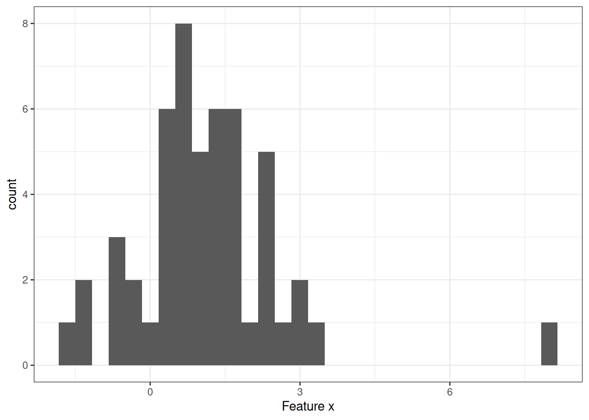
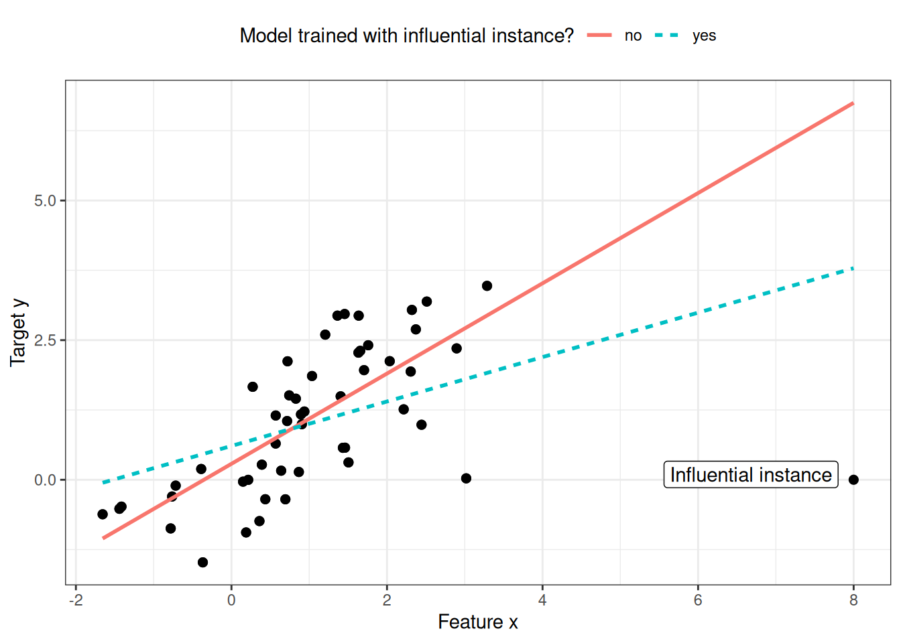
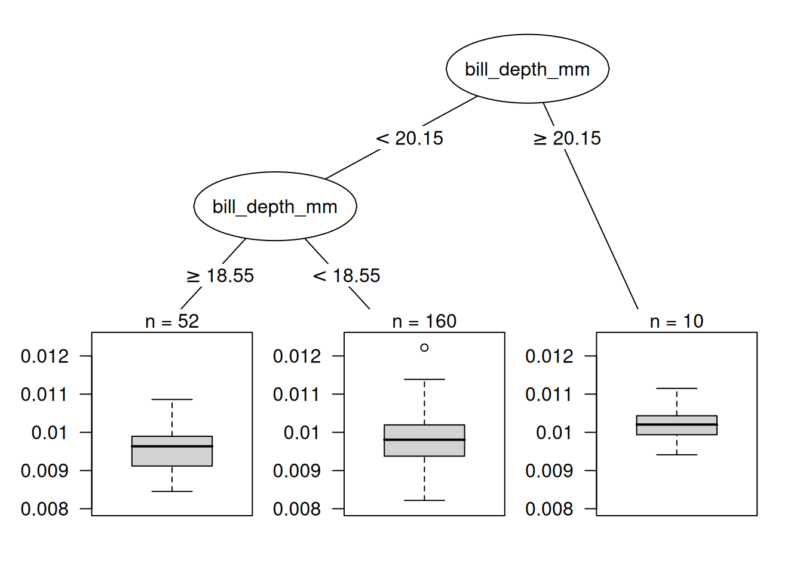
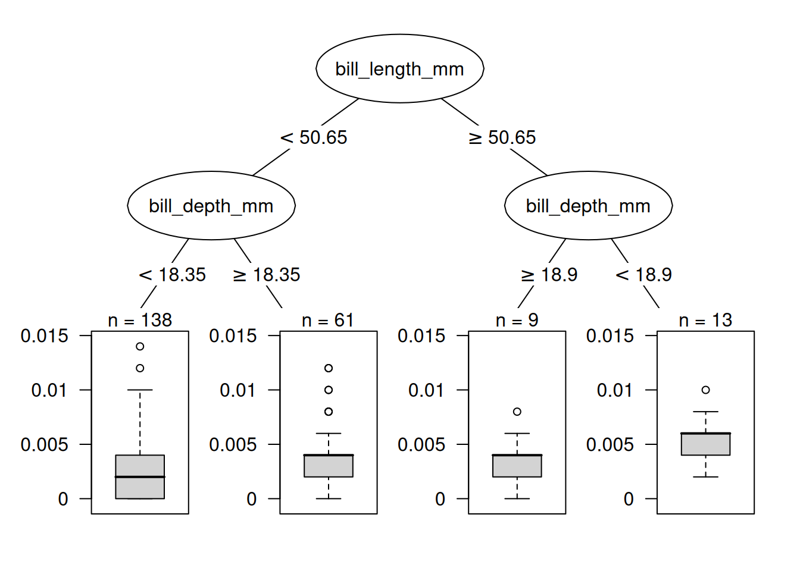

# فصل ۳۱: نمونه‌های تأثیرگذار

> **عنوان اصلی:** Influential Instances  
> **منبع:** [https://christophm.github.io/interpretable-ml-book/influential.html](https://christophm.github.io/interpretable-ml-book/influential.html)  
> **نویسنده:** Christoph Molnar  
> **مترجم:** مریم محمودی

---

مدل‌های یادگیری ماشین در نهایت حاصل داده‌های آموزشی هستند؛ حذف یکی از نمونه‌های آموزشی می‌تواند پارامترها یا پیش‌بینی‌های مدل را تحت تأثیر قرار دهد. یک نمونهٔ آموزشی را «تأثیرگذار» می‌نامیم اگر حذف آن از داده‌های آموزشی، پارامترها یا پیش‌بینی‌های مدل را به‌شکل قابل‌ملاحظه‌ای تغییر دهد. با شناسایی نمونه‌های تأثیرگذار می‌توان مدل‌های یادگیری ماشین را «اشکال‌زدایی» کرد و رفتار و پیش‌بینی‌های آن‌ها را بهتر تبیین نمود.

در این فصل دو رویکرد برای شناسایی نمونه‌های تأثیرگذار معرفی می‌شود: تشخیص‌های حذفی (Deletion Diagnostics) و توابع تأثیر (Influence Functions). هر دو رویکرد بر پایهٔ آمار مقاوم (Robust Statistics) بنا شده‌اند؛ آمار مقاومی که روش‌های آماری‌ای را ارائه می‌دهد که کمتر تحت تأثیر داده‌های پرت یا نقض فروض مدل قرار می‌گیرند. آمار مقاوم همچنین روش‌هایی برای سنجش میزان استواری برآوردهای حاصل از داده — مانند برآورد میانگین یا وزن‌های یک مدل پیش‌بینی — ارائه می‌کند.

تصور کنید می‌خواهید میانگین درآمد مردم شهرتان را برآورد کنید و از ده نفر تصادفی در خیابان می‌پرسید چقدر درمی‌آورند. فارغ از اینکه نمونهٔ شما احتمالاً خوب نیست، یک نفر چقدر می‌تواند برآورد میانگین درآمد شما را تحت تأثیر بگذارد؟ برای پاسخ به این سؤال می‌توان میانگین را با حذف یک‌به‌یک پاسخ‌ها بازمحاسبه کرد، یا از طریق «توابع تأثیر» به‌شکل ریاضی نشان داد که میانگین چقدر می‌تواند دستکاری شود. در رویکرد حذفی، میانگین را ده بار محاسبه می‌کنیم و هر بار یکی از اعلام درآمدها را حذف می‌کنیم تا ببینیم برآورد چقدر تغییر می‌کند. تغییر زیاد نشان‌دهندهٔ تأثیرگذاری بالای آن نمونه است. رویکرد دوم، وزن یکی از افراد را به اندازه‌ای بی‌نهایت کوچک افزایش می‌دهد که معادل محاسبهٔ مشتق اول یک آمارهٔ آماری یا پارامتر مدل است؛ این رویکرد را «رویکرد بی‌نهایت کوچک» یا «تابع تأثیر» نیز می‌نامند. پاسخ این است که برآورد میانگین می‌تواند به‌شدت تحت تأثیر یک پاسخ قرار گیرد، چون میانگین با مقادیر منفرد رابطهٔ خطی دارد. انتخاب مقاوم‌تر، میانه است (مقداری که نیمی از مردم بیشتر و نیمی کمتر از آن درمی‌آورند)، زیرا حتی اگر درآمد پردرآمدترین فرد نمونه ده برابر شود، میانهٔ حاصل تغییر نمی‌کند.

تشخیص‌های حذفی و توابع تأثیر را می‌توان بر پارامترها یا پیش‌بینی‌های مدل‌های یادگیری ماشین نیز اعمال کرد تا رفتار آن‌ها را بهتر درک کرده یا پیش‌بینی‌های فردی را تبیین نمود. پیش از بررسی این دو رویکرد برای یافتن نمونه‌های تأثیرگذار، تفاوت میان «داده‌پرت» و «نمونهٔ تأثیرگذار» را بررسی می‌کنیم.

**داده‌پرت (Outlier)**

داده‌پرت نمونه‌ای است که فاصلهٔ زیادی از سایر نمونه‌های مجموعه داده دارد. «فاصلهٔ زیاد» به این معنا است که فاصلهٔ آن، مثلاً فاصلهٔ اقلیدسی، با تمام نمونه‌های دیگر بسیار زیاد است. در یک مجموعه داده از نوزادان، نوزادی با وزن ۵ کیلوگرم داده‌پرت محسوب می‌شود. در مجموعه داده‌ای از حساب‌های بانکی که بیشتر آن‌ها حساب جاری هستند، یک حساب وام اختصاصی (موجودی منفی زیاد، تراکنش‌های اندک) داده‌پرت تلقی می‌شود. شکل ۳۱.۱ یک داده‌پرت را در یک توزیع یک‌بعدی نشان می‌دهد.

داده‌های پرت می‌توانند نقاط داده‌ای جالب باشند (به‌عنوان مثال [نقدها](https://christophm.github.io/interpretable-ml-book/proto.html)). وقتی یک داده‌پرت روی مدل تأثیر می‌گذارد، در عین حال یک نمونهٔ تأثیرگذار هم هست.

**نمونهٔ تأثیرگذار (Influential Instance)**

نمونهٔ تأثیرگذار یک نمونهٔ داده‌ای است که حذف آن تأثیر قوی‌ای بر مدل آموزش‌دیده می‌گذارد. هرچه با حذف یک نمونه از داده‌های آموزشی و آموزش مجدد مدل، پارامترها یا پیش‌بینی‌های مدل بیشتر تغییر کنند، آن نمونه تأثیرگذارتر است. اینکه یک نمونه برای مدل آموزش‌دیده تأثیرگذار باشد یا نه، به مقدار هدف y آن نمونه نیز بستگی دارد. شکل ۳۱.۲ یک نمونهٔ تأثیرگذار را برای یک مدل رگرسیون خطی نشان می‌دهد.

**چرا نمونه‌های تأثیرگذار به درک مدل کمک می‌کنند؟**

ایدهٔ اصلی پشت نمونه‌های تأثیرگذار برای تفسیرپذیری، ردیابی پارامترها و پیش‌بینی‌های مدل به ریشهٔ اصلی آن‌ها است: داده‌های آموزشی. یادگیرنده (Learner)، یعنی الگوریتمی که مدل یادگیری ماشین را تولید می‌کند، تابعی است که داده‌های آموزشی شامل ماتریس ویژگی‌ها $\mathbf{X}$ و بردار هدف $\mathbf{y}$ را دریافت و یک مدل یادگیری ماشین تولید می‌کند، همان‌طور که شکل ۳۱.۳ نشان می‌دهد. برای مثال، یادگیرندهٔ یک درخت تصمیم الگوریتمی است که ویژگی‌های تقسیم و مقادیر تقسیم را انتخاب می‌کند. یادگیرندهٔ یک شبکهٔ عصبی از پس‌انتشار (Backpropagation) برای یافتن بهترین وزن‌ها استفاده می‌کند.

ما می‌پرسیم اگر در فرآیند آموزش، نمونه‌هایی را از داده‌های آموزشی حذف کنیم، پارامترها یا پیش‌بینی‌های مدل چگونه تغییر می‌کنند. این رویکرد با سایر رویکردهای تفسیرپذیری که نحوهٔ تغییر پیش‌بینی را هنگام دست‌کاری ویژگی‌های نمونه‌های پیش‌بینی‌شونده تحلیل می‌کنند — مانند [نمودارهای وابستگی جزئی](https://christophm.github.io/interpretable-ml-book/pdp.html) یا [اهمیت ویژگی](https://christophm.github.io/interpretable-ml-book/feature-importance.html) — تفاوت اساسی دارد. در رویکرد نمونه‌های تأثیرگذار، مدل را ثابت در نظر نمی‌گیریم، بلکه آن را تابعی از داده‌های آموزشی می‌دانیم. نمونه‌های تأثیرگذار به ما کمک می‌کنند سؤالاتی درباره رفتار کلی مدل و پیش‌بینی‌های فردی پاسخ دهیم: کدام نمونه‌ها برای پارامترها یا پیش‌بینی‌های کلی مدل بیشترین تأثیر را داشته‌اند؟ کدام نمونه‌ها برای یک پیش‌بینی خاص بیشترین تأثیر را داشته‌اند؟ نمونه‌های تأثیرگذار به ما نشان می‌دهند کدام نمونه‌ها ممکن است برای مدل مشکل‌ساز باشند، کدام نمونه‌های آموزشی باید از نظر خطا بررسی شوند، و تصویری از استواری مدل به دست می‌دهند. اگر یک نمونهٔ منفرد تأثیر قوی‌ای بر پیش‌بینی‌ها و پارامترهای مدل داشته باشد، شاید نتوان به آن مدل اعتماد کرد. حداقل این موضوع انگیزه‌ای برای بررسی‌های بیشتر خواهد بود.

چگونه نمونه‌های تأثیرگذار را شناسایی کنیم؟ دو روش برای سنجش تأثیر داریم: نخست، نمونه را از داده‌های آموزشی حذف می‌کنیم، مدل را روی مجموعه دادهٔ کاهش‌یافته از نو آموزش می‌دهیم و تفاوت در پارامترها یا پیش‌بینی‌ها را (به‌صورت فردی یا روی کل مجموعه داده) مشاهده می‌کنیم. روش دوم، وزن یک نمونهٔ داده‌ای را از طریق تقریب تغییرات پارامتر بر مبنای گرادیان‌های پارامترهای مدل افزایش می‌دهد. آغاز با رویکرد حذفی که درک آن آسان‌تر است، درک رویکرد افزایش وزن را نیز تسهیل می‌کند.

## تشخیص‌های حذفی

آمارشناسان پژوهش‌های گسترده‌ای در حوزهٔ نمونه‌های تأثیرگذار، به‌ویژه برای مدل‌های رگرسیون خطی (تعمیم‌یافته)، انجام داده‌اند. با جستجوی عبارت «influential observations»، نخستین نتایج معیارهایی مانند DFBETA و فاصلهٔ کوک (Cook's Distance) هستند. **DFBETA** اثر حذف یک نمونه بر پارامترهای مدل را اندازه می‌گیرد. **فاصلهٔ کوک** (Cook ۱۹۷۷) اثر حذف یک نمونه بر پیش‌بینی‌های مدل را اندازه می‌گیرد. برای هر دو معیار باید مدل را بارها آموزش دهیم و هر بار یک نمونه را حذف کنیم. سپس پارامترها یا پیش‌بینی‌های مدل با تمام نمونه‌ها با پارامترها یا پیش‌بینی‌های مدلی که یکی از نمونه‌ها از آن حذف شده، مقایسه می‌شوند.

DFBETA به‌صورت زیر تعریف می‌شود:

$$DFBETA\_{i}=\boldsymbol{\beta}-\boldsymbol{\beta}^{(-i)}$$

که در آن $\boldsymbol{\beta}$ بردار وزن هنگام آموزش مدل روی تمام نمونه‌ها است و $\boldsymbol{\beta^{(-i)}}$ بردار وزن هنگام آموزش مدل بدون نمونهٔ $i$ است. کاملاً شهودی است. DFBETA تنها برای مدل‌هایی با پارامترهای وزنی — مانند رگرسیون لجستیک یا شبکه‌های عصبی — کار می‌کند و برای مدل‌هایی مانند درخت‌های تصمیم، مجموعه‌های درختی، برخی ماشین‌های بردار پشتیبان و غیره کاربرد ندارد.

فاصلهٔ کوک برای مدل‌های رگرسیون خطی ابداع شده است و تقریب‌هایی برای مدل‌های رگرسیون خطی تعمیم‌یافته نیز وجود دارد. فاصلهٔ کوک برای یک نمونهٔ آموزشی به‌صورت مجموع مقیاس‌شدهٔ مجذور تفاوت‌ها در پیامد پیش‌بینی‌شده هنگام حذف نمونهٔ $i$ از آموزش مدل تعریف می‌شود:

$$D\_i=\frac{\sum\_{j=1}^n(\hat{y}\_j-\hat{y}\_{j}^{(-i)})^2}{p\cdot{}MSE}$$

که در آن صورت کسر مجذور تفاوت بین پیش‌بینی‌های مدل با و بدون نمونهٔ $i$، جمع‌زده شده روی کل مجموعه داده، است. مخرج کسر تعداد ویژگی‌های $p$ ضربدر میانگین مربعات خطا (MSE) است. مخرج برای همهٔ نمونه‌ها یکسان است، صرف‌نظر از اینکه کدام نمونهٔ $i$ حذف شده باشد. فاصلهٔ کوک به ما می‌گوید وقتی نمونهٔ $i$ را از آموزش حذف می‌کنیم، خروجی پیش‌بینی‌شدهٔ مدل خطی چقدر تغییر می‌کند.

آیا می‌توان از فاصلهٔ کوک و DFBETA برای هر مدل یادگیری ماشینی استفاده کرد؟ DFBETA به پارامترهای مدل نیاز دارد، پس این معیار تنها برای مدل‌های پارامتریک کار می‌کند. فاصلهٔ کوک به پارامترهای مدل نیاز ندارد. جالب است که فاصلهٔ کوک معمولاً خارج از بافت مدل‌های خطی و خطی تعمیم‌یافته دیده نمی‌شود، اما ایدهٔ محاسبهٔ تفاوت بین پیش‌بینی‌های مدل پیش و پس از حذف یک نمونهٔ خاص بسیار کلی است. مشکل تعریف فاصلهٔ کوک در وجود MSE است که برای همهٔ انواع مدل‌های پیش‌بینی معنادار نیست (برای مثال، طبقه‌بندی).

ساده‌ترین معیار تأثیر برای اثر بر پیش‌بینی‌های مدل را می‌توان چنین نوشت:

$$\text{Influence}^{(-i)}=\frac{1}{n}\sum\_{k=1}^{n}\left|\hat{y}\_k-\hat{y}\_{k}^{(-i)}\right|$$

این عبارت اساساً صورت کسر فاصلهٔ کوک است، با این تفاوت که به‌جای مجذور تفاوت‌ها، قدر مطلق آن‌ها جمع می‌شود. این انتخاب به این دلیل انجام شده که در مثال‌های بعدی معنادارتر است. شکل کلی معیارهای تشخیص حذفی شامل انتخاب یک معیار (مانند پیامد پیش‌بینی‌شده) و محاسبهٔ تفاوت آن معیار برای مدل آموزش‌دیده روی تمام نمونه‌ها و هنگامی که نمونه حذف شده است، می‌باشد.

می‌توان تأثیر را به‌راحتی تجزیه کرد تا برای پیش‌بینی نمونهٔ $k$ نشان داد تأثیر نمونهٔ آموزشی $i$-ام چقدر بوده است:

$$\text{Influence}\_{k}^{(-i)}=\left|\hat{y}\_k - \hat{y}\_{k}^{(-i)}\right|$$

این رویکرد برای تفاوت در پارامترهای مدل یا تفاوت در زیان نیز کار می‌کند. در مثال زیر از این معیارهای ساده تأثیر استفاده می‌کنیم.

**مثال تشخیص‌های حذفی**

در مثال زیر، یک Random Forest برای پیش‌بینی [جنسیت پنگوئن](https://christophm.github.io/interpretable-ml-book/data.html#penguins) بر اساس اندازه‌گیری‌های بدن آموزش می‌دهیم و اندازه می‌گیریم کدام نمونه‌های آموزشی در مجموع و برای یک پیش‌بینی خاص بیشترین تأثیر را داشته‌اند. از آنجا که این یک مسئلهٔ طبقه‌بندی است، تأثیر را به‌صورت تفاوت در احتمال پیش‌بینی‌شده برای جنس مادهٔ می‌سنجیم. یک نمونه تأثیرگذار است اگر وقتی از آموزش مدل حذف می‌شود، احتمال پیش‌بینی‌شده به‌طور میانگین در کل مجموعه داده به‌شکل قابل‌توجهی افزایش یا کاهش یابد. سنجش تأثیر برای همهٔ ۲۲۲ نمونهٔ آموزشی مستلزم یک‌بار آموزش مدل روی تمام داده‌ها و ۲۲۲ بار آموزش مجدد با حذف یکی از نمونه‌ها است.

تأثیرگذارترین نمونه معیار تأثیری حدود ۰.۰۱۲ دارد. تأثیر ۰.۰۱۲ یعنی اگر نمونهٔ دوازدهم را حذف کنیم، احتمال پیش‌بینی‌شده به‌طور میانگین ۱.۲ درصد تغییر می‌کند. این عدد زیاد به نظر نمی‌رسد، اما میانگینی است روی کل داده که تنها از حذف ۱ نقطه داده به دست آمده است. اکنون می‌دانیم کدام نمونه‌های داده برای مدل بیشترین تأثیر را داشته‌اند. این دانش برای اشکال‌زدایی داده بسیار مفید است: آیا نمونهٔ مشکل‌داری وجود دارد؟ آیا خطاهای اندازه‌گیری وجود دارد؟ نمونه‌های تأثیرگذار اولین‌هایی هستند که باید از نظر خطا بررسی شوند، چون هر خطایی در آن‌ها به‌شدت بر پیش‌بینی‌های مدل اثر می‌گذارد.

> **نکته — ابتدا تأثیرگذارترین داده‌ها را مرور کنید**
>
> برای اشکال‌زدایی، ابتدا تأثیرگذارترین نمونه‌ها را مرور کنید تا وقت خود را روی داده‌هایی صرف کنید که بیشترین اهمیت را برای پیش‌بینی‌ها دارند.

فراتر از اشکال‌زدایی مدل، آیا می‌توان چیزی برای درک بهتر مدل آموخت؟ فقط چاپ کردن ۱۰ نمونهٔ تأثیرگذار اول خیلی مفید نیست، زیرا فقط یک جدول از نمونه‌های با ویژگی‌های فراوان است. تمام روش‌هایی که نمونه را به‌عنوان خروجی برمی‌گردانند، تنها در صورتی معنا دارند که روش خوبی برای بازنمایی آن‌ها داشته باشیم. اما وقتی می‌پرسیم «چه چیزی یک نمونهٔ تأثیرگذار را از یک نمونهٔ غیرتأثیرگذار متمایز می‌کند؟»، می‌توانیم درک بهتری کسب کنیم. این سؤال را می‌توان به یک مسئلهٔ رگرسیون تبدیل کرد و تأثیر هر نمونه را به‌عنوان تابعی از مقادیر ویژگی‌هایش مدل‌سازی کرد. در این مثال، یک درخت تصمیم (شکل ۳۱.۴) انتخاب شده که نشان می‌دهد داده‌هایی از پنگوئن‌های با منقار عمیق بیشترین تأثیر را بر ماشین بردار پشتیبان داشته‌اند.

این نخستین تحلیل تأثیر، تأثیرگذارترین نمونهٔ *کلی* را آشکار کرد. اکنون نمونهٔ هشتم را انتخاب می‌کنیم تا پیش‌بینی آن را با شناسایی تأثیرگذارترین نمونه‌های آموزشی تبیین کنیم. این یک سؤال شبه‌خلاف‌واقع است: اگر نمونهٔ $i$ را از فرآیند آموزش حذف کنیم، پیش‌بینی برای نمونهٔ ۸ چقدر تغییر می‌کند؟ این حذف را برای تمام نمونه‌ها تکرار می‌کنیم. سپس نمونه‌های آموزشی‌ای را انتخاب می‌کنیم که با حذف آن‌ها بیشترین تغییر در پیش‌بینی نمونهٔ ۸ رخ می‌دهد و از آن‌ها برای تبیین پیش‌بینی مدل برای آن نمونه استفاده می‌کنیم. درخت تصمیم در شکل ۳۱.۵ نشان می‌دهد چه نوع نمونه‌های آموزشی بیشترین تأثیر را بر پیش‌بینی نمونهٔ هشتم داشته‌اند. داده‌هایی از پنگوئن‌های با توده بدنی بالا و منقار عمیق تأثیر بیشتری بر پیش‌بینی نمونهٔ هشتم داشته‌اند.

این مثال‌ها نشان دادند که شناسایی نمونه‌های تأثیرگذار برای بررسی استواری مدل چقدر مفید است. یک مشکل رویکرد پیشنهادی این است که برای هر نمونهٔ آموزشی باید مدل را از نو آموزش داد. این آموزش مجدد می‌تواند بسیار کند باشد؛ اگر هزاران نمونهٔ آموزشی داشته باشید، باید مدل را هزاران بار آموزش دهید. فرض کنید آموزش مدل یک روز طول می‌کشد و ۱٬۰۰۰ نمونهٔ آموزشی دارید؛ در این صورت، محاسبهٔ نمونه‌های تأثیرگذار — بدون موازی‌سازی — نزدیک به ۳ سال طول خواهد کشید. هیچ‌کس این قدر وقت ندارد. در ادامهٔ این فصل، روشی معرفی می‌شود که نیازی به آموزش مجدد مدل ندارد.

## توابع تأثیر

*شما:* می‌خواهم بدانم یک نمونهٔ آموزشی چه تأثیری بر یک پیش‌بینی خاص دارد.
*پژوهش:* می‌توانید نمونهٔ آموزشی را حذف کنید، مدل را از نو آموزش دهید و تفاوت در پیش‌بینی را اندازه بگیرید.
*شما:* عالی! ولی آیا روشی دارید که بدون آموزش مجدد کار کند؟ خیلی وقت می‌برد.
*پژوهش:* آیا مدلی دارید با تابع زیانی که دو بار نسبت به پارامترهایش مشتق‌پذیر باشد؟
*شما:* یک شبکهٔ عصبی با زیان لجستیک آموزش دادم. بله، دارم.
*پژوهش:* پس می‌توانید تأثیر نمونه را بر پارامترها و پیش‌بینی مدل با **توابع تأثیر** تقریب بزنید. تابع تأثیر معیاری است که نشان می‌دهد پارامترها یا پیش‌بینی‌های مدل تا چه حد به یک نمونهٔ آموزشی وابسته‌اند. به‌جای حذف نمونه، این روش وزن نمونه را در تابع زیان به اندازهٔ بسیار کوچکی افزایش می‌دهد. این روش مستلزم تقریب تابع زیان در اطراف پارامترهای فعلی مدل با استفاده از گرادیان و ماتریس هسین است. افزایش وزن شبیه به حذف نمونه است.
*شما:* عالی، همین را می‌خواستم!

Koh و Liang (۲۰۱۷) پیشنهاد کردند از توابع تأثیر، روشی در آمار مقاوم، برای سنجش تأثیر یک نمونه بر پارامترها یا پیش‌بینی‌های مدل استفاده شود. مانند تشخیص‌های حذفی، توابع تأثیر پارامترها و پیش‌بینی‌های مدل را به نمونهٔ آموزشی مسئول ردیابی می‌کنند. اما به‌جای حذف نمونه‌های آموزشی، این روش تقریب می‌زند که اگر وزن نمونه در ریسک تجربی (مجموع زیان روی داده‌های آموزشی) افزایش یابد، مدل چقدر تغییر می‌کند.

روش توابع تأثیر نیازمند دسترسی به گرادیان زیان نسبت به پارامترهای مدل (یا نسبت به پیش‌بینی‌ها) است که تنها برای زیرمجموعه‌ای از مدل‌های یادگیری ماشین کار می‌کند. رگرسیون لجستیک، شبکه‌های عصبی و ماشین‌های بردار پشتیبان واجد شرایط هستند؛ روش‌های مبتنی بر درخت مانند Random Forest واجد شرایط نیستند. توابع تأثیر برای درک رفتار مدل، اشکال‌زدایی و شناسایی خطاها در مجموعه داده کمک می‌کنند.

**ریاضیات پشت توابع تأثیر**

ایدهٔ اصلی پشت توابع تأثیر، افزایش وزن زیان یک نمونهٔ آموزشی به اندازهٔ گامی بی‌نهایت کوچک $\epsilon$ است که پارامترهای جدید مدل را نتیجه می‌دهد:

$$\hat{\boldsymbol{\theta}}\_{\epsilon, \mathbf{z}} = \arg\min\_{\boldsymbol{\theta} \in \Theta} \left(\frac{1}{n}\sum\_{i=1}^n L(\mathbf{z}^{(i)}, \boldsymbol{\theta}) + \epsilon L(\mathbf{z}, \boldsymbol{\theta}) \right)$$

که در آن $\theta$ بردار پارامترهای مدل و $\hat{\boldsymbol{\theta}}\_{\epsilon, \mathbf{z}}$ بردار پارامتر پس از افزایش وزن $\mathbf{z}$ به اندازهٔ عددی بسیار کوچک $\epsilon$ است. $L$ تابع زیانی است که مدل با آن آموزش دیده، $\mathbf{z}^{(i)}$ داده‌های آموزشی و $\mathbf{z}$ نمونهٔ آموزشی‌ای است که می‌خواهیم وزنش را برای شبیه‌سازی حذفش افزایش دهیم. شهود پشت این فرمول این است: اگر وزن یک نمونهٔ خاص $\mathbf{z}^{(i)}$ را کمی ($\epsilon$) افزایش دهیم و وزن سایر نمونه‌ها را متناسب کاهش دهیم، زیان چقدر تغییر می‌کند؟ بردار پارامتر برای بهینه‌سازی این زیان ترکیبی جدید چه شکلی خواهد داشت؟ تابع تأثیر پارامترها — یعنی تأثیر افزایش وزن نمونهٔ آموزشی $\mathbf{z}$ بر پارامترها — به‌صورت زیر محاسبه می‌شود:

$$I\_{\text{up,params}}(\mathbf{z}) = \left.\frac{d \hat{\boldsymbol{\theta}}\_{\epsilon, \mathbf{z}}}{d\epsilon}\right|\_{\epsilon=0} = -H\_{\hat{\boldsymbol{\theta}}}^{-1} \nabla\_{\boldsymbol{\theta}} L(\mathbf{z}, \hat{\boldsymbol{\theta}})$$

عبارت آخر $\nabla\_{\boldsymbol{\theta}}L(\mathbf{z}, \hat{\boldsymbol{\theta}})$ گرادیان زیان نسبت به پارامترها برای نمونهٔ آموزشی با افزایش وزن است. گرادیان نرخ تغییر زیان آن نمونه است. نشان می‌دهد با تغییر اندک پارامترهای مدل $\hat{\boldsymbol{\theta}}$، زیان چقدر عوض می‌شود. یک مقدار مثبت در بردار گرادیان یعنی افزایش کوچک در پارامتر متناظر، زیان را افزایش می‌دهد؛ یک مقدار منفی یعنی افزایش آن پارامتر، زیان را کاهش می‌دهد. بخش اول $H^{-1}\_{\hat{\boldsymbol{\theta}}}$ معکوس ماتریس هسین (مشتق دوم زیان نسبت به پارامترهای مدل) است. ماتریس هسین نرخ تغییر گرادیان است، یا بر حسب زیان، نرخ تغییرِ نرخ تغییر زیان است. این ماتریس را می‌توان با استفاده از فرمول زیر تخمین زد:

$$H\_{\boldsymbol{\theta}} = \frac{1}{n}\sum\_{i=1}^n \nabla^2\_{\hat{\boldsymbol{\theta}}}L(\mathbf{z}^{(i)}, \hat{\boldsymbol{\theta}})$$

به زبان ساده‌تر: ماتریس هسین ثبت می‌کند که زیان در یک نقطهٔ خاص چقدر انحنا دارد. هسین یک ماتریس است نه یک بردار، زیرا انحنای زیان را توصیف می‌کند و این انحنا به جهتی که نگاه می‌کنیم بستگی دارد. محاسبهٔ واقعی ماتریس هسین اگر پارامترهای زیادی داشته باشید وقت‌گیر است. Koh و Liang ترفندهایی برای محاسبهٔ کارآمد آن پیشنهاد کردند که از حوصلهٔ این فصل خارج است. به‌روزرسانی پارامترهای مدل، آن‌طور که فرمول بالا توصیف می‌کند، معادل برداشتن یک گام نیوتن (Newton Step) پس از ایجاد یک بسط درجه‌دوم (Quadratic Expansion) پیرامون پارامترهای مدل تخمین‌زده شده است.

شهود پشت این فرمول چیست؟ فرمول از ایجاد یک بسط درجه‌دوم پیرامون پارامترهای $\hat{\boldsymbol{\theta}}$ به دست می‌آید. یعنی دقیقاً نمی‌دانیم — یا محاسبه‌اش خیلی پیچیده است — که زیان نمونهٔ $\mathbf{z}$ هنگام حذف/افزایش وزن دقیقاً چقدر تغییر می‌کند. پس تابع را به‌صورت محلی با استفاده از اطلاعات مربوط به شیب (= گرادیان) و انحنا (= ماتریس هسین) در تنظیم فعلی پارامترهای مدل تقریب می‌زنیم. با این تقریب از زیان، می‌توانیم محاسبه کنیم اگر وزن نمونهٔ $\mathbf{z}$ را افزایش دهیم پارامترهای جدید تقریباً چه شکلی خواهند داشت:

$$\hat{\boldsymbol{\theta}}\_{-\mathbf{z}} \approx \hat{\boldsymbol{\theta}} - \frac{1}{n} I\_{\text{up,params}}(\mathbf{z})$$

بردار پارامتر تقریبی اساساً پارامتر اصلی منهای گرادیان زیان $\mathbf{z}$ (چون می‌خواهیم زیان را کاهش دهیم) است که با انحنا (= ماتریس هسین معکوس) مقیاس‌بندی شده و با $\frac{1}{n}$ ضرب شده، چون وزن یک نمونهٔ آموزشی منفرد همین است.

شکل ۳۱.۶ نحوهٔ عملکرد افزایش وزن را نشان می‌دهد. محور x مقدار پارامتر $\boldsymbol{\theta}$ و محور y مقدار متناظر زیان با نمونهٔ $\mathbf{z}$ با وزن افزایش‌یافته را نشان می‌دهد. پارامتر مدل در اینجا برای نمایش یک‌بعدی است، اما در واقعیت معمولاً چندبعدی است. ما تنها $\frac{1}{n}$ در جهت بهبود زیان برای نمونهٔ $\mathbf{z}$ حرکت می‌کنیم. نمی‌دانیم زیان اگر $\mathbf{z}$ را حذف کنیم واقعاً چطور تغییر می‌کند، اما با مشتقات اول و دوم زیان، این تقریب درجه‌دوم را پیرامون پارامتر فعلی مدل می‌سازیم و رفتار واقعی زیان را با این تقریب شبیه‌سازی می‌کنیم.

در واقع لازم نیست پارامترهای جدید را محاسبه کنیم، بلکه می‌توانیم از تابع تأثیر به‌عنوان معیار تأثیر $\mathbf{z}$ بر پارامترها استفاده کنیم.

پیش‌بینی‌ها چگونه تغییر می‌کنند وقتی وزن نمونهٔ آموزشی $\mathbf{z}$ را افزایش می‌دهیم؟ می‌توانیم پارامترهای جدید را محاسبه کرده و سپس با مدل پارامترگذاری‌شدهٔ جدید پیش‌بینی کنیم، یا می‌توانیم تأثیر نمونهٔ $\mathbf{z}$ بر پیش‌بینی‌ها را مستقیماً محاسبه کنیم، چون می‌توان تأثیر را با قانون زنجیره محاسبه کرد:

$$\begin{align*}
I\_{up,loss}(\mathbf{z}, \mathbf{z}\_{test}) & = \left.\frac{d L(\mathbf{z}\_{test},\hat{\boldsymbol{\theta}}\_{\epsilon, \mathbf{z}})}{d\epsilon}\right|\_{\epsilon=0} \\\\
& = \left.\nabla\_{\boldsymbol{\theta}}L(\mathbf{z}\_{test},\hat{\boldsymbol{\theta}})^T \frac{d\hat{\boldsymbol{\theta}}\_{\epsilon,\mathbf{z}}}{d \epsilon}\right|\_{\epsilon=0} \\\\
& = -\nabla\_{\boldsymbol{\theta}}L(\mathbf{z}\_{test}, \hat{\boldsymbol{\theta}})^T H^{-1}\_{\boldsymbol{\theta}} \nabla\_{\boldsymbol{\theta}} L(\mathbf{z},\hat{\boldsymbol{\theta}})
\end{align*}$$

خط اول این معادله یعنی تأثیر یک نمونهٔ آموزشی بر یک پیش‌بینی خاص $\mathbf{z}\_{test}$ را به‌عنوان تغییر در زیان نمونهٔ آزمایشی هنگام افزایش وزن نمونهٔ $\mathbf{z}$ و دریافت پارامترهای جدید $\hat{\theta}\_{\epsilon,z}$ اندازه می‌گیریم. در خط دوم، قانون زنجیرهٔ مشتق را اعمال کرده‌ایم و مشتق زیان نمونهٔ آزمایشی نسبت به پارامترها ضربدر تأثیر $\mathbf{z}$ بر پارامترها را به دست آورده‌ایم. در خط سوم، عبارت را با تابع تأثیر برای پارامترها جایگزین می‌کنیم. جملهٔ اول در خط سوم $\nabla\_{\boldsymbol{\theta}} L(\mathbf{z}\_{test},\hat{\boldsymbol{\theta}})^T$ گرادیان نمونهٔ آزمایشی نسبت به پارامترهای مدل است.

داشتن یک فرمول روش علمی و دقیق است. اما درک شهودی فرمول نیز بسیار مهم است. فرمول $I\_{\text{up,loss}}$ می‌گوید: تأثیر نمونهٔ آموزشی $\mathbf{z}$ بر پیش‌بینی نمونهٔ $\mathbf{z}\_{test}$ برابر است با «شدت واکنش نمونه به تغییر پارامترهای مدل» ضربدر «میزان تغییر پارامترها هنگام افزایش وزن $\mathbf{z}$». به عبارت دیگر: تأثیر متناسب است با بزرگی گرادیان‌های زیان آموزشی و آزمایشی. هرچه گرادیان زیان آموزشی بزرگ‌تر باشد، تأثیر آن بر پارامترها و در نتیجه بر پیش‌بینی آزمایشی بیشتر است. هرچه گرادیان پیش‌بینی آزمایشی بزرگ‌تر باشد، آن نمونهٔ آزمایشی تأثیرپذیرتر است. کل این ساختار را می‌توان به‌عنوان معیاری از شباهت (آن‌طور که مدل یاد گرفته) بین نمونهٔ آموزشی و آزمایشی نیز در نظر گرفت.

این بود نظریه و شهود. بخش بعدی چگونگی کاربرد توابع تأثیر را توضیح می‌دهد.

**کاربردهای توابع تأثیر**

توابع تأثیر کاربردهای بسیاری دارند که برخی از آن‌ها قبلاً در این فصل معرفی شدند.

**درک رفتار مدل**

مدل‌های یادگیری ماشین مختلف پیش‌بینی‌ها را به شیوه‌های متفاوتی انجام می‌دهند. حتی اگر دو مدل عملکرد یکسانی داشته باشند، نحوهٔ پیش‌بینی آن‌ها از ویژگی‌ها می‌تواند بسیار متفاوت باشد و در نتیجه در سناریوهای مختلف شکست بخورند. شناسایی نمونه‌های تأثیرگذار به درک نقاط ضعف خاص یک مدل کمک می‌کند و «مدل ذهنی» از رفتار مدل یادگیری ماشین در ذهن شما شکل می‌دهد.

**مدیریت ناهماهنگی دامنه / اشکال‌زدایی خطاهای مدل**

مدیریت ناهماهنگی دامنه (Domain Mismatch) ارتباط نزدیکی با درک بهتر رفتار مدل دارد. ناهماهنگی دامنه یعنی توزیع داده‌های آموزشی و آزمایشی متفاوت است که می‌تواند باعث شود مدل روی داده‌های آزمایشی ضعیف عمل کند. توابع تأثیر می‌توانند نمونه‌های آموزشی‌ای را که باعث خطا شده‌اند شناسایی کنند. فرض کنید یک مدل پیش‌بینی پیامد بیماران تحت عمل جراحی آموزش داده‌اید و همهٔ این بیماران از یک بیمارستان هستند. حال مدل را در بیمارستان دیگری استفاده می‌کنید و می‌بینید برای بسیاری از بیماران خوب کار نمی‌کند. طبیعتاً فرض می‌کنید دو بیمارستان بیماران متفاوتی دارند و اگر به داده‌هایشان نگاه کنید می‌بینید در بسیاری از ویژگی‌ها تفاوت دارند. اما کدام ویژگی‌ها یا نمونه‌ها مدل را «خراب» کرده‌اند؟ در اینجا نیز نمونه‌های تأثیرگذار راه خوبی برای پاسخ به این سؤال هستند. یکی از بیماران جدیدی را که مدل پیش‌بینی اشتباهی برایش داشته انتخاب می‌کنید و تأثیرگذارترین نمونه‌ها را می‌یابید و تحلیل می‌کنید. برای مثال، این می‌تواند نشان دهد که بیمارستان دوم به‌طور میانگین بیماران مسن‌تری دارد، تأثیرگذارترین نمونه‌ها از داده‌های آموزشی همان چند بیمار مسن‌تر بیمارستان اول هستند، و مدل به سادگی داده‌های کافی برای یادگیری پیش‌بینی این زیرگروه نداشته است. نتیجه این می‌شود که مدل باید روی بیماران مسن‌تر بیشتری آموزش ببیند تا در بیمارستان دوم نیز خوب کار کند.

**اصلاح داده‌های آموزشی**

اگر محدودیتی بر تعداد نمونه‌های آموزشی قابل بررسی برای صحت دارید، چگونه انتخاب کارآمدی انجام می‌دهید؟ بهترین راه انتخاب تأثیرگذارترین نمونه‌هاست، زیرا — طبق تعریف — بیشترین تأثیر را بر مدل دارند. حتی اگر نمونه‌ای با مقادیر آشکارا غلط داشته باشید، اگر تأثیرگذار نباشد و تنها به مدل پیش‌بینی نیاز داشته باشید، بررسی نمونه‌های تأثیرگذار انتخاب بهتری است. برای مثال، مدلی برای پیش‌بینی اینکه آیا بیمار باید در بیمارستان بماند یا زود مرخص شود آموزش می‌دهید. واقعاً می‌خواهید مدل مقاوم باشد و پیش‌بینی‌های درستی داشته باشد، چون مرخص کردن اشتباه یک بیمار پیامدهای بدی می‌تواند داشته باشد. پرونده‌های بیماران می‌توانند خیلی نامرتب باشند و اطمینان کاملی به کیفیت داده‌ها ندارید. اما بررسی و تصحیح اطلاعات بیمار می‌تواند بسیار وقت‌گیر باشد. در این شرایط، منطقی است که تنها چند نمونهٔ مهم را بررسی کنید. بهترین راه انتخاب بیمارانی است که تأثیر بالایی بر مدل پیش‌بینی داشته‌اند. Koh و Liang (۲۰۱۷) نشان دادند این نوع انتخاب بسیار بهتر از انتخاب تصادفی یا انتخاب بر اساس بیشترین زیان یا طبقه‌بندی غلط عمل می‌کند.

## نقاط قوت

رویکردهای تشخیص‌های حذفی و توابع تأثیر با رویکردهای مبتنی بر اغتشاش ویژگی مانند SHAP (شپ) بسیار متفاوت هستند. نگاه به نمونه‌های تأثیرگذار نقش داده‌های آموزشی در فرآیند یادگیری را برجسته می‌کند. این موضوع توابع تأثیر و تشخیص‌های حذفی را **به یکی از بهترین ابزارهای اشکال‌زدایی برای مدل‌های یادگیری ماشین** تبدیل می‌کند. از میان روش‌های معرفی‌شده در این کتاب، این‌ها تنها روش‌هایی هستند که مستقیماً در شناسایی نمونه‌هایی که باید از نظر خطا بررسی شوند کمک می‌کنند.

**تشخیص‌های حذفی مدل-آگنوستیک (Model-Agnostic) هستند**، یعنی رویکرد را می‌توان برای هر مدلی به کار برد. همچنین توابع تأثیر مبتنی بر مشتقات را می‌توان برای طیف گسترده‌ای از مدل‌ها استفاده کرد.

این روش‌ها را می‌توان برای **مقایسهٔ مدل‌های مختلف یادگیری ماشین** و درک بهتر رفتارهای متفاوت آن‌ها، فراتر از مقایسهٔ صرف عملکرد پیش‌بینی، به کار برد.

در این فصل به این موضوع نپرداختیم، اما **توابع تأثیر از طریق مشتقات همچنین می‌توانند برای ایجاد داده‌های آموزشی مخالف (Adversarial)** استفاده شوند. این‌ها نمونه‌هایی هستند که به‌گونه‌ای دستکاری شده‌اند که مدل وقتی روی آن‌ها آموزش می‌بیند، نتواند برخی نمونه‌های آزمایشی را درست پیش‌بینی کند. تفاوت با روش‌های فصل [نمونه‌های مخالف](https://christophm.github.io/interpretable-ml-book/adversarial.html) این است که حمله در زمان آموزش انجام می‌شود، که به آن حملات مسموم‌سازی (Poisoning Attacks) نیز گفته می‌شود. اگر علاقه‌مند هستید، مقالهٔ Koh و Liang (۲۰۱۷) را بخوانید.

برای تشخیص‌های حذفی و توابع تأثیر، تفاوت در پیش‌بینی و برای تابع تأثیر افزایش زیان را در نظر گرفتیم. اما در واقع **این رویکرد قابل تعمیم است** به هر سؤالی به شکل «... چه اتفاقی می‌افتد وقتی نمونهٔ $\mathbf{z}$ را حذف یا وزنش را افزایش می‌دهیم؟» که می‌توان «...» را با هر تابعی از مدل مورد نظر پر کرد. می‌توانید تحلیل کنید یک نمونهٔ آموزشی چقدر بر زیان کلی مدل تأثیر می‌گذارد. می‌توانید تحلیل کنید یک نمونهٔ آموزشی چقدر بر اهمیت ویژگی تأثیر می‌گذارد. می‌توانید تحلیل کنید یک نمونهٔ آموزشی چقدر بر ویژگی انتخاب‌شده برای اولین تقسیم در آموزش یک [درخت تصمیم](https://christophm.github.io/interpretable-ml-book/tree.html) تأثیر می‌گذارد.

همچنین می‌توان **گروه‌هایی از نمونه‌های تأثیرگذار را نیز شناسایی کرد** (Koh et al. ۲۰۱۹).

## محدودیت‌ها

تشخیص‌های حذفی از نظر محاسباتی بسیار **پرهزینه هستند** چون نیاز به آموزش مجدد دارند. اما تاریخ نشان داده منابع محاسباتی پیوسته در حال افزایش هستند. محاسبه‌ای که ۲۰ سال پیش از نظر منابع غیرقابل تصور بود، امروزه روی گوشی هوشمند شما به‌راحتی انجام می‌شود. مدل‌هایی با هزاران نمونهٔ آموزشی و صدها پارامتر را می‌توان در ثانیه‌ها یا دقیقه‌ها روی یک لپ‌تاپ آموزش داد. بنابراین می‌توان انتظار داشت که تشخیص‌های حذفی در ۱۰ سال آینده حتی با شبکه‌های عصبی بزرگ نیز بدون مشکل کار کنند.

**توابع تأثیر جایگزین خوبی برای تشخیص‌های حذفی هستند، اما تنها برای مدل‌هایی با تابع زیان دو بار مشتق‌پذیر نسبت به پارامترهایشان**، مانند شبکه‌های عصبی. برای روش‌های مبتنی بر درخت مانند Random Forest، درخت‌های تقویت‌شده (Boosted Trees) یا درخت‌های تصمیم کار نمی‌کنند. حتی اگر مدل‌هایی با پارامتر و تابع زیان داشته باشید، ممکن است تابع زیان مشتق‌پذیر نباشد. اما برای این مشکل آخر ترفندی وجود دارد: از یک تابع زیان مشتق‌پذیر به‌عنوان جایگزین برای محاسبهٔ تأثیر استفاده کنید، مثلاً وقتی مدل اصلی از Hinge Loss به‌جای یک زیان مشتق‌پذیر استفاده می‌کند. زیان با نسخهٔ هموارشده‌ای از زیان مشکل‌دار برای توابع تأثیر جایگزین می‌شود، اما آموزش مدل همچنان می‌تواند با زیان اصلی غیرهموار انجام شود.

**توابع تأثیر تنها تقریبی هستند**، چون رویکرد یک بسط درجه‌دوم پیرامون پارامترها ایجاد می‌کند. تقریب ممکن است اشتباه باشد و تأثیر واقعی یک نمونه هنگام حذف بیشتر یا کمتر از این مقدار باشد. Koh و Liang (۲۰۱۷) در برخی مثال‌ها نشان دادند تأثیر محاسبه‌شده توسط تابع تأثیر به معیار تأثیر به‌دست‌آمده از آموزش مجدد واقعی مدل پس از حذف نمونه نزدیک بود. اما هیچ تضمینی وجود ندارد که تقریب همیشه این‌قدر دقیق باشد.

**آستانهٔ مشخصی برای معیار تأثیر وجود ندارد که بر مبنای آن بتوان یک نمونه را تأثیرگذار یا غیرتأثیرگذار دانست.** مرتب کردن نمونه‌ها بر اساس تأثیر مفید است، اما نه‌تنها باید نمونه‌ها را مرتب کنیم، بلکه باید بتوانیم میان تأثیرگذار و غیرتأثیرگذار تمایز قائل شویم. برای مثال، اگر ۱۰ تأثیرگذارترین نمونهٔ آموزشی را برای یک نمونهٔ آزمایشی شناسایی کنید، ممکن است برخی از آن‌ها تأثیرگذار نباشند — چون مثلاً تنها ۳ نمونهٔ اول واقعاً تأثیرگذار بوده‌اند.

## نرم‌افزار و جایگزین‌ها

تشخیص‌های حذفی پیاده‌سازی بسیار ساده‌ای دارند.

برای مدل‌های خطی و خطی تعمیم‌یافته، بسیاری از معیارهای تأثیر مانند فاصلهٔ کوک در پکیج `stats` زبان R پیاده‌سازی شده‌اند.

Koh و Liang کد پایتون توابع تأثیر مقالهٔ خود را [در یک مخزن](https://github.com/kohpangwei/influence-release) منتشر کرده‌اند. این خوب است! اما متأسفانه این «تنها» کد مقاله است و یک ماژول پایتون نگهداری‌شده و مستنددار نیست. کد بر کتابخانهٔ TensorFlow متمرکز است، پس نمی‌توان مستقیماً آن را برای مدل‌های Black Box که از چارچوب‌های دیگری مانند `scikit-learn` استفاده می‌کنند به کار برد.

---

| انگلیسی | معادل فارسی پیشنهادی |
|---------|---------------------|
| Influential Instances | نمونه‌های تأثیرگذار |
| Deletion Diagnostics | تشخیص‌های حذفی |
| Influence Functions | توابع تأثیر |
| Outlier | داده‌پرت |
| Cook's Distance | فاصلهٔ کوک |
| Hessian Matrix | ماتریس هسین |
| Loss Function | تابع زیان |
| Robust Statistics | آمار مقاوم |
| Empirical Risk | ریسک تجربی |
| Quadratic Expansion | بسط درجه‌دوم |
| Newton Step | گام نیوتن |
| Domain Mismatch | ناهماهنگی دامنه |
| Poisoning Attacks | حملات مسموم‌سازی |
| Upweight | افزایش وزن |
| Learner | یادگیرنده |

> **نکتهٔ ساختاری:** بخش گفتگوی فرضی میان شما و پژوهش در ابتدای بخش توابع تأثیر، سبک روایی غیررسمی‌تری دارد که در ترجمه حفظ شد — این تغییر سبک عمدی نویسنده است نه خطا.

---

Cook, R. Dennis. 1977. "Detection of Influential Observation in Linear Regression." *Technometrics* 19 (1): 15–18. <https://doi.org/10.1080/00401706.1977.10489493>.

Koh, Pang Wei, Kai-Siang Ang, Hubert H. K. Teo, and Percy Liang. 2019. "On the Accuracy of Influence Functions for Measuring Group Effects." In *Proceedings of the 33rd International Conference on Neural Information Processing Systems*, 32:5254–64. 472. Red Hook, NY, USA: Curran Associates Inc.

Koh, Pang Wei, and Percy Liang. 2017. "Understanding Black-Box Predictions via Influence Functions." In *Proceedings of the 34th International Conference on Machine Learning - Volume 70*, 1885–94. ICML'17. Sydney, NSW, Australia: JMLR.org.
