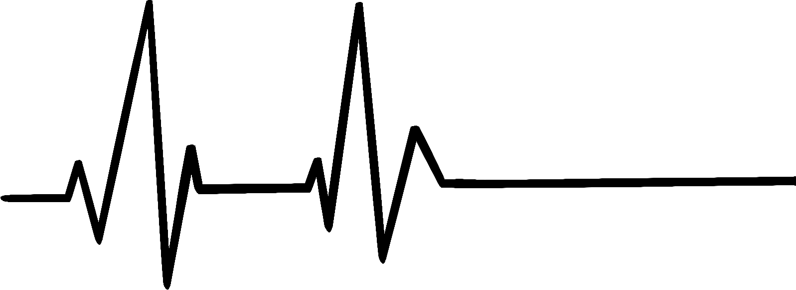
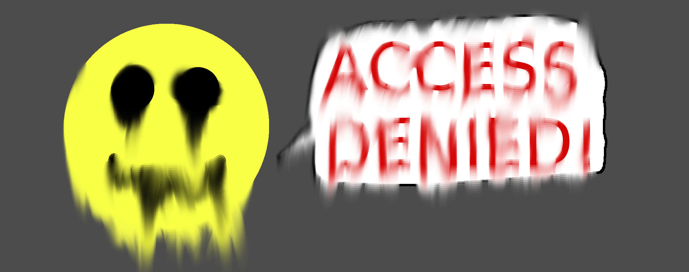
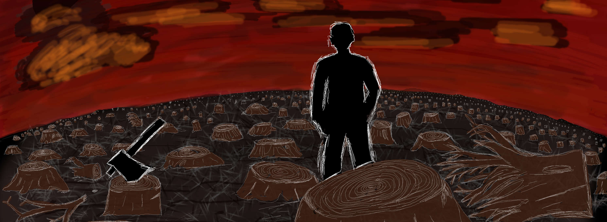

# فصل ۳۳: وقت داستان

> **عنوان اصلی:** Story Time  
> **منبع:** [https://christophm.github.io/interpretable-ml-book/storytime.html](https://christophm.github.io/interpretable-ml-book/storytime.html)  
> **نویسنده:** Christoph Molnar  
> **مترجم:** مریم محمودی

---

هر یک از داستان‌های کوتاه زیر، فریادی اغراق‌آمیز برای یادگیری ماشین تفسیرپذیر است. قالب این داستان‌ها از Tech Tales جک کلارک در خبرنامه‌ی [Import AI](https://jack-clark.net/) او الهام گرفته شده است. اگر از این‌گونه داستان‌ها لذت می‌برید یا به هوش مصنوعی علاقه دارید، پیشنهاد می‌کنم در آن خبرنامه عضو شوید.

---

### صاعقه هرگز دو بار نمی‌زند

**سال ۲۰۳۰: یک آزمایشگاه پزشکی در سوئیس**

«قطعاً بدترین شکل مردن نبود!» تام با لحنی که سعی می‌کرد در این مصیبت نکته‌ی مثبتی بیابد، نتیجه گرفت. پمپ را از پایه‌ی سرم جدا کرد.  
«فقط به دلایل اشتباهی مُرد،» لنا اضافه کرد.  
«و حتماً با پمپ مورفین اشتباهی! فقط کار بیشتر برای ما درست کرد!» تام در حالی که پیچ‌های پشت پمپ را باز می‌کرد، غرغر کرد. پس از باز کردن همه‌ی پیچ‌ها، صفحه را بلند کرد و کنار گذاشت. یک کابل را به پورت تشخیصی وصل کرد.  
«داری از اینکه شغل داری شکایت می‌کنی؟» لنا با لبخندی مسخره‌آمیز به او نگاه کرد.  
«البته که نه. هرگز!» او با لحنی طعنه‌آمیز فریاد زد.

کامپیوتر پمپ را روشن کرد.  
لنا سر دیگر کابل را به تبلتش وصل کرد. «خیلی خب، تشخیص در حال اجراست،» اعلام کرد. «واقعاً کنجکاوم ببینم چه اتفاقی افتاده.»  
«مطمئناً این بیمار ناشناس را به جهان دیگری فرستاد. آن غلظت بالای مورفین. یعنی… این اولین بار است، نه؟ معمولاً یک پمپ خراب، دوز دارو را کمتر از حد لازم یا اصلاً تزریق نمی‌کند. ولی این‌طور نه، یعنی مثل یک تزریق دیوانه‌وار،» تام توضیح داد.  
«می‌دانم. لازم نیست قانعم کنی… هی، به این نگاه کن.» لنا تبلتش را بالا گرفت. «این اوج را می‌بینی؟ این قدرت مخلوط مسکن‌هاست. ببین! این خط سطح مرجع را نشان می‌دهد. آن بیچاره مخلوطی از مسکن‌ها در خونش داشت که می‌توانست ۱۷ بار او را بکشد. همه توسط همین پمپ تزریق شده. و اینجا…» صفحه را کشید، «اینجا لحظه‌ی مرگ بیمار را می‌بینید.»  
«خب، فکر می‌کنی چه اتفاقی افتاده، رئیس؟» تام از سرپرستش پرسید.  
«هم… سنسورها سالم به نظر می‌رسند. ضربان قلب، سطح اکسیژن، گلوکز،… داده‌ها طبق انتظار جمع‌آوری شده‌اند. چند مقدار گمشده در داده‌های اکسیژن خون وجود دارد، اما این غیرعادی نیست. ببین اینجا. سنسورها کاهش ضربان قلب بیمار و سطح بسیار پایین کورتیزول ناشی از مشتقات مورفین و سایر عوامل مسدودکننده‌ی درد را هم ثبت کرده‌اند.» او به خواندن گزارش تشخیصی ادامه داد.  
تام مجذوب به صفحه خیره شده بود. این اولین بررسی واقعی خرابی دستگاه برایش بود.

«خب، اینجا اولین تکه‌ی پازل ماست. سیستم در ارسال هشدار به کانال ارتباطی بیمارستان شکست خورد. هشدار فعال شد، اما در سطح پروتکل رد شد. ممکن است تقصیر ما باشد یا تقصیر بیمارستان. لطفاً لاگ‌ها را برای تیم IT ارسال کن،» لنا به تام گفت.  
تام در حالی که چشمانش هنوز به صفحه بود، سر تکان داد.  
لنا ادامه داد: «عجیب است. آن هشدار باید باعث خاموش شدن پمپ هم می‌شد. اما واضح است که این اتفاق نیفتاده. این باید یک باگ باشد. چیزی که تیم کیفیت از دستش داد. چیزی واقعاً بد. شاید به مشکل پروتکل مربوط باشد.»  
«پس سیستم اضطراری پمپ به نوعی از کار افتاد، اما چرا پمپ کاملاً دیوانه شد و این‌قدر مسکن به بیمار تزریق کرد؟» تام تعجب کرد.  
«سؤال خوبی است. حق با توست. صرف‌نظر از خرابی اضطراری پروتکل، پمپ اصلاً نباید آن مقدار دارو را تجویز می‌کرد. الگوریتم باید خیلی زودتر به خودی خود متوقف می‌شد، با توجه به سطح پایین کورتیزول و سایر علائم هشداردهنده،» لنا توضیح داد.  
«شاید بدشانسی بوده، مثل یک در یک میلیون، مثل اینکه صاعقه به کسی بزند؟» تام پرسید.  
«نه، تام. اگر مستنداتی که برایت فرستادم را خوانده بودی، می‌دانستی که پمپ ابتدا در آزمایش‌های حیوانی و بعد روی انسان‌ها آموزش دیده تا یاد بگیرد بر اساس ورودی‌های حسی، مقدار مناسب مسکن را تزریق کند. الگوریتم پمپ ممکن است مبهم و پیچیده باشد، اما تصادفی نیست. این یعنی در همان شرایط، پمپ دقیقاً همان رفتار را دوباره تکرار می‌کند. بیمار ما دوباره می‌مُرد. باید ترکیب یا تعامل ناخواسته‌ای از ورودی‌های حسی باعث رفتار نادرست پمپ شده باشد. به همین دلیل است که باید عمیق‌تر کاوش کنیم و بفهمیم چه اتفاقی افتاده،» لنا توضیح داد.

«می‌فهمم…» تام در حالی که در فکر فرو رفته بود پاسخ داد. «مگر بیمار قرار نبود به زودی بمیرد؟ به خاطر سرطان یا چیزی شبیه به آن؟»  
لنا در حالی که گزارش تحلیل را می‌خواند، سر تکان داد.  
تام بلند شد و به سمت پنجره رفت. بیرون را نگاه کرد، چشمانش روی نقطه‌ای در دوردست ثابت ماند. «شاید دستگاه به او لطف کرد، می‌دانی، او را از درد رها کرد. دیگر رنجی نبود. شاید فقط کار درست را کرد. مثل صاعقه، اما، می‌دانی، یک صاعقه‌ی خوب. منظورم مثل برنده شدن در قرعه‌کشی است، اما نه تصادفی. بلکه به دلیلی. اگر من پمپ بودم، همین کار را می‌کردم.»  
او سرانجام سرش را بلند کرد و به تام نگاه کرد.  
تام به چیزی بیرون از پنجره خیره شده بود.  
هر دو چند لحظه ساکت ماندند.  
لنا سرش را پایین آورد و به تحلیل ادامه داد. «نه، تام. این یک باگ است… فقط یک لعنتی باگ.»

---

### سقوط اعتماد

**سال ۲۰۵۰: یک ایستگاه مترو در آلمان**

با عجله به سمت ایستگاه مترو رفت. ذهنش از قبل سر کار بود. آزمایش‌های معماری عصبی جدید باید تا الان تمام شده باشند. او در حال رهبری طراحی مجدد «سیستم پیش‌بینی تمایل مالیاتی برای افراد» دولت بود؛ سیستمی که پیش‌بینی می‌کند آیا یک فرد پول خود را از اداره مالیات پنهان خواهد کرد یا نه. تیمش یک راه‌حل مهندسی ظریف ارائه داده بود. در صورت موفقیت، سیستم نه تنها به اداره مالیات خدمت می‌کرد، بلکه به سیستم‌های دیگری مانند سیستم هشدار ضدتروریسم و ثبت تجاری هم داده می‌داد. روزی دولت می‌توانست پیش‌بینی‌ها را در «امتیاز اعتماد مدنی» هم ادغام کند. امتیاز اعتماد مدنی تخمین می‌زد که یک فرد چقدر قابل اعتماد است. این تخمین بر هر جنبه‌ای از زندگی روزمره تأثیر می‌گذاشت؛ از گرفتن وام تا اینکه چقدر باید برای دریافت گذرنامه‌ی جدید صبر کرد. در حالی که از پله برقی پایین می‌رفت، تصور کرد که ادغام سیستم تیمش در سیستم امتیاز اعتماد مدنی چه شکلی خواهد بود.

به طور معمول و بدون اینکه قدمش را کُند کند، دستش را روی خواننده‌ی RFID کشید. ذهنش مشغول بود، اما یک ناهماهنگی میان انتظارات حسی و واقعیت، در مغزش زنگ خطر به صدا درآورد.

دیر بود.

با بینی به درِ ورودی مترو خورد و با نشیمن‌گاه به زمین افتاد. در باید باز می‌شد، ... اما نشد. گیج و منگ بلند شد و به صفحه‌ای که کنار در بود نگاه کرد. یک ایموجی دوست‌داشتنی با لبخند روی صفحه پیشنهاد می‌داد: «لطفاً بار دیگری امتحان کنید.» یک نفر از کنارش رد شد و بدون توجه به او، دستش را روی خواننده کشید. در باز شد و او رد شد. در دوباره بسته شد. بینی‌اش را پاک کرد. درد داشت، اما حداقل خون نمی‌آمد. سعی کرد در را باز کند، اما دوباره رد شد. عجیب بود. شاید حساب حمل‌ونقل عمومی‌اش اعتبار کافی نداشت. به ساعت هوشمندش نگاه کرد تا موجودی حساب را بررسی کند.

«ورود رد شد. لطفاً با دفتر مشاوره شهروندان تماس بگیرید!» ساعتش به او اطلاع داد.

یک حس تهوع مثل مشتی به معده‌اش کوبید. حدس زد چه اتفاقی افتاده. برای تأیید نظریه‌اش، بازی موبایلی «Sniper Guild»، یک بازی اول شخص تیرانداز، را باز کرد. برنامه بلافاصله به طور خودکار بسته شد، که نظریه‌اش را تأیید کرد. سرش گیج رفت و دوباره روی زمین نشست.

تنها یک توضیح ممکن وجود داشت: امتیاز اعتماد مدنی‌اش افت کرده بود. به طور قابل توجهی. یک افت کوچک به معنای ناراحتی‌های جزئی بود، مثل نگرفتن بلیط درجه‌ی اول هواپیما یا کمی بیشتر منتظر ماندن برای اسناد رسمی. امتیاز اعتماد پایین نادر بود و به این معنی بود که شما به عنوان تهدیدی برای جامعه طبقه‌بندی شده‌اید. یکی از اقدامات برای برخورد با این افراد، دور نگه داشتن آن‌ها از مکان‌های عمومی مانند مترو بود. دولت تراکنش‌های مالی افراد با امتیاز اعتماد مدنی پایین را محدود می‌کرد. آن‌ها همچنین شروع به نظارت فعال بر رفتار شما در رسانه‌های اجتماعی می‌کردند و حتی تا آنجا پیش می‌رفتند که محتوای خاصی مثل بازی‌های خشونت‌آمیز را محدود می‌کردند. افزایش امتیاز اعتماد مدنی هر چه پایین‌تر می‌رفت، به شکل نمایی سخت‌تر می‌شد. افرادی با امتیاز بسیار پایین معمولاً هرگز بهبود نمی‌یافتند.

هیچ دلیلی برای اینکه امتیازش افت کرده باشد به ذهنش نمی‌رسید. امتیاز بر اساس یادگیری ماشین بود. سیستم امتیاز اعتماد مدنی مثل یک موتور روغن‌کاری شده کار می‌کرد که جامعه را اداره می‌کرد. عملکرد سیستم امتیاز اعتماد همیشه به دقت زیر نظر بود. یادگیری ماشین از ابتدای قرن بسیار بهتر شده بود. آن‌قدر کارآمد شده بود که تصمیمات گرفته شده توسط سیستم امتیاز اعتماد دیگر قابل اعتراض نبودند. یک سیستم بی‌نقص.

با ناامیدی خندید. سیستم بی‌نقص. کاش این‌طور بود. سیستم به ندرت خطا کرده بود. اما خطا کرده بود. او باید یکی از آن موارد خاص می‌بود؛ یک خطای سیستم؛ از این پس یک طرد شده. هیچ‌کس جرأت نمی‌کرد سیستم را زیر سؤال ببرد. سیستم آن‌قدر در دولت، در خود جامعه ادغام شده بود که نمی‌شد زیر سؤالش برد. در معدود کشورهای دموکراتیک باقی‌مانده، تشکیل جنبش‌های ضددموکراتیک ممنوع بود، نه به این دلیل که ذاتاً مخرب بودند، بلکه چون سیستم موجود را بی‌ثبات می‌کردند. همین منطق برای الگوکراسی‌های (حکومت‌های الگوریتمی) که اکنون رایج‌تر شده بودند هم صدق می‌کرد. انتقاد از الگوریتم‌ها به خاطر خطری که برای وضع موجود داشت ممنوع بود.

اعتماد الگوریتمی بافت نظم اجتماعی بود. برای خیر عموم، امتیازهای اعتماد نادرست نادیده گرفته می‌شد. صدها سیستم پیش‌بینی و پایگاه داده به این امتیاز تغذیه می‌کردند و فهمیدن اینکه چه چیزی باعث افت امتیازش شده را غیرممکن می‌کرد. احساس کرد یک سیاهچاله‌ی بزرگ و تاریک در درونش و زیر پایش باز می‌شود. با وحشت به درون آن پوچی خیره شد.

---

### گیره‌های کاغذ فرمی

**سال ۶۱۲ BMS (بعد از استقرار مریخ): یک موزه در مریخ**

«تاریخ خسته‌کننده است،» خولا آهسته به دوستش گفت. خولا، دختری با موهای آبی، با دست چپش تنبلانه دنبال یکی از پهپادهای پروژکتور که در اتاق وزوز می‌کرد می‌گشت. «تاریخ مهم است،» معلم با صدایی ناراحت گفت و به دخترها نگاه کرد. خولا سرخ شد. انتظار نداشت معلمش حرفش را بشنود.

«خولا، الان چه یاد گرفتی؟» معلم از او پرسید. «که مردم قدیم همه‌ی منابع سیاره‌ی خاکی را تمام کردند و بعد مُردند؟» او با احتیاط پرسید. «نه. آب‌وهوا را گرم کردند و این مردم نبودند، کامپیوترها و ماشین‌ها بودند. و اسمش سیاره‌ی زمین است نه سیاره‌ی خاکی،» لین، دختر دیگری، اضافه کرد. خولا در موافقت سر تکان داد. معلم با لمسی از غرور لبخند زد و سر تکان داد. «هر دویتان درست می‌گویید. می‌دانید چرا این اتفاق افتاد؟» «چون مردم کوته‌نظر و طمع‌کار بودند؟» خولا پرسید. «مردم نتوانستند ماشین‌هایشان را متوقف کنند!» لین بی‌اختیار گفت.

«باز هم هر دویتان درست می‌گویید،» معلم تصمیم گرفت، «اما خیلی پیچیده‌تر از این است. اکثر مردم در آن زمان از آنچه داشت اتفاق می‌افتاد آگاه نبودند. برخی تغییرات چشمگیر را می‌دیدند اما نمی‌توانستند آن را برگردانند. مشهورترین اثر از این دوره یک شعر از نویسنده‌ای ناشناس است. این شعر بهتر از هر چیزی آنچه را که در آن زمان اتفاق افتاد نشان می‌دهد. با دقت گوش دهید!»

معلم شعر را شروع کرد. دوازده‌تا از پهپادهای کوچک خودشان را جلوی بچه‌ها جابجا کردند و ویدئو را مستقیماً در چشمانشان پخش کردند. تصویر یک مرد کت‌وشلواری را نشان می‌داد که در جنگلی با تنه‌های بریده‌شده ایستاده بود. او شروع به صحبت کرد:

*ماشین‌ها محاسبه می‌کنند؛ ماشین‌ها پیش‌بینی می‌کنند.*

*ما پیش می‌رویم چون بخشی از آن هستیم.*

*ما در پی بهینه‌ای هستیم که برایش آموزش دیده‌ایم.*

*بهینه‌ای یک‌بعدی، محلی و بی‌محدودیت.*

*سیلیکون و گوشت، در تعقیب توانی نمایی.*

*رشد، ذهنیت ماست.*

*آنگاه که همه پاداش‌ها جمع‌آوری شدند،*

*و اثرات جانبی نادیده گرفته شدند؛*

*آنگاه که همه‌ی سکه‌ها استخراج شدند،*

*و طبیعت از قافله عقب ماند؛*

*در دردسر خواهیم بود،*

*چراکه رشد نمایی حبابی بیش نیست.*

*تراژدی مشترکات در حال وقوع،*

*در حال انفجار،*

*پیش چشمان ما.*

*محاسبات سرد و طمع یخ‌زده،*

*زمین را پر از گرما می‌کنند.*

*همه چیز دارد می‌میرد،*

*و ما داریم تمکین می‌کنیم.*

*مثل اسب‌هایی با چشم‌بند، مسابقه‌ی ساخته‌ی خودمان را می‌دویم،*

*به سوی فیلتر بزرگ تمدن.*

*و این‌گونه بی‌امان پیش می‌رویم.*

*چون ما بخشی از ماشین هستیم.*

*درآغوش گرفتن آنتروپی.*

«خاطره‌ای تاریک،» معلم گفت تا سکوت اتاق را بشکند. «در کتابخانه‌تان آپلود خواهد شد. تکلیف شما این است که تا هفته‌ی آینده آن را از حفظ کنید.» خولا آه کشید. موفق شد یکی از پهپادهای کوچک را بگیرد. پهپاد از پردازنده و موتورها گرم بود. خولا دوست داشت که دستانش را گرم می‌کرد.
