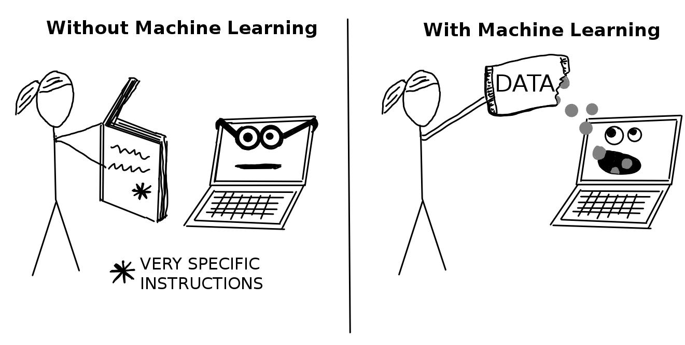
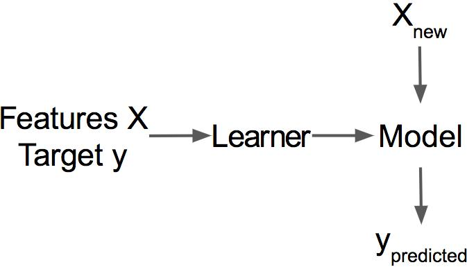
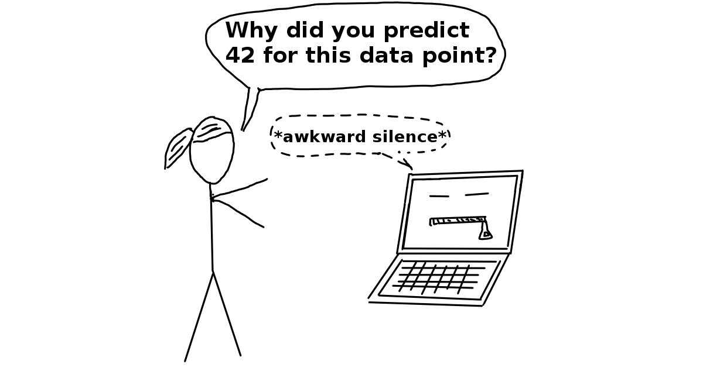

# پیوست الف — اصطلاحات یادگیری ماشین

> **عنوان اصلی:** Machine Learning Terms  
> **منبع:** [https://christophm.github.io/interpretable-ml-book/what-is-machine-learning.html](https://christophm.github.io/interpretable-ml-book/what-is-machine-learning.html)  
> **نویسنده:** Christoph Molnar  
> **مترجم:** مریم محمودی

---

برای پرهیز از ابهام، تعاریف اصطلاحاتی که در این کتاب به‌کار رفته‌اند در ادامه آمده است:

**الگوریتم** (Algorithm) مجموعه‌ای از قوانین است که ماشین برای رسیدن به هدفی مشخص از آن‌ها پیروی می‌کند ([Merriam-Webster 2017](https://christophm.github.io/interpretable-ml-book/references.html#ref-merriam_algorithm_2017)). الگوریتم را می‌توان به‌مثابه یک دستورالعمل دانست که ورودی‌ها، خروجی و تمام مراحل لازم برای رسیدن از ورودی به خروجی را مشخص می‌کند. دستورالعمل‌های آشپزی نمونه‌ای از الگوریتم هستند: مواد اولیه، ورودی؛ غذای پخته‌شده، خروجی؛ و مراحل آماده‌سازی و پخت، دستورالعمل‌های الگوریتم‌اند.

**یادگیری ماشین** (Machine Learning) مجموعه‌ای از روش‌هاست که به رایانه‌ها امکان می‌دهد از داده بیاموزند و پیش‌بینی‌هایی بسازند و بهبود دهند (برای نمونه: پیش‌بینی سرطان، فروش هفتگی، یا نکول اعتباری). یادگیری ماشین یک تحول پارادایمی است؛ از «برنامه‌نویسی متعارف» که در آن تمام دستورالعمل‌ها باید به‌صراحت به رایانه داده شوند، به سمت «برنامه‌نویسی غیرمستقیم» که از طریق ارائه داده انجام می‌گیرد.

**یادگیرنده** (Learner) یا **الگوریتم یادگیری ماشین** برنامه‌ای است که برای یادگیری یک مدل یادگیری ماشین از داده به‌کار می‌رود. نام دیگر آن «استنتاج‌کننده» (inducer) است (برای مثال: «استنتاج‌کننده درخت»).

**مدل یادگیری ماشین** (Machine Learning Model) برنامه‌ی آموخته‌شده‌ای است که ورودی‌ها را به پیش‌بینی نگاشت می‌کند. این مدل می‌تواند مجموعه‌ای از وزن‌ها برای یک مدل خطی یا یک شبکه عصبی باشد. نام‌های دیگری که به‌جای واژه کلی «مدل» به‌کار می‌روند عبارت‌اند از «پیش‌بین» یا — بسته به وظیفه — «دسته‌بند» یا «مدل رگرسیون». در فرمول‌ها، مدل یادگیری ماشین آموزش‌دیده با $\hat{f}$ یا $\hat{f}(\mathbf{x})$ نمایش داده می‌شود.

یک یادگیرنده از داده‌های آموزشی برچسب‌دار، مدلی می‌آموزد. سپس از آن مدل برای پیش‌بینی استفاده می‌شود.

**مدل جعبه‌سیاه** (Black Box Model) سیستمی است که سازوکار درونی خود را آشکار نمی‌کند. در یادگیری ماشین، اصطلاح «جعبه‌سیاه» به مدل‌هایی اشاره دارد که با نگاه به پارامترهایشان قابل درک نیستند (مانند شبکه‌های عصبی). نقطه مقابل جعبه‌سیاه گاهی **جعبه‌سفید** (White Box) نامیده می‌شود که در این کتاب با عنوان مدل تفسیرپذیر از آن یاد می‌شود. روش‌های مدل‌آگنوستیک تفسیرپذیری، مدل‌های یادگیری ماشین را به‌مثابه جعبه‌سیاه تلقی می‌کنند، حتی اگر در واقع چنین نباشند.

**یادگیری ماشین تفسیرپذیر** (Interpretable Machine Learning) به روش‌ها و مدل‌هایی اشاره دارد که رفتار و پیش‌بینی‌های سیستم‌های یادگیری ماشین را برای انسان قابل فهم می‌سازند.

**مجموعه داده** (Dataset) جدولی است که داده‌های مورد نیاز برای یادگیری ماشین را در خود دارد. این مجموعه شامل ویژگی‌ها و متغیر هدفی است که باید پیش‌بینی شود. هنگامی که از مجموعه داده برای آموزش مدل استفاده می‌شود، به آن داده آموزشی گفته می‌شود.

**نمونه** (Instance) یک سطر در مجموعه داده است. نام‌های دیگر برای «نمونه» عبارت‌اند از: نقطه داده (data point)، مثال (example)، مشاهده (observation). هر نمونه از مقادیر ویژگی $\mathbf{x}^{(i)}$ و — در صورت موجود بودن — مقدار هدف $y^{(i)}$ تشکیل شده است.

**ویژگی‌ها** (Features) ورودی‌هایی هستند که برای پیش‌بینی یا دسته‌بندی به‌کار می‌روند. هر ویژگی یک ستون در مجموعه داده است. در سراسر کتاب فرض بر این است که ویژگی‌ها تفسیرپذیرند؛ یعنی درک معنای آن‌ها آسان است، مانند دمای هوا در یک روز مشخص یا قد یک فرد. این فرض درباره تفسیرپذیری ویژگی‌ها، پیش‌فرض مهمی است. اگر درک ویژگی‌های ورودی دشوار باشد، فهمیدن اینکه مدل چه می‌کند به‌مراتب دشوارتر خواهد بود. ماتریس تمام ویژگی‌ها با $\mathbf{X}$ و برای یک نمونه منفرد با $\mathbf{x}^{(i)}$ نمایش داده می‌شود. بردار یک ویژگی مشخص برای تمام نمونه‌ها $\mathbf{x}_j$ است و مقدار ویژگی $j$ برای نمونه $i$ برابر $x^{(i)}_j$ خواهد بود.

**هدف** (Target) اطلاعاتی است که ماشین یاد می‌گیرد آن را پیش‌بینی کند. در فرمول‌های ریاضی، هدف معمولاً با $y$ یا برای یک نمونه منفرد با $y^{(i)}$ نشان داده می‌شود.

**وظیفه یادگیری ماشین** (Machine Learning Task) ترکیبی از یک مجموعه داده با ویژگی‌ها و یک هدف است. بسته به نوع هدف، وظیفه می‌تواند دسته‌بندی (classification)، رگرسیون، تحلیل بقا (survival analysis)، خوشه‌بندی (clustering) یا تشخیص داده‌های پرت (outlier detection) باشد.

**پیش‌بینی** (Prediction) «حدس» مدل یادگیری ماشین برای مقدار هدف بر اساس ویژگی‌های داده‌شده است. در این کتاب، پیش‌بینی مدل با $\hat{f}(\mathbf{x}^{(i)})$ یا $\hat{y}$ نشان داده می‌شود.

---

Merriam-Webster. 2017. "Definition of Algorithm." <https://www.merriam-webster.com/dictionary/algorithm>.
